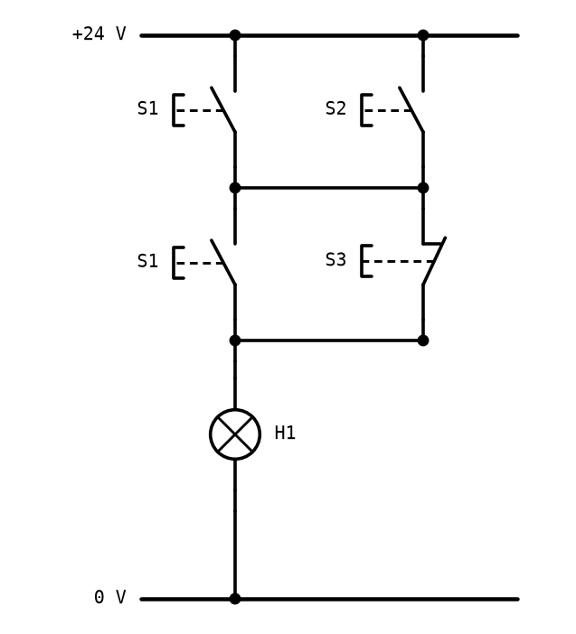

# Övningsprov - Digitalteknik AI26

* **Tid:** 2 timmar.
* **Hjälpmedel:** penna, suddgummi och linjal, och det utdelade
  [referensbladet med AVR-instruktionerna](../info/avr_instructions.md). Ingen miniräknare.
* **Poäng:** 40. **G** kräver 20 poäng och **VG** 30 poäng.

**Instruktioner:**
* Börja varje fråga på ett nytt papper, och skriv ditt namn på varje papper.
* Visa hur du räknar. Metoden ger poäng även när svaret blir fel.
* Skriv alltid ut talsystemet: `0x2C`, `0010 1100` eller 44.
* Assemblerfrågorna gäller ATmega328P med klockfrekvensen 16 MHz.

---

## Fråga 1 - Talsystem och koder (8 p)

**a)** Omvandla det binära talet `1101 0110` till decimalt och hexadecimalt. *(2 p)*

**b)** Omvandla det decimala talet 173 till binärt och hexadecimalt. *(2 p)*

**c)** Talen `0xB4` och `0x6A` adderas i ett 8-bitars register. Ställ upp additionen binärt, och
ange resultatet i registret hexadecimalt. Blir det en minnessiffra ut ur registret? *(2 p)*

**d)** Skriv talet 59 i BCD. Ange också de två ASCII-koder som texten `59` består av. *(2 p)*

---

## Fråga 2 - Grindar och boolesk algebra (8 p)

**a)** Gör sanningstabellen för `X = A'B + BC'`. *(2 p)*

**b)** Förenkla uttrycket algebraiskt så långt det går, och ange vilken lag du använder i varje
steg. Vilken enda grind beräknar det förenklade uttrycket? *(3 p)*

```text
X = AB + AB' + A'B
```

**c)**
1. Skriv `(A + B)'` utan parentes. *(1 p)*
2. Visa hur funktionen `A + B` kan byggas av enbart NAND-grindar med två ingångar. Rita nätet, och
   visa med boolesk algebra att det stämmer. *(2 p)*

---

## Fråga 3 - Karnaughdiagram (6 p)

En funktion `X` av de fyra variablerna A, B, C och D är 1 för mintermerna 0, 2, 5, 7, 8, 10, 13 och
15, och 0 för alla andra.

**a)** Rita Karnaughdiagrammet, med `AB` på raderna och `CD` på kolumnerna, och fyll i ettorna.
*(2 p)*

**b)** Gruppera ettorna minimalt, och skriv det minimerade uttrycket för `X` på SP-form. *(3 p)*

**c)** Uttrycket beror bara på två av variablerna. Vilka två, och vilken grind med två ingångar är
`X`? *(1 p)*

---

## Fråga 4 - Analys av ett kontaktnät (6 p)

Kontaktnätet nedan styr lampan H1 med tre tryckknappar. Tryckknappen S1 har två kontaktblock, som
båda manövreras av samma knapp. S1 och S2 är slutande, S3 är brytande.



**a)** Skriv det booleska uttrycket för H1. *(2 p)*

**b)** Gör sanningstabellen för H1, med S1, S2 och S3 som ingångar. *(2 p)*

**c)** Förenkla uttrycket, och rita ett kontaktnät som gör samma sak med färre kontakter. *(2 p)*

---

## Fråga 5 - Mikrodatorns uppbyggnad (4 p)

**a)** Rita en mikrodators blockschema, med CPU (ALU, register, styrenhet och programräknare),
programminne, dataminne, in- och utportar och bussar. Skriv en mening om vad varje block gör.
*(2 p)*

**b)** Vad innehåller programräknaren, och vad händer med den när ett `rcall` utförs? *(1 p)*

**c)** I vilket minne i ATmega328P ligger programmet, och i vilket ligger stacken? Vilket av dem
behåller sitt innehåll när strömmen bryts? *(1 p)*

---

## Fråga 6 - Assemblerprogrammering (8 p)

**a)** Programmet nedan körs från början. Ange värdena i `r16`, `r17` och `r18` hexadecimalt när det
har kommit till `end`, och värdet på flaggan `C` efter `add`. Förklara varför `r18` inte blev 300.
*(3 p)*

```asm
    ldi r16, 0xB4
    ldi r17, 0x0F
    and r17, r16
    lsl r16
    ldi r18, 200
    ldi r19, 100
    add r18, r19
end:
    rjmp end
```

**b)** Programmet nedan körs från början.

```asm
    ldi r16, 0xFF
    out DDRB, r16
    ldi r16, 1
    ldi r17, 4
loop:
    out PORTB, r16
    lsl r16
    dec r17
    brne loop
```

1. Hur många gånger körs loopen, och vilket värde har `PORTB` när loopen är klar? *(1 p)*
2. Hur många klockcykler tar loopen, från den första `out` till och med den sista `brne`, och hur
   lång tid är det? *(1 p)*

**c)** En knapp är kopplad mellan PD3 och jord, och en lysdiod med förkopplingsmotstånd mellan PB0
och jord. Skriv ett komplett program, med initiering, där lysdioden lyser så länge knappen hålls
nedtryckt och är släckt annars. Använd stiftets inbyggda pull-up-motstånd. *(3 p)*

---
