# Microchip Studio - installation, simulering och programmering av kortet

Microchip Studio är den utvecklingsmiljö där programmen i [Labb 3](../labs/lab3/README.md) skrivs,
assembleras och körs. Den här sidan är referensen för allt verktygsarbete i kursen:
* avsnitt 1-4 behövs från [L07](../lectures/L07/README.md): installation, projekt, assemblering och
  simulering;
* avsnitt 5 behövs först i [L11](../lectures/L11/README.md), när programmet ska köras på ett riktigt
  Arduino Uno-kort.

Microchip Studio finns bara för Windows. Menyernas namn nedan är de engelska, eftersom programmet
bara finns på engelska.

---

## 1. Installera Microchip Studio
1. Ladda ned installationsprogrammet från
   [Microchips webbplats](https://www.microchip.com/en-us/tools-resources/develop/microchip-studio).
   Välj webbinstallationen (*web installer*) om du inte vet vilken du ska ta.
2. Kör installationen. När du får välja arkitekturer räcker **AVR**; SAM och UC3 behövs inte.
3. Godkänn installationen av drivrutiner om du tillfrågas, och starta om datorn när installationen
   är klar.

Installationen tar en stund och kräver flera gigabyte. Gör den hemma före L07, inte i början av
passet.

> **Om installationsfilen inte går att öppna.** Windows 11 kan blockera okända installationsprogram
> med funktionen *Smart App Control*. Sök efter Smart App Control i Windows sökruta, stäng av den,
> och starta om datorn.

---

## 2. Skapa ett assemblerprojekt
Varje program i Labb 3 är ett eget projekt. Ett projekt är en katalog med en projektfil och en
källfil, `main.asm`.

1. Välj **File → New → Project...**
2. Välj **Assembler** i listan till vänster, och sedan **AVR Assembler Project**.
3. Ge projektet ett namn som säger vilken del av labben det hör till, till exempel `lab3_06`, och
   välj var det ska sparas. Klicka **OK**.
4. I dialogen **Device Selection**, sök efter och välj **ATmega328P**. Klicka **OK**.

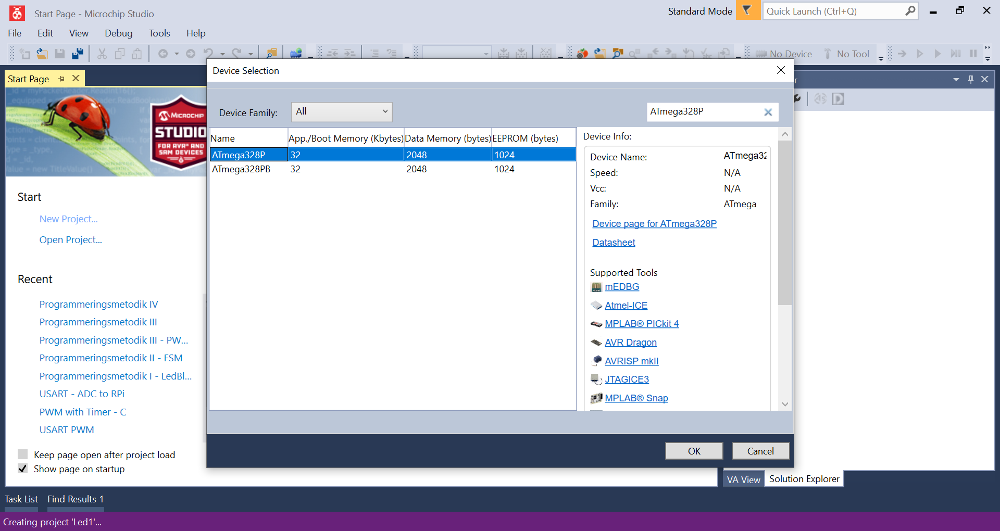

Studio skapar projektet och öppnar `main.asm` med ett litet exempelprogram. Ersätt det med kursens
programmall ([labs/lab3/code/template.asm](../labs/lab3/code/template.asm)), eller med det program
uppgiften anger.

Varje program i kursen börjar med raden:

```asm
.include "m328Pdef.inc"
```

Den läser in definitionsfilen för ATmega328P, som ger namnen `PORTB`, `DDRB`, `PIND`, `RAMEND` och
alla andra registernamn. Studio läser ofta in filen automatiskt, men raden gör att programmet
fungerar oavsett inställningar, och det gör ingen skada att filen läses in två gånger.

---

## 3. Assemblera
Välj **Build → Build Solution**, eller tryck **F7**.

Assemblern översätter programmet till maskinkod. Resultatet visas i fönstret **Output** längst ned:

```text
Assembly complete, 0 errors. 0 warnings
...
========== Build: 1 succeeded or up-to-date, 0 failed, 0 skipped ==========
```

Om något är fel visas felen i fönstret **Error List** (**View → Error List** om det inte syns).
Varje fel anger fil och radnummer. Dubbelklicka på felet så hoppar editorn till raden.

Tre fel som alla gör i början:
* **`Invalid register`** på en rad med `ldi`: `ldi` kan bara ladda `r16`-`r31`
  ([L07 Appendix A](../lectures/L07/appendix/a_avr_core.md)).
* **`Undefined symbol`**: en etikett eller ett registernamn är felstavat, eller raden `.include`
  saknas.
* **`Syntax error`**: ofta ett kommatecken som saknas mellan operanderna, `ldi r16 5` i stället för
  `ldi r16, 5`.

Rätta **det första felet först** och bygg om. Ett fel följs ofta av flera följdfel som försvinner av
sig själva.

---

## 4. Simulera
Simulatorn kör ditt program i en modell av ATmega328P, instruktion för instruktion, och visar
register, flaggor och portar medan det går. Nästan hela Labb 3 görs i simulatorn.

### 4.1 Välj simulatorn
Första gången i varje projekt:
1. Välj **Project → Properties** (eller **Alt+F7**).
2. Välj fliken **Tool**.
3. Välj **Simulator** under *Selected debugger/programmer*.
4. Spara med **Ctrl+S** och stäng fliken.

### 4.2 Stega genom programmet
Välj **Debug → Start Debugging and Break** (**Alt+F5**). Programmet assembleras, laddas in i
simulatorn och stannar på första instruktionen, markerad med en gul pil. Den gula pilen pekar på
den instruktion som står på tur, **inte** den som just har körts.

| Kommando | Tangent | Gör |
|----------|---------|-----|
| Step Into | F11 | Kör en instruktion. Följer med in i en subrutin. |
| Step Over | F10 | Kör en instruktion. Kör en hel subrutin som ett steg. |
| Run To Cursor | Ctrl+F10 | Kör tills programmet når raden där markören står. |
| Continue | F5 | Kör fritt, tills en brytpunkt nås. |
| Break All | Ctrl+F5 | Stoppar ett program som kör fritt. |
| Stop Debugging | Ctrl+Shift+F5 | Avslutar simuleringen. |

### 4.3 Fönstren du behöver
Öppnas under **Debug → Windows** medan simuleringen pågår.

* **Processor Status**: de 32 registren `R00`-`R31`, statusregistret `SREG` med en ruta per
  flagga, programräknaren (*Program Counter*), stackpekaren (*Stack Pointer*), och två räknare som
  mäter tid: *Cycle Counter* och *Stop Watch*. Värden som ändrades i det senaste steget visas i
  rött. Medan programmet står still kan du ändra ett registers värde genom att dubbelklicka på det
  och skriva in ett nytt, vilket är ett snabbt sätt att prova samma program med andra indata.
* **I/O**: alla I/O-register, grupperade per enhet. Under **PORTB** finns `DDRB`, `PORTB` och
  `PINB`, med en ruta per bit. En fylld ruta är en etta.
* **Memory**: minnet byte för byte. Välj **data IRAM** för att se SRAM, där stacken ligger, och
  **prog FLASH** för att se programmet som maskinkod.
* **Watch**: värden du själv väljer att bevaka.

Värdena visas som standard hexadecimalt. Högerklicka i fönstret för att växla till decimalt om det
finns, men vänj dig vid hexadecimal: det är så datablad och instruktionslistor skriver.

### 4.4 Brytpunkter och cykelräknaren
En **brytpunkt** stoppar ett program som kör fritt. Klicka i den grå marginalen till vänster om en
rad, eller ställ markören på raden och tryck **F9**. En röd prick markerar brytpunkten.

**Cycle Counter** räknar klockcykler sedan programmet startade, och **Stop Watch** visar samma sak
som tid. Stoppuret räknar tiden utifrån fältet **Frequency**, som ska stå på **16 MHz**, samma
klockfrekvens som ett Arduino Uno-kort har. Dubbelklicka på värdet för att ändra det.

Så mäter du hur lång tid en del av programmet tar, till exempel en fördröjning i
[L09](../lectures/L09/README.md):
1. Sätt en brytpunkt före och en efter den del du vill mäta.
2. Kör till den första brytpunkten.
3. Högerklicka på **Stop Watch** och välj **Reset Stopwatch**, eller skriv upp värdet.
4. Kör vidare till den andra brytpunkten, och läs av.

### 4.5 Simulera en ingång
I simulatorn finns ingen knapp att trycka på. I stället ändrar du ingångens värde för hand, i
fönstret **I/O**:
1. Stoppa programmet, med en brytpunkt eller **Break All**.
2. Välj **PORTD** i I/O-fönstret.
3. Klicka på den bit i **PIND** du vill ändra. En fylld ruta är en etta, en tom en nolla.
4. Stega eller kör vidare. Programmet läser det nya värdet nästa gång det läser `PIND`.

En knapp kopplad mot jord med pull-up läses som `1` när den är släppt och `0` när den är nedtryckt,
se [L10 Appendix B](../lectures/L10/appendix/b_input_port.md). I simulatorn betyder det: töm
rutan för att "trycka ned" knappen.

---

## 5. Programmera ett Arduino-kort från Microchip Studio
Hittills har programmet bara körts i simulatorn. I [L11](../lectures/L11/README.md) ska det köras på
ett riktigt Arduino Uno-kort. Det här avsnittet är en engångsinställning som gör det till ett
menyval i Studio.

### 5.1 Varför det här arbetsflödet
Arduino Uno-kortet har en **bootloader**, ett litet program i toppen av flashminnet som tar emot ett
nytt program över USB-kabeln. Programmet som skickar det heter `avrdude`, och det följer med Arduino
IDE. Arduino IDE vet dessutom exakt vilket kommando som behövs för just ditt kort och din COM-port.

Så tricket är att låna det kommandot från Arduino IDE, och peka det på den hexfil Microchip Studio
skapar i stället för på Arduinos egen. Ingen extra programmerare behövs.

### 5.2 Hämta avrdude-kommandot ur Arduino IDE
1. Installera [Arduino IDE](https://www.arduino.cc/en/software) och starta den.
2. Slå på utförlig utskrift vid uppladdning: **File → Preferences**, och kryssa i **Show verbose
   output during: Upload**.

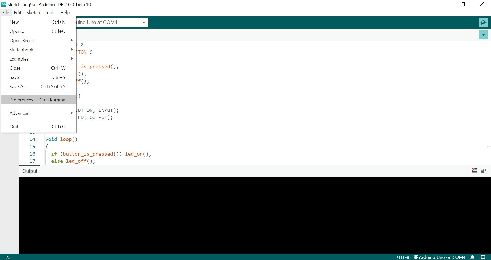

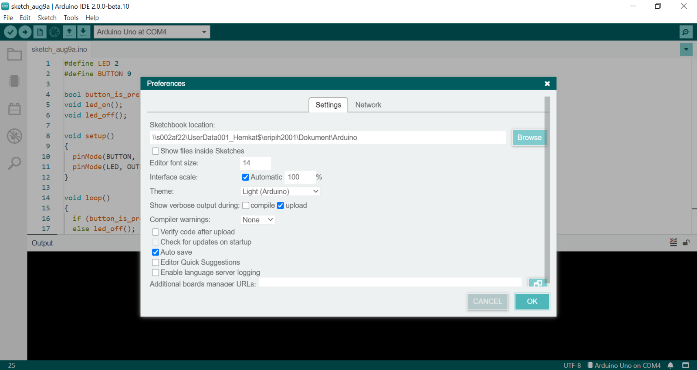

3. Installera stödet för AVR-korten om det inte redan finns: **Tools → Board → Boards Manager**, och
   installera **Arduino AVR Boards**.

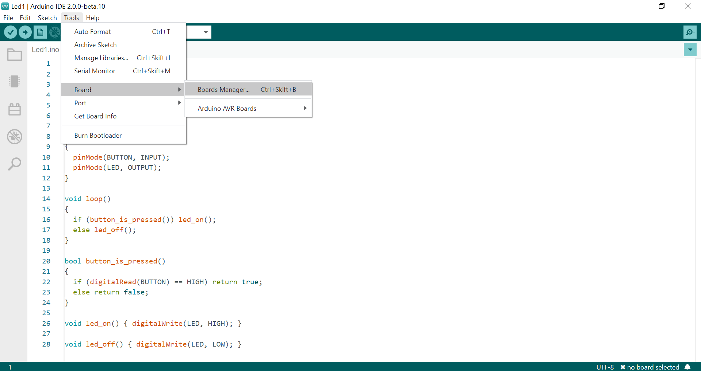

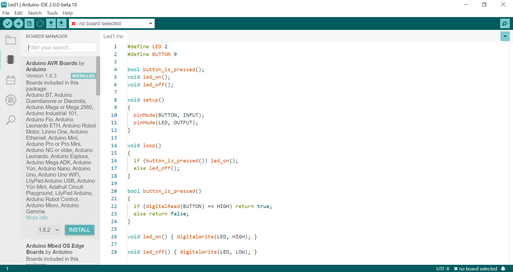

4. Anslut kortet med USB-kabeln. Välj kortet under **Tools → Board → Arduino AVR Boards → Arduino
   Uno**, och dess port under **Tools → Port**, till exempel COM4. Numret spelar ingen roll, men
   skriv upp det.

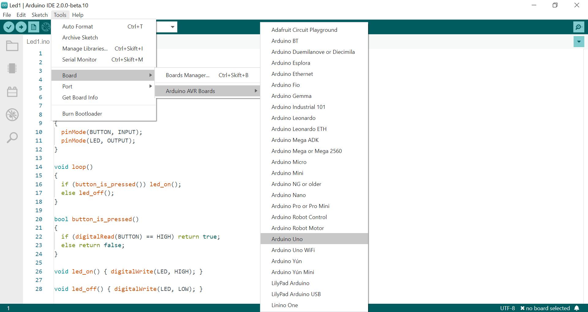

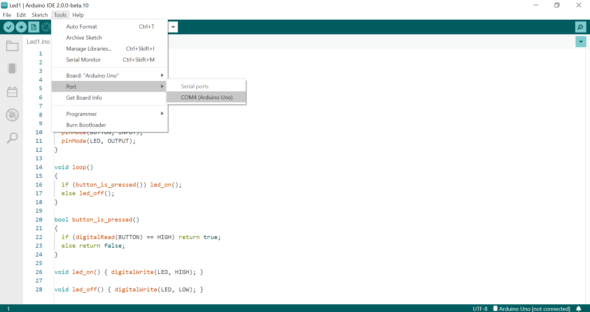

5. Öppna exemplet **File → Examples → 01.Basics → Blink** och klicka på **Upload**, pilen uppe till
   vänster. Lysdioden på kortet börjar blinka.

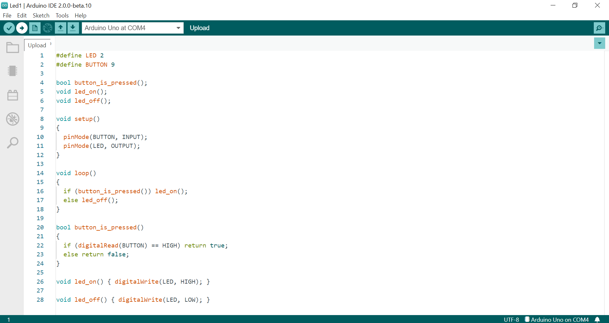

6. Leta upp raden som startar `avrdude` i utskriften längst ned, och kopiera den. Den ser ut ungefär
   så här (med ditt användarnamn och din COM-port):

```text
"C:\Users\...\Arduino15\packages\arduino\tools\avrdude\6.3.0-arduino17/bin/avrdude"
"-CC:\Users\...\Arduino15\packages\arduino\tools\avrdude\6.3.0-arduino17/etc/avrdude.conf"
-v -V -patmega328p -carduino "-PCOM4" -b115200 -D
"-Uflash:w:C:\Users\...\Temp\arduino-sketch-.../Blink.ino.hex:i"
```

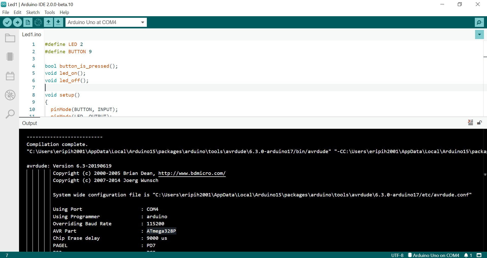

### 5.3 Gör om kommandot till ett återanvändbart verktyg
Kommandot ska delas upp i två delar: själva programmet (**Command**) och allt det får med sig
(**Arguments**). Gör det i Anteckningar (Notepad):

1. Klistra in raden och ta bort alla citattecken.
2. Sätt en radbrytning direkt efter `bin/avrdude`, och lägg till `.exe`, så att första raden slutar
   på `bin/avrdude.exe`.

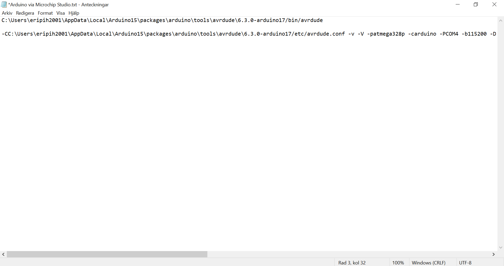


3. Sätt en radbrytning till före `-Uflash`, så att resten hamnar på en tredje rad.
4. Sätt tillbaka citattecken runt de två filsökvägarna: sökvägen till `avrdude.conf` på andra raden,
   och sökvägen till hexfilen på tredje.

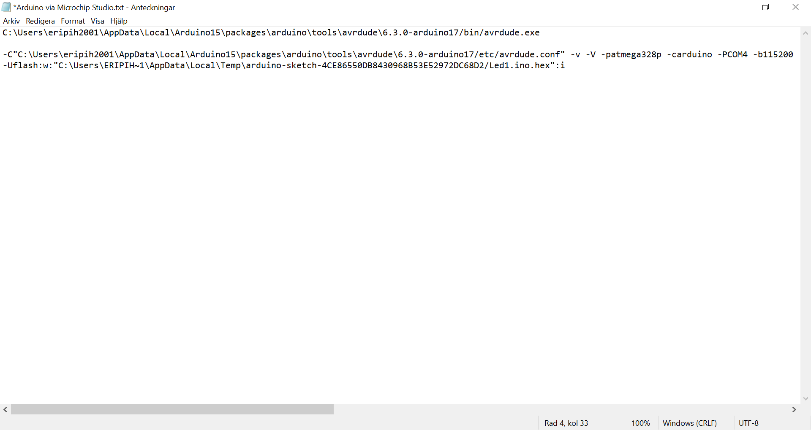

5. Ersätt sökvägen till Arduinos hexfil, allt mellan citattecknen på tredje raden, med
   `$(ProjectDir)Debug\$(TargetName).hex`. Microchip Studio byter ut de två variablerna mot
   det aktuella projektets katalog och namn, så samma kommando fungerar för alla dina projekt.
6. Slå ihop de två sista raderna till en, så att det bara finns två rader kvar. Spara filen.

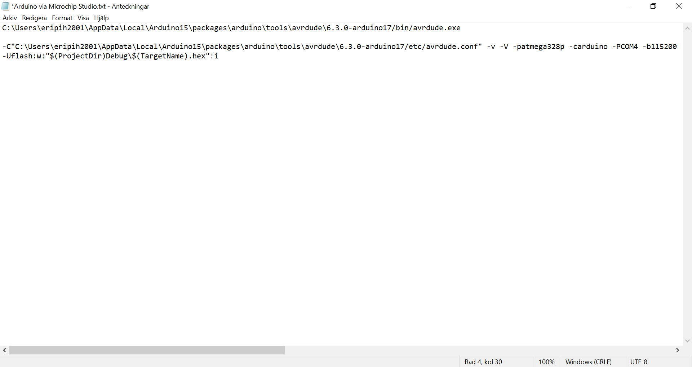

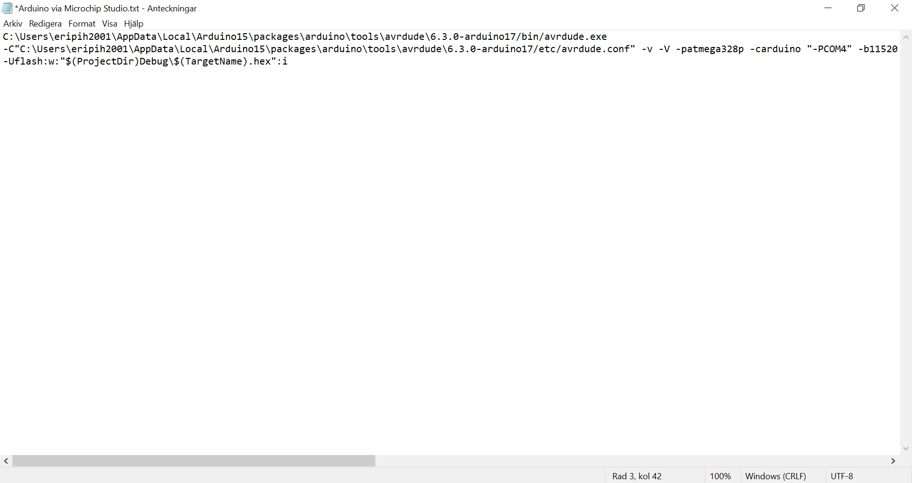


Första raden är nu kommandot, andra raden argumenten.

### 5.4 Lägg till verktyget i Microchip Studio
1. Externa verktyg kräver den avancerade profilen: **Tools → Select Profile**, välj **Advanced** och
   klicka **Apply**.

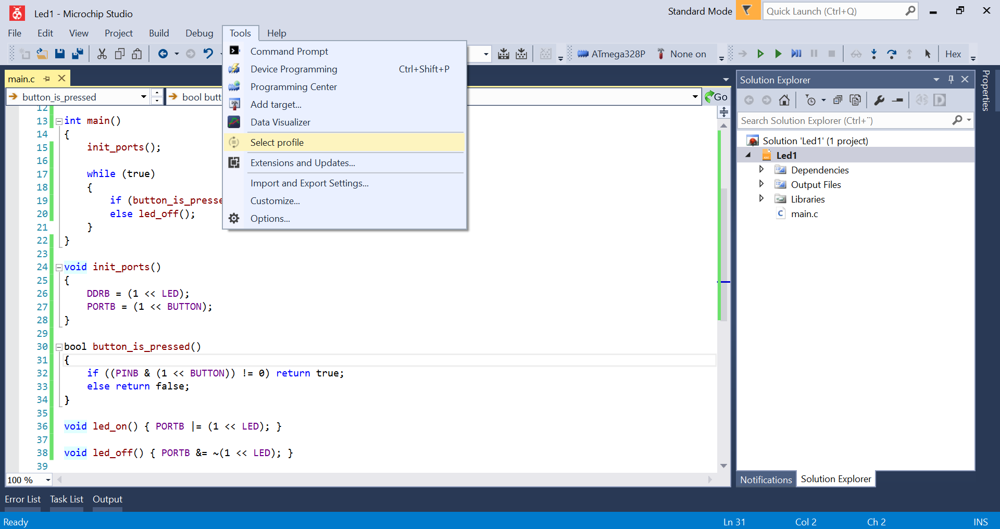

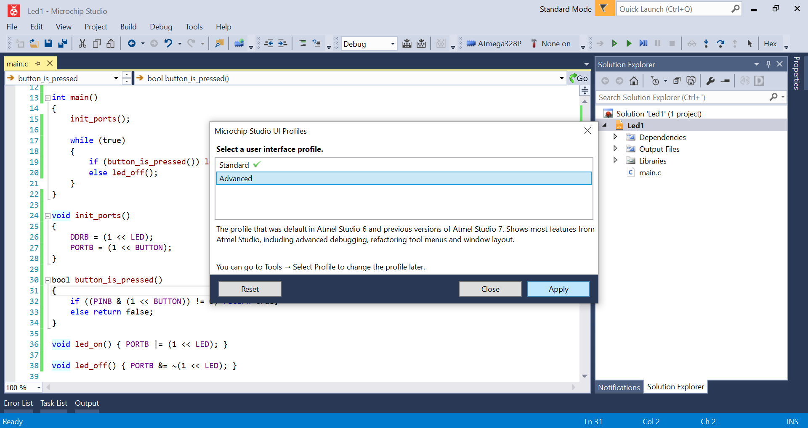

2. Välj **Tools → External Tools** och klicka **Add**.
3. Döp verktyget till `Arduino` följt av COM-porten, till exempel `Arduino - COM4`.
4. Klistra in första raden från Anteckningar i **Command** och andra raden i **Arguments**.
5. Kryssa i **Use Output window** och klicka **OK**.

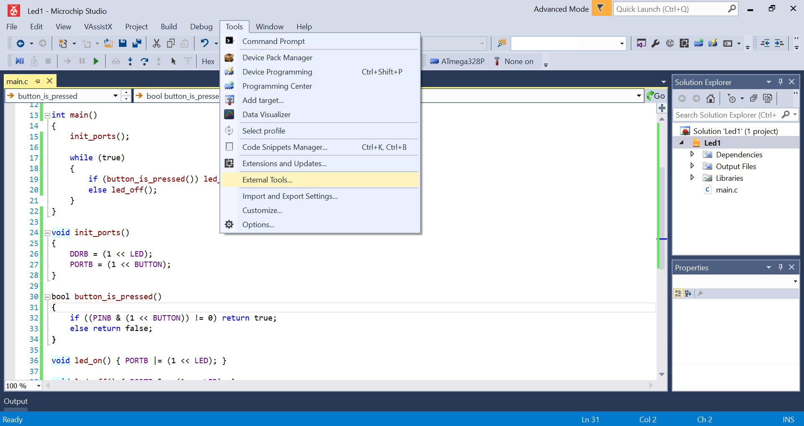

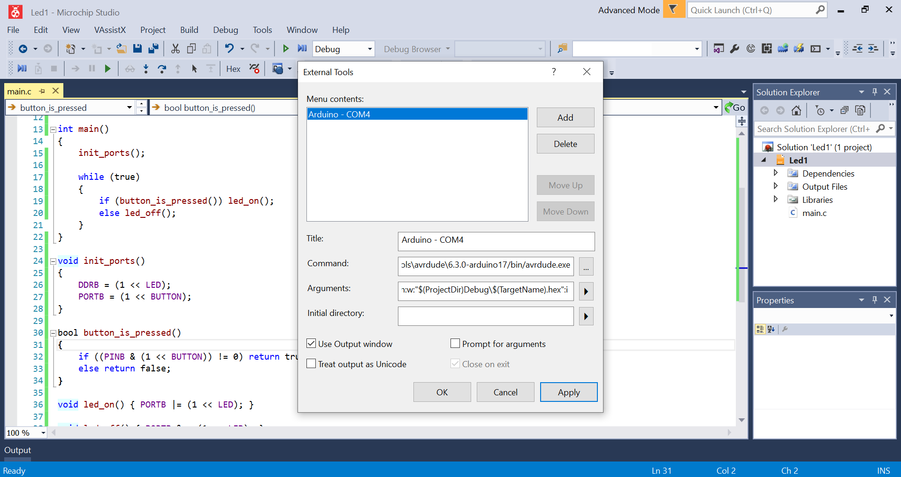

Skärmbilderna är tagna i ett C-projekt. För ett assemblerprojekt är varje steg detsamma.

### 5.5 Programmera och kontrollera
1. Bygg projektet med **F7**. Hexfilen skapas i projektets katalog `Debug`; kontrollera i
   Output-fönstret var den hamnade om programmeringen inte hittar den.
2. Välj **Tools → Arduino - COM4**.

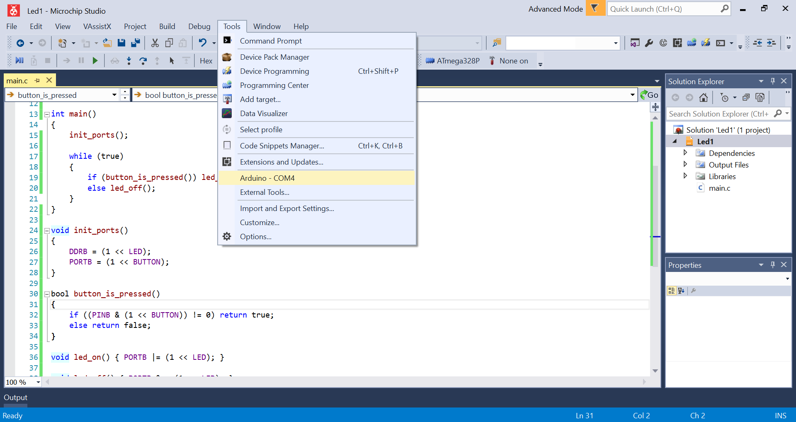

Om allt fungerar slutar utskriften med antalet byte som skrevs:

```text
Writing | ################################################## | 100% 0.05s

avrdude.exe: 194 bytes of flash written
...
avrdude.exe done. Thank you.
```

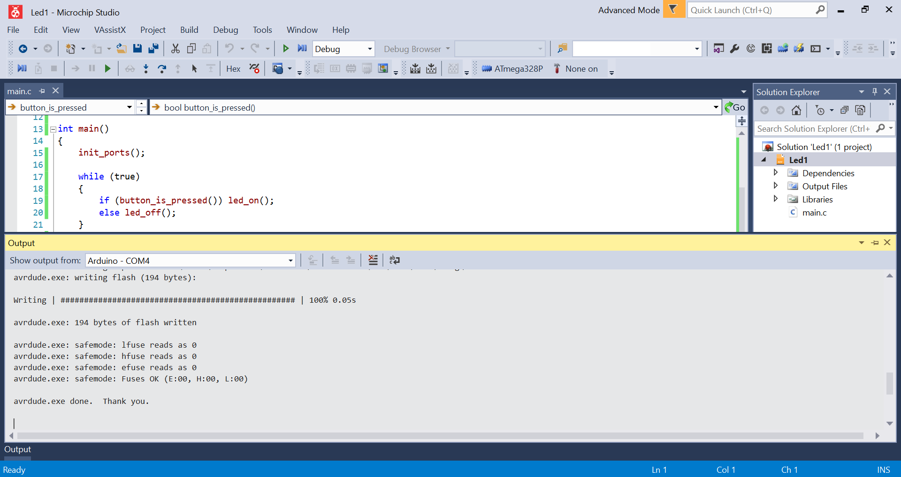

### 5.6 Om COM-porten ändras
Om kortet ansluts till en annan USB-port kan det få en annan COM-port, och programmeringen
misslyckas med ett fel i stil med:

```text
avrdude.exe: ser_open(): can't open device "\\.\COM4": Det går inte att hitta filen.
```

Kontrollera kortets aktuella port i Arduino IDE (**Tools → Port**). Lägg sedan till ett andra
verktyg i **Tools → External Tools**, likadant som det första men med den nya porten i
**Arguments**, till exempel `-PCOM3` i stället för `-PCOM4`.

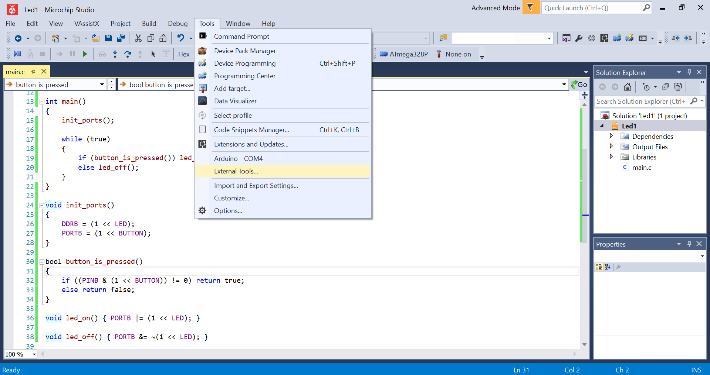

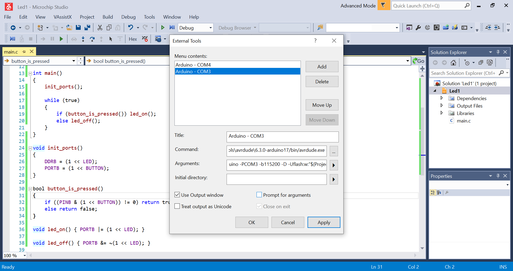

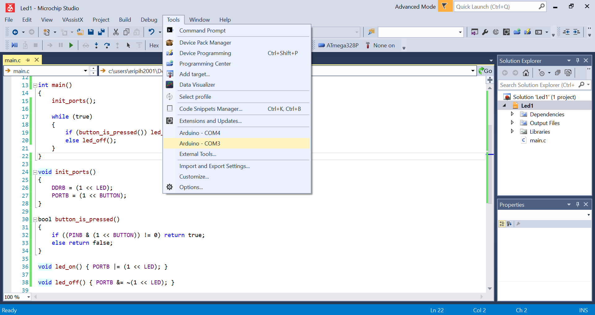

---

## 6. Vanliga fel

| Symptom | Trolig orsak |
|---------|--------------|
| **Start Debugging** frågar efter ett verktyg | Simulatorn är inte vald, se [4.1](#41-välj-simulatorn). |
| Den gula pilen står kvar på samma rad | Programmet väntar i en loop, till exempel på en ingång som aldrig ändras. |
| Ett register ändras inte som väntat | Den gula pilen visar nästa instruktion, inte den som just kördes. |
| Stoppuret visar orimliga tider | **Frequency** står inte på 16 MHz. |
| En port ändras inte i I/O-fönstret | Fel register (`PINB` i stället för `PORTB`), eller `DDRB` är inte satt. |
| `avrdude` hittar inte hexfilen | Projektet är inte byggt, eller hexfilen ligger i en annan katalog än `Debug`. |
| `ser_open(): can't open device` | Fel COM-port, eller kortet är inte anslutet, se [5.6](#56-om-com-porten-ändras). |

---
