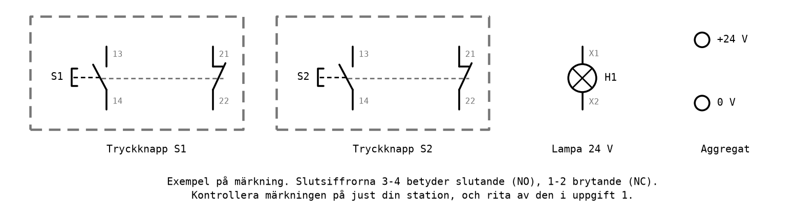
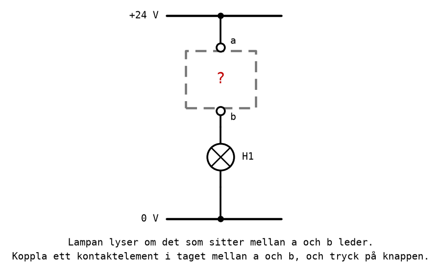
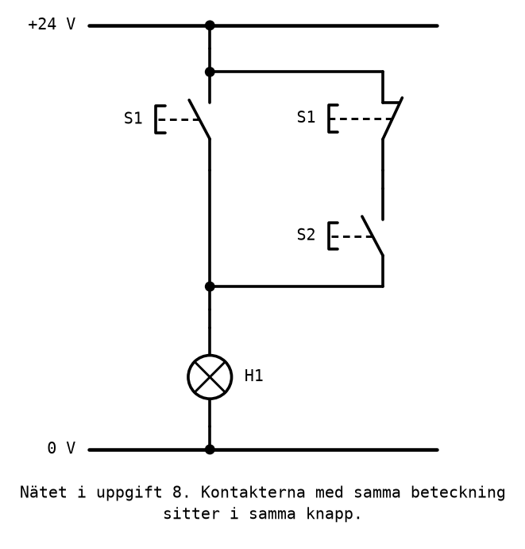

# Labb 1 - Kopplingsnät

I den här laborationen bygger du logiska funktioner av strömkontakter: två tryckknappar, en lampa
och ett aggregat på 24 V. Samma funktioner som i [L02](../../lectures/L02/README.md) byggdes av
grindar blir här serie- och parallellkopplingar av slutande och brytande kontakter, och lampans
läge är utgången.

Laborationen görs i par under [L03](../../lectures/L03/README.md). Teorin finns i
[L02 Appendix B](../../lectures/L02/appendix/b_contact_networks.md) och, för analys och
felsökning, i [L03 Appendix A](../../lectures/L03/appendix/a_contact_network_analysis.md).

---

## Mål
Efter laborationen ska du kunna:
* avgöra vilka anslutningar på en tryckknapp som är slutande och vilka som är brytande;
* koppla upp ett kontaktnät efter ett strömvägsschema;
* realisera AND, OR, NOT, NAND, NOR, XOR och XNOR med kontakter;
* syntetisera ett kontaktnät ur en sanningstabell, via ett förenklat uttryck;
* analysera ett kontaktnät och ersätta det med ett mindre, likvärdigt nät;
* kontrollera ett nät genom att jämföra förutsagda och uppmätta sanningstabeller.

---

## Utrustning
Varje station har:
* ett **DC-aggregat** inställt på 24 V;
* två **tryckknappar**, S1 och S2, med både slutande (NO) och brytande (NC) kontaktelement;
* en **glödlampa** för 24 V, H1;
* **kopplingssladdar**;
* en **multimeter**, för felsökning.

Varje kontaktelement har två anslutningar, märkta med ett nummer. Enligt standarden slutar numret
på **3 och 4 för ett slutande element** och på **1 och 2 för ett brytande**, medan den första
siffran anger elementets plats i knappen. Figuren visar ett exempel; märkningen kan skilja sig
mellan stationerna, och uppgift 1 går ut på att ta reda på hur just din station ser ut.

Alla uppgifter i laborationen går att göra med **ett slutande och ett brytande element per knapp**.
Har din station fler, använd dem du behöver.

---

## Säkerhet
* **Koppla alltid med aggregatet frånslaget**, och slå på det först när kopplingen är kontrollerad
  mot schemat. 24 V är inte farligt att röra, men en kortslutning ger stora strömmar, varma sladdar
  och ett aggregat som slår ifrån.
* **Varje strömväg ska gå genom lampan.** Koppla aldrig en kontakt direkt mellan +24 V och 0 V:
  när kontakten sluts blir det en kortslutning.
* Glödlampan blir varm när den har lyst en stund. Rör inte glaset.
* Se också de gemensamma säkerhetsreglerna i [labs/README.md](../README.md#säkerhet).

---

## Förberedelser
Förberedelseuppgifterna ska vara gjorda **före** passet. Läraren tittar på dem innan ni börjar
koppla, och utan dem hinner man inte klart.

**F1.** Skriv sanningstabellen för H1 med ingångarna S1 och S2 för var och en av funktionerna AND,
OR, NAND, NOR, XOR och XNOR, och tabellen för NOT med S1 som enda ingång. En nedtryckt knapp är `1`
och en tänd lampa är `1`.

**F2.** Rita ett strömvägsschema mellan +24 V och 0 V för var och en av funktionerna i F1, med
tryckknappar och lampan H1. Ange för varje kontakt om den är slutande eller brytande. Lämna plats
att fylla i anslutningarnas nummer när du har gjort uppgift 1.

**F3.** Läs uppgift 7. Ta fram uttrycket för H1 på SP-form ur sanningstabellen, förenkla det, och
rita det minsta kontaktnätet.

**F4.** Läs uppgift 8. Skriv uttrycket för nätet i figuren, ta fram dess sanningstabell, förenkla
uttrycket, och rita det minsta likvärdiga nätet.

---

## Arbetsgång
Varje uppgift görs på samma sätt, enligt
[L03 A.4](../../lectures/L03/appendix/a_contact_network_analysis.md#a4-förutsäg-innan-du-mäter):
1. Ta fram schemat från förberedelserna, och fyll i anslutningarnas nummer.
2. Fyll i kolumnen **förutsagt** i uppgiftens tabell.
3. Koppla med aggregatet frånslaget. Den ena i paret kopplar, den andra kontrollerar mot schemat.
4. Slå på aggregatet, pröva varje kombination av knapparna, och fyll i kolumnen **uppmätt**.
5. Stämmer kolumnerna? Om inte: felsök enligt
   [L03 A.5](../../lectures/L03/appendix/a_contact_network_analysis.md#a5-felsökning).
6. **Redovisa** för läraren: schemat, tabellen och ett prov med knapparna.

Byt roll mellan uppgifterna, så att båda i paret har kopplat.

---

## Uppgift 1 - Identifiera kontakterna
Innan något kan kopplas måste du veta vilka anslutningar som hör till vilket kontaktelement, och om
elementet är slutande eller brytande. Märkningen berättar det, men den ska kontrolleras, eftersom
en felaktigt kopplad kontakt ger en krets som gör precis tvärtom.

Använd lampan som provare: koppla +24 V till en anslutning a, och lampan mellan en annan anslutning
b och 0 V. Om det som sitter mellan a och b leder, lyser lampan.

**a)** Koppla in ett kontaktelement i taget mellan a och b. Pröva med knappen släppt och nedtryckt,
och fyll i tabellen, med en rad per element. Har knapparna fler än två element, lägg till rader:

| Knapp | Anslutningar | Lampan, knappen släppt | Lampan, knappen nedtryckt | Slutande eller brytande? |
|-------|--------------|------------------------|---------------------------|--------------------------|
| S1 | | | | |
| S1 | | | | |
| S2 | | | | |
| S2 | | | | |

**b)** Stämmer resultatet med märkningen, enligt regeln att 3-4 är slutande och 1-2 brytande?

**c)** Rita av din station som i figuren under [Utrustning](#utrustning), med rätt nummer, och fyll
i numren i dina scheman från F2.

**Redovisa** tabellen och ritningen.

---

## Uppgift 2 - AND
Bygg AND-funktionen, `H1 = S1 · S2`, efter ditt schema från F2.

| S1 | S2 | H1 förutsagt | H1 uppmätt |
|----|----|--------------|------------|
| 0 | 0 | | |
| 0 | 1 | | |
| 1 | 0 | | |
| 1 | 1 | | |

Nämn ett ställe där en AND-funktion med två knappar används i verkligheten, och förklara varför.

**Redovisa** schemat, tabellen och kopplingen.

---

## Uppgift 3 - OR
Bygg OR-funktionen, `H1 = S1 + S2`.

| S1 | S2 | H1 förutsagt | H1 uppmätt |
|----|----|--------------|------------|
| 0 | 0 | | |
| 0 | 1 | | |
| 1 | 0 | | |
| 1 | 1 | | |

**Redovisa** schemat, tabellen och kopplingen.

---

## Uppgift 4 - NOT
Bygg NOT-funktionen, `H1 = S1'`, med S1 som enda knapp.

| S1 | H1 förutsagt | H1 uppmätt |
|----|--------------|------------|
| 0 | | |
| 1 | | |

Förklara varför en nödstoppsknapp alltid kopplas med sitt brytande element.

**Redovisa** schemat, tabellen och kopplingen.

---

## Uppgift 5 - NAND och NOR
**a)** Bygg NAND-funktionen, `H1 = (S1 · S2)'`. Använd De Morgans lag för att skriva om uttrycket
så att det bara innehåller enskilda, eventuellt inverterade, variabler, och bygg det uttrycket.

| S1 | S2 | H1 förutsagt | H1 uppmätt |
|----|----|--------------|------------|
| 0 | 0 | | |
| 0 | 1 | | |
| 1 | 0 | | |
| 1 | 1 | | |

**b)** Bygg NOR-funktionen, `H1 = (S1 + S2)'`, på samma sätt.

| S1 | S2 | H1 förutsagt | H1 uppmätt |
|----|----|--------------|------------|
| 0 | 0 | | |
| 0 | 1 | | |
| 1 | 0 | | |
| 1 | 1 | | |

**c)** Jämför dina NAND- och NOR-kopplingar med AND- och OR-kopplingarna i uppgift 2 och 3. Vad har
ändrats, och hur hänger det ihop med De Morgans lagar?

**Redovisa** båda kopplingarna och svaret på c).

---

## Uppgift 6 - XOR och XNOR
**a)** Bygg XOR-funktionen, `H1 = S1 · S2' + S1' · S2`. Varje knapp används med både sitt slutande
och sitt brytande element.

| S1 | S2 | H1 förutsagt | H1 uppmätt |
|----|----|--------------|------------|
| 0 | 0 | | |
| 0 | 1 | | |
| 1 | 0 | | |
| 1 | 1 | | |

**b)** Gör om kopplingen till XNOR, `H1 = S1 · S2 + S1' · S2'`, genom att **flytta så få sladdar som
möjligt**. Vilka flyttade du, och varför räcker det?

| S1 | S2 | H1 förutsagt | H1 uppmätt |
|----|----|--------------|------------|
| 0 | 0 | | |
| 0 | 1 | | |
| 1 | 0 | | |
| 1 | 1 | | |

**c)** XOR-kopplingen kallas ibland trappkoppling. Förklara varför, och vad som skiljer den från en
riktig trappbelysning med två vippströmbrytare.

**Redovisa** båda kopplingarna och svaren på b) och c).

---

## Uppgift 7 - Syntes från sanningstabell
H1 är driftlampan till en maskin. Den ska lysa när maskinens skyddslucka är stängd, eller när
servicenyckeln är vriden, oavsett luckan. I laborationen motsvaras servicenyckeln av S1
(nedtryckt betyder vriden) och luckans givare av S2, som påverkas, alltså är nedtryckt, när luckan
är **öppen**.

| S1 | S2 | H1 |
|----|----|----|
| 0 | 0 | 1 |
| 0 | 1 | 0 |
| 1 | 0 | 1 |
| 1 | 1 | 1 |

**a)** Ta fram uttrycket för H1 på SP-form ur tabellen, och förenkla det (F3). Vilken räknelag
använder du?

**b)** Bygg det minsta kontaktnätet för det förenklade uttrycket, och kontrollera det mot tabellen.

| S1 | S2 | H1 förutsagt | H1 uppmätt |
|----|----|--------------|------------|
| 0 | 0 | | |
| 0 | 1 | | |
| 1 | 0 | | |
| 1 | 1 | | |

**c)** Hur många kontakter hade nätet behövt om du hade byggt det oförenklade uttrycket, med en
strömväg per minterm?

**Redovisa** härledningen, kopplingen och svaret på c).

---

## Uppgift 8 - Analys av ett kontaktnät
Nätet nedan har konstruerats av någon annan. Din uppgift är att ta reda på vad det gör, och om det
går att göra enklare.

**a)** Skriv uttrycket för H1 (F4).

**b)** Förutsäg sanningstabellen, bygg nätet precis som det är ritat, och mät.

| S1 | S2 | H1 förutsagt | H1 uppmätt |
|----|----|--------------|------------|
| 0 | 0 | | |
| 0 | 1 | | |
| 1 | 0 | | |
| 1 | 1 | | |

**c)** Förenkla uttrycket, och bygg det minsta likvärdiga nätet. Mät igen, och kontrollera att
tabellen är densamma.

| S1 | S2 | H1 förutsagt | H1 uppmätt |
|----|----|--------------|------------|
| 0 | 0 | | |
| 0 | 1 | | |
| 1 | 0 | | |
| 1 | 1 | | |

**d)** En av kontakterna i det ursprungliga nätet gick att ta bort. Förklara med ord, utan
räknelagar, varför den aldrig påverkar lampan fast den påverkar strömmen.

**Redovisa** båda näten, tabellerna och förklaringen i d).

---

## Uppgift 9 - Extra: fler funktioner
*Frivillig uppgift, för den som blir klar i tid.*

Med två knappar finns det 16 olika funktioner, eftersom varje rad i en tabell med fyra rader kan
vara `0` eller `1`.

**a)** Skriv upp alla 16 sanningstabellerna, och ange för var och en ett så enkelt uttryck som
möjligt. Två av dem behöver inga kontakter alls.

**b)** Välj fyra funktioner som du inte redan har byggt, bygg dem, och kontrollera dem mot
tabellerna.

**c)** Vilka av de 16 funktionerna behöver både det slutande och det brytande elementet i båda
knapparna? Vilka klarar sig med ett element per knapp?

---

## Redovisning
Läraren prickar av varje uppgift när den är redovisad. För godkänd laboration krävs uppgift 1-8;
uppgift 9 är frivillig. Båda i paret ska kunna förklara varje koppling.

| Uppgift | Innehåll | Redovisad |
|---------|----------|-----------|
| F1-F4 | Förberedelser | |
| 1 | Identifiera kontakterna | |
| 2 | AND | |
| 3 | OR | |
| 4 | NOT | |
| 5 | NAND och NOR | |
| 6 | XOR och XNOR | |
| 7 | Syntes från sanningstabell | |
| 8 | Analys av ett kontaktnät | |
| 9 | Extra (frivillig) | |

Återställ stationen när ni är klara: aggregatet av, sladdarna tillbaka på sin plats.

---
