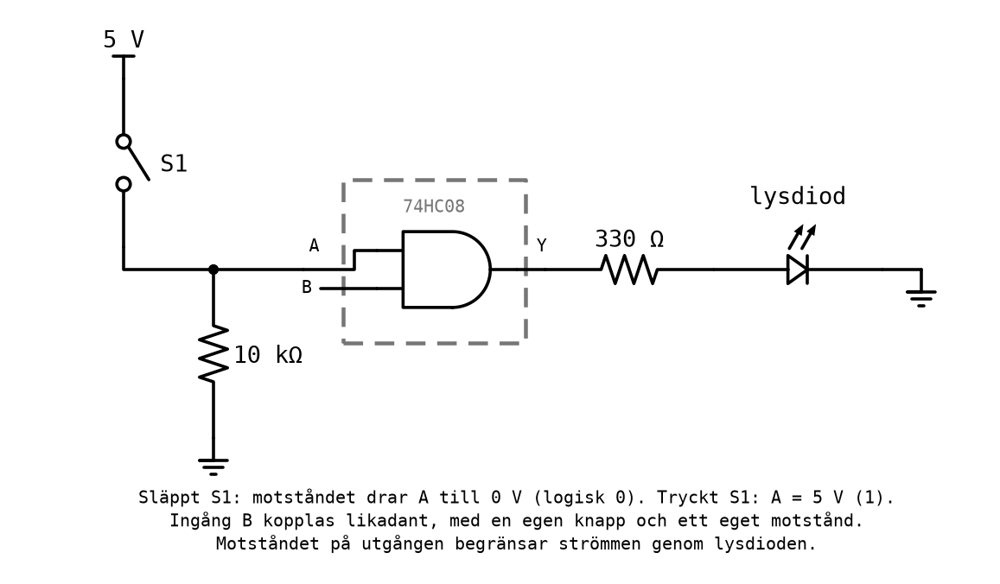
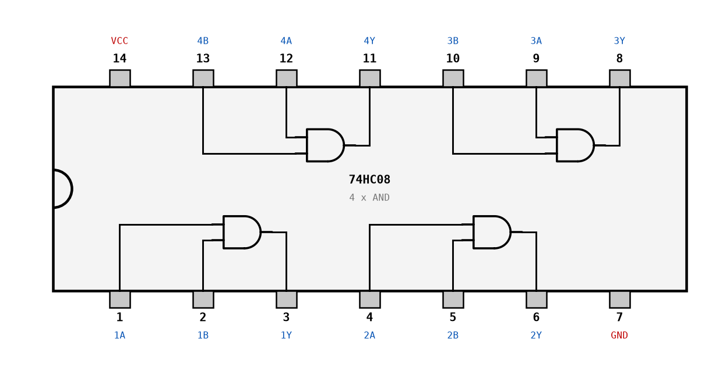
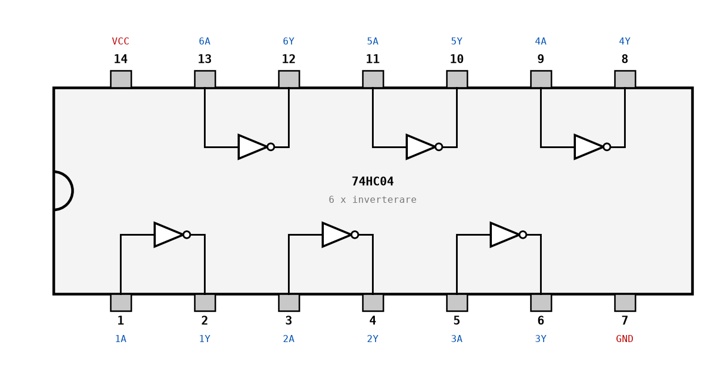
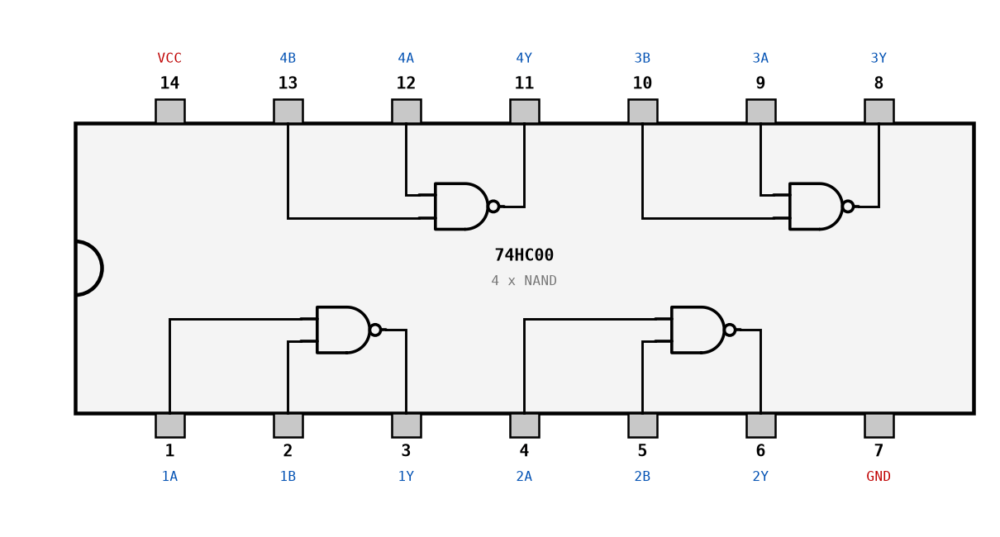
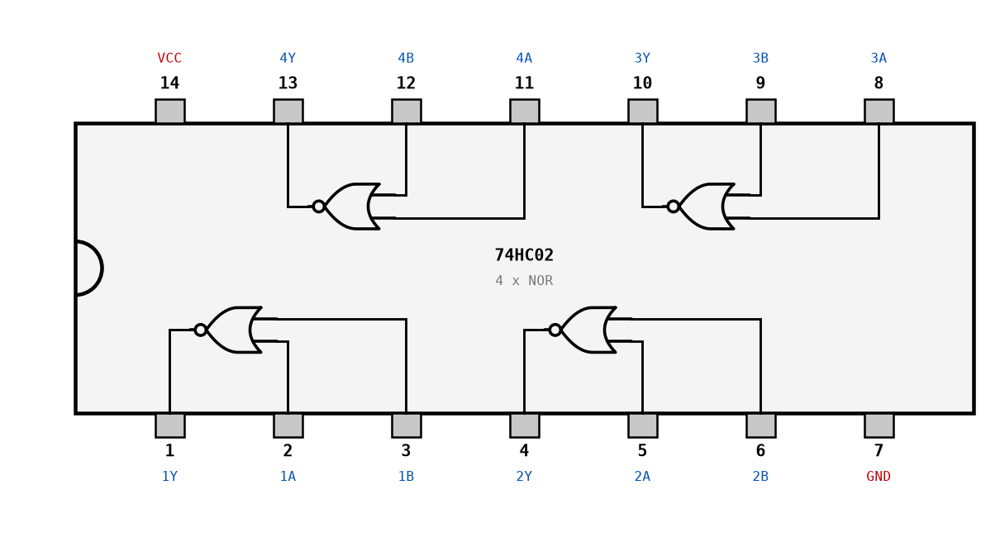
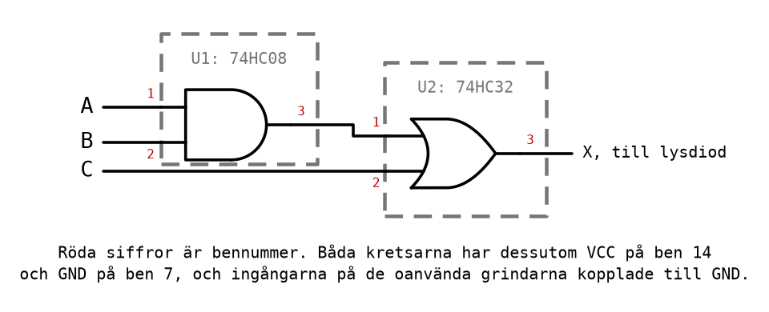

# Labb 2 - Grindnät med IC-kretsar

I Labb 1 byggde du logiska funktioner av kontakter. Nu gör du samma sak med **IC-kretsar**: små
kretsar ur 74-serien, med fyra eller sex grindar i varje, uppkopplade på ett kopplingsdäck. Labben
har två delar som görs i samma pass, [L05](../../lectures/L05/README.md):

* **Labb 2-1**: grindnät med AND-, OR- och inverterarkretsar, från ett minimerat uttryck till en
  fungerande krets.
* **Labb 2-2**: samma sorts nät med enbart NAND-grindar, och en titt på NOR.

Teorin finns i [L04](../../lectures/L04/README.md): Karnaughdiagram i
[Appendix A](../../lectures/L04/appendix/a_karnaugh_maps.md) och IC-kretsar, kopplingsdäck och
planering i [Appendix B](../../lectures/L04/appendix/b_integrated_circuits.md). Hur du hittar felet
när något inte fungerar står i [L05 Appendix A](../../lectures/L05/appendix/a_troubleshooting.md).

---

## Mål
Efter labben ska du kunna:
* ta fram ett minimerat uttryck med ett Karnaughdiagram och realisera det med IC-kretsar;
* läsa en benplacering och koppla upp en IC-krets med matning, ingångar och utgång;
* planera en uppkoppling med en grindtilldelning och en kopplingslista, och följa planen;
* bygga om ett nät till enbart NAND-grindar, och förklara varför det kan spara kretsar;
* verifiera ett nät mot dess sanningstabell, och felsöka det systematiskt när det inte stämmer.

---

## Utrustning
Varje station har:
* ett kopplingsdäck med 5 V-matning, strömbrytare för ingångarna och lysdioder för utgångarna;
* kretsarna **74HC08** (AND), **74HC32** (OR) och **74HC04** (inverterare) till Labb 2-1;
* kretsarna **74HC00** (NAND) och **74HC02** (NOR) till Labb 2-2;
* kopplingstråd, och en multimeter.

Titta efter på din station hur strömbrytarna och lysdioderna är anslutna. Om stationen saknar egna
lysdioder kopplar du en lysdiod med ett förkopplingsmotstånd på 330 Ω från utgången till jord. Om
du använder egna tryckknappar i stället för stationens strömbrytare behöver varje ingång ett
pull-down-motstånd. Båda beskrivs i
[L04 Appendix B](../../lectures/L04/appendix/b_integrated_circuits.md), avsnitt B.4 och B.5:



Benplaceringarna för kretsarna, sedda ovanifrån med hacket åt vänster:










Kopplingsdäcket, med kretsen över mittspåret och matningen dragen:


---

## Säkerhet
* Koppla med matningen **frånslagen**, och slå på först när kopplingen är kontrollerad mot din
  kopplingslista.
* **Kontrollera kretsens riktning** innan du slår på: hacket åt vänster, ben 1 nere till vänster.
  En felvänd krets får plus och jord omkastade.
* Känn efter med ett finger på kretsen strax efter att du slagit på. **En krets som blir varm är
  felkopplad**: bryt matningen direkt.
* Koppla aldrig 24 V från Labb 1 till kopplingsdäcket. Kretsarna tål högst 7 V.

---

## Förberedelser
Görs **före** passet, hemma eller i L04. Utan dem hinner du inte klart, och de ingår i
redovisningen.

**F1 - Sanningstabeller.** Skriv den förväntade sanningstabellen för en AND-, en OR- och en
inverterargrind, och för näten i Labb 2-1 uppgift 2 och 3.

**F2 - Karnaughdiagram.** Ta fram ett minimerat uttryck för Labb 2-1 uppgift 4 med ett
Karnaughdiagram, och rita grindnätet.

**F3 - NAND-nät.** Rita NOT, AND och OR byggda av enbart NAND-grindar (Labb 2-2 uppgift 2), och
nätet för `X = AB + C` med enbart NAND (Labb 2-2 uppgift 3). Kontrollera varje nät med De Morgans
lagar eller genom att gå igenom alla rader.

**F4 - Simulera.** Bygg varje nät i [CircuitVerse](https://circuitverse.org/simulator) och
kontrollera det mot sanningstabellen, rad för rad.

**F5 - Planera.** Gör en **grindtilldelning** och en **kopplingslista** för varje uppgift där du
bygger ett nät: Labb 2-1 uppgift 2, 3 och 4 och Labb 2-2 uppgift 3. Använd formen i
[L04 B.7](../../lectures/L04/appendix/b_integrated_circuits.md#b7-att-planera-en-uppkoppling), med
bennummer på varje rad.

---

## Labb 2-1
AND-, OR- och inverterarkretsar: 74HC08, 74HC32 och 74HC04.

Arbetsgången är densamma i varje uppgift, och det är värt att hålla fast vid den:
1. Koppla matningen till varje krets först, ben 14 till +5 V och ben 7 till jord.
2. Koppla resten enligt kopplingslistan, och bocka av varje rad.
3. Koppla ingångarna på oanvända grindar till jord.
4. Slå på, och gå igenom **alla** kombinationer av ingångarna. Fyll i tabellen: förväntat värde
   från förberedelserna, och uppmätt värde.
5. Om en rad inte stämmer: felsök enligt
   [L05 Appendix A](../../lectures/L05/appendix/a_troubleshooting.md), inte genom att flytta
   sladdar på måfå.

### Uppgift 1 - Verifiera AND, OR och inverterare
Innan du bygger något med en krets ska du veta att den fungerar och att du läser benplaceringen
rätt.

**a)** Sätt 74HC08 på kopplingsdäcket och koppla matningen. Koppla grind 1 (ben 1, 2 och 3) till två
strömbrytare och en lysdiod. Koppla ingångarna på grind 2-4 till jord.

**b)** Gå igenom alla fyra kombinationerna och fyll i tabellen.

**c)** Byt 74HC08 mot 74HC32 **utan att flytta en enda sladd**, och upprepa. Förklara varför det
fungerar.

**d)** Koppla en inverterare i 74HC04 (ben 1 in, ben 2 ut) och kontrollera båda raderna.

**e)** Mät med multimetern spänningen på en utgång som är 1 och en som är 0, med lysdioden
ansluten. Skriv upp värdena; de används i kontrolluppgiften i
[L05, övning 10](../../lectures/L05/appendix/b_exercises.md#10-kontroll-en-utgång-under-last).

| A | B | AND, förväntat | AND, mätt | OR, förväntat | OR, mätt |
|---|---|----------------|-----------|---------------|----------|
| 0 | 0 | | | | |
| 0 | 1 | | | | |
| 1 | 0 | | | | |
| 1 | 1 | | | | |

| A | NOT, förväntat | NOT, mätt |
|---|----------------|-----------|
| 0 | | |
| 1 | | |

*Redovisa* tabellerna och de uppmätta spänningarna.

### Uppgift 2 - X = AB + C
Nätet från [L04 A.3](../../lectures/L04/appendix/a_karnaugh_maps.md#a3-att-gruppera), två grindar i
två kretsar. Figuren visar det med kretsbeteckningar och bennummer, så som kopplingslistan läser
det:



**a)** Koppla upp nätet enligt din kopplingslista från F5.

**b)** Gå igenom alla åtta kombinationerna och fyll i tabellen.

**c)** Mät spänningen på U1 ben 3 för raden `ABC = 110`. Vilken logisk nivå är det, och stämmer det
med vad `AB` ska vara?

| A | B | C | X, förväntat | X, mätt |
|---|---|---|--------------|---------|
| 0 | 0 | 0 | | |
| 0 | 0 | 1 | | |
| 0 | 1 | 0 | | |
| 0 | 1 | 1 | | |
| 1 | 0 | 0 | | |
| 1 | 0 | 1 | | |
| 1 | 1 | 0 | | |
| 1 | 1 | 1 | | |

*Redovisa* den fungerande kretsen och tabellen.

### Uppgift 3 - Bromsassistenten
Bromsassistenten från
[L02 A.10](../../lectures/L02/appendix/a_logic_gates.md#a10-föreläsningens-krets-bromsassistenten)
har fyra ingångar och en utgång, med samma beteckningar som där:
* `D`: föraren står på bromspedalen;
* `S` och `R`: avståndssensorn respektive radarn, två detektorer som var och en kan se ett hinder;
* `F`: assistanssystemet rapporterar ett fel;
* `B`: bilen bromsar.

Bilen ska bromsa om föraren bromsar, eller om någon av detektorerna ser ett hinder och systemet
inte rapporterar något fel. Föraren ska alltid kunna bromsa, även när systemet är trasigt.

**a)** Skriv uttrycket för `B` (du tog fram det i L02; kontrollera det mot kravet igen), och
rita grindnätet med AND, OR och NOT.

**b)** Gör en grindtilldelning. Hur många grindar av varje sort behövs, och vilka kretsar?

**c)** Koppla upp nätet och gå igenom alla sexton kombinationerna.

**d)** Säkerhetskravet: kontrollera särskilt de åtta raderna där `D = 1`. Vad ska `B` vara
på alla dem, oavsett de andra ingångarna?

| D | S | R | F | B, förväntat | B, mätt |
|---|---|---|---|--------------|---------|
| 0 | 0 | 0 | 0 | | |
| 0 | 0 | 0 | 1 | | |
| 0 | 0 | 1 | 0 | | |
| 0 | 0 | 1 | 1 | | |
| 0 | 1 | 0 | 0 | | |
| 0 | 1 | 0 | 1 | | |
| 0 | 1 | 1 | 0 | | |
| 0 | 1 | 1 | 1 | | |
| 1 | 0 | 0 | 0 | | |
| 1 | 0 | 0 | 1 | | |
| 1 | 0 | 1 | 0 | | |
| 1 | 0 | 1 | 1 | | |
| 1 | 1 | 0 | 0 | | |
| 1 | 1 | 0 | 1 | | |
| 1 | 1 | 1 | 0 | | |
| 1 | 1 | 1 | 1 | | |

*Redovisa* den fungerande kretsen, tabellen, och svaret på d).

### Uppgift 4 - Syntes med Karnaughdiagram
Ett grindnät med fyra ingångar `ABCD` och en utgång `X` har sanningstabellen nedan. Du har tagit
fram det minimerade uttrycket i F2.

| ABCD | X | ABCD | X |
|------|---|------|---|
| 0000 | 0 | 1000 | 0 |
| 0001 | 1 | 1001 | 1 |
| 0010 | 0 | 1010 | 0 |
| 0011 | 1 | 1011 | 1 |
| 0100 | 0 | 1100 | 1 |
| 0101 | 0 | 1101 | 0 |
| 0110 | 0 | 1110 | 1 |
| 0111 | 0 | 1111 | 0 |

**a)** Visa ditt Karnaughdiagram och ditt minimerade uttryck.

**b)** Hur många kretsar behövs? Jämför med vad den direkta avläsningen ur tabellen hade krävt.

**c)** Koppla upp nätet och kontrollera alla sexton raderna. Skriv ned förväntat och uppmätt värde
för varje rad, i en tabell som ovan.

*Redovisa* diagrammet, uttrycket, den fungerande kretsen och tabellen.

---

## Labb 2-2
NAND och NOR: 74HC00 och 74HC02.

I [L02](../../lectures/L02/README.md) såg du att NAND ensam räcker för att bygga vilken funktion
som helst. Här bevisar du det med riktiga kretsar, och ser vad det kostar och vad det sparar.

### Uppgift 1 - Verifiera NAND och NOR
**a)** Koppla grind 1 i 74HC00 (ingångar ben 1 och 2, utgång ben 3) och kontrollera alla fyra
raderna.

**b)** Byt till 74HC02. **Titta på benplaceringen först**: i 74HC02 är ben 1 en utgång, och
ingångarna på grind 1 är ben 2 och 3. Flytta sladdarna därefter, och kontrollera alla fyra raderna.

**c)** Vad hade hänt om du bara bytt kretsen, som i Labb 2-1 uppgift 1 c)? Två utgångar hade
kopplats mot varandra, eller en strömbrytare mot en utgång. Förklara varför det inte är bra.

| A | B | NAND, förväntat | NAND, mätt | NOR, förväntat | NOR, mätt |
|---|---|-----------------|------------|----------------|-----------|
| 0 | 0 | | | | |
| 0 | 1 | | | | |
| 1 | 0 | | | | |
| 1 | 1 | | | | |

*Redovisa* tabellen.

### Uppgift 2 - NOT, AND och OR av NAND
Bygg de tre grundgrindarna av enbart NAND-grindar ur en 74HC00, en i taget, med näten från F3:
* **NOT**: en NAND med båda ingångarna ihopkopplade.
* **AND**: en NAND följd av en NOT.
* **OR**: en NOT på varje ingång, följda av en NAND. Kontrollera med De Morgan: `(A'B')' = A + B`.

**a)** Hur många NAND-grindar kräver var och en? Ryms alla tre i en 74HC00 samtidigt?

**b)** Koppla upp var och en och kontrollera den mot sin sanningstabell.

*Redovisa* varje grind när den fungerar.

### Uppgift 3 - X = AB + C med enbart NAND
Samma funktion som i Labb 2-1 uppgift 2, nu enligt
[L04 A.9](../../lectures/L04/appendix/a_karnaugh_maps.md#a9-nand--och-nor-nät):

```text
X = ((AB)' · C')'
```

**a)** Koppla upp nätet i en enda 74HC00.

**b)** Gå igenom alla åtta raderna. Tabellen ska vara identisk med den i Labb 2-1 uppgift 2.

**c)** Jämför de två lösningarna: antal grindar, antal kretsar och antal sladdar. Vilken hade du
valt om du skulle bygga hundra exemplar?

*Redovisa* den fungerande kretsen, tabellen och jämförelsen.

### Uppgift 4 - Extra: enbart NOR, och XOR av fyra NAND
Frivillig, för den som hinner. Den krävs inte för godkänt.

**a)** Bygg `X = AB + C` med enbart NOR-grindar i en 74HC02, med uttrycket
`X = ((A + C)' + (B + C)')'`. Tänk på benplaceringen.

**b)** Bygg en XOR av fyra NAND-grindar i en 74HC00:


Kontrollera alla fyra raderna, och jämför med sanningstabellen för XOR.

**c)** Bromsassistenten från Labb 2-1 uppgift 3 med enbart NAND-grindar. Hur många kretsar
behövs?

*Redovisa* det du hunnit.

---

## Redovisning
Bocka av varje uppgift när den är redovisad för läraren. Båda i paret ska kunna förklara
lösningen.

| Del | Uppgift | Krävs för G | Redovisad |
|-----|---------|-------------|-----------|
| Förberedelser | F1-F5 | ja | |
| Labb 2-1 | 1 - Verifiera AND, OR och inverterare | ja | |
| Labb 2-1 | 2 - X = AB + C | ja | |
| Labb 2-1 | 3 - Bromsassistenten | ja | |
| Labb 2-1 | 4 - Syntes med Karnaughdiagram | ja | |
| Labb 2-2 | 1 - Verifiera NAND och NOR | ja | |
| Labb 2-2 | 2 - NOT, AND och OR av NAND | ja | |
| Labb 2-2 | 3 - X = AB + C med enbart NAND | ja | |
| Labb 2-2 | 4 - Extra | nej | |

---
