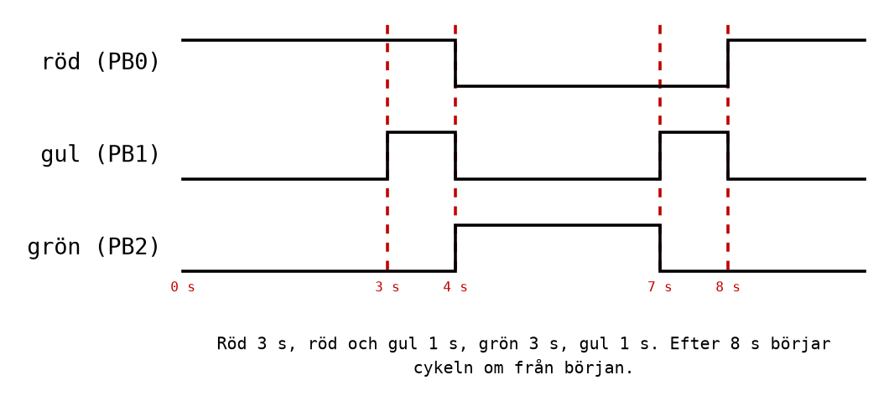

# Labb 3 - Slutuppgift: Trafikljuset och övergångsstället

Slutuppgiften hör till [L11](../../lectures/L11/README.md), och är den del av Labb 3 där programmet
till sist lämnar simulatorn och styr något på riktigt: tre lysdioder och en knapp på ett Arduino
Uno-kort. Del A krävs för godkänt, och del B för VG.

Läs [L11 Appendix A](../../lectures/L11/appendix/a_control_objects.md) om lysdioder, knappar och
kopplingen, och [Appendix B](../../lectures/L11/appendix/b_traffic_light.md), där ett enklare ljus,
ett vägarbetsljus, tas hela vägen från flödesplan till program. Hur programmet förs över till kortet
står i
[info/microchip_studio.md, avsnitt 5](../../info/microchip_studio.md#5-programmera-ett-arduino-kort-från-microchip-studio).

---

## Kopplingen
Samma koppling används i båda delarna. Varje lysdiod har ett eget förkopplingsmotstånd, och knappen
kopplas mellan stift 2 och jord.

| Funktion | Arduino-stift | Port och bit |
|----------|---------------|--------------|
| Röd lysdiod | 8 | PB0 |
| Gul lysdiod | 9 | PB1 |
| Grön lysdiod | 10 | PB2 |
| Knapp, till jord | 2 | PD2 |
| Jord | GND | - |


Lysdiodens långa ben, anoden, ska vara vänt mot motståndet och stiftet, och det korta, katoden, mot
jord. Koppla med USB-kabeln urkopplad, och kontrollera kopplingen mot tabellen innan kabeln sätts i.

---

## De färdiga subrutinerna
Båda delarna använder fördröjningar på hela sekunder. Ni behöver inte skriva dem själva: kopiera in
de två subrutinerna nedan sist i programmet, och konstanten `QUARTER_MS` överst. De förklaras i
[L11 Appendix B.4](../../lectures/L11/appendix/b_traffic_light.md#b4-subrutinen-delay_s), och
`delay_ms` är samma subrutin som i del 22.

```asm
.equ QUARTER_MS = 250               ; 250 ms. Set it to 1 to run about 250 times
                                    ; faster in the simulator; set it back before
                                    ; flashing.
```

```asm
;--------------------------------------------------------------------------------
; delay_s: Waits r24 seconds (1-63), as 4 x r24 calls of delay_ms with 250 ms each.
; A call takes 16 000 084 x r24 + 18 cycles: about 5 microseconds too long per second.
;--------------------------------------------------------------------------------
delay_s:
    push r24                        ; Save the registers this subroutine changes.
    push r25
    mov r25, r24
    lsl r25                         ; r25 = 2 x r24 ...
    lsl r25                         ; ... = 4 x r24: the number of quarter seconds.
    ldi r24, QUARTER_MS             ; A quarter of a second is 250 ms.
delay_s_loop:
    rcall delay_ms
    dec r25
    brne delay_s_loop
    pop r25                         ; Restore them, in the opposite order.
    pop r24
    ret

;--------------------------------------------------------------------------------
; delay_ms: Waits r24 milliseconds (1-255) at 16 MHz.
; A call takes 16 000 x r24 + 18 cycles, the rcall and the ret included.
;--------------------------------------------------------------------------------
delay_ms:
    push r24                        ; Save the registers this subroutine changes.
    push r26
    push r27
delay_ms_outer:
    ldi r26, low(3999)              ; X = r27:r26 = 3999.
    ldi r27, high(3999)
delay_ms_inner:
    sbiw r26, 1                     ; 4 cycles per turn, 3 the last time.
    brne delay_ms_inner
    dec r24                         ; One more millisecond done.
    brne delay_ms_outer
    pop r27                         ; Restore them, in the opposite order.
    pop r26
    pop r24
    ret
```

Så används de: ladda `r24` med antalet sekunder och anropa `delay_s`. `ldi r24, 3` följt av
`rcall delay_s` väntar tre sekunder, och `r24` är fortfarande 3 efteråt.

> **I simulatorn** tar varje simulerad sekund lång tid att köra. Sätt `QUARTER_MS` till 1 medan ni
> testar programmet där: då går varje "sekund" på ungefär 4 ms, och hela ljuscykeln syns på några
> ögonblick. **Sätt tillbaka den till 250 innan programmet förs över till kortet.**

---

## Del A - Trafikljuset

### Mål
Styra ett trafikljus med tre lysdioder genom en fast ljuscykel, i simulatorn och på kortet.

### Bakgrund
Vägarbetsljuset i [L11 Appendix B](../../lectures/L11/appendix/b_traffic_light.md) har två
tillstånd; trafikljuset har fyra. Metoden är densamma: skriv upp tillstånden och deras tider, rita
flödesplanen, och skriv sedan programmet ett tillstånd i taget.

### Specifikation
Trafikljuset går igenom fyra tillstånd, i den här ordningen, och börjar sedan om:

| Tillstånd | Röd (PB0) | Gul (PB1) | Grön (PB2) | Tid |
|-----------|-----------|-----------|------------|-----|
| Stopp | tänd | släckt | släckt | 3 s |
| Klart att köra | tänd | tänd | släckt | 1 s |
| Kör | släckt | släckt | tänd | 3 s |
| Stopp strax | släckt | tänd | släckt | 1 s |



### Uppgifter
1. **Flödesplan.** Rita flödesplanen för programmet, med ett symbolpar per tillstånd: tänd rätt
   lampor, vänta rätt tid. *Redovisa* den innan ni börjar skriva kod.
2. **Bitmönstren.** Skriv upp vilket värde `PORTB` ska ha i vart och ett av de fyra tillstånden,
   binärt och hexadecimalt. Använd gärna `.equ RED = 0` och skrivsättet `(1 << RED)`, så att
   programmet säger vad det gör.
3. **Programmet.** Skriv programmet utifrån programmallen, med initiering av `SP`, `DDRB`, och de
   färdiga subrutinerna.
4. **Simulera.** Sätt `QUARTER_MS` till 1 och kör i simulatorn. Sätt en brytpunkt på varje
   `out PORTB, r16` och kontrollera i I/O-fönstret att rätt lampor tänds, i rätt ordning.
   Kontrollera också med stoppuret att tiderna står i rätt förhållande till varandra: 3, 1, 3, 1.
5. **På kortet.** Sätt tillbaka `QUARTER_MS` till 250, bygg, och för över programmet till kortet
   enligt
   [info/microchip_studio.md, avsnitt 5](../../info/microchip_studio.md#5-programmera-ett-arduino-kort-från-microchip-studio).
6. **Mät.** Ta tid på tio hela cykler med stoppuret i en mobiltelefon. *Förutsäg* tiden först, med
   formeln för `delay_s`. Hur nära kommer ni? Vad begränsar noggrannheten i er mätning, och vad
   begränsar noggrannheten i programmet?

### Frågor
* Vad händer om `delay_s` inte sparade `r24`? Hade programmet märkt det?
* Varför tänds röd och gul samtidigt i det andra tillståndet? Vad säger det till en bilist?

*Redovisa* flödesplanen, simuleringen och trafikljuset på kortet.

---

## Del B - Övergångsstället

### Mål
Låta en knapp styra när ljuscykeln körs: ett övergångsställe där bilarna har grönt tills en
fotgängare trycker på knappen.

### Bakgrund
Att vänta på en knapp med `sbic` finns i
[L10 Appendix B.5](../../lectures/L10/appendix/b_input_port.md#b5-att-vänta-på-en-knapp), och varför
en knapp studsar i
[L11 Appendix A.4](../../lectures/L11/appendix/a_control_objects.md#a4-knappar-som-studsar).
Subrutiner och kursens regel om register finns i
[L10 Appendix C](../../lectures/L10/appendix/c_subroutines_and_stack.md).

### Specifikation
* Bilarna har **grönt**, så länge ingen trycker på knappen.
* När knappen trycks går ljuset igenom:

  | Tillstånd | Röd (PB0) | Gul (PB1) | Grön (PB2) | Tid |
  |-----------|-----------|-----------|------------|-----|
  | Stopp strax | släckt | tänd | släckt | 1 s |
  | Stopp: fotgängarna går | tänd | släckt | släckt | 4 s |
  | Klart att köra | tänd | tänd | släckt | 1 s |

* Därefter blir det grönt igen, och programmet väntar på nästa tryck.
* Knappen är aktivt låg, med den inbyggda pull-upen: PD2 som ingång, med pull-up.
* Programmet ska använda minst en egen subrutin utöver de färdiga, och varje subrutin ska följa
  kursens regel: spara varje register den ändrar.

### Uppgifter
1. **Flödesplan.** Rita flödesplanen, med beslutet "knappen nedtryckt?" och de tre tillstånden.
   *Redovisa* den innan ni skriver kod.
2. **En egen subrutin.** De tre tillstånden gör samma sak med olika värden: tänd vissa lampor, vänta
   en viss tid. Skriv en subrutin `show` som tänder lamporna i `r16` och väntar det antal sekunder
   som står i `r24`. Vilka register ändrar den? Måste något av dem sparas?
3. **Programmet.** Skriv programmet. Initiera `SP`, `DDRB`, `DDRD` och pull-upen på PD2.
4. **Simulera.** Sätt `QUARTER_MS` till 1. Kör programmet, stoppa det medan det väntar på knappen,
   och "tryck" genom att tömma rutan för bit 2 i `PIND`. *Förutsäg* vilka lampor som ska tändas i
   vilken ordning, och kontrollera med brytpunkter.
5. **På kortet.** Sätt tillbaka `QUARTER_MS` till 250 och för över programmet till kortet. Prova ett
   kort tryck, ett långt tryck, och ett tryck medan ljuset redan är rött.

### Frågor
* Knappen studsar när den trycks. Varför ställer det inte till något här, när det gjorde det för
  knapptryckräknaren i L11?
* Vad händer om någon håller knappen nedtryckt hela tiden? Är det ett problem för bilarna?
* Ett tryck medan ljuset är rött gör ingenting. Varför inte? Hur skulle programmet behöva ändras för
  att komma ihåg ett sådant tryck?

### Extra
Frivilliga utökningar, för den som vill vidare:
* **Minsta tid på grönt.** Riktiga övergångsställen ger bilarna grönt i minst några sekunder innan
  ett nytt tryck får verkan. Låt bilarna alltid ha grönt i minst 5 s efter varje fotgängarfas.
* **Fotgängarnas ljus.** Lägg till en röd och en grön lysdiod för fotgängarna på PB3 och PB4 (stift
  11 och 12). Fotgängarnas gröna ska lysa bara under de 4 sekunderna med rött för bilarna.
* **Vänta-lampan.** Tänd en lampa, till exempel PB5 (stift 13, lysdioden på kortet), när knappen har
  tryckts, och släck den när fotgängarna får grönt.

*Redovisa* flödesplanen, simuleringen och övergångsstället på kortet.

---
