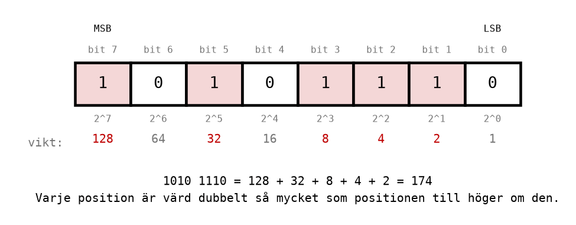
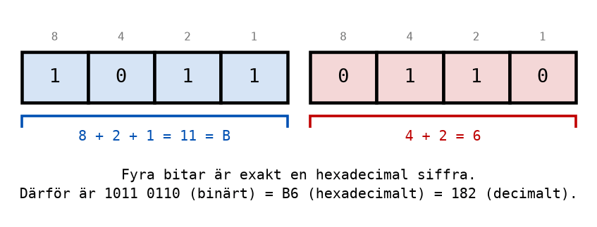

# Appendix A - Talsystem

## A.1 Digitalt och analogt
En **analog** signal kan anta vilket värde som helst inom ett intervall. Spänningen från en
temperaturgivare kan vara 1,2 V, 1,21 V eller 1,2137 V, och varje liten ändring betyder något. Det
gör också varje liten störning: brus från en motor i närheten flyttar signalen, och mottagaren
kan inte veta vilken del av värdet som är mätning och vilken som är störning.

En **digital** signal antar bara två värden, som vi kallar `0` och `1`. I en krets som matas med
5 V betyder ungefär 0 V en nolla och ungefär 5 V en etta, och allt som ligger tillräckligt nära
någon av dem läses som exakt `0` eller exakt `1`. En störning på några tiondels volt ändrar
därför ingenting alls.

**Den tåligheten mot brus är skälet till att nästan all modern elektronik är digital**, från
mikrokontrollern i en kaffebryggare till styrsystemet i en fabrik. Priset är att en digital signal
bara bär en enda uppgift, ja eller nej, tänd eller släckt. För att kunna representera ett tal, en
temperatur eller en bokstav behövs många digitala signaler tillsammans, och ett sätt att tolka
dem. Det är vad talsystemen och koderna i den här föreläsningen handlar om.

En digital signal, eller en siffra i ett binärt tal, kallas en **bit**, av engelskans *binary
digit*.

---

## A.2 Positionssystem och talbas
Det talsystem vi använder till vardags, det **decimala** talsystemet, har tio siffror, 0 till 9.
Antalet siffror kallas talsystemets **talbas**, så det decimala talsystemet har talbasen 10.

Det är också ett **positionssystem**: en siffras värde beror på var i talet den står. I talet 25
är femman värd 5 och tvåan värd 20. Lägg till en nolla sist, 250, så flyttar båda ett steg åt
vänster och blir värda tio gånger mer: femman 50 och tvåan 200.

Varje position har alltså en **vikt**, en potens av talbasen. Positionerna numreras från höger
med början på **noll**:

| Position | 2 | 1 | 0 |
|----------|---|---|---|
| Vikt | $10^2 = 100$ | $10^1 = 10$ | $10^0 = 1$ |
| Siffra i talet 250 | 2 | 5 | 0 |
| Värde | 200 | 50 | 0 |

Talets värde är summan av varje siffra gånger vikten för dess position:

```math
250 = 2 \cdot 10^2 + 5 \cdot 10^1 + 0 \cdot 10^0 = 200 + 50 + 0
```

Att numreringen börjar på noll är ingen godtycklig vana. Den högra positionen har vikten
$B^0 = 1$ i **alla** talsystem, oavsett talbas *B*, och det är skälet till att den kallas position
noll.

Samma formel gäller alltså för varje talsystem. En siffra $x_n$ på position $n$ i ett tal med
talbasen $B$ är värd

```math
x_n \cdot B^n
```

och talets värde är summan av alla siffrornas värden. Den högra siffran, med lägst vikt, kallas
den **minst signifikanta** siffran, och den vänstra den **mest signifikanta**.

När det inte framgår av sammanhanget vilket talsystem ett tal är skrivet i, skrivs talbasen som
ett index efter talet: $25_{10}$ är tjugofem decimalt, $11001_2$ är samma tal binärt. I kod och i
den här kursens text används i stället ett prefix, se [A.8](#a8-skrivsätt).

---

## A.3 Det binära talsystemet
En digital signal har två tillstånd, så den naturliga talbasen i digitaltekniken är 2. Det
**binära** talsystemet har bara siffrorna 0 och 1, och varje position är värd dubbelt så mycket
som positionen till höger om den:

| Position | 7 | 6 | 5 | 4 | 3 | 2 | 1 | 0 |
|----------|---|---|---|---|---|---|---|---|
| Vikt | 128 | 64 | 32 | 16 | 8 | 4 | 2 | 1 |

Den raden med vikter är det viktigaste i hela den här föreläsningen. Lär dig den utantill, från
höger: 1, 2, 4, 8, 16, 32, 64, 128.

### Från binärt till decimalt
För att omvandla ett binärt tal till decimalt summerar du vikterna för de positioner där det står
en etta. Nollorna bidrar inte med något och kan hoppas över.

**Exempel:** $1011_2$ har ettor på position 3, 1 och 0:

```math
1011_2 = 1 \cdot 8 + 0 \cdot 4 + 1 \cdot 2 + 1 \cdot 1 = 8 + 2 + 1 = 11_{10}
```

**Exempel:** $1010\,1110_2$ har ettor på position 7, 5, 3, 2 och 1:



```math
1010\,1110_2 = 128 + 32 + 8 + 4 + 2 = 174_{10}
```

Binära tal skrivs ofta i grupper om fyra siffror, med ett mellanrum emellan, på samma sätt som
man skriver 1 000 000 i stället för 1000000. Mellanrummet betyder ingenting; det gör bara talet
lättare att läsa.

### Bitar, nibblar och byte
Några namn på grupper av bitar som återkommer genom hela kursen:

| Namn | Antal bitar | Exempel |
|------|-------------|---------|
| bit | 1 | `1` |
| nibble | 4 | `1011` |
| byte | 8 | `1010 1110` |
| ord (på AVR-processorn) | 16 | `0000 0011 1110 1000` |

Den vänstra biten, med störst vikt, kallas **MSB** (*most significant bit*). Den högra, med vikten
1, kallas **LSB** (*least significant bit*). I en byte är MSB bit 7 och LSB bit 0.

Två saker går att se direkt på LSB och MSB:
* **LSB avgör om talet är udda eller jämnt.** Alla andra vikter är jämna tal, så bara LSB kan göra
  summan udda.
* **MSB avgör om talet är minst hälften av det största talet.** I en byte är MSB värd 128, och
  resten tillsammans som mest 127.

### Talområden
Med *n* bitar finns det $2^n$ olika kombinationer av ettor och nollor, eftersom varje bit
fördubblar antalet möjligheter. Den minsta är noll, så den största är en mindre än antalet
kombinationer:

```math
\text{antal värden} = 2^n \qquad \text{största värde} = 2^n - 1
```

| Antal bitar | Antal värden | Talområde |
|-------------|--------------|-----------|
| 1 | 2 | 0-1 |
| 4 | 16 | 0-15 |
| 8 | 256 | 0-255 |
| 10 | 1024 | 0-1023 |
| 16 | 65 536 | 0-65 535 |

Du kan kontrollera den största: åtta ettor är $128 + 64 + 32 + 16 + 8 + 4 + 2 + 1 = 255$, vilket
är $2^8 - 1$.

Det här är ingen teoretisk detalj. Mikrodatorn i den här kursen, ATmega328P, räknar med 8 bitar
åt gången, så ett av dess register kan bara hålla talen 0-255. Vad som händer när ett tal inte
ryms är ämnet för [A.7](#a7-binär-addition), och för en stor del av
[L08](../../L08/README.md).

---

## A.4 Från decimalt till binärt
Åt andra hållet finns två metoder. Båda ger samma svar; välj den du tycker är enklast.

### Metod 1: vikttabellen
Skriv upp vikterna, och ta för varje vikt från vänster ställning till om den ryms i det som är
kvar av talet. Ryms den skriver du en etta och drar bort vikten; annars skriver du en nolla.

**Exempel:** omvandla $23_{10}$ till binärt.

| Vikt | 16 | 8 | 4 | 2 | 1 |
|------|----|---|---|---|---|
| Ryms den i det som är kvar? | 23: ja | 7: nej | 7: ja | 3: ja | 1: ja |
| Kvar efteråt | 7 | 7 | 3 | 1 | 0 |
| Bit | 1 | 0 | 1 | 1 | 1 |

Alltså är $23_{10} = 10111_2$. Kontrollera baklänges: $16 + 4 + 2 + 1 = 23$.

### Metod 2: division med 2
Dela talet med 2 och skriv upp resten, som alltid är 0 eller 1. Dela sedan kvoten med 2 igen, och
fortsätt tills kvoten är 0. Resterna är bitarna, med **den första resten som LSB**.

**Exempel:** omvandla $23_{10}$ till binärt igen.

| Division | Kvot | Rest |
|----------|------|------|
| 23 / 2 | 11 | 1 (bit 0, LSB) |
| 11 / 2 | 5 | 1 (bit 1) |
| 5 / 2 | 2 | 1 (bit 2) |
| 2 / 2 | 1 | 0 (bit 3) |
| 1 / 2 | 0 | 1 (bit 4, MSB) |

Resterna läses **nedifrån och upp**: $10111_2$, samma svar som med tabellen.

Det vanligaste felet med den här metoden är att läsa resterna uppifrån och ned, vilket ger talet
baklänges, $11101_2 = 29$. Kontrollera därför alltid svaret genom att räkna tillbaka till
decimalt.

### Att fylla ut till en hel byte
$10111_2$ har fem bitar. Ska talet ligga i ett 8-bitars register fylls det ut med nollor till
vänster: `0001 0111`. Nollor till vänster ändrar inte värdet, precis som 023 är samma sak som 23.

---

## A.5 Det hexadecimala talsystemet
Binära tal blir snabbt långa och svårlästa. Ett 16-bitars tal som
`0100 1010 1000 1100` är lätt att skriva av fel, och det är nästan omöjligt att se vilket tal det
är. Därför skrivs binära tal nästan alltid i det **hexadecimala** talsystemet, med talbasen 16.

Det behövs 16 siffror, så efter 0-9 används bokstäverna A-F:

| Decimalt | Binärt | Hexadecimalt | | Decimalt | Binärt | Hexadecimalt |
|----------|--------|--------------|-|----------|--------|--------------|
| 0 | 0000 | 0 | | 8 | 1000 | 8 |
| 1 | 0001 | 1 | | 9 | 1001 | 9 |
| 2 | 0010 | 2 | | 10 | 1010 | A |
| 3 | 0011 | 3 | | 11 | 1011 | B |
| 4 | 0100 | 4 | | 12 | 1100 | C |
| 5 | 0101 | 5 | | 13 | 1101 | D |
| 6 | 0110 | 6 | | 14 | 1110 | E |
| 7 | 0111 | 7 | | 15 | 1111 | F |

**Poängen med just talbasen 16 är att $16 = 2^4$: en hexadecimal siffra motsvarar exakt fyra
bitar**, en nibble. Omvandlingen mellan binärt och hexadecimalt kräver därför ingen räkning alls,
bara tabellen ovan.

### Från binärt till hexadecimalt
Dela upp det binära talet i grupper om fyra bitar, **med början från höger**, och byt varje grupp
mot sin hexadecimala siffra.

**Exempel:** $1011\,0110_2$.



Alltså är $1011\,0110_2 = \text{B6}_{16}$.

Om den sista gruppen till vänster har färre än fyra bitar fyller du ut den med nollor:
$1\,1110_2 = 0001\,1110_2 = \text{1E}_{16}$. Det är därför grupperingen börjar från höger. Börjar
man från vänster hamnar de utfyllande nollorna mitt i talet, där de ändrar värdet.

### Från hexadecimalt till binärt
Byt varje hexadecimal siffra mot sina fyra bitar.

**Exempel:** $\text{4A8C}_{16}$.

| Hexadecimal siffra | 4 | A | 8 | C |
|--------------------|---|---|---|---|
| Fyra bitar | 0100 | 1010 | 1000 | 1100 |

Alltså är $\text{4A8C}_{16} = 0100\,1010\,1000\,1100_2$. Fyra tecken i stället för sexton, och
omvandlingen tar några sekunder när tabellen väl sitter.

---

## A.6 Omvandling mellan alla tre
Mellan binärt och hexadecimalt är det bara att gruppera, som i A.5. Mellan decimalt och de andra
två finns två vägar.

### Från hexadecimalt till decimalt
Använd formeln från A.2 med talbasen 16. Vikterna är $16^0 = 1$, $16^1 = 16$, $16^2 = 256$ och
$16^3 = 4096$.

**Exempel:** $\text{F6}_{16}$, där F är 15:

```math
\text{F6}_{16} = 15 \cdot 16 + 6 \cdot 1 = 240 + 6 = 246_{10}
```

**Exempel:** $\text{2A5}_{16}$, där A är 10:

```math
\text{2A5}_{16} = 2 \cdot 256 + 10 \cdot 16 + 5 \cdot 1 = 512 + 160 + 5 = 677_{10}
```

Den andra vägen går via binärt:
$\text{F6}_{16} = 1111\,0110_2 = 128 + 64 + 32 + 16 + 4 + 2 = 246$. Den är ofta lika snabb för
tvåsiffriga tal, och bra som kontroll.

### Från decimalt till hexadecimalt
Också här finns två vägar.

**Via binärt:** omvandla till binärt enligt A.4, och gruppera sedan i fyror. $200_{10}$ blir
$1100\,1000_2$, som är $\text{C8}_{16}$.

**Division med 16:** som divisionsmetoden i A.4, men med 16 i stället för 2. Resterna är
hexadecimala siffror, och även här är den första resten den minst signifikanta.

| Division | Kvot | Rest |
|----------|------|------|
| 200 / 16 | 12 | 8 |
| 12 / 16 | 0 | 12 = C |

Nedifrån och upp: $\text{C8}_{16}$. Kontroll: $12 \cdot 16 + 8 = 192 + 8 = 200$.

### En sammanfattning
| Från \ Till | Decimalt | Binärt | Hexadecimalt |
|-------------|----------|--------|--------------|
| **Decimalt** | - | vikttabellen eller division med 2 | via binärt, eller division med 16 |
| **Binärt** | summera vikterna | - | gruppera i fyror från höger |
| **Hexadecimalt** | siffra gånger $16^n$ | fyra bitar per siffra | - |

---

## A.7 Binär addition
Binära tal adderas med samma uppställning som decimala: kolumn för kolumn från höger, med en
**minnessiffra** (en *carry*) som förs vidare till nästa kolumn när summan inte ryms i en siffra.

Skillnaden är bara att det "blir tio" redan vid två. Fyra regler räcker:

| Summa | Resultat | Minnessiffra |
|-------|----------|--------------|
| 0 + 0 | 0 | 0 |
| 0 + 1 | 1 | 0 |
| 1 + 1 | 0 | 1 |
| 1 + 1 + 1 (med minnessiffra) | 1 | 1 |

Den tredje raden är den som känns ovan: $1 + 1 = 10_2$, alltså två, skrivet som en nolla med en
etta i minnet.

**Exempel:** $90 + 55$, med båda talen som 8-bitars binära tal.

```text
  minne:   1111 1100
           0101 1010     (90)
         + 0011 0111     (55)
         -----------
           1001 0001     (145)
```

Kontrollera: $1001\,0001_2 = 128 + 16 + 1 = 145$, och $90 + 55 = 145$.

### När summan inte ryms
Ett 8-bitars register rymmer 0-255. Vad händer med $240 + 17 = 257$?

```text
  minne: 1 1110 0000
           1111 0000     (240)
         + 0001 0001     (17)
         -----------
         1 0000 0001
```

Summan behöver nio bitar. I ett 8-bitars register finns bara plats för de åtta högra, `0000 0001`,
alltså 1, och den nionde biten, minnessiffran ut ur bit 7, hamnar utanför. Resultatet blir
$257 - 256 = 1$.

**Det är inte ett fel i datorn; det är vad åtta bitar betyder.** Talet slår runt, som
vägmätaren i en gammal bil som går från 99 999 till 00 000. Mikrodatorn sparar den nionde biten
i en särskild flagga, *carry*, så att programmet kan upptäcka att det hände. Det är ämnet för
[L08](../../L08/README.md), där samma sak kallas **aritmetisk rundgång**.

### Hexadecimal addition
Hexadecimala tal kan adderas direkt, med regeln att det "blir tio" vid 16. Oftast är det lika
enkelt att gå via binärt eller decimalt.

**Exempel:** $\text{3C}_{16} + \text{0A}_{16}$. Entalskolumnen: C + A = 12 + 10 = 22 = 16 + 6, så
siffran blir 6 med en etta i minnet. Sextontalskolumnen: 3 + 0 + 1 = 4. Summan är
$\text{46}_{16}$, och kontrollen i decimalt är $60 + 10 = 70 = 4 \cdot 16 + 6$.

---

## A.8 Skrivsätt
Samma tal kan skrivas på flera sätt, och vilket som används beror på sammanhanget.

| Skrivsätt | Exempel (tjugofem) | Används |
|-----------|-------------------|---------|
| Index efter talet | $25_{10}$, $11001_2$, $19_{16}$ | i matematik och i läroböcker |
| Prefix `0b` | `0b00011001` | i kod, för binära tal |
| Prefix `0x` | `0x19` | i kod, för hexadecimala tal |
| Prefix `$` | `$19` | i äldre AVR-assembler, för hexadecimala tal |
| Utan prefix | `25` | alltid decimalt |

Den här kursen använder prefixen `0b` och `0x` i löptext och i kod, eftersom det är så talen
skrivs i assemblerprogrammen från [L07](../../L07/README.md) och framåt. Indexen används bara i
härledningar som den här, där båda skrivsätten behövs sida vid sida.

Två saker är värda att notera:
* `0x19` och `19` är olika tal: tjugofem respektive nitton. Ett tal utan prefix är decimalt.
* Nollor till vänster ändrar inte värdet: `0x09` och `0x9` är samma tal. I kod skriver man ofta
  ut dem ändå, så att det syns hur många bitar talet är tänkt att ha.

### Att kontrollera med kalkylatorn
Kalkylatorn i Windows har ett läge som heter **Programmerare**. Där visas samma tal samtidigt som
`HEX`, `DEC`, `OCT` (oktalt, talbas 8, som inte används i kursen) och `BIN`. Knappen där det står
`QWORD`, under talen, väljer hur många bitar kalkylatorn räknar med; varje klick byter till nästa:
`QWORD` (64), `DWORD` (32), `WORD` (16) och `BYTE` (8).

Använd den för att kontrollera dina omvandlingar, aldrig för att ta fram dem: på provet finns
ingen kalkylator, och en omvandling du inte kan göra för hand kan du inte heller felsöka i ett
program.

---
