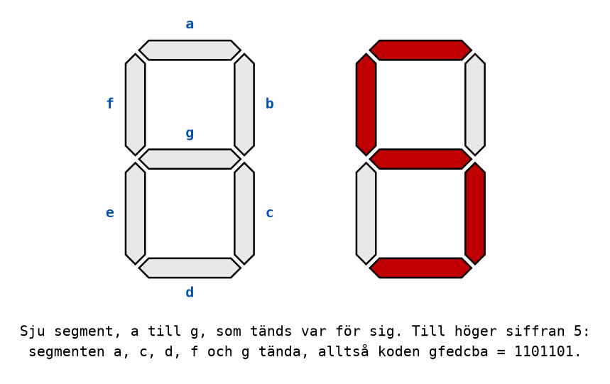

# Appendix B - Binära koder

## B.1 Vad en kod är
Ett binärt tal är ett sätt att tolka en rad bitar: som en summa av vikter. Men samma rad bitar kan
tolkas på andra sätt, och vilket sätt som gäller är en överenskommelse mellan den som skriver och
den som läser. En sådan överenskommelse kallas en **binär kod**.

Bitmönstret `0100 0001` är talet 65 om det tolkas som ett binärt tal, bokstaven `A` om det tolkas
som ASCII, och talet 41 om det tolkas som BCD. Bitarna vet inte vilket de är. **Det är alltid
sammanhanget, och den som skrev programmet, som bestämmer vad ett bitmönster betyder.**

Det här appendixet går igenom de koder som förekommer i kursen och som du kommer att möta i
yrkeslivet:

| Kod | Kodar | Används till exempel i |
|-----|-------|------------------------|
| BCD | decimala siffror | displayer, klockkretsar, äldre styrsystem |
| Graykod | tal, så att bara en bit ändras åt gången | lägesgivare, Karnaughdiagram (L04) |
| ASCII | bokstäver, siffertecken och skiljetecken | all text i datorer, seriell kommunikation |
| 7-segmentkod | vilka segment som ska lysa i en sifferdisplay | displayer på instrument och apparater |
| Paritetsbit | en extra bit som avslöjar ett överföringsfel | seriell kommunikation, minnen |

---

## B.2 BCD
**BCD**, *binary coded decimal*, kodar varje decimal siffra för sig med fyra bitar, med vikterna
8, 4, 2 och 1. Koden kallas därför också **8421-kod**.

| Decimal siffra | 0 | 1 | 2 | 3 | 4 | 5 | 6 | 7 | 8 | 9 |
|----------------|---|---|---|---|---|---|---|---|---|---|
| BCD | 0000 | 0001 | 0010 | 0011 | 0100 | 0101 | 0110 | 0111 | 1000 | 1001 |

Ett tal med flera siffror kodas siffra för siffra, fyra bitar per siffra:

```text
59 (decimalt)  ->  5 = 0101, 9 = 1001  ->  0101 1001 (BCD)
```

Jämför med det binära talet 59, som är `0011 1011`. **BCD och binärt är olika koder**, och
förväxlar man dem blir det fel: `0101 1001` tolkat som ett binärt tal är 89.

Fyra bitar har 16 kombinationer, men BCD använder bara tio av dem. Kombinationerna `1010` till
`1111` är **ogiltiga** i BCD. Det är slöseri med bitar, men priset är värt det när talet ska visas:
varje nibble är redan en decimal siffra, redo att skickas till sin egen display, utan någon
omräkning. Därför används BCD i klockkretsar och sifferdisplayer. Att koden lämnar sex
kombinationer oanvända återkommer i [L04](../../L04/README.md), där de blir *don't care* i ett
Karnaughdiagram.

---

## B.3 Graykod
Tänk dig en givare som mäter vinkeln på en axel med tre bitar, till exempel i en robotarm. När
axeln vrids från läge 3 till läge 4 ska givarens utsignal gå från `011` till `100`. Men alla tre
bitarna ändras, och de ändras aldrig på exakt samma gång. Under det korta ögonblick då bara några
av dem har hunnit ändras läser styrsystemet något helt annat, kanske `111`, alltså läge 7. Axeln
har inte rört sig mer än en bråkdel av ett steg, men systemet tror att den har gått halvvägs runt.

**Graykoden** löser det genom att ordna kombinationerna så att **exakt en bit ändras mellan två
på varandra följande tal**, också från det sista talet tillbaka till det första:

| Tal | Binärt | Graykod |
|-----|--------|---------|
| 0 | 000 | 000 |
| 1 | 001 | 001 |
| 2 | 010 | 011 |
| 3 | 011 | 010 |
| 4 | 100 | 110 |
| 5 | 101 | 111 |
| 6 | 110 | 101 |
| 7 | 111 | 100 |

Mellan läge 3 (`010`) och läge 4 (`110`) ändras nu bara den vänstra biten. Under övergången kan
givaren alltså bara visa 3 eller 4, aldrig något orimligt.

### Att bygga en Graykod
En Graykod med en bit fler byggs genom att **spegla** den man har:
1. Skriv koden med två bitar: `00`, `01`, `11`, `10`.
2. Skriv samma lista en gång till, i omvänd ordning: `10`, `11`, `01`, `00`.
3. Sätt en nolla framför den första halvan och en etta framför den andra.

Resultatet är tabellen ovan. Därför kallas koden också **reflekterad binärkod**.

Tvåbitarsversionen, `00`, `01`, `11`, `10`, är den du kommer att använda mest. Den är ordningen på
rader och kolumner i ett Karnaughdiagram, där just egenskapen att grannar skiljer sig i en enda
bit är hela poängen ([L04](../../L04/README.md)).

---

## B.4 ASCII
En dator lagrar text som tal: varje tecken har en kod. Den kod som nästan all text bygger på
heter **ASCII**, *American Standard Code for Information Interchange*. Den använder 7 bitar och
har alltså 128 tecken: bokstäver, siffertecken, skiljetecken och några styrtecken.

Ett urval:

| Tecken | Hexadecimalt | Decimalt | | Tecken | Hexadecimalt | Decimalt |
|--------|--------------|----------|-|--------|--------------|----------|
| mellanslag | `0x20` | 32 | | `A` | `0x41` | 65 |
| `0` | `0x30` | 48 | | `B` | `0x42` | 66 |
| `1` | `0x31` | 49 | | `Z` | `0x5A` | 90 |
| `9` | `0x39` | 57 | | `a` | `0x61` | 97 |
| `:` | `0x3A` | 58 | | `b` | `0x62` | 98 |
| `?` | `0x3F` | 63 | | `z` | `0x7A` | 122 |

Styrtecknen ligger på `0x00`-`0x1F` och skrivs inte ut. De två du oftast möter är
radmatning (`0x0A`) och vagnretur (`0x0D`), som avslutar en rad text.

Tre saker i tabellen är värda att lägga på minnet:
* **Siffertecknen `0`-`9` ligger på `0x30`-`0x39`.** Siffertecknet `7` är alltså inte talet 7
  utan talet `0x37` = 55. För att få talet ur tecknet drar man bort `0x30`, och för att få
  tecknet ur talet lägger man till `0x30`. Det är precis vad ett program gör när det ska visa ett
  tal som text, och det gör du själv i [L10](../../L10/README.md).
* **Bokstäverna ligger i ordning**, så `B` är ett mer än `A`. Det gör att ett program kan räkna
  fram bokstäver.
* **Stora och små bokstäver skiljer sig med `0x20`**, alltså bara i bit 5: `A` är `0100 0001` och
  `a` är `0110 0001`.

ASCII har inga svenska bokstäver. Å, ä och ö kom med senare koder som utökar ASCII, i dag
nästan alltid Unicode i formatet UTF-8, där de första 128 tecknen är exakt ASCII.

---

## B.5 7-segmentkod
En sifferdisplay på en mikrovågsugn, en multimeter eller en klocka består ofta av sju avlånga
lysdioder, **segment**, som kallas a till g. Varje siffra visas genom att rätt segment tänds.



**7-segmentkoden** för en siffra är en bit per segment: `1` för tänt och `0` för släckt. Skrivs
bitarna i ordningen g, f, e, d, c, b, a, med a som bit 0, blir koderna för siffrorna 0-9:

| Siffra | Tända segment | g f e d c b a | Hexadecimalt |
|--------|---------------|---------------|--------------|
| 0 | a b c d e f | 0 1 1 1 1 1 1 | `0x3F` |
| 1 | b c | 0 0 0 0 1 1 0 | `0x06` |
| 2 | a b d e g | 1 0 1 1 0 1 1 | `0x5B` |
| 3 | a b c d g | 1 0 0 1 1 1 1 | `0x4F` |
| 4 | b c f g | 1 1 0 0 1 1 0 | `0x66` |
| 5 | a c d f g | 1 1 0 1 1 0 1 | `0x6D` |
| 6 | a c d e f g | 1 1 1 1 1 0 1 | `0x7D` |
| 7 | a b c | 0 0 0 0 1 1 1 | `0x07` |
| 8 | a b c d e f g | 1 1 1 1 1 1 1 | `0x7F` |
| 9 | a b c d f g | 1 1 0 1 1 1 1 | `0x6F` |

En krets som tar emot en BCD-siffra och tänder rätt segment kallas en **avkodare**, och den är
ett kombinatoriskt nät: sju utgångar, en per segment, som var och en är en funktion av de fyra
ingångsbitarna. Sådana nät är ämnet för [L02](../../L02/README.md) och
[L04](../../L04/README.md).

Tabellen gäller en display där en etta tänder segmentet (gemensam katod). Det finns också
displayer där en nolla tänder segmentet (gemensam anod), och då är varje bit inverterad. Vilken
sort man har står i databladet.

---

## B.6 Paritetsbit
När bitar skickas över en kabel kan en störning ibland vända en etta till en nolla eller tvärtom.
Det enklaste sättet att upptäcka det är en **paritetsbit**: en extra bit som läggs till så att det
totala antalet ettor alltid är jämnt.

**Exempel:** tecknet `A` är `100 0001` i ASCII. Det har två ettor, ett jämnt antal, så
paritetsbiten blir `0`, och det som skickas är `0100 0001`. Tecknet `C` är `100 0011` med tre
ettor, så paritetsbiten blir `1`, och det som skickas är `1100 0011`, med fyra ettor.

Mottagaren räknar ettorna. Är antalet udda har något gått fel, och tecknet kan begäras på nytt.

Paritetsbiten har en tydlig begränsning: **den upptäcker en felaktig bit, men inte två.** Vänds
två bitar är antalet ettor jämnt igen, och felet passerar obemärkt. Den säger inte heller vilken
bit som är fel. Den är ändå vanlig, eftersom den kostar en enda bit och fångar det vanligaste
felet.

Att räkna ut en paritetsbit är samma sak som att använda XOR-grinden från
[L02](../../L02/README.md) på alla bitar: XOR av ett jämnt antal ettor är `0`, och av ett udda
antal `1`.

Det finns också **udda paritet**, där paritetsbiten väljs så att antalet ettor blir udda. Sändare
och mottagare måste vara överens om vilken som gäller; det är ännu en överenskommelse av det slag
som [B.1](#b1-vad-en-kod-är) handlade om.

---
