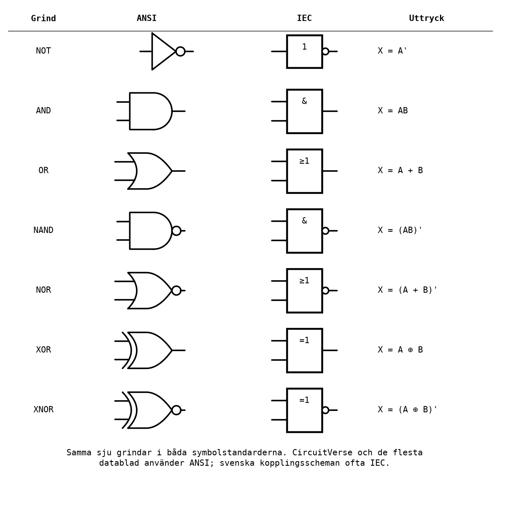
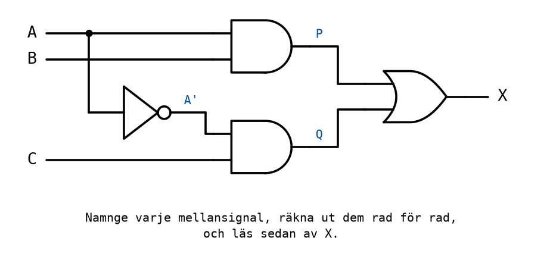
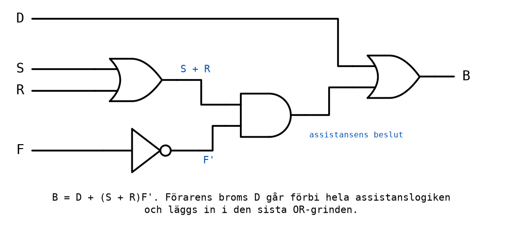

# Appendix A - Logiska grindar och boolesk algebra

## A.1 Digitala signaler och logiska nivåer
[L01](../../L01/appendix/a_number_systems.md#a1-digitalt-och-analogt) konstaterade att en digital
signal bara har två värden, `0` och `1`. I en verklig krets är de två värdena två
spänningsintervall:
* I en krets som matas med 5 V, som IC-kretsarna i [Labb 2](../../../labs/lab2/README.md) och
  mikrodatorn i Labb 3, läses en spänning nära 0 V som `0` och en spänning nära 5 V som `1`.
  Exakt var gränserna går står i kretsens datablad ([L04](../../L04/README.md)).
* I ett kontaktnät på 24 V, som i [Labb 1](../../../labs/lab1/README.md), är en tryckknapp `1` när
  den är nedtryckt och `0` när den är släppt, och lampan är `1` när den lyser.

Det är en överenskommelse att hög spänning betyder `1`. Den kallas **positiv logik** och är den
som används i hela kursen.

En **logisk grind** är en krets med en eller flera ingångar och en utgång, där utgången är en fast
funktion av ingångarna. Ett nät av grindar, där utgångarna bara beror på vad ingångarna är just
nu, kallas ett **kombinatoriskt nät**. Det är ämnet för den här föreläsningen och de tre
följande. En krets som också minns vad som har hänt tidigare kallas ett **sekvensnät**; den typen
får du en glimt av i [B.7](./b_contact_networks.md#b7-reläet), och den är ämnet för
[L06](../../L06/README.md).

---

## A.2 Grindarna
Det finns sju grundgrindar. NOT har en ingång; de andra har två eller fler.

| Grind | Utgången är `1` när ... | Uttryck |
|-------|--------------------------|---------|
| NOT (inverterare) | ingången är `0` | `X = A'` |
| AND | **alla** ingångar är `1` | `X = AB` |
| OR | **minst en** ingång är `1` | `X = A + B` |
| NAND | inte alla ingångar är `1` (inverterad AND) | `X = (AB)'` |
| NOR | ingen ingång är `1` (inverterad OR) | `X = (A + B)'` |
| XOR | ingångarna är **olika** | `X = A ⊕ B` |
| XNOR | ingångarna är **lika** | `X = (A ⊕ B)'` |

Sanningstabellerna för alla grindar med två ingångar, sida vid sida:

| A | B | AND | OR | NAND | NOR | XOR | XNOR |
|---|---|:---:|:--:|:----:|:---:|:---:|:----:|
| 0 | 0 | 0 | 0 | 1 | 1 | 0 | 1 |
| 0 | 1 | 0 | 1 | 1 | 0 | 1 | 0 |
| 1 | 0 | 0 | 1 | 1 | 0 | 1 | 0 |
| 1 | 1 | 1 | 1 | 0 | 0 | 0 | 1 |

| A | NOT A |
|---|:-----:|
| 0 | 1 |
| 1 | 0 |

Värt att lägga på minnet direkt ur tabellerna:
* NAND, NOR och XNOR är inverserna av AND, OR och XOR: varje kolumn är den andras med ettor och
  nollor bytta.
* AND och OR går att utvidga till fler ingångar. En AND med tre ingångar är `1` bara om alla tre är
  `1`; en OR med tre ingångar är `1` om minst en är `1`.
* XOR med fler än två ingångar är `1` när ett **udda** antal ingångar är `1`. Det är samma sak som
  paritetsbiten i [L01 B.6](../../L01/appendix/b_binary_codes.md#b6-paritetsbit).

### Två sätt att rita samma grind
Grindarna ritas med två olika symbolstandarder, och du kommer att möta båda:
* **ANSI** (amerikansk standard) har en egen form för varje grind: AND är D-formad, OR har en
  böjd ingångssida. Den används i CircuitVerse och i de flesta datablad.
* **IEC** (internationell standard) ritar varje grind som en rektangel med en symbol i: `&` för
  AND, `≥1` för OR (minst en ingång ska vara 1), `=1` för XOR (exakt en ingång ska vara 1) och
  `1` för NOT. Den förekommer ofta i svenska läroböcker och kopplingsscheman.

I båda standarderna betyder en liten ring på utgången att utsignalen är inverterad.



---

## A.3 Boolesk algebra som notation
Att skriva "A AND (NOT B) OR C" blir snabbt otympligt. **Boolesk algebra**, efter matematikern
George Boole, ger en kort notation som ser ut som vanlig algebra:

| Operation | Skrivs | Utläses |
|-----------|--------|---------|
| NOT | `A'` | "A inverterad", "icke A" |
| AND | `AB` eller `A·B` | "A och B" |
| OR | `A + B` | "A eller B" |
| XOR | `A ⊕ B` | "A exklusivt eller B" |

Du kommer att se NOT skrivet på andra sätt också, framför allt som ett streck över bokstaven, Ā.
Kursen använder primtecknet, `A'`, eftersom det går att skriva på ett tangentbord.

**Prioritetsordningen** är NOT först, sedan AND, sist OR, precis som potenser, multiplikation och
addition i vanlig algebra:
* `AB + C` betyder `(AB) + C`.
* `A + BC` betyder `A + (BC)`, och det är **inte** samma sak som `(A + B)C`.
* `AB'` betyder `A(B')`: bara B är inverterad. `(AB)'` inverterar hela produkten.

Sätt ut parenteser när du är osäker. De kostar ingenting.

Ett uttryck som är en OR av AND-termer, till exempel `X = AB' + CD`, sägs stå på **SP-form**, summa
av produkter. Det är den form nästan alla uttryck i kursen skrivs på, eftersom den läses av direkt
ur en sanningstabell (A.6) och översätts direkt till ett grindnät: en AND-grind per term, och en
OR-grind som samlar dem.

---

## A.4 Räknelagarna
Lagarna nedan gäller för alla värden på A, B och C, och varje lag går att kontrollera genom att
skriva ut sanningstabellen för båda sidorna. Många av dem ser ut som vanlig algebra; några gör det
inte, och de är markerade.

| Lag | Med OR | Med AND |
|-----|--------|---------|
| Identitet | `A + 0 = A` | `A · 1 = A` |
| Dominans | `A + 1 = 1` *(inte som vanlig algebra)* | `A · 0 = 0` |
| Idempotens *(inte som vanlig algebra)* | `A + A = A` | `A · A = A` |
| Komplement | `A + A' = 1` | `A · A' = 0` |
| Dubbel invertering | `(A')' = A` | |
| Kommutativ | `A + B = B + A` | `AB = BA` |
| Associativ | `A + (B + C) = (A + B) + C` | `A(BC) = (AB)C` |
| Distributiv | `A(B + C) = AB + AC` | `A + BC = (A + B)(A + C)` *(inte som vanlig algebra)* |
| Absorption *(inte som vanlig algebra)* | `A + AB = A` | `A(A + B) = A` |
| Förenkling | `A + A'B = A + B` | `A(A' + B) = AB` |

Några av lagarna blir självklara när man tänker på vad de betyder:
* `A + 1 = 1`: "A eller sant" är alltid sant.
* `A + A' = 1`: en signal är alltid antingen `1` eller `0`, så "A eller icke A" är alltid sant.
* `A + AB = A`: om A är `1` är uttrycket `1` oavsett B, och om A är `0` är båda termerna `0`.
  Termen `AB` tillför alltså ingenting.

Den sista raden, **förenklingslagen** `A + A'B = A + B`, är den som oftast behövs och oftast
missas. Den går att härleda ur den andra distributiva lagen:

```text
A + A'B = (A + A')(A + B) = 1 · (A + B) = A + B
```

Med ord: i termen `A'B` behövs inte villkoret `A'`, för när A är `1` är uttrycket redan `1`.

### Att bevisa en lag med en sanningstabell
Varje lag kan kontrolleras genom att räkna ut båda sidorna för alla kombinationer. Förenklingslagen:

| A | B | A' | A'B | A + A'B | A + B |
|---|---|----|-----|---------|-------|
| 0 | 0 | 1 | 0 | 0 | 0 |
| 0 | 1 | 1 | 1 | 1 | 1 |
| 1 | 0 | 0 | 0 | 1 | 1 |
| 1 | 1 | 0 | 0 | 1 | 1 |

De två sista kolumnerna är lika på varje rad, så lagen gäller. Med två variabler är det fyra rader
och med tre är det åtta, så det finns ingen ursäkt för att inte kontrollera en förenkling man är
osäker på.

---

## A.5 De Morgans lagar
Två lagar är så viktiga att de har ett eget namn, efter matematikern Augustus De Morgan:

```text
(A + B)' = A'B'
(AB)'    = A' + B'
```

Med ord: **invertera hela uttrycket genom att invertera varje variabel och byta AND mot OR** (och
tvärtom). En minnesregel är "bryt strecket, byt tecknet".

Kontrollera den första med en tabell:

| A | B | A + B | (A + B)' | A' | B' | A'B' |
|---|---|-------|----------|----|----|------|
| 0 | 0 | 0 | 1 | 1 | 1 | 1 |
| 0 | 1 | 1 | 0 | 1 | 0 | 0 |
| 1 | 0 | 1 | 0 | 0 | 1 | 0 |
| 1 | 1 | 1 | 0 | 0 | 0 | 0 |

Kolumnerna `(A + B)'` och `A'B'` är lika. Med ord: "inte (A eller B)" är samma sak som "varken A
eller B", alltså "inte A och inte B".

Lagarna gäller för fler variabler också: `(A + B + C)' = A'B'C'` och `(ABC)' = A' + B' + C'`.

### Vad De Morgan betyder för grindarna
De Morgan är mer än en räkneregel. Den säger att en grind kan bytas mot en annan grind med
inverterade in- och utgångar:
* En **NAND**, `(AB)'`, är samma sak som en **OR med båda ingångarna inverterade**, `A' + B'`.
* En **NOR**, `(A + B)'`, är samma sak som en **AND med båda ingångarna inverterade**, `A'B'`.

Det har två viktiga följder. Den första är att **varje funktion går att bygga med enbart
NAND-grindar**, eller med enbart NOR-grindar. En NAND med båda ingångarna ihopkopplade är en NOT,
eftersom `(AA)' = A'`; en NAND följd av en NOT är en AND; och en OR är en NAND med inverterade
ingångar. Det är därför NAND-kretsen är den vanligaste IC-kretsen av alla, och det är vad
[Labb 2-2](../../../labs/lab2/README.md#labb-2-2) går ut på.

Den andra följden syns i kontaktnät: en NAND är två brytande kontakter parallellt, och en NOR två
brytande kontakter i serie ([B.5](./b_contact_networks.md#b5-sammansatta-kontaktnät)).

---

## A.6 Från sanningstabell till uttryck
Ofta börjar ett konstruktionsarbete med en beskrivning av vad kretsen ska göra, och den
beskrivningen blir en sanningstabell. Varje sanningstabell kan läsas av direkt som ett uttryck på
SP-form:
1. Leta upp varje rad där utgången är `1`.
2. Skriv för varje sådan rad en AND-term med **alla** ingångar: ingången som den är om den är `1`
   på raden, inverterad om den är `0`.
3. Sätt ihop termerna med OR.

En sådan AND-term, med alla ingångar och som är `1` på exakt en rad, kallas en **minterm**.

**Exempel:**

| A | B | X |
|---|---|---|
| 0 | 0 | 0 |
| 0 | 1 | 1 |
| 1 | 0 | 1 |
| 1 | 1 | 0 |

Raden `AB = 01` ger mintermen `A'B`, och raden `AB = 10` ger `AB'`. Alltså:

```text
X = A'B + AB'
```

Det är XOR-funktionen. Samma nät går alltså att bygga av en enda XOR-grind, i stället för två AND,
två NOT och en OR.

**Exempel med tre ingångar**, en **majoritetsgrind**: utgången är `1` när minst två av de tre
ingångarna är `1`. Den används där tre givare mäter samma sak och systemet ska lita på det två av
dem är överens om, så att en enstaka trasig givare inte kan bestämma något på egen hand.

| A | B | C | X | Minterm |
|---|---|---|---|---------|
| 0 | 0 | 0 | 0 | |
| 0 | 0 | 1 | 0 | |
| 0 | 1 | 0 | 0 | |
| 0 | 1 | 1 | 1 | `A'BC` |
| 1 | 0 | 0 | 0 | |
| 1 | 0 | 1 | 1 | `AB'C` |
| 1 | 1 | 0 | 1 | `ABC'` |
| 1 | 1 | 1 | 1 | `ABC` |

```text
X = A'BC + AB'C + ABC' + ABC
```

Uttrycket är **korrekt**, men det är inte det **minsta**: fyra AND-grindar med tre ingångar och en
OR-grind med fyra. Att förenkla det är nästa avsnitts ämne.

---

## A.7 Algebraisk förenkling
Ett uttryck som läses av rakt ur en sanningstabell har en term per etta. Ofta delar flera termer
det mesta av sina variabler, och då går de att slå ihop. Verktyget är nästan alltid samma: **bryt
ut det gemensamma, och använd `A + A' = 1`**.

**Exempel 1:**

```text
X = AB + AB' = A(B + B') = A · 1 = A
```

Värdet på B spelar ingen roll, så B försvinner.

**Exempel 2:** en sanningstabell där X är `1` på raderna 001, 011, 101 och 111.

```text
X = A'B'C + A'BC + AB'C + ABC
  = A'C(B' + B) + AC(B' + B)
  = A'C + AC
  = C(A' + A)
  = C
```

Fyra termer blev en enda variabel. Titta på tabellen igen: X är `1` precis när C är `1`. Det hade
gått att se direkt, men uträkningen visar varför.

**Exempel 3:** majoritetsgrinden från A.6. Här behövs ett knep: termen `ABC` kan användas flera
gånger, eftersom `ABC + ABC = ABC` (idempotens). Skriv den tre gånger, och para ihop den med var
och en av de andra termerna:

```text
X = A'BC + AB'C + ABC' + ABC
  = (A'BC + ABC) + (AB'C + ABC) + (ABC' + ABC)
  = BC(A' + A)  + AC(B' + B)  + AB(C' + C)
  = BC + AC + AB
```

Tre AND-grindar med två ingångar och en OR-grind med tre, i stället för fyra AND-grindar med tre
ingångar.

**Exempel 4:** inte allt går att förenkla. `X = A'B + AB'` har inga gemensamma variabler att bryta
ut. Uttrycket är redan minimalt på SP-form, och det bästa man kan göra är att känna igen det som en
XOR.

Algebraisk förenkling kräver att man ser vilka termer som går att para ihop, och det är lätt att
missa ett par, eller att inte veta när man är klar. [L04](../../L04/README.md) introducerar
**Karnaughdiagram**, som gör samma sak med en ritning, systematiskt, och med ett tydligt svar på
när man är klar.

---

## A.8 Analys: från grindnät till sanningstabell
Åt andra hållet: du har ett färdigt grindnät och ska ta reda på vad det gör. Metoden är att ge
varje grinds utgång ett namn, en **mellansignal**, och räkna fram dem en i taget, rad för rad.



Mellansignalerna är `A'`, `P = AB` och `Q = A'C`, och utgången är `X = P + Q`. Uttrycket för hela
nätet blir alltså

```text
X = AB + A'C
```

och sanningstabellen räknas fram kolumn för kolumn:

| A | B | C | A' | P = AB | Q = A'C | X = P + Q |
|---|---|---|----|--------|---------|-----------|
| 0 | 0 | 0 | 1 | 0 | 0 | 0 |
| 0 | 0 | 1 | 1 | 0 | 1 | 1 |
| 0 | 1 | 0 | 1 | 0 | 0 | 0 |
| 0 | 1 | 1 | 1 | 0 | 1 | 1 |
| 1 | 0 | 0 | 0 | 0 | 0 | 0 |
| 1 | 0 | 1 | 0 | 0 | 0 | 0 |
| 1 | 1 | 0 | 0 | 1 | 0 | 1 |
| 1 | 1 | 1 | 0 | 1 | 0 | 1 |

Läs tabellen i två halvor. När A är `0` är X samma som C; när A är `1` är X samma som B. Nätet är
alltså en **väljare**: A väljer vilken av B och C som ska släppas fram till utgången. En sådan
krets kallas en **multiplexer**, och den är ett av de viktigaste byggblocken i en dator. Den
återkommer i övning 13 i [L04](../../L04/appendix/c_exercises.md).

Två råd som gäller för all analys:
* **Skriv ut mellansignalerna som egna kolumner.** Att räkna fram X direkt ur A, B och C i
  huvudet fungerar för små nät och ger fel i större.
* **Sammanfatta sedan tabellen med ord.** En tabell säger vad kretsen gör rad för rad; en mening
  som "A väljer mellan B och C" säger vad den är till för.

---

## A.9 CircuitVerse
[CircuitVerse](https://circuitverse.org/simulator) är en gratis logiksimulator som körs i
webbläsaren. Varje grindnät i kursen byggs och testas där innan det byggs med riktiga kretsar:
1. Öppna simulatorn och starta ett nytt projekt.
2. Placera ett **Input**-element per insignal och ett **Output**-element per utsignal, och döp om
   dem så att de heter som dina variabler.
3. Placera de grindar ditt uttryck kräver, från panelen **Gates**.
4. Koppla ihop nätet en grind i taget, enligt uttrycket. Du ska redan veta exakt vilka grindar du
   behöver innan du öppnar simulatorn, och det är därför A.6 och A.7 kommer först.
5. Klicka på varje ingång för att växla den mellan `0` och `1`, och kontrollera att utgången
   stämmer med din sanningstabell på **varje** rad.
6. Spara under menyn **Project**, antingen online med ett konto eller som en fil på datorn.

**Steg 5 är inte valfritt, och ingenting annat gör det åt dig.** Tre regler gör det till en
kontroll snarare än en formalitet:
* **Alla rader, inte ett urval.** Två ingångar är fyra rader och tre är åtta. Vid de storlekarna
  finns ingen ursäkt för att bara prova några.
* **Förutsäg först, simulera sedan.** Skriv sanningstabellen innan du bygger. Annars läser du av
  simuleringen och tror att du har kontrollerat den, när du bara har skrivit av den.
* **En avvikelse är information.** Den säger att ritningen och uttrycket är oense, och att en av
  dem har ett fel.

Den vanan, att förutsäga ett beteende och sedan kontrollera det, är den du kommer att använda vid
varje laboration i kursen, med kontakter, med IC-kretsar och med mikrodatorn.

---

## A.10 Föreläsningens krets: bromsassistenten
Föreläsningen bygger en krets från ett krav till ett simulerat grindnät, och i
[B.6](./b_contact_networks.md#b6-från-uttryck-till-kontaktnät-och-tillbaka) samma krets som
kontaktnät.

Kravet: **bilen bromsar om föraren bromsar, eller om assistanssystemet bestämmer sig för det.**
Assistanssystemet bestämmer sig för det när endera av två detektorer ser ett hinder, om det inte
samtidigt rapporterar ett fel, i vilket fall det inte anförtros att bromsa alls.

| Signal | Betydelse |
|--------|-----------|
| `D` | Föraren står på bromspedalen. |
| `S` | Avståndssensorn ser ett hinder. |
| `R` | Radarn ser ett hinder. |
| `F` | Assistanssystemet rapporterar ett fel. |
| `B` | Utgång: lägg an bromsarna. |

Tre meningar i kravet bestämmer tillsammans hela strukturen:
* Endera detektorn räcker på egen hand, och ingen av dem väger tyngre än den andra.
* Ett fel utlöser inget larm; det *hindrar* assistanssystemet från att bromsa.
* Föraren kan alltid bromsa, även när assistanssystemet är trasigt.

Den sista är ett säkerhetskrav, och det är den att hålla fast vid: pedalen är inte en ingång till
assistanslogiken, den går förbi den.

### Sanningstabellen
Sexton rader, i den ordning en fyrabitars räknare skulle producera dem. Kolumnen `P` är ingen
utgång; den är assistanssystemets eget beslut, visad för att det ska synas var strukturen kommer
ifrån.

| D | S | R | F | P | B |
|---|---|---|---|---|---|
| 0 | 0 | 0 | 0 | 0 | 0 |
| 0 | 0 | 0 | 1 | 0 | 0 |
| 0 | 0 | 1 | 0 | 1 | 1 |
| 0 | 0 | 1 | 1 | 0 | 0 |
| 0 | 1 | 0 | 0 | 1 | 1 |
| 0 | 1 | 0 | 1 | 0 | 0 |
| 0 | 1 | 1 | 0 | 1 | 1 |
| 0 | 1 | 1 | 1 | 0 | 0 |
| 1 | 0 | 0 | 0 | 0 | 1 |
| 1 | 0 | 0 | 1 | 0 | 1 |
| 1 | 0 | 1 | 0 | 1 | 1 |
| 1 | 0 | 1 | 1 | 0 | 1 |
| 1 | 1 | 0 | 0 | 1 | 1 |
| 1 | 1 | 0 | 1 | 0 | 1 |
| 1 | 1 | 1 | 0 | 1 | 1 |
| 1 | 1 | 1 | 1 | 0 | 1 |

Den nedre halvan är genomgående `1`: så snart D är `1` ändrar ingenting annat svaret. Det är hur
"åsidosätter allt" ser ut i en tabell.

> **Försök själv först.** Innan du läser vidare: läs av uttrycket på SP-form, förenkla det, och
> räkna grindarna. Det raka uttrycket har elva termer; det förenklade får plats på en rad.

### Härledningen
Att läsa av tabellen rakt av ger elva mintermer, en per etta, var och en med fyra variabler.
Korrekt, men ohanterligt. Dela i stället upp tabellen efter D.

**Den nedre halvan (D = 1)** är `1` på alla åtta raderna. De åtta mintermerna tillsammans täcker
alla kombinationer av S, R och F, så de förenklas till bara `D`, precis som i exempel 2 i A.7.

**Den övre halvan (D = 0)** är `1` på tre rader: SRF = 010, 100 och 110, alltså när F är `0` och
minst en av S och R är `1`:

```text
D'S'RF' + D'SR'F' + D'SRF' = D'F'(S'R + SR' + SR) = D'F'(S + R)
```

(`S'R + SR' + SR` är `1` när minst en av S och R är `1`, alltså `S + R`; övning 6 i
[Appendix C](./c_exercises.md) låter dig visa det algebraiskt.)

Tillsammans:

```text
B = D + D'(S + R)F'
```

och förenklingslagen `A + A'X = A + X` från A.4 tar bort `D'`:

```text
B = D + (S + R)F'
```

Uttrycket läses som kravet: bromsa om föraren bromsar, eller om (sensorn eller radarn) ser något
och det inte finns något fel.

### Grindnätet
Fyra grindar: en OR för `S + R`, en NOT för `F'`, en AND för assistanssystemets beslut, och en OR
som lägger till förarens pedal.



**Säkerhetsargumentet vilar på den sista OR-grinden.** Förarens pedal går direkt in där, förbi
allt som har med felet att göra. Ett nät som i stället matar in pedalen före fellogiken,
`B = (D + S + R)F'`, är en grind enklare och ser rimligt ut, men det bromsar inte när föraren
trampar på pedalen samtidigt som assistanssystemet rapporterar fel. Övning 13 i
[Appendix C](./c_exercises.md) låter dig hitta exakt vilka rader som går fel.

Bygg nätet i CircuitVerse och kontrollera det mot alla sexton raderna i tabellen.

---
