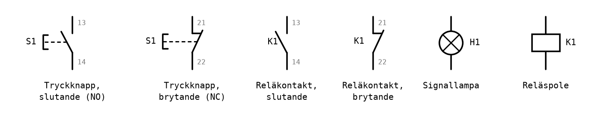
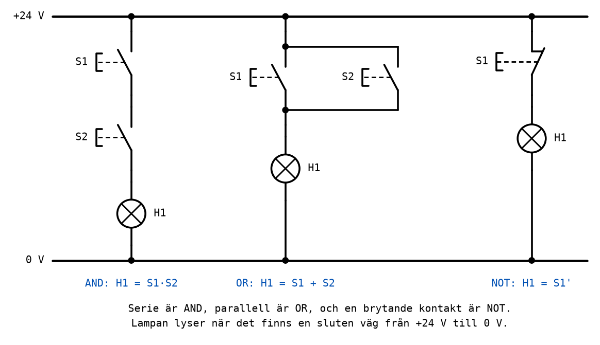
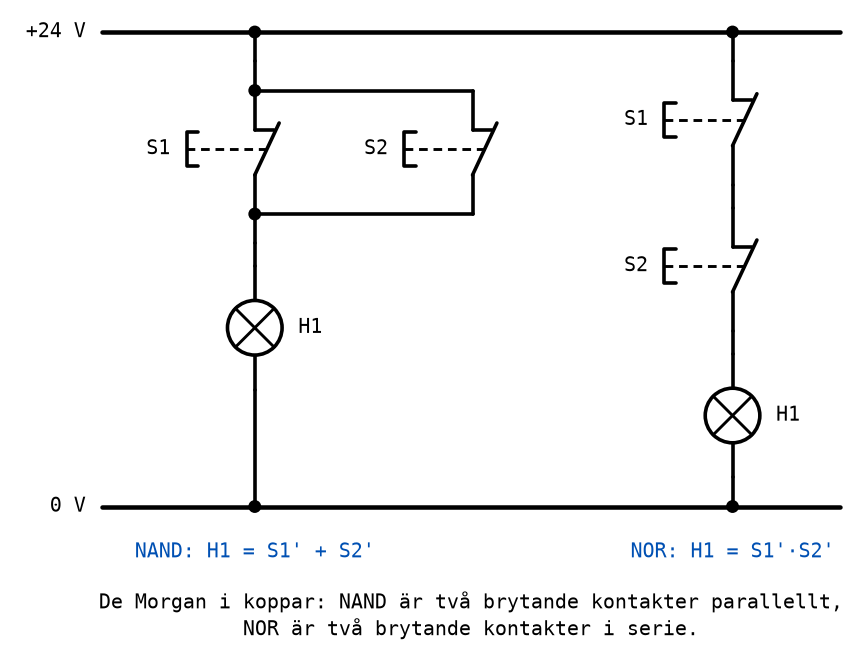
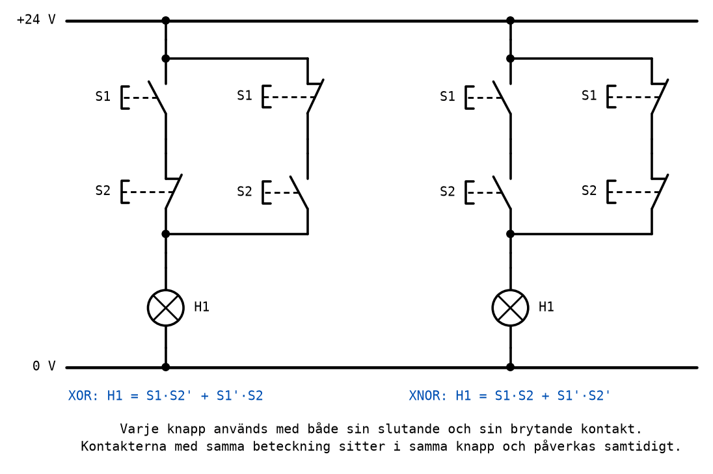
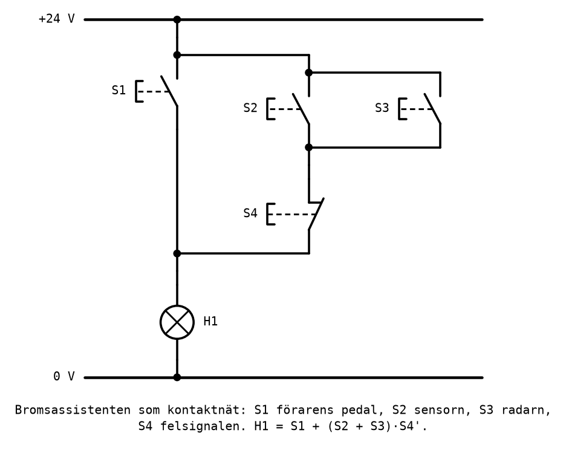
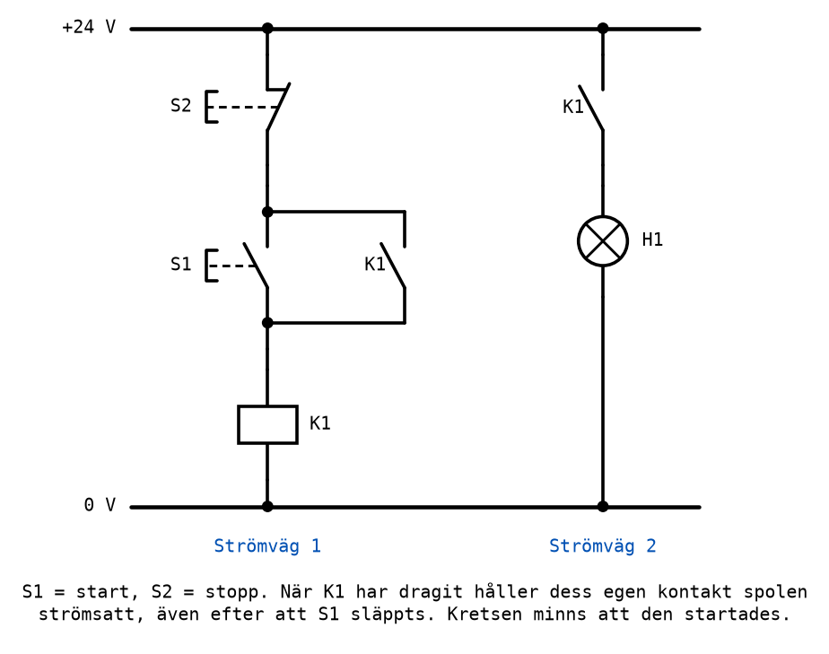
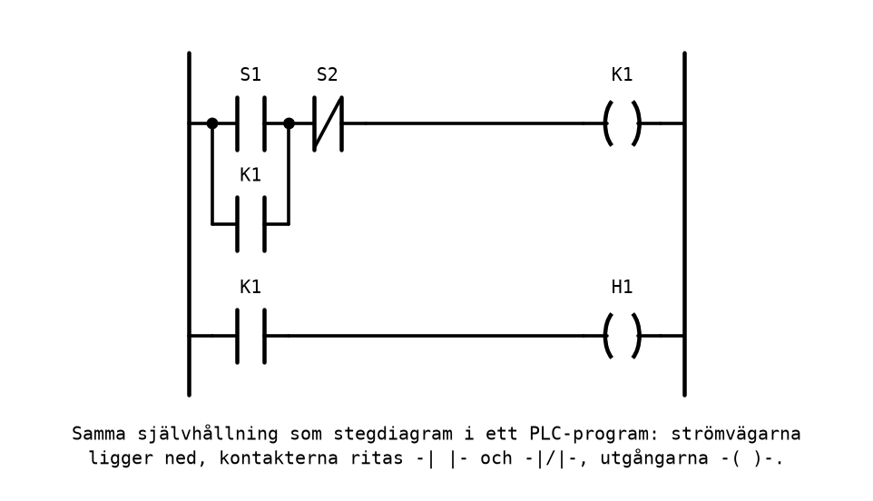

# Appendix B - Kontaktnät

## B.1 Kontakter och symboler
Långt innan det fanns IC-kretsar byggdes styrlogik av kontakter: tryckknappar, gränslägesbrytare
och reläer, kopplade så att en lampa, en motor eller en ventil fick ström precis när den skulle.
Så fungerar fortfarande en stor del av säkerhetskretsarna i industrin, och det är samma logik som
en PLC programmeras med i dag ([B.8](#b8-kontaktnät-och-plcns-stegdiagram)).

En **kontakt** har två lägen, sluten eller öppen, och är därför en logisk variabel. Det finns två
sorter:
* En **slutande kontakt** (NO, *normally open*) är öppen i vila och sluts när den påverkas. Tryck
  på knappen, så leder den.
* En **brytande kontakt** (NC, *normally closed*) är sluten i vila och bryts när den påverkas.
  Tryck på knappen, så slutar den leda.

En tryckknapp innehåller ofta flera **kontaktelement** som påverkas samtidigt, till exempel ett
slutande och ett brytande. Kontaktelementens anslutningar har nummer enligt en standard: den sista
siffran är **3-4 för ett slutande** element och **1-2 för ett brytande**, och den första siffran
är elementets platsnummer. Ett slutande element kan alltså heta 13-14 och ett brytande 21-22.

Kontakterna ritas i ett **strömvägsschema**: vertikala strömvägar mellan en matningsskena upptill
(+24 V) och en återledare nedtill (0 V), med kontakterna ritade vertikalt i vägen och det som ska
styras, en lampa eller en reläspole, längst ned.



Symbolerna ritas alltid i **viloläge**: den slutande kontakten öppen, den brytande sluten, som när
ingen rör något. Den streckade linjen till vänster är tryckknappens påverkansdon; en reläkontakt
har ingen sådan, eftersom den påverkas av sin spole. Varje komponent har en beteckning: S för
tryckknappar och andra manöverdon, H för lampor och K för reläer.

### Kontakten som logisk variabel
Översättningen till logik är:
* en **nedtryckt knapp** är `1`, en släppt knapp `0`;
* en **tänd lampa** är `1`, en släckt lampa `0`;
* **lampan lyser när det finns en sluten väg från +24 V till 0 V.**

Den sista punkten är hela bron mellan kontakter och logik. Allt i resten av det här appendixet
följer av den.

---

## B.2 Seriekoppling = AND
Två slutande kontakter efter varandra i samma strömväg. Strömmen måste passera **båda**, så lampan
lyser bara om S1 **och** S2 är nedtryckta:

```text
H1 = S1 · S2
```

| S1 | S2 | H1 |
|----|----|----|
| 0 | 0 | 0 |
| 0 | 1 | 0 |
| 1 | 0 | 0 |
| 1 | 1 | 1 |

Det är AND-grindens sanningstabell. Ett vardagsexempel är **tvåhandsmanövern** på en press: den går
bara om båda knapparna trycks samtidigt, så att båda händerna garanterat är utanför.

---

## B.3 Parallellkoppling = OR
Två slutande kontakter bredvid varandra, var och en en egen väg mellan samma två punkter. Det räcker
att **en** av vägarna är sluten, så lampan lyser om S1 **eller** S2 är nedtryckt, eller båda:

```text
H1 = S1 + S2
```

| S1 | S2 | H1 |
|----|----|----|
| 0 | 0 | 0 |
| 0 | 1 | 1 |
| 1 | 0 | 1 |
| 1 | 1 | 1 |

Det är OR-grindens sanningstabell. Ett vardagsexempel är en ringklocka med en knapp vid framdörren
och en vid bakdörren: vilken som helst av dem får den att ringa.

---

## B.4 Brytande kontakt = NOT
En brytande kontakt ensam i strömvägen. Lampan lyser **när knappen inte är nedtryckt**, och slocknar
när den trycks:

```text
H1 = S1'
```

Det är NOT. Ett vardagsexempel är en stoppknapp: den ska bryta, inte sluta, en krets, och varför
den ska vara brytande just av säkerhetsskäl återkommer i [B.7](#b7-reläet).

Här är de tre grundkopplingarna i samma figur:



---

## B.5 Sammansatta kontaktnät
Med serie, parallell och brytande kontakter går det att bygga varje logisk funktion.

### NAND och NOR
De Morgans lagar från [A.5](./a_logic_gates.md#a5-de-morgans-lagar) visar hur:
* NAND: `(S1 · S2)' = S1' + S2'`. Två **brytande** kontakter **parallellt**: lampan slocknar bara
  om båda vägarna bryts, alltså om båda knapparna trycks.
* NOR: `(S1 + S2)' = S1' · S2'`. Två **brytande** kontakter **i serie**: lampan slocknar så snart
  någon av knapparna trycks.



Det är De Morgan uttryckt i koppar: inverterade ingångar (brytande kontakter) och bytt operation
(parallell i stället för serie).

### XOR och XNOR: trappkopplingen
En lampa i en trappa ska kunna tändas och släckas från både övervåningen och nedervåningen. Varje
tryck på vilken knapp som helst ska ändra lampans läge. Med två knappar är det XOR:

```text
H1 = S1 · S2' + S1' · S2
```

Varje term är en strömväg med två kontakter i serie, och de två vägarna ligger parallellt. Termen
`S1 · S2'` behöver S1:s **slutande** kontakt och S2:s **brytande**; termen `S1' · S2` tvärtom.
**Varje knapp används alltså med båda sina kontaktelement**, och det är skälet till att
labbstationens knappar har både slutande och brytande kontakter.



Kontakterna med samma beteckning, till exempel de två som heter S1, sitter i samma knapp och
påverkas samtidigt. I schemat ritas de där de gör nytta i strömvägen, inte bredvid varandra.

(En riktig trappbelysning använder vippströmbrytare, som stannar i det läge man lämnar dem, i
stället för tryckknappar. Logiken är densamma.)

---

## B.6 Från uttryck till kontaktnät och tillbaka
Översättningen går åt båda hållen med fyra regler:

| Uttryck | Kontaktnät |
|---------|------------|
| en variabel `S1` | en slutande kontakt S1 |
| en inverterad variabel `S1'` | en brytande kontakt S1 |
| en produkt, `AB` | kontakterna i **serie** |
| en summa, `A + B` | kontakterna **parallellt** |

Parenteser blir grupper: `(S2 + S3) · S4'` är en parallellkoppling av S2 och S3, i serie med en
brytande kontakt S4.

**Från uttryck till nät:** börja med den yttersta operationen och arbeta dig inåt. Är uttrycket en
summa av termer, rita en parallell gren per term; är det en produkt, rita faktorerna i serie.

**Från nät till uttryck:** börja med de innersta grupperna, de minsta serie- och
parallellkopplingarna, och arbeta dig utåt. [L03](../../L03/README.md) går igenom det i detalj.

### Bromsassistenten som kontaktnät
Uttrycket från [A.10](./a_logic_gates.md#a10-föreläsningens-krets-bromsassistenten),
`B = D + (S + R)F'`, blir med tryckknappar i stället för signaler (S1 för D, S2 för S, S3 för R och
S4 för F) och en lampa H1 som bromsljus:

```text
H1 = S1 + (S2 + S3) · S4'
```

Den yttersta operationen är en summa: två parallella grenar. Den vänstra är S1 ensam. Den högra är
en produkt: parallellkopplingen av S2 och S3, i serie med S4:s brytande kontakt.



Säkerhetsargumentet syns direkt i ritningen: förarens knapp S1 har en egen väg till lampan, och
felsignalen S4 kan bara bryta assistanssystemets gren. Ingen kombination av de andra knapparna kan
hindra S1 från att tända H1.

---

## B.7 Reläet
Ett **relä** är en elektriskt styrd strömbrytare: en **spole** som, när den får ström, drar till sig
ett ankare som påverkar reläets **kontakter**. En reläkontakt kan vara slutande eller brytande,
precis som en tryckknapps. Spolen och kontakterna har samma beteckning, till exempel K1, men ritas
där de hör hemma i schemat: spolen längst ned i en strömväg, kontakterna i andra strömvägar.

Två egenskaper gör reläet användbart:
* **En liten ström styr en stor.** Spolen kan drivas av en svag signal, till exempel från en
  mikrodator, medan kontakterna kan koppla en motor eller en lampa på 24 V eller 230 V. Det
  återkommer i [L11](../../L11/README.md), när mikrodatorn ska styra något i verkligheten.
* **En signal kan användas många gånger.** Ett relä kan ha flera kontakter, så en logisk variabel,
  "K1 har dragit", kan användas i så många strömvägar som behövs, slutande i några och brytande i
  andra.

### Självhållning: en krets som minns
Den viktigaste reläkopplingen av alla är **självhållningen**, som finns i nästan varje maskin med
en start- och en stoppknapp:



Följ vad som händer:
1. I vila är S1 och reläkontakten K1 öppna. Spolen får ingen ström, och lampan är släckt.
2. **Tryck på start, S1.** Strömväg 1 sluts genom S2 (brytande, alltså sluten) och S1. Spolen K1
   får ström och drar. Då sluts båda K1-kontakterna: lampan tänds, och K1-kontakten parallellt med
   S1 sluts.
3. **Släpp S1.** Strömmen går nu genom K1:s egen kontakt i stället, så spolen håller sig själv
   strömsatt. Lampan fortsätter lysa.
4. **Tryck på stopp, S2.** Den brytande kontakten bryter strömväg 1, spolen släpper, och båda
   K1-kontakterna öppnar. När S2 släpps är S1 och K1 öppna igen, och kretsen är tillbaka i vila.

Lägg märke till vad som hände i steg 3: **ingångarna är desamma som i steg 1**, båda knapparna
släppta, men lampan lyser. Utgången beror inte bara på ingångarna nu, utan också på vad som har
hänt tidigare. Kretsen **minns** att den startades.

Det är inte ett kombinatoriskt nät längre. Ett nät där en utgång återkopplas till sin egen ingång,
och som därför har minne, kallas ett **sekvensnät**, och det är grunden för allt minne i en dator,
från ett enda register till hela arbetsminnet. [L06](../../L06/README.md) bygger samma sak med
grindar i stället för reläer.

Stoppknappen är brytande av ett säkerhetsskäl: går en ledning till den av, bryts kretsen och
maskinen stannar. Med en slutande stoppknapp skulle en avbruten ledning i stället göra det
omöjligt att stoppa maskinen.

---

## B.8 Kontaktnät och PLC:ns stegdiagram
I dag byggs styrlogik sällan av reläer, utan programmeras i en **PLC**, en industridator gjord för
att styra maskiner. Det vanligaste språket för att programmera en PLC, **stegdiagram** (LD, *ladder
diagram*), är ritat för att se ut som ett kontaktnät vänt på sidan:
* strömvägarna ligger ned, som stegpinnar mellan två lodräta skenor;
* en slutande kontakt ritas `-| |-` och en brytande `-|/|-`;
* utgången, en spole eller en lampa, ritas `-( )-` längst till höger.



Allt i det här appendixet gäller oförändrat: serie är AND, parallell är OR, en brytande kontakt är
NOT, och självhållningen fungerar på samma sätt. Den som kan läsa ett kontaktnät kan läsa ett
stegdiagram.

---

## B.9 Förbered Labb 1
I [Labb 1](../../../labs/lab1/README.md) bygger du kontaktnät med två tryckknappar, en lampa och ett
aggregat på 24 V. Innan passet ska du ha gjort
[förberedelseuppgifterna](../../../labs/lab1/README.md#förberedelser). De går ut på det som det här
appendixet har visat:
* skriva sanningstabeller för AND, OR, NOT, NAND, NOR, XOR och XNOR med två knappar;
* rita strömvägsscheman för dem, med rätt kontaktsort för varje variabel;
* ta fram ett uttryck ur en sanningstabell, och förenkla det;
* analysera ett färdigt kontaktnät, som i [B.6](#b6-från-uttryck-till-kontaktnät-och-tillbaka).

**Rita alltid schemat innan du kopplar.** Ett schema på papper går att kontrollera mot
sanningstabellen på en minut. En felkopplad sladd på stationen tar mycket längre tid att hitta.

---
