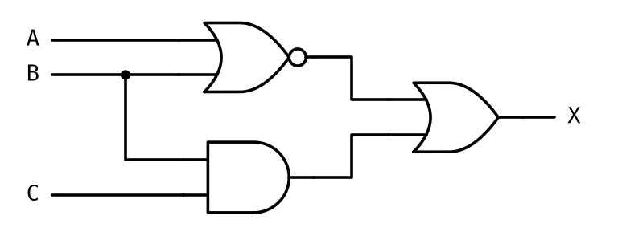
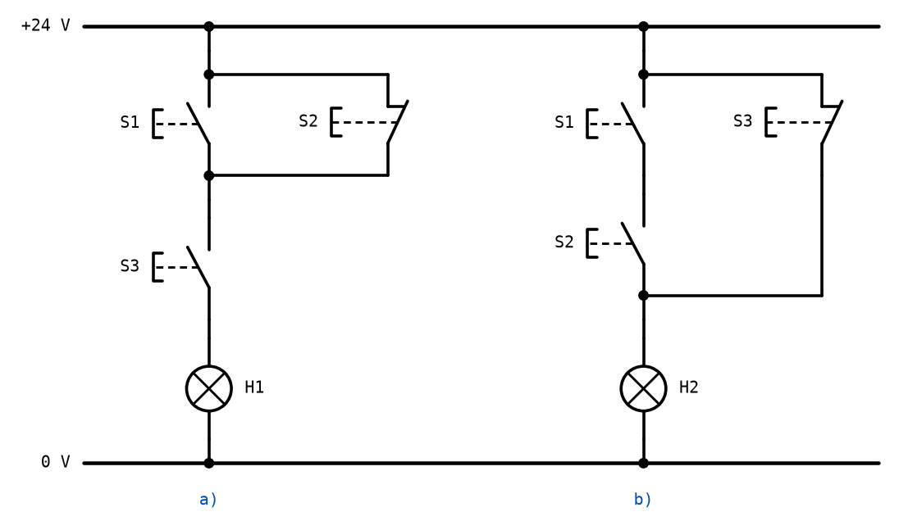

# Appendix C - Övningar

> **Så kontrollerar du ditt arbete.** Varje uttryck du förenklar kan kontrolleras med en
> sanningstabell: räkna ut det ursprungliga och det förenklade uttrycket för alla kombinationer av
> ingångarna, och jämför kolumnerna. Är de lika på varje rad är förenklingen rätt, oavsett vilken
> väg du tog dit. Varje grindnät kan dessutom byggas i
> [CircuitVerse](https://circuitverse.org/simulator) och kontrolleras rad för rad, enligt
> [A.9](./a_logic_gates.md#a9-circuitverse).
>
> Lösningsförslagen finns i [Appendix D](./d_solutions.md) när de har publicerats.
>
> Varje övning är märkt med sin sort. Övning 7 är passets **kontrolluppgift**.

---

## 1. Grindar med tre ingångar
**Förståelse.**

**a)** Skriv sanningstabellen för en AND-grind, en OR-grind och en XOR-grind med tre ingångar A, B
och C, i samma tabell.

**b)** Beskriv med en mening var för varje grind när utgången är `1`.

**c)** På hur många av de åtta raderna är AND-grinden `1`? OR-grinden? Förklara varför svaren är
så olika.

---

## 2. Från ord till uttryck
**Förståelse.**

Skriv ett booleskt uttryck för varje beskrivning. Välj själv bokstäver för signalerna, och ange vad
de betyder.

**a)** Larmet ska ljuda om dörren är öppen och larmet är aktiverat.

**b)** Pumpen ska gå om nivån i tanken är låg och ingen har tryckt på det manuella stoppet.

**c)** Varningslampan ska lysa om minst en av tre dörrar är öppen.

**d)** Beskriv med ord vad `X = AB' + C` betyder, om A är "maskinen är påslagen", B är "skyddet är
på plats" och C är "nödlarmet är utlöst".

**e)** Beräkna `AB + C` och `A(B + C)` för A = 0, B = 0 och C = 1. Vad visar resultatet om
prioritetsordningen?

---

## 3. Räknelagarna
**Räkna för hand.**

Förenkla med lagarna i [A.4](./a_logic_gates.md#a4-räknelagarna), och ange vilken lag du använder.

**a)** `A + A`

**b)** `A · A'`

**c)** `A + 1`

**d)** `(A')'`

**e)** `A + AB`

**f)** `A(A + B)`

**g)** `A + A'B`

**h)** `AB + A'B`

---

## 4. De Morgan
**Räkna för hand.**

**a)** Skriv om `(AB)'` utan någon inversion av ett helt uttryck.

**b)** Skriv om `(A + B + C)'` på samma sätt.

**c)** Förenkla `(A'B)'`. Tänk på att `(A')' = A`.

**d)** Förenkla `(A + B')'`.

**e)** Visa med en sanningstabell att `(AB)' = A' + B'`.

---

## 5. Från sanningstabell till uttryck
**Räkna för hand.**

| A | B | C | X |
|---|---|---|---|
| 0 | 0 | 0 | 1 |
| 0 | 0 | 1 | 0 |
| 0 | 1 | 0 | 1 |
| 0 | 1 | 1 | 0 |
| 1 | 0 | 0 | 0 |
| 1 | 0 | 1 | 0 |
| 1 | 1 | 0 | 1 |
| 1 | 1 | 1 | 1 |

**a)** Läs av uttrycket för X på SP-form, med en minterm per etta.

**b)** Förenkla uttrycket algebraiskt. Du ska få två termer med två variabler var.

**c)** Kontrollera ditt förenklade uttryck mot tabellen, rad för rad.

**d)** Hur många grindar behöver det oförenklade respektive det förenklade uttrycket, om du har
NOT-grindar och AND- och OR-grindar med så många ingångar du vill?

---

## 6. Algebraisk förenkling
**Räkna för hand.**

Förenkla så långt det går, och kontrollera varje svar med en sanningstabell.

**a)** `AB + AB' + A'B`

**b)** `(A + B)(A + B')`

**c)** `S'R + SR' + SR`, som behövdes i härledningen av bromsassistenten i
[A.10](./a_logic_gates.md#a10-föreläsningens-krets-bromsassistenten). Visa att det är `S + R`.

**d)** `A'B'C + A'BC + ABC`

---

## 7. Kontroll: analys av ett grindnät
**Kontroll.** *Analysera för hand, bygg och simulera, jämför.*



Gör delarna i ordning, och skriv ned varje svar innan du går vidare.

**a) För hand.** Ge NOR-grindens utgång namnet P och AND-grindens utgång namnet Q. Skriv uttrycken
för P, Q och X.

**b)** Räkna fram sanningstabellen med kolumnerna A, B, C, P, Q och X, som i
[A.8](./a_logic_gates.md#a8-analys-från-grindnät-till-sanningstabell).

**c) I CircuitVerse.** Bygg nätet precis som det är ritat, och gå igenom alla åtta kombinationerna.
Stämmer simuleringen med din tabell?

**d)** Om inte: är det tabellen eller bygget som är fel? Kontrollera den rad som skiljer genom att
räkna ut P och Q för just den raden en gång till, och genom att följa varje ledning i bygget.

**e)** Beskriv med en mening när X är `1`.

---

## 8. Från uttryck till grindnät
**Konstruktion.**

**a)** Rita grindnätet för `X = A'B + BC'` med NOT-, AND- och OR-grindar. Hur många grindar går
det åt?

**b)** Bryt ut B ur uttrycket, och använd De Morgan på det som blir kvar. Visa att samma funktion
går att bygga med en NAND-grind och en AND-grind.

**c)** Rita grindnätet för `Y = (A + B)C'`. Hur många grindar går det åt?

**d)** Bygg nätet från b) i CircuitVerse och kontrollera det mot en sanningstabell för
`A'B + BC'`.

---

## 9. Allt av NAND
**Konstruktion.**

[A.5](./a_logic_gates.md#a5-de-morgans-lagar) påstår att varje funktion går att bygga med enbart
NAND-grindar. Visa det för de tre grundoperationerna.

**a)** Visa algebraiskt att en NAND-grind med båda ingångarna ihopkopplade är en NOT-grind.

**b)** Hur bygger du en AND av NAND-grindar? Hur många behövs?

**c)** Utgå från `A + B = ((A + B)')'` och använd De Morgan för att skriva OR med enbart
NAND-operationer. Hur många NAND-grindar behövs?

**d)** Bygg alla tre i CircuitVerse med enbart NAND-grindar, och kontrollera var och en mot sin
sanningstabell.

---

## 10. Från uttryck till kontaktnät
**Konstruktion.**

Rita ett strömvägsschema mellan +24 V och 0 V för varje uttryck, med tryckknappar och lampan H1.
Ange för varje kontakt om den är slutande eller brytande.

**a)** `H1 = S1 · S2'`

**b)** `H1 = S1 + S2 · S3`

**c)** `H1 = (S1 + S2) · S3'`

**d)** Hur många kontaktelement behöver varje knapp ha i a)-c)? Och hur många i XOR-kopplingen i
[B.5](./b_contact_networks.md#b5-sammansatta-kontaktnät)?

---

## 11. Analys av kontaktnät
**Räkna för hand.**



**a)** Skriv uttrycket för H1 i nät a), och ta fram sanningstabellen för S1, S2 och S3.

**b)** Gör samma sak för H2 i nät b).

**c)** I nät b): vilka kombinationer tänder H2 utan att S1 eller S2 är nedtryckt? Förklara med
ritningen varför.

---

## 12. Självhållning
**Förståelse.**

Utgå från självhållningskretsen i [B.7](./b_contact_networks.md#b7-reläet).

**a)** Beskriv vad som händer med spolen K1 och lampan H1 när du trycker på S1, och sedan när du
släpper den.

**b)** Beskriv vad som händer när du sedan trycker på S2, och när du släpper den.

**c)** Vad händer om någon trycker på S1 och S2 samtidigt? Vilken av knapparna "vinner"?

**d)** Vid monteringen kopplas stoppknappen S2 av misstag med sitt slutande kontaktelement i stället
för sitt brytande. Beskriv hur maskinen beter sig.

**e)** Förklara varför kretsen inte är ett kombinatoriskt nät. Använd ordet minne.

---

## 13. Bromsassistenten, felkopplad *(fördjupning)*
**Räkna för hand.**

En konstruktör vill spara en grind och kopplar bromsassistenten från
[A.10](./a_logic_gates.md#a10-föreläsningens-krets-bromsassistenten) som

```text
B = (D + S + R)F'
```

Det är en OR-grind med tre ingångar följd av en AND med den inverterade felsignalen, och det ser
rimligt ut.

**a)** Ta fram sanningstabellen för det nya uttrycket, och jämför den rad för rad med tabellen i
A.10. På vilka rader skiljer de sig?

**b)** Vad har de raderna gemensamt? Beskriv vad som händer fysiskt i bilen i en sådan situation.

**c)** Vad säger det här om värdet av en sanningstabell som är härledd ur kravet, jämfört med en
som är avläst ur en krets man redan har byggt?

---
