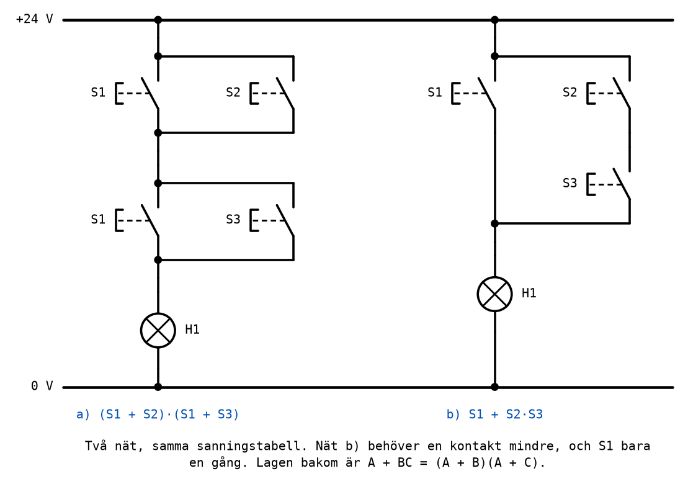
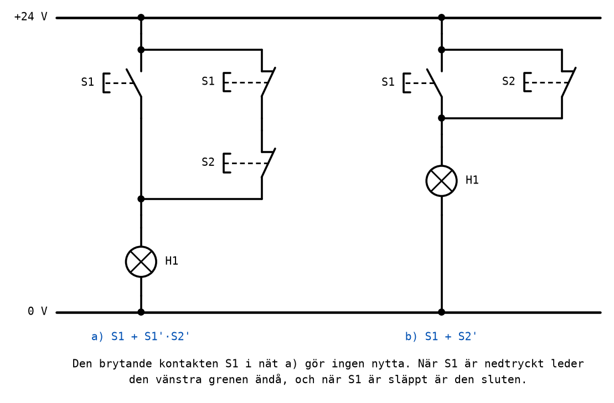
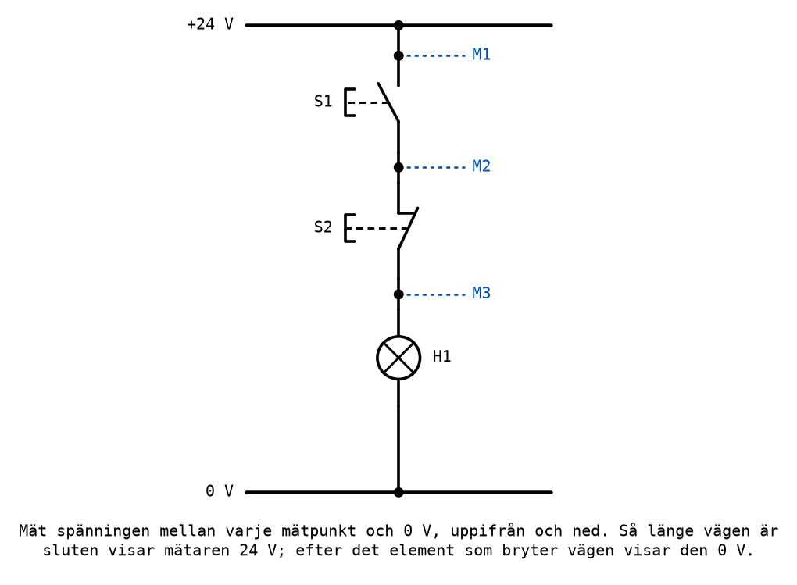

# Appendix A - Analys och felsökning av kontaktnät

## A.1 Kontaktnätet som uttryck
[L02 B.6](../../L02/appendix/b_contact_networks.md#b6-från-uttryck-till-kontaktnät-och-tillbaka)
visade hur ett uttryck blir ett kontaktnät. Att **analysera** ett nät är samma sak baklänges: du har
ett schema, och ska ta reda på vilken funktion det realiserar.

Metoden är att arbeta **inifrån och ut**:
1. Leta upp de minsta grupperna: två eller flera kontakter som sitter direkt i serie eller direkt
   parallellt, utan något annat emellan. Skriv uttrycket för var och en: en seriekoppling blir en
   produkt, en parallellkoppling en summa. En slutande kontakt är variabeln, en brytande kontakt
   variabeln inverterad.
2. Betrakta varje sådan grupp som en enda kontakt, och upprepa: nu syns nästa nivå av serie- och
   parallellkopplingar.
3. När hela strömvägen från +24 V till lampan har blivit ett enda uttryck är du klar.
4. Räkna fram sanningstabellen ur uttrycket, och sammanfatta den med en mening.

Sätt parenteser runt varje grupp, också när de inte behövs. En parallellkoppling i serie med något
annat är alltid en parentes, `(S1 + S2) · S3`, och den som glömmer den får `S1 + S2 · S3`, som är
en helt annan funktion.

---

## A.2 Genomarbetat exempel


**Nät a).** De minsta grupperna är de två parallellkopplingarna: `S1 + S2` överst och `S1 + S3`
under. De två grupperna sitter i serie med varandra, och därefter lampan:

```text
H1 = (S1 + S2) · (S1 + S3)
```

Sanningstabellen, med varje grupp som en egen kolumn:

| S1 | S2 | S3 | S1 + S2 | S1 + S3 | H1 |
|----|----|----|---------|---------|----|
| 0 | 0 | 0 | 0 | 0 | 0 |
| 0 | 0 | 1 | 0 | 1 | 0 |
| 0 | 1 | 0 | 1 | 0 | 0 |
| 0 | 1 | 1 | 1 | 1 | 1 |
| 1 | 0 | 0 | 1 | 1 | 1 |
| 1 | 0 | 1 | 1 | 1 | 1 |
| 1 | 1 | 0 | 1 | 1 | 1 |
| 1 | 1 | 1 | 1 | 1 | 1 |

Sammanfattat med ord: **lampan lyser om S1 är nedtryckt, eller om både S2 och S3 är det.**

Men den meningen är ett annat uttryck, `S1 + S2 · S3`, och det är nät b). Att de två är samma
funktion går att visa algebraiskt genom att multiplicera ut:

```text
(S1 + S2)(S1 + S3) = S1·S1 + S1·S3 + S2·S1 + S2·S3
                   = S1 + S1·S3 + S1·S2 + S2·S3
                   = S1(1 + S3 + S2) + S2·S3
                   = S1 + S2·S3
```

Det är den andra distributiva lagen från
[L02 A.4](../../L02/appendix/a_logic_gates.md#a4-räknelagarna), `A + BC = (A + B)(A + C)`, den som
inte ser ut som vanlig algebra. I kontakter är den lätt att se: i nät a) behövs S1 i båda
parallellkopplingarna, och i nät b) räcker det med en S1 som går förbi allt annat.

Nät b) har tre kontakter i stället för fyra, och S1 behöver bara ett kontaktelement i stället för
två. Färre kontakter betyder färre sladdar att koppla, färre ställen där något kan gå sönder, och i
en maskin lägre kostnad.

---

## A.3 Likvärdiga nät
Två nät är **likvärdiga** om de har samma sanningstabell. De kan se helt olika ut, ha olika antal
kontakter och vara kopplade på olika sätt; om lampan gör samma sak för varje kombination av
knapparna är de, för den som trycker på knapparna, samma nät.

Det finns två sätt att visa att två nät är likvärdiga:
* **Med sanningstabeller.** Räkna fram tabellen för båda och jämför dem rad för rad. Det fungerar
  alltid, och med två eller tre knappar är det bara fyra eller åtta rader.
* **Med algebra.** Förenkla det ena uttrycket tills det blir det andra, som i A.2. Det är snabbare
  när man ser vägen, men lätt att räkna fel.

Ett exempel på ett nät med en onödig kontakt:



Nät a) är `S1 + S1' · S2'`. Förenklingslagen från
[L02 A.4](../../L02/appendix/a_logic_gates.md#a4-räknelagarna), `A + A'B = A + B` med `S2'` i B:s
roll, säger direkt att det är `S1 + S2'`, alltså nät b).

Varför kan den brytande kontakten S1 tas bort? Titta på de två fallen:
* När S1 är **nedtryckt** leder den vänstra grenen, och lampan lyser vad den högra grenen än gör.
* När S1 är **släppt** är den brytande kontakten S1 sluten, och den högra grenen är bara S2:s
  brytande kontakt.

Den brytande kontakten S1 avgör alltså aldrig något: i det enda fall där den är öppen spelar den
högra grenen ingen roll. Den **påverkar strömmen**, men den **påverkar inte lampan**, och en kontakt
som inte påverkar utgången kan ersättas med en ledning. [Labb 1](../../../labs/lab1/README.md),
uppgift 8, har ett nät av samma slag, som du analyserar och förenklar själv.

---

## A.4 Förutsäg innan du mäter
Varje uppgift i Labb 1 följer samma arbetsgång:
1. **Rita schemat** på papper, med beteckning och kontaktsort för varje kontakt.
2. **Förutsäg** lampans läge för varje kombination av knapparna, och skriv in det i tabellen.
3. **Koppla** efter schemat, med spänningen frånslagen.
4. **Mät**: slå på spänningen, pröva varje kombination, och skriv in vad lampan gör.
5. **Jämför** de två kolumnerna.

| S1 | S2 | H1 förutsagt | H1 uppmätt |
|----|----|--------------|------------|
| 0 | 0 | | |
| 0 | 1 | | |
| 1 | 0 | | |
| 1 | 1 | | |

Det kan kännas som en omväg att fylla i den förutsagda kolumnen när svaret ändå kommer om en minut.
Det är det inte. **Den som bara mäter har inget att jämföra med**, och kan inte avgöra om lampan gör
rätt eller fel. En avvikelse mellan de två kolumnerna är information: den säger att schemat,
förutsägelsen eller kopplingen är fel, och vilken rad som avslöjar det. Det är där felsökningen
börjar.

---

## A.5 Felsökning
Lampan gör inte som den ska. Det finns två sätt att hitta felet, och båda bygger på samma idé:
**följ strömvägen från +24 V mot 0 V, och hitta det första stället där den är bruten.**

### Med spänningen påslagen: mät spänning
Ställ multimetern på likspänning (V DC), sätt den svarta mätsladden på 0 V, och mät med den röda i
varje mätpunkt längs strömvägen, uppifrån och ned. Tryck på de knappar som ska få lampan att lysa.



Så länge vägen ovanför mätpunkten är sluten visar mätaren 24 V. Efter det element som bryter vägen
visar den 0 V. Med S1 nedtryckt och S2 släppt ska lampan lysa, och mätningen avslöjar var den inte
gör det:

| M1 | M2 | M3 | Slutsats |
|----|----|----|----------|
| 0 V | 0 V | 0 V | Ingen spänning alls: aggregatet är av, eller ledningen från +24 V är bruten. |
| 24 V | 0 V | 0 V | S1 leder inte: fel kontaktelement, en lös sladd, eller en trasig kontakt. |
| 24 V | 24 V | 0 V | S2 leder inte: troligen kopplad till de slutande anslutningarna i stället för de brytande. |
| 24 V | 24 V | 24 V | Vägen fram till lampan är hel: felet sitter i lampan eller i ledningen till 0 V. |

I det sista fallet: mät direkt över lampan. 24 V över en släckt lampa betyder att lampan är
trasig; 0 V betyder att ledningen från lampan till 0 V är bruten.

### Med spänningen frånslagen: mät ledning
Slå av aggregatet, ställ multimetern på genomgångsprovning (ofta med en summer) eller resistans, och
mät över ett element i taget. En sluten kontakt eller en hel sladd ger nästan 0 Ω och ett pip; en
öppen kontakt eller en bruten sladd ger inget utslag. Tryck på knappen medan du mäter över dess
kontakt, för att se att den ändrar sig som den ska.

**Mät aldrig resistans eller genomgång med spänningen påslagen.** Mätaren mäter resistans genom att
skicka en egen liten ström, och en yttre spänning ger i bästa fall ett meningslöst värde och i
värsta fall en trasig mätare.

### Halveringsmetoden
I en lång strömväg lönar det sig att inte börja uppifrån, utan i **mitten**. Visar mätpunkten i
mitten 24 V sitter felet i den nedre halvan; visar den 0 V sitter det i den övre. Mät sedan i mitten
av den halva som återstår, och så vidare. Med åtta element hittar du felet på tre mätningar i
stället för upp till sju.

---

## A.6 Vanliga fel
| Symptom | Trolig orsak |
|---------|--------------|
| Lampan lyser aldrig | Aggregatet är av; en sladd sitter i fel hål; lampan är trasig; en kontakt i serie är kopplad som slutande när den skulle vara brytande, eller omvänt. |
| Lampan lyser alltid | En kontakt är förbikopplad av en extra sladd; en parallell gren har fått en brytande kontakt i stället för en slutande. |
| Lampan gör precis tvärtom mot tabellen | En kontakt är kopplad till fel kontaktelement: slutande och brytande har bytt plats. |
| Lampan fungerar för en knapp men inte för den andra | Den andra knappens kontakt är inte med i strömvägen; kontrollera att båda ändarna av den är anslutna. |
| Aggregatet går i strömbegränsning eller säkringen löser ut | Kortslutning: +24 V har fått en väg till 0 V utan lampan emellan. Slå av och kontrollera schemat. |

Den vanligaste orsaken av alla är att schemat och kopplingen inte stämmer överens. Kontrollera
kopplingen mot schemat sladd för sladd, gärna med en kamrat som läser schemat högt medan du pekar på
sladdarna, innan du börjar mäta.

---
