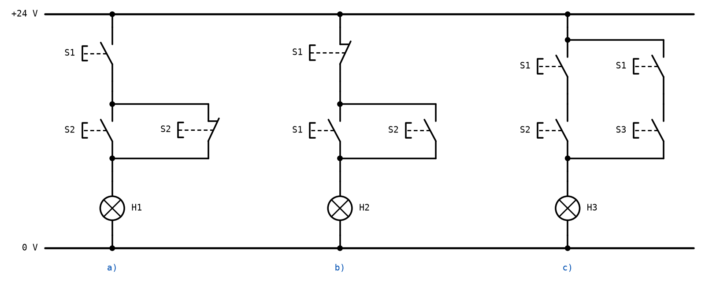
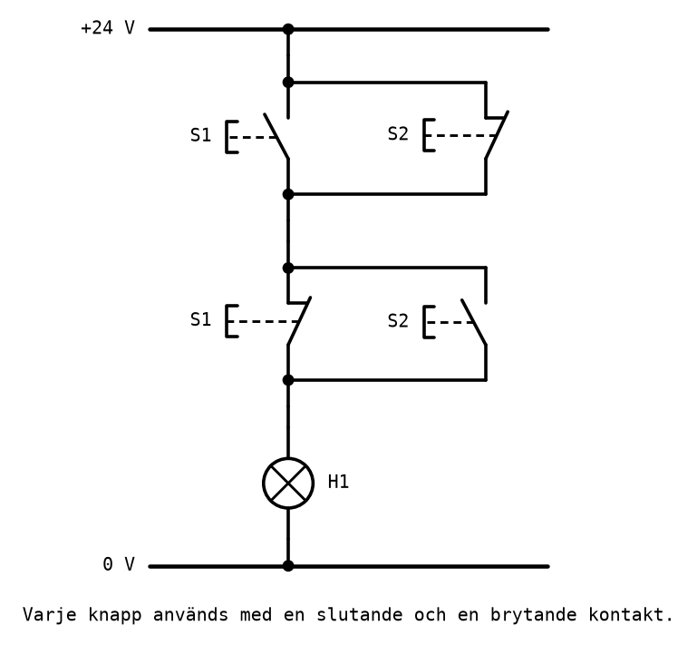
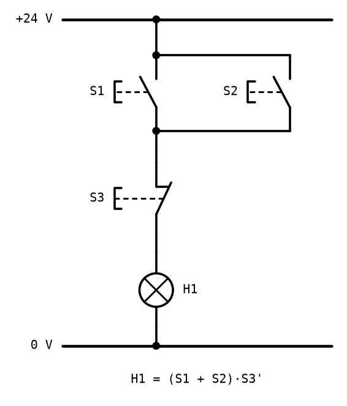

# Appendix B - Övningar

> **Så kontrollerar du ditt arbete.** Varje uttryck du läser av ur ett nät kan kontrolleras med
> nätet självt: välj en rad i sanningstabellen, tänk dig knapparna i det läget, och följ
> strömvägen i ritningen. Finns det en sluten väg från +24 V till lampan ska tabellen säga `1`.
> Övning 3 kontrolleras på labbstationen.
>
> Lösningsförslagen finns i [Appendix C](./c_solutions.md) när de har publicerats.
>
> Varje övning är märkt med sin sort. Övning 3 är passets **kontrolluppgift**.

---

## 1. Läs av uttrycket
**Räkna för hand.**

För vart och ett av näten a), b) och c):

**a)** Skriv uttrycket för lampan, med parenteser runt varje grupp, enligt
[A.1](./a_contact_network_analysis.md#a1-kontaktnätet-som-uttryck).

**b)** Ta fram sanningstabellen.

**c)** Sammanfatta tabellen med en mening.

---

## 2. Det minsta nätet
**Konstruktion.**

**a)** Förenkla vart och ett av de tre uttrycken från övning 1, och ange vilken räknelag du
använder.

**b)** Beskriv det minsta nätet för varje uttryck: vilka kontakter, och hur de sitter.

**c)** Hur många kontakter sparar du i varje nät? Hur många kontaktelement behöver varje knapp
före och efter?

---

## 3. Kontroll: förutsäg och bygg
**Kontroll.** *Förutsäg för hand, bygg på stationen, jämför.*

Gör delarna i ordning, och skriv ned varje svar innan du går vidare.

**a) För hand.** Skriv uttrycket för H1, och förutsäg lampans läge för alla fyra kombinationerna
av S1 och S2.

**b)** Multiplicera ut uttrycket och förenkla. Vilken grind från L02 är det?

**c) På stationen.** Koppla nätet och pröva alla fyra kombinationerna. Stämmer lampan med din
förutsägelse?

**d)** Jämför med nätet för samma funktion i Labb 1, uppgift 6. Hur många kontakter har de två
näten? Varför kan två så olika nät göra samma sak?

---

## 4. Syntes
**Konstruktion.**

**a)** Ta fram det minsta kontaktnätet med två knappar för sanningstabellen nedan:

| S1 | S2 | H1 |
|----|----|----|
| 0 | 0 | 1 |
| 0 | 1 | 1 |
| 1 | 0 | 0 |
| 1 | 1 | 1 |

**b)** Ett transportband drivs av en motor som styrs av reläet K1. Motorn får gå om skyddsgrinden
är stängd (givaren S3 påverkad), och samtidigt antingen startknappen på plats (S1) eller
fjärrstarten (S2) är intryckt. Skriv uttrycket för K1 och rita strömvägen.

---

## 5. Felsökning
**Förståelse.**

Nätet ska realisera `H1 = (S1 + S2) · S3'`.

**a)** Du trycker på S1 men inte på S3, och lampan förblir släckt. Du mäter 24 V mellan 0 V och
punkten ovanför parallellkopplingen, 24 V mellan 0 V och punkten mellan parallellkopplingen och S3,
och 0 V mellan 0 V och punkten mellan S3 och lampan. Var sitter felet, och vad är den troligaste
orsaken?

**b)** Efter en ny koppling lyser lampan när S1 eller S2 är nedtryckt, men den slocknar inte när du
dessutom trycker på S3. Vad är fel?

**c)** Efter ytterligare en ny koppling lyser lampan bara när S3 **och** minst en av S1 och S2 är
nedtryckta. Vad är fel nu?

---

## 6. Stoppknappen
**Förståelse.**

**a)** I en maskins stoppkrets används stoppknappens brytande kontakt. Beskriv vad som händer med
maskinen om ledningen till stoppknappen går av.

**b)** Beskriv vad som skulle hända om stoppknappens slutande kontakt i stället användes, och
kretsen var gjord så att maskinen stannar när kontakten sluts. Vad händer då om ledningen går av?

**c)** Formulera en regel för hur en stoppfunktion ska kopplas, med ordet *säker*.

---

## 7. Alla funktioner av två knappar
**Förståelse.**

**a)** En sanningstabell med två ingångar har fyra rader. Hur många olika sanningstabeller finns
det, alltså hur många olika funktioner av två variabler?

**b)** Två av funktionerna behöver inte någon kontakt alls. Vilka, och hur realiseras de?

**c)** Vilka funktioner behöver både det slutande och det brytande kontaktelementet i båda
knapparna?

---

## 8. En väljare av kontakter *(fördjupning)*
**Räkna för hand.**

Ett nät har kontakterna S1 och S2 slutande parallellt, i serie med S1 brytande och S3 slutande
parallellt: `H1 = (S1 + S2) · (S1' + S3)`.

**a)** Ta fram sanningstabellen.

**b)** Dela tabellen i två halvor efter S1, och beskriv med ord vad nätet gör.

**c)** Visa algebraiskt att `(S1 + S2)(S1' + S3) = S1' · S2 + S1 · S3`. Tänk på att `S1 · S1' = 0`,
och att en term som `S2 · S3` kan visa sig vara onödig: kontrollera med tabellen.

**d)** Jämför med grindnätet i
[L02 A.8](../../L02/appendix/a_logic_gates.md#a8-analys-från-grindnät-till-sanningstabell). Vad har
de gemensamt?

---
