# Appendix A - Karnaughdiagram

## A.1 Varför minimera
I [L02](../../L02/README.md) lärde du dig läsa av ett uttryck direkt ur en sanningstabell: en
AND-term för varje rad där utgången är `1`, och alla termerna ihop med OR. Den metoden fungerar
**alltid**, och det är dess stora styrka. Men den ger nästan aldrig det **minsta** nätet.

Ta sanningstabellen nedan, med tre ingångar `A`, `B`, `C` och en utgång `X`:

| A | B | C | X |
|---|---|---|---|
| 0 | 0 | 0 | 0 |
| 0 | 0 | 1 | 1 |
| 0 | 1 | 0 | 0 |
| 0 | 1 | 1 | 1 |
| 1 | 0 | 0 | 0 |
| 1 | 0 | 1 | 1 |
| 1 | 1 | 0 | 1 |
| 1 | 1 | 1 | 1 |

Fem rader har `X = 1`, så den direkta avläsningen ger fem AND-termer med tre ingångar var:

```text
X = A'B'C + A'BC + AB'C + ABC' + ABC
```

Det är fem AND-grindar med tre ingångar, en OR-grind med fem ingångar och tre inverterare. Samma
funktion kan skrivas `X = AB + C`: en AND-grind och en OR-grind. Båda uttrycken ger exakt samma
sanningstabell, men det ena kostar nio grindar och det andra två.

Skillnaden är inte akademisk. Varje grind är en krets att köpa, en plats på kopplingsdäcket och ett
dussin sladdar att dra, och varje sladd är ett ställe där något kan bli fel. I Labb 1 var varje
term dessutom en kontakt i en tryckknapp, och en tryckknapp har bara så många kontakter.

Du kan förenkla med räknelagarna från L02, och det är precis vad du gjorde där. Problemet med
algebra är att du måste **se** vilken lag som ska användas härnäst, och att du aldrig riktigt vet
när du är klar. Ett **Karnaughdiagram** (uttalas "karnå") gör samma förenkling visuell: du ritar
tabellen som ett rutnät, ringar in ettor som ligger bredvid varandra, och läser av svaret. För
funktioner med två till fyra ingångar är det den snabbaste och säkraste metoden som finns.

---

## A.2 Diagrammet och Graykoden
Ett Karnaughdiagram är sanningstabellen omskriven till ett rutnät: **en ruta per rad** i
tabellen. Tre ingångar ger åtta rader och därför åtta rutor; fyra ingångar ger sexton.

Idén bakom rutnätet är en enda regel: **två rutor som ligger bredvid varandra får bara skilja sig i
en enda ingång.** Då betyder två ettor bredvid varandra alltid att utgången inte beror på den
ingång som skiljer dem åt, och den ingången kan strykas. Det är hela metoden; resten är teknik.

För att regeln ska hålla skrivs rubrikerna i **Graykod**, inte i vanlig binär ordning. Med två
bitar är ordningen `00, 01, 11, 10`: bara en bit ändras i varje steg, också i steget från den
sista tillbaka till den första. Graykoden presenterades i
[L01 Appendix B](../../L01/appendix/b_binary_codes.md); här är den till nytta. Vanlig binär
ordning, `00, 01, 10, 11`, fungerar **inte**: i steget från `01` till `10` ändras båda bitarna,
och två rutor som ser ut som grannar är det inte.

Kursen använder alltid samma uppställning:

* **två ingångar**: `A` nedåt, `B` åt sidan;
* **tre ingångar**: `AB` nedåt i Graykod, `C` åt sidan;
* **fyra ingångar**: `AB` nedåt och `CD` åt sidan, båda i Graykod.

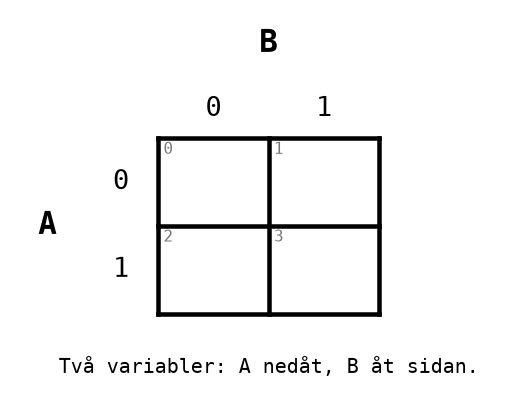

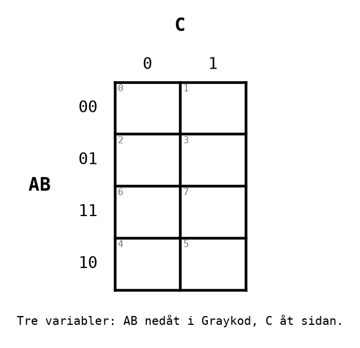

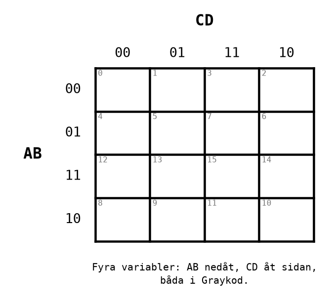

Det lilla grå talet i hörnet av varje ruta är radens nummer i sanningstabellen: ingångarna läst
som ett binärt tal, med `A` som mest signifikant bit. Rutan på raden `AB = 11` och i kolumnen
`CD = 01` är alltså `ABCD = 1101`, rad **13**. Ett sådant radnummer kallas en **minterm**, och det
är det enklaste sättet att föra över en tabell till diagrammet utan att fastna på Graykoden.

Lägg märke till ordningen: `2` står till höger om `3`, och raden med `12-15` står ovanför raden med
`8-11`. Det är Graykoden som syns. Den som fyller i diagrammet i tabellens ordning, rad för rad från
vänster, gör just det fel som gör resten av arbetet värdelöst.

---

## A.3 Att gruppera
Arbetsgången, för varje diagram:

1. **Fyll i** en `1` i varje ruta där utgången är `1`. Lämna övriga rutor tomma; nollorna behövs
   inte för att hitta grupperna.
2. **Ringa in grupper av ettor**, efter tre regler:
   * en grupp är en **rektangel**, aldrig ett L eller en diagonal;
   * gruppens storlek är en **tvåpotens**: 1, 2, 4, 8 eller 16 rutor. En grupp om 4 kan vara en
     rad, en kolumn eller en kvadrat om 2 x 2, men aldrig tre rutor och aldrig sex;
   * en grupp får bara innehålla ettor.
3. **Gör varje grupp så stor som möjligt.** En större grupp stryker fler ingångar och ger en
   kortare term.
4. **Täck varje etta minst en gång**, med så få grupper som möjligt. Grupper får överlappa, och en
   etta får alltså ingå i flera grupper. En grupp vars alla ettor redan täcks av andra grupper är
   däremot överflödig: stryk den.

Diagrammet för tabellen i A.1, ifyllt:

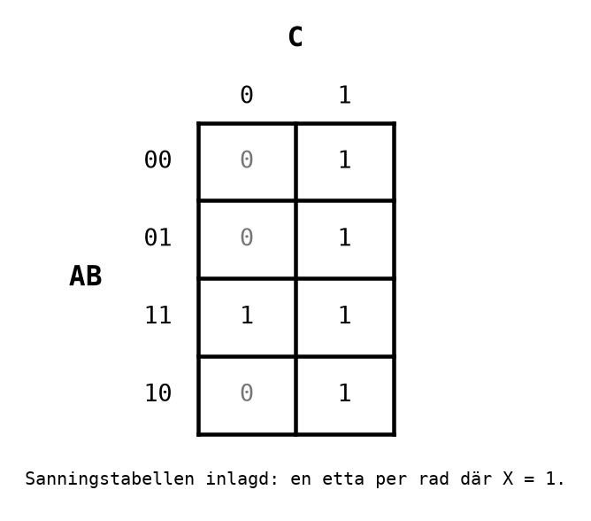

Hela kolumnen `C = 1` är fylld med ettor: fyra rutor, en tillåten grupp.

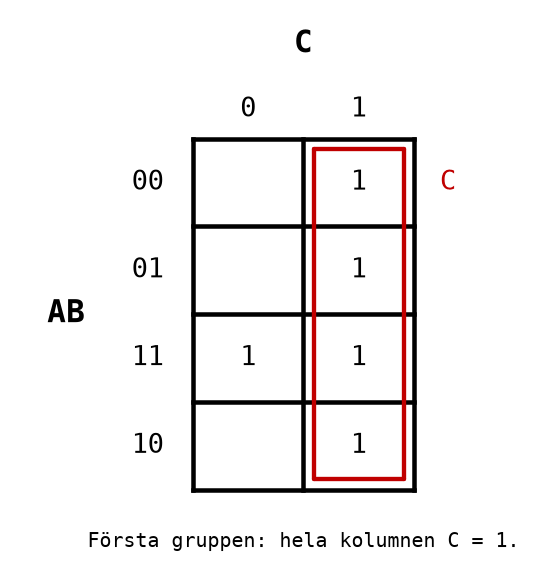

En etta är ännu inte täckt, på raden `AB = 11`. Den största grupp den kan ingå i är paret med sin
granne till höger, som redan ingår i `C`-gruppen. Det gör inget: överlapp är tillåtet, och en
grupp om två är bättre än en grupp om en.

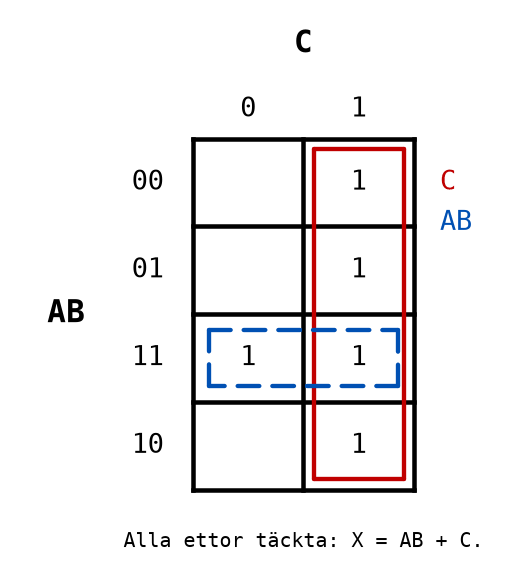

Varje etta är nu täckt, och båda grupperna är så stora de kan bli.

---

## A.4 Att läsa av grupperna
Varje grupp blir en AND-term. För att hitta den, gå igenom ingångarna en i taget och fråga:
**har ingången samma värde i varje ruta i gruppen?**

* Om ja, och värdet är `1`: ingången står med i termen, som den är.
* Om ja, och värdet är `0`: ingången står med, inverterad (med prim).
* Om nej: ingången stryks. Utgången bryr sig inte om den inom gruppen.

Gruppen i kolumnen `C = 1`: `A` är både 0 och 1 i gruppen, och stryks. `B` är både 0 och 1, och
stryks. `C` är 1 i alla fyra rutorna. Termen blir **`C`**.

Gruppen på raden `AB = 11`: `A` är 1 i båda rutorna, `B` är 1 i båda, och `C` är 0 i den ena och
1 i den andra. Termen blir **`AB`**.

Svaret är termerna ihop med OR:

```text
X = AB + C
```

Två tumregler gör avläsningen snabb, och de är värda att lära sig utantill:

| Gruppens storlek | Antal ingångar som stryks | Kvar i termen, av 3 | Kvar i termen, av 4 |
|------------------|---------------------------|---------------------|---------------------|
| 1 ruta  | 0 | 3 | 4 |
| 2 rutor | 1 | 2 | 3 |
| 4 rutor | 2 | 1 | 2 |
| 8 rutor | 3 | 0 | 1 |

* En grupp om 2<sup>k</sup> rutor stryker exakt k ingångar. Om din avläsning ger en annan längd på
  termen har du läst fel.
* **Kontrollera alltid svaret mot tabellen.** Sätt in varje rad i ditt uttryck och se att det ger
  rätt `X`. Med tre ingångar är det åtta rader, och det tar en minut. Det är samma disciplin som
  i CircuitVerse: förutsäg, kontrollera, och lita inte på något du inte kontrollerat.

---

## A.5 Kanter och hörn
Graykoden gäller också runt kanterna: den översta raden (`AB = 00`) och den nedersta (`AB = 10`)
skiljer sig bara i `A`, och är därför grannar. Likadant är vänstra och högra kolumnen grannar i
ett diagram med fyra ingångar. Tänk dig att diagrammet är ritat på en cylinder, eller att
rutnätet fortsätter på andra sidan, som i ett tv-spel där man kommer ut på motsatt sida.

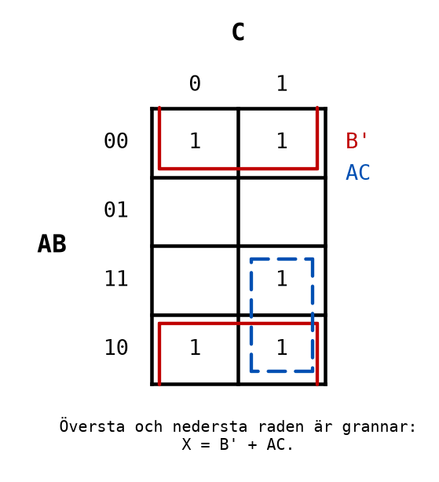

Gruppen `B'` består av raderna `AB = 00` och `AB = 10`, båda kolumnerna. I alla fyra rutorna är
`B = 0`, och den läses av precis som en grupp i mitten av diagrammet. Den ritas som två halva
ringar som är öppna mot kanten de går över; det är så en grupp över kanten ritas för hand. Den
sista ettan, `ABC = 111`, paras med sin granne nedanför och ger `AC`, så `X = B' + AC`.

I ett diagram med fyra ingångar är de fyra **hörnen** grannar till varandra, två och två: översta
och nedersta raden är grannar, och vänstra och högra kolumnen är grannar. Hörnen bildar alltså en
kvadrat om 2 x 2, bara uppdelad på fyra ställen.

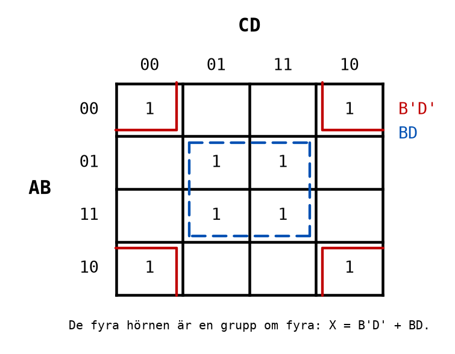

Hörngruppen: `A` varierar (rad 00 och 10), `B = 0` i alla fyra, `C` varierar (kolumn 00 och 10),
`D = 0` i alla fyra. Termen blir `B'D'`. Mittgruppen har `B = 1` och `D = 1` överallt och blir
`BD`. Svaret är `X = B'D' + BD`, vilket för övrigt är XNOR av `B` och `D`: `A` och `C` spelar ingen
roll alls.

Hörnen är det ställe där flest missar en grupp. När du tror att du är klar med ett diagram med fyra
ingångar, titta på hörnen en extra gång.

---

## A.6 Don't care
Ibland finns det ingångskombinationer som **aldrig förekommer**. Då spelar det ingen roll vad
utgången blir för dem, och det kan du utnyttja.

Det vanligaste exemplet är **BCD** från [L01](../../L01/appendix/b_binary_codes.md): en decimal
siffra 0-9 kodad med fyra bitar `ABCD`. Kombinationerna `1010` till `1111`, alltså 10-15, är inga
siffror och kommer aldrig in i kretsen. I diagrammet markeras de med ett **X**, "don't care".

Regeln är enkel: **ett X får räknas som en etta om det gör en grupp större, och som en nolla
annars.** Det behöver inte täckas.

Exempel: en krets som ska tända en lampa när siffran är **minst 5**. Ettor för 5, 6, 7, 8 och 9,
X för 10-15:

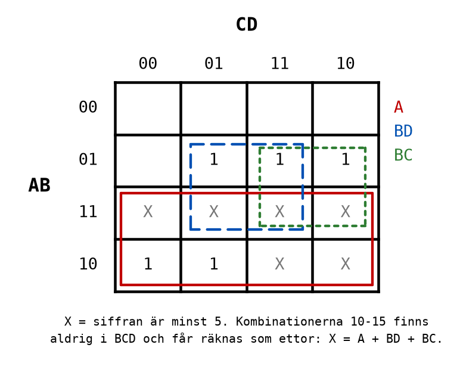

Tack vare X-en kan de två nedersta raderna bli en enda grupp om åtta: `A`. Utan X-en hade ettorna
8 och 9 bara kunnat bilda gruppen `AB'C'`. De andra två grupperna, `BD` och `BC`, använder också
X-rutor för att växa från två till fyra rutor. Svaret är:

```text
X = A + BD + BC
```

Kontrollera mot siffrorna: 5 är `0101`, där `BD = 1`. 6 är `0110`, där `BC = 1`. 7 är `0111`, där
båda är 1. 8 och 9 har `A = 1`. Siffrorna 0-4 har `A = 0` och aldrig både `B` och `C` eller `B`
och `D`, så `X = 0`. Stämmer.

---

## A.7 Från specifikation till grindnät
Nu hela vägen, från en beskrivning i ord till ett nät som kan kopplas upp. Det är arbetsgången du
använder i Labb 2, och den har fem steg.

**Specifikationen.** En tank har tre nivågivare, `A`, `B` och `C`, som var och en ger `1` när de
känner vätska. Givare kan gå sönder, så ett larm för hög nivå ska inte lita på en enda givare.
Larmet `X` ska gå när **minst två** av givarna ger `1`. En sådan krets kallas en
**majoritetskrets**, och samma idé används i flygplan och kraftverk, där tre datorer räknar samma
sak och systemet gör det två av dem är överens om.

**Steg 1: sanningstabellen.** Tre ingångar, åtta rader. `X = 1` där minst två ingångar är `1`:

| A | B | C | X |
|---|---|---|---|
| 0 | 0 | 0 | 0 |
| 0 | 0 | 1 | 0 |
| 0 | 1 | 0 | 0 |
| 0 | 1 | 1 | 1 |
| 1 | 0 | 0 | 0 |
| 1 | 0 | 1 | 1 |
| 1 | 1 | 0 | 1 |
| 1 | 1 | 1 | 1 |

**Steg 2: Karnaughdiagrammet.** Ettor i rutorna 3, 5, 6 och 7:

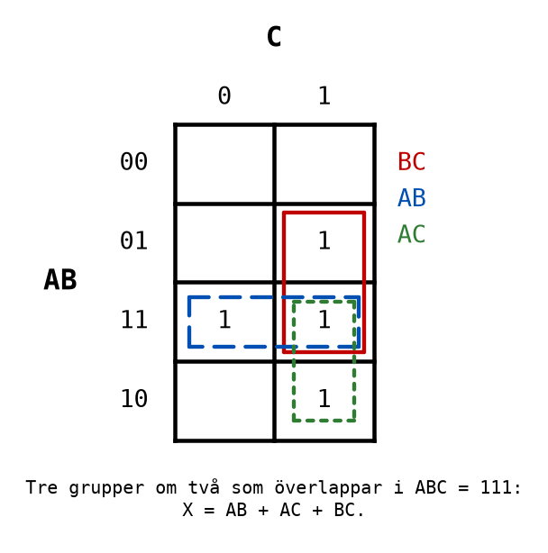

Ingen grupp om fyra är möjlig, men varje etta kan paras med rutan `ABC = 111`. Tre par, som
överlappar i mitten.

**Steg 3: det minimerade uttrycket.**

```text
X = AB + AC + BC
```

Läs det högt och jämför med specifikationen: "A och B, eller A och C, eller B och C". Det är "minst
två" skrivet som logik, och det är en bra kontroll att uttrycket går att läsa så.

**Steg 4: grindnätet.** Tre AND-grindar med två ingångar och en OR-grind med tre:

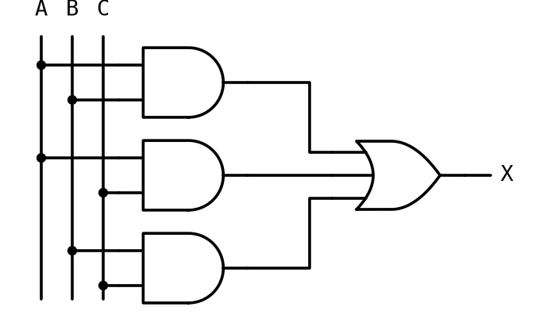

**Steg 5: kontrollera.** Bygg nätet i [CircuitVerse](https://circuitverse.org/simulator) och gå
igenom alla åtta raderna, eller sätt in raderna i uttrycket för hand. Först därefter kopplas det
upp. En direkt avläsning av tabellen hade gett fyra termer med tre ingångar var; diagrammet gav
tre termer med två.

---

## A.8 Nät med flera utgångar
Många kretsar har mer än en utgång. Då ritas **ett diagram per utgång**, och varje utgång
minimeras för sig.

Ett exempel som kommer tillbaka i [L06](../../L06/appendix/b_microcomputer.md), när vi tittar
inuti mikrodatorns räkneenhet, är **heladderaren**: den adderar två bitar `A` och `B` och en
minnessiffra `C` från föregående position, och ger en summa `S` och en ny minnessiffra `Cut`.

| A | B | C | Cut | S |
|---|---|---|-----|---|
| 0 | 0 | 0 | 0 | 0 |
| 0 | 0 | 1 | 0 | 1 |
| 0 | 1 | 0 | 0 | 1 |
| 0 | 1 | 1 | 1 | 0 |
| 1 | 0 | 0 | 0 | 1 |
| 1 | 0 | 1 | 1 | 0 |
| 1 | 1 | 0 | 1 | 0 |
| 1 | 1 | 1 | 1 | 1 |

Kolumnen `Cut` är precis majoritetskretsen från A.7: minnessiffran blir 1 när minst två av de tre
bitarna är 1. Samma diagram, samma svar, `Cut = AB + AC + BC`.

Kolumnen `S` är mer intressant:

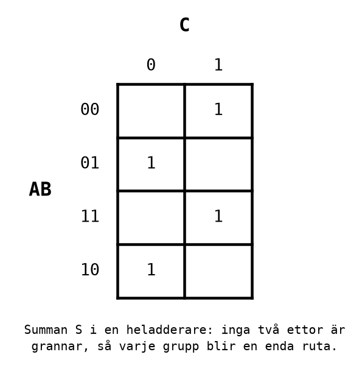

Ettorna bildar ett schackbräde. **Ingen etta har en etta som granne**, så den största möjliga
gruppen är en enda ruta, och diagrammet kan inte förenkla något. Det är inget misslyckande, det är
ett svar: ett schackmönster betyder **XOR**. `S = 1` när ett udda antal av bitarna är 1, vilket är
`S = A xor B xor C`, två XOR-grindar.

Ett Karnaughdiagram hittar det minsta nätet av AND-, OR- och NOT-grindar. Det ser inte XOR. När du
får ett schackmönster, eller en del av ett, är det dags att tänka på XOR i stället.

---

## A.9 NAND- och NOR-nät
I L02 såg du att **NAND** ensam räcker för att bygga vilken funktion som helst, och likaså **NOR**.
Det är mer än en kuriositet: en krets som 74HC00 innehåller fyra NAND-grindar, och ett nät som
bara använder NAND kan ofta byggas med en enda krets i stället för två eller tre.

### Från summa av produkter till NAND-NAND
Ett uttryck på summa av produkter-form, som de ett Karnaughdiagram ger, kan alltid göras om till
enbart NAND i tre steg:

1. Rita nätet som AND-grindar som matar en OR-grind.
2. Invertera två gånger på varje ledning mellan AND och OR. Två inversioner tar ut varandra, så
   funktionen är densamma.
3. Flytta den ena inversionen in i AND-grinden (som då blir NAND), och den andra in i OR-grinden.
   En OR-grind med inverterade ingångar är, enligt De Morgan, en NAND-grind: `A' + B' = (AB)'`.

Resultatet: **varje AND blir en NAND, och OR-grinden blir en NAND.** En ensam ingång som går
direkt till OR-grinden, utan AND framför, måste inverteras, och en inverterare är en NAND med
ingångarna ihopkopplade.

För `X = AB + C`:

```text
X = AB + C = ((AB)' · C')'
```

Kontrollera med De Morgan: `((AB)' · C')' = (AB)'' + C'' = AB + C`. Stämmer.

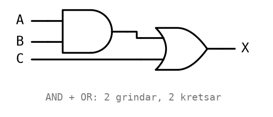

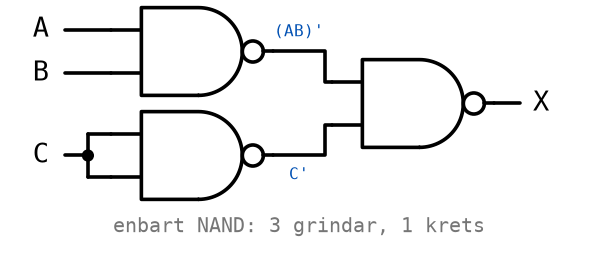

Nätet har en grind mer, men alla tre ryms i **en** 74HC00. AND-OR-versionen kräver en 74HC08 och
en 74HC32. Färre kretsar betyder färre matningar att dra och färre ställen att göra fel, och därför
är NAND-NAND ofta det bästa valet på ett kopplingsdäck.

### Från produkt av summor till NOR-NOR
Samma sak fungerar spegelvänt: ett uttryck på **produkt av summor**-form (A.10) blir enbart NOR.
Varje OR blir en NOR, och AND-grinden som samlar ihop dem blir en NOR:

```text
X = (A + C)(B + C) = ((A + C)' + (B + C)')'
```

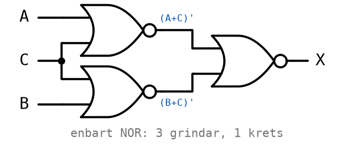

### XOR av fyra NAND
En XOR-grind finns som egen krets (74HC86), men den kan också byggas av fyra NAND:

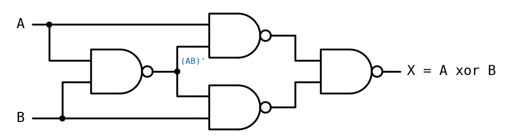

Följ signalerna: den första grinden ger `(AB)'`. Den övre i mitten ger `(A · (AB)')'`, den nedre
`(B · (AB)')'`, och den sista kombinerar dem. Sätt in alla fyra kombinationerna av `A` och `B` så
ser du att utgången är `1` precis när `A` och `B` skiljer sig åt. Det är en frivillig uppgift i
Labb 2-2.

---

## A.10 Produkt av summor
Hittills har grupperna ringat in **ettor**, och svaret har blivit en summa av produkter (SP-form):
AND-termer ihop med OR. Man kan lika gärna ringa in **nollor**. Då blir svaret en **produkt av
summor** (PS-form): OR-termer ihop med AND.

Varje grupp av nollor läses av som en OR-term, med omvänd regel: en ingång som är `0` i hela
gruppen står med som den är, och en ingång som är `1` står inverterad. Tanken är att termen ska bli
`0` precis i gruppens rutor.

Samma funktion som i A.3, nu med nollorna inringade:

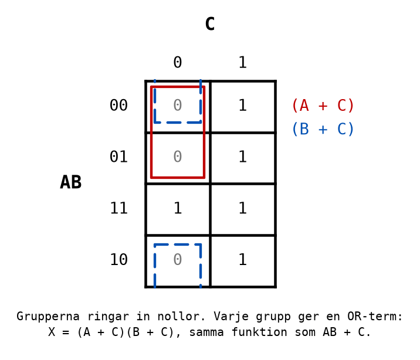

Gruppen `AB = 00, 01` i kolumnen `C = 0` har `A = 0` och `C = 0`: termen `(A + C)`, som är 0 bara
när både `A` och `C` är 0. Gruppen över kanten, raderna `00` och `10` i samma kolumn, har `B = 0`
och `C = 0`: termen `(B + C)`.

```text
X = (A + C)(B + C)
```

Multiplicera ut, så får du `AB + AC + BC + C`, och eftersom `AC + BC + C = C` enligt
absorptionslagen blir det `AB + C`. Samma funktion, två skrivsätt.

Du behöver PS-formen främst för NOR-nät (A.9). För allt annat i kursen räcker SP-formen, och den är
den du ska välja om inget annat sägs.

---
