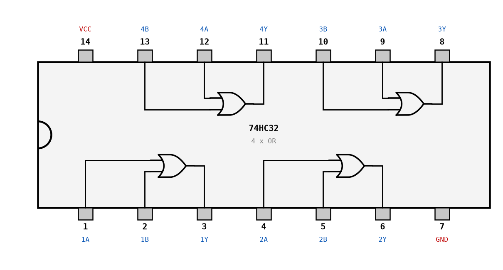
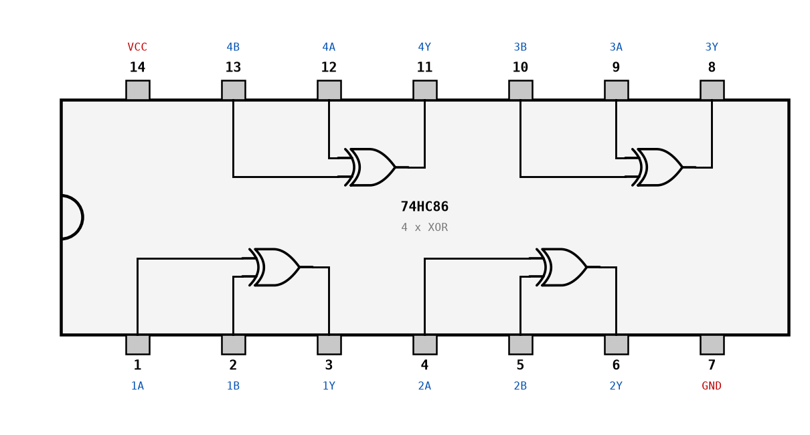
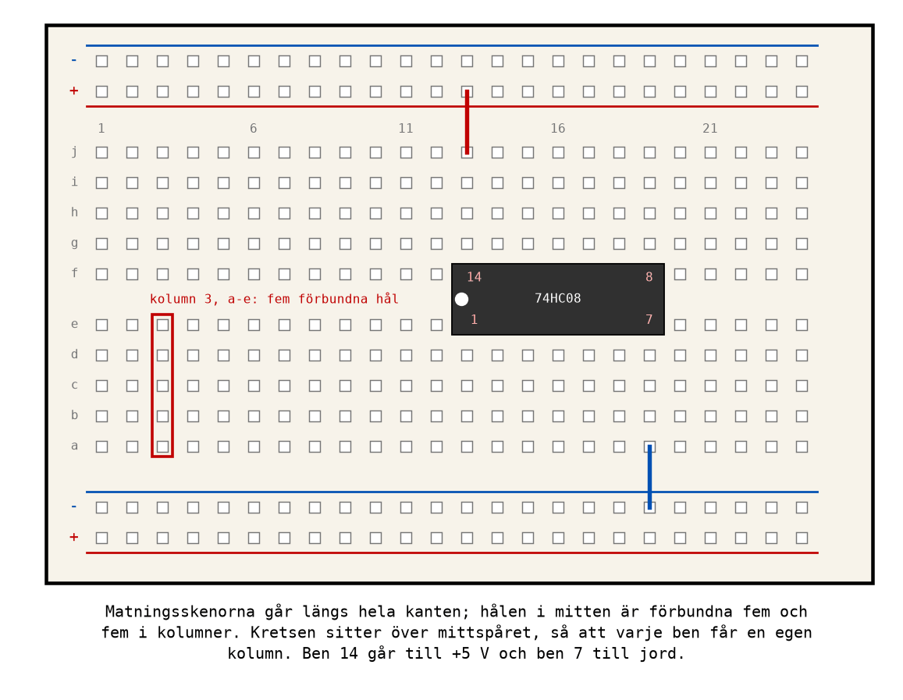

# Appendix B - IC-kretsar

## B.1 Från grind till krets
En logisk grind är ett begrepp. För att kunna koppla upp den behöver du en **IC-krets**
(*integrated circuit*): en liten kiselbit med transistorer, ingjuten i en plastkapsel med metallben.
Den mest spridda familjen av enkla logikkretsar är **74-serien**, som funnits sedan 1960-talet och
fortfarande tillverkas. Varje krets i serien har ett nummer som säger vad den innehåller:

| Krets | Innehåll | Används i |
|-------|----------|-----------|
| 74HC00 | fyra NAND-grindar med två ingångar | Labb 2-2 |
| 74HC02 | fyra NOR-grindar med två ingångar | Labb 2-2 |
| 74HC04 | sex inverterare (NOT) | Labb 2-1 |
| 74HC08 | fyra AND-grindar med två ingångar | Labb 2-1 |
| 74HC32 | fyra OR-grindar med två ingångar | Labb 2-1 |
| 74HC86 | fyra XOR-grindar med två ingångar | - |

Namnet har tre delar. **74** betyder standardserien, för normala temperaturer. **HC** är
kretsfamiljen, alltså hur transistorerna inuti är byggda: *High-speed CMOS*. **00** är funktionen.
En 74HC00 och en 74LS00 innehåller samma fyra NAND-grindar, men i olika teknik.

Tillverkarna lägger ofta till egna bokstäver före och efter. `SN74HC00N` från Texas Instruments och
`74HC00N` från Nexperia är samma krets; `N` på slutet betyder här kapseln DIP, den som passar i ett
kopplingsdäck. Leta efter `74`, familjen och numret, och bry dig inte om resten.

**Två familjer du kommer att möta:**
* **HC** (CMOS) arbetar på 2-6 V, drar nästan ingen ström i vila, och är den kursen använder.
* **LS** (TTL) är äldre, kräver 5 V, och drar mer ström. En LS-ingång som lämnas okopplad läses
  som 1, vilket har lärt generationer av elektroniker den dåliga vanan att lämna ingångar okopplade.
  På en HC-krets är det ett fel (B.4).

---

## B.2 Kapsel och benplacering
Kretsarna i kursen sitter i en **DIP-14**-kapsel: 14 ben i två rader, 2,54 mm mellan benen, så att
de passar i kopplingsdäckets hål.

**Ben 1 hittar du med hjälp av markeringen.** I ena kortsidan finns ett halvrunt **hack**, och ofta
också en liten prick vid ben 1. Håll kretsen med hacket åt vänster och texten rättvänd: då sitter
ben 1 längst ned till vänster. Benen räknas sedan **moturs, sett ovanifrån**: 1 till 7 längs
nederkanten från vänster till höger, och 8 till 14 längs överkanten från höger till vänster.

Alla kretsar i tabellen ovan har matningen på samma ben:
* **ben 14: VCC**, plus 5 V;
* **ben 7: GND**, jord (0 V).

Utan matning fungerar ingenting. Och en krets som sitter felvänd får plus på ben 7 och jord på ben
14: den blir varm, fungerar inte, och kan förstöras. Känn efter med ett finger om en krets blir
varm, och bryt matningen direkt om den blir det.

Benplaceringen finns i databladet. Här är de kretsar kursen använder, ritade ovanifrån med grindarna
inuti:







**74HC00, 08, 32 och 86 har samma benplacering.** Grind 1 har ingångarna på ben 1 och 2 och
utgången på ben 3, grind 2 på ben 4, 5 och 6, och så vidare. Byt en 74HC08 mot en 74HC32 så byts
alla fyra AND-grindarna mot OR-grindar, utan att en enda sladd flyttas.

**74HC02 är undantaget**, och det är den krets flest kopplar fel. I varje grupp om tre ben kommer
**utgången först**: ben 1 är utgång och ben 2 och 3 ingångar. Den som kopplar en 74HC02 ur minnet
av en 74HC00 kopplar sina insignaler till en utgång. Titta på benplaceringen varje gång.

---

## B.3 Databladet
Varje krets har ett **datablad**, ett dokument från tillverkaren som beskriver den i detalj. Sök på
kretsens namn och "datasheet", och välj en stor tillverkare som Texas Instruments, Nexperia eller
onsemi. Ett datablad är ofta 15-20 sidor, men för att koppla upp en krets behöver du bara tre
saker ur det:

1. **Benplaceringen** (*pin configuration* eller *pinout*): vilket ben som är vad, som i figurerna
   ovan.
2. **Funktionstabellen** (*function table*): kretsens sanningstabell, skriven med `H` för hög och
   `L` för låg, och ibland `X` för "spelar ingen roll".
3. **De elektriska nivåerna**: vilka spänningar som räknas som 0 och 1.

### Logiknivåer
En digital krets delar in spänningen i tre områden: låg, hög, och ett förbjudet område däremellan.
För en 74HC-krets matad med 4,5 V anger databladet:

| Storhet | Betydelse | Värde vid VCC = 4,5 V |
|---------|-----------|------------------------|
| V<sub>IH</sub> | lägsta spänning på en ingång som garanterat läses som 1 | 3,15 V |
| V<sub>IL</sub> | högsta spänning på en ingång som garanterat läses som 0 | 1,35 V |
| V<sub>OH</sub> | lägsta spänning en hög utgång ger, vid 4 mA last | 3,84 V |
| V<sub>OL</sub> | högsta spänning en låg utgång ger, vid 4 mA last | 0,33 V |

En tumregel för HC-kretsar: under **30 %** av matningen är 0, över **70 %** är 1. Vid 5 V betyder
det under 1,5 V och över 3,5 V. En ingång mellan de två gränserna kan läsas som vad som helst, och
får kretsen att dra onödigt mycket ström.

Lägg märke till marginalen: en utgång ger minst 3,84 V när den är hög, och en ingång behöver bara
3,15 V. Skillnaden, ungefär 0,7 V, är **brusmarginalen**. Den gör att en störning på upp till 0,7 V
på en ledning inte ändrar något. Det är brusimmuniteten från
[L01](../../L01/appendix/a_number_systems.md#a1-digitalt-och-analogt), uttryckt i volt.

### Gränsvärden
Databladet har också en tabell med **absoluta maxvärden** (*absolute maximum ratings*). De är
inte arbetsvärden, utan gränser som förstör kretsen om de överskrids. För 74HC:
* matningen får vara högst 7 V (och kretsen är specificerad för 2-6 V);
* en utgång får leverera högst 25 mA;
* hela kretsen, alla utgångar tillsammans, högst 50 mA genom VCC eller GND.

**Koppla aldrig 24 V från Labb 1 till en 74HC-krets.** Den överlever det inte.

---

## B.4 Ingångar: aldrig flytande
En CMOS-ingång drar nästan ingen ström, under en mikroampere. Det låter bra, men det betyder att en
ingång som inte är ansluten till något, en **flytande ingång**, inte har någon bestämd spänning
alls. Den plockar upp laddning från omgivningen och kan läsas som 0 i ena sekunden och 1 i nästa,
beroende på om din hand är nära. Kretsen verkar fungera ibland, och det är den värsta sortens fel.

**Regeln: varje ingång ska vara ansluten till något.** Det gäller också ingångarna på grindar du
inte använder: koppla dem till GND (eller VCC).

En strömbrytare eller tryckknapp ger bara en förbindelse när den är sluten. När den är öppen är
ingången flytande, om inte ett motstånd bestämmer nivån:


* Knappen sitter mellan **5 V** och ingången.
* Ett motstånd på **10 kΩ** sitter mellan ingången och **jord**. Det kallas ett
  **pull-down-motstånd**: det drar ned ingången till 0 när knappen är öppen.
* När knappen trycks ned kopplar den ingången direkt till 5 V. Motståndet ligger då mellan 5 V och
  jord och leder 0,5 mA, men det spelar ingen roll; ingången ser 5 V och läser 1.

Det omvända, knappen mot jord och motståndet mot 5 V, kallas ett **pull-up-motstånd** och ger
omvänd logik: nedtryckt knapp läses som 0. Det är den kopplingen mikrokontrollern använder i
[L10](../../L10/README.md), där motståndet dessutom sitter inbyggt i kretsen.

Kopplingsdäckets stationer i Labb 2 har strömbrytare som redan ger 0 eller 5 V. Då behövs inga
egna motstånd, men regeln om ingångar du inte använder gäller fortfarande.

---

## B.5 Utgångar: lysdiod med förkopplingsmotstånd
För att se vad en utgång gör kopplar du en **lysdiod** till den. En lysdiod är en diod som lyser
när ström går igenom den i rätt riktning: från det långa benet (**anoden**) till det korta
(**katoden**, som också är märkt med en platt kant på kapseln).

En lysdiod måste alltid ha ett **förkopplingsmotstånd** i serie. Över en röd lysdiod ligger ungefär
2 V när den lyser, nästan oberoende av strömmen, så utan motstånd skulle strömmen bara begränsas
av hur mycket utgången orkar leverera, och det är mer än lysdioden tål.

Motståndet räknas ut med Ohms lag. Resten av spänningen, det som inte ligger över lysdioden, ska
ligga över motståndet:

```math
R = \frac{U_{matning} - U_{lysdiod}}{I}
```

Med 5 V matning, en röd lysdiod på 2 V och en önskad ström på 10 mA:

```math
R = \frac{5 - 2}{0{,}010} = 300\ \Omega
```

Välj närmaste standardvärde uppåt, **330 Ω**, som ger 9 mA. En lysdiod lyser tydligt redan vid
några milliampere, så 330-470 Ω är ett bra val till en 74HC-utgång. Håll strömmen under 10 mA: då
ligger utgången väl inom sina gränser, och en hög utgång håller sin spänning.

Lysdioden kopplas från utgången, genom motståndet, till jord. Då lyser den när utgången är **1**.
Vänd den, eller koppla den mot 5 V i stället för mot jord, så lyser den när utgången är 0: det
fungerar också, men gör varje avläsning baklänges.

---

## B.6 Kopplingsdäcket
Ett **kopplingsdäck** (*breadboard*) låter dig koppla upp en krets utan att löda. Under hålen finns
metallfjädrar som förbinder hålen i ett bestämt mönster:



* **Matningsskenorna** längs kanterna, märkta `+` (röd linje) och `-` (blå linje), är förbundna
  längs hela kanten. Anslut 5 V och jord till dem en gång, så har du matning överallt.
* **Hålen i mitten** är förbundna **fem och fem i kolumner**, a-e på ena sidan av mittspåret och
  f-j på den andra. Allt som sitter i samma kolumn på samma sida är kopplat ihop.
* **Mittspåret** skiljer de två halvorna åt. En IC-krets sätts **över** mittspåret, så att varje
  ben hamnar i en egen kolumn, och du får fyra lediga hål bredvid varje ben att koppla till.

Tre vanliga fel, som alla ger en krets som "nästan" fungerar:
* Två ledningar i **samma kolumn** som inte skulle vara ihopkopplade. De är det nu.
* En krets som **inte** sitter över mittspåret: då kortsluts benen parvis.
* Matningsskenor som är **delade på mitten**. På en del kopplingsdäck går skenan inte hela vägen,
  vilket syns som ett avbrott i den röda eller blå linjen. Koppla i så fall ihop halvorna.

Använd gärna **röd tråd för 5 V och svart eller blå för jord**, och korta trådar som ligger platt
mot däcket. En uppkoppling som går att följa med blicken går också att felsöka.

Sätt en **avkopplingskondensator** på 100 nF mellan VCC och GND, så nära varje krets som möjligt.
När en grind slår om drar den en kort strömpuls, och kondensatorn levererar den lokalt, i stället
för att pulsen ska störa matningen till resten av kretsarna. I små uppkopplingar som i Labb 2
fungerar det ofta utan, men det är god vana, och i en verklig konstruktion är den inte valfri.

---

## B.7 Att planera en uppkoppling
Den som börjar koppla direkt från ett grindnät tappar bort sig efter tredje sladden. Planera i
stället i tre steg, med papper och penna.

**1. Räkna grindarna, välj kretsar.** Räkna hur många grindar av varje sort nätet behöver, och hur
många kretsar det blir. Varje 74HC08, 32, 00, 02 och 86 har fyra grindar, 74HC04 har sex.

**2. Gör en grindtilldelning.** Bestäm vilken grind i vilken krets som gör vad, och skriv ut
benens nummer. Kretsarna får beteckningarna U1, U2 och så vidare. För `X = AB + C`:

| Grind i nätet | Krets | Grind i kretsen | Ingångar (ben) | Utgång (ben) |
|---------------|-------|-----------------|----------------|--------------|
| AND: `AB` | U1 = 74HC08 | grind 1 | A → 1, B → 2 | 3 |
| OR: `AB + C` | U2 = 74HC32 | grind 1 | U1 ben 3 → 1, C → 2 | 3 → X |

**3. Gör en kopplingslista.** En rad per ledning, i den ordning du kopplar. Börja alltid med
matningen:

| Nr | Från | Till |
|----|------|------|
| 1 | U1 ben 14 | +5 V |
| 2 | U1 ben 7 | GND |
| 3 | U2 ben 14 | +5 V |
| 4 | U2 ben 7 | GND |
| 5 | strömbrytare A | U1 ben 1 |
| 6 | strömbrytare B | U1 ben 2 |
| 7 | U1 ben 3 | U2 ben 1 |
| 8 | strömbrytare C | U2 ben 2 |
| 9 | U2 ben 3 | lysdiod X |
| 10 | oanvända ingångar (U1 ben 4, 5, 9, 10, 12, 13; U2 ben 4, 5, 9, 10, 12, 13) | GND |

Bocka av varje rad när ledningen sitter. Om något inte fungerar har du nu en lista att kontrollera
rad för rad, och det är precis vad felsökningen i [L05](../../L05/appendix/a_troubleshooting.md)
bygger på.

---

## B.8 Förbered Labb 2
[Labb 2](../../../labs/lab2/README.md) görs i nästa pass, [L05](../../L05/README.md), och du hinner
inte klart om förberedelserna görs på plats. Före passet ska du ha:

* läst hela labbhandledningen, och tagit fram sanningstabeller, Karnaughdiagram och minimerade
  uttryck för varje uppgift;
* ritat grindnätet för varje uppgift, och byggt och testat det i
  [CircuitVerse](https://circuitverse.org/simulator);
* gjort en grindtilldelning och en kopplingslista (B.7) för varje uppgift;
* för Labb 2-2: gjort om näten till enbart NAND (A.9), och gjort grindtilldelningen för 74HC00.

Ta med allt på papper eller i datorn. Förberedelserna är en del av redovisningen.

---
