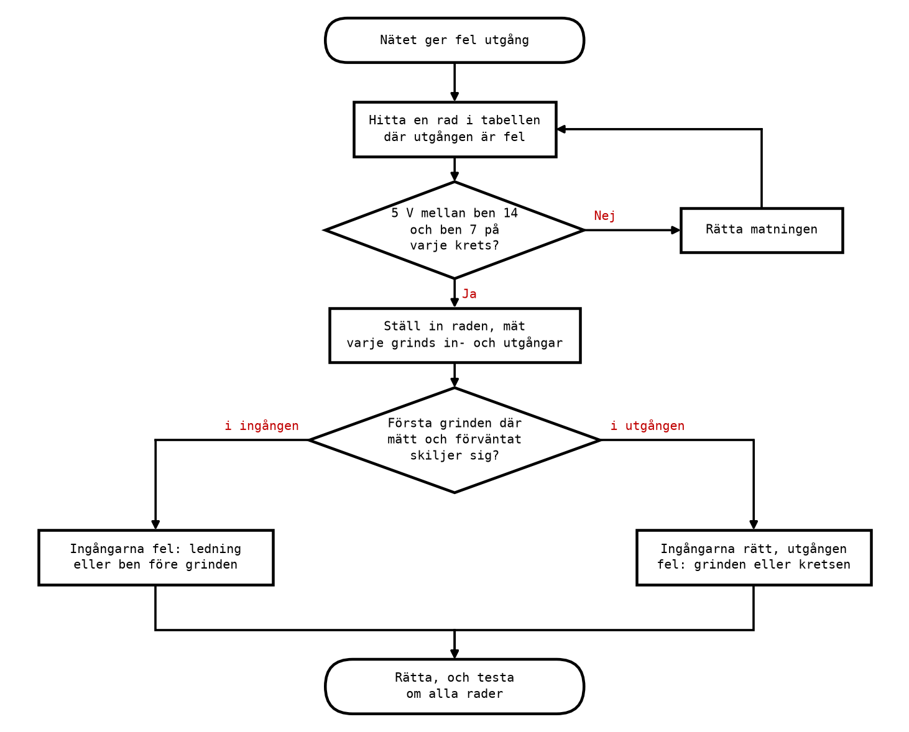
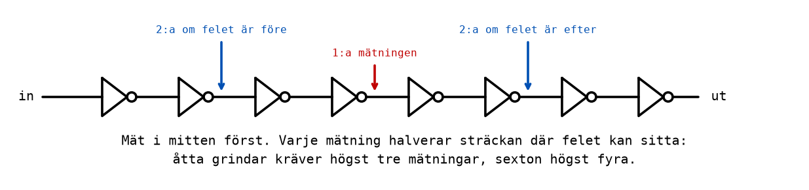

# Appendix A - Felsökning av grindnät

## A.1 Varför felsöka systematiskt
Förr eller senare kopplar du upp ett nät som inte gör vad det ska. Det är inget misslyckande, det
händer alla, och det är ingen slump heller: ett nät med tre kretsar och tjugo sladdar har tjugo
ställen där en sladd kan sitta i fel hål, och du behöver bara en.

Den vanligaste reaktionen är att börja flytta sladdar, trycka till kretsar och prova igen. Ibland
fungerar det, och då vet du inte varför, vilket betyder att felet kan komma tillbaka. Oftast gör det
saken värre, eftersom en ny felkoppling läggs till den gamla.

Det finns ett bättre sätt, och det bygger på samma idé som resten av kursen: **förutsäg, mät,
jämför**. Du vet vad varje ledning ska ha för värde för en viss kombination av ingångarna, eftersom
du har sanningstabellen och grindnätet. Mät vad den faktiskt har. Det första stället där mätt och
förväntat skiljer sig är felet, eller precis bredvid det.

Arbetsgången i en figur:

Resten av det här appendixet går igenom stegen ett i taget.

---

## A.2 Att mäta en logisk nivå
Allt du behöver är en **multimeter** inställd på likspänning (V med ett rakt streck, eller `DCV`),
med ett mätområde på 20 V om den inte väljer själv.

* Sätt den **svarta** mätsladden på **jord**, till exempel matningsskenan märkt `-`. Den får sitta
  kvar där hela tiden.
* Peka med den **röda** mätsladden på det ben eller den ledning du vill mäta.

Tolka värdet med logiknivåerna från
[L04 B.3](../../L04/appendix/b_integrated_circuits.md#b3-databladet):

| Mätt spänning | Betyder |
|---------------|---------|
| under 1,5 V | logisk **0** |
| över 3,5 V | logisk **1** |
| mellan 1,5 och 3,5 V | **fel**: ingen giltig nivå |

En giltig utgång ligger nästan alltid mycket nära 0 V eller 5 V: under 0,3 V när den är låg och
över 4 V när den är hög, även med en lysdiod ansluten. Ett värde mitt emellan betyder nästan alltid
något av tre saker:
* en **flytande ingång** (A.7), som kan visa vad som helst och ofta ändrar sig när du rör handen;
* **två utgångar** som är kopplade mot varandra, där den ena driver hög och den andra låg;
* en **krets utan matning**, där ingenting ligger på en bestämd nivå.

En lysdiod på utgången är en utmärkt indikator, men den visar bara slutresultatet. Multimetern
låter dig titta på varje ledning i nätet, och det är vad felsökning kräver.

---

## A.3 Börja med matningen
**Mät alltid matningen först**, på varje krets: röd mätsladd på ben 14, svart på ben 7. Du ska se
ungefär 5 V.

Det låter onödigt, och det är det inte. En krets utan matning ger inte ett tydligt fel; den ger
konstiga, halvt fungerande resultat, eftersom den kan få en del ström genom sina ingångar. Den
enskilt vanligaste orsaken till att ett nät "nästan" fungerar är en krets där ben 7 eller ben 14
sitter i fel kolumn, eller en matningsskena som är delad på mitten av kopplingsdäcket.

Mät mellan benen, inte mellan skenorna: det är spänningen **på kretsen** som räknas. En skena med
5 V hjälper inte om sladden till ben 14 sitter i kolumnen bredvid.

Om kretsen **blir varm**: bryt matningen direkt. En varm 74HC-krets är nästan alltid felvänd, eller
har en utgång som är kortsluten mot matningen eller mot en annan utgång.

---

## A.4 Följ signalen
När matningen är kontrollerad:

1. **Välj en rad i sanningstabellen där utgången blir fel**, och ställ in ingångarna på den. Använd
   inte vilken rad som helst; använd en rad där du vet att resultatet är fel.
2. **Skriv upp vad varje ledning i nätet ska ha för värde** för just den raden. Gå från ingångarna
   genom varje grind fram till utgången.
3. **Mät grind för grind**, i samma ordning: först ingångarna på den första grinden, sedan dess
   utgång, sedan nästa grind.
4. **Stanna vid den första grinden där mätt och förväntat skiljer sig.** Då finns två fall:
   * **En ingång är fel.** Felet sitter före grinden: i ledningen dit, i den föregående grindens
     utgång, eller i att sladden sitter i fel kolumn. Mät i andra änden av ledningen.
   * **Alla ingångar är rätt men utgången är fel.** Då är det grinden: fel ben (du mäter på en annan
     grind än du tror), fel krets (en 74HC32 där det skulle sitta en 74HC08), eller i sällsynta fall
     en trasig krets.

Kom ihåg att mäta **på kretsens ben**, inte bara på sladden du tror går dit. Poängen är att hitta
skillnaden mellan det du tror att du har kopplat och det du faktiskt har kopplat.

---

## A.5 Halvering
I ett nät med många grindar i rad går det snabbare att börja i mitten än i början:

Mät efter halva kedjan. Om värdet där är rätt sitter felet i den andra halvan, annars i den första.
Mät sedan i mitten av den halva som återstår, och så vidare. Varje mätning **halverar** området där
felet kan sitta, så åtta grindar kräver högst tre mätningar och sexton högst fyra, i stället för
sju respektive femton om du börjar från början och mäter efter varje grind.

I ett litet nät som i Labb 2, med tre eller fyra grindar, är det ingen stor vinst. Men metoden
gäller för allt som går att dela i två: en lång kabel, ett program, en maskin med många steg. Det är
den viktigaste felsökningsmetoden som finns, och den kommer tillbaka i mikrodatordelen, när ett
program ska felsökas i simulatorn.

---

## A.6 Läs felet ur sanningstabellen
Innan du mäter något alls kan tabellen berätta mycket. Jämför den uppmätta tabellen med den
förväntade, och titta på **vilka rader** som blir fel:

* **Utgången ändras aldrig**, den är alltid 0 eller alltid 1: utgången är inte kopplad till det du
  tror, kretsen saknar matning, eller lysdioden sitter fel.
* **Utgången är inverterad** på varje rad: en NAND där det skulle vara en AND, eller en lysdiod
  kopplad mot 5 V i stället för mot jord.
* **Utgången beror inte alls på en viss ingång**: den ingången når inte fram. Sladden sitter i fel
  kolumn, eller går till en oanvänd grind.
* **Bara några rader fel**, och de har något gemensamt: de pekar ut en grind. Om `X = AB + C` blir
  fel precis när `C = 0` och `A = B = 1`, är det AND-grindens bidrag som saknas, och den ska mätas
  först.

Det sista fallet är värt att öva på, för det sparar mest tid. Frågan att ställa är: **vilken del av
uttrycket är det enda som kan göra de här raderna 1?**

---

## A.7 Vanliga fel
De fel du med störst sannolikhet kommer att göra, och hur de ser ut:

| Symptom | Trolig orsak | Kontrollera |
|---------|--------------|-------------|
| Ingenting fungerar alls | Matningen saknas | Mät mellan ben 14 och ben 7 |
| Kretsen blir varm | Kretsen felvänd, eller en utgång kortsluten | Bryt matningen; kontrollera hacket och ben 1 |
| Utgången flimrar eller ändras när du rör handen | Flytande ingång | Mät alla ingångar, också på oanvända grindar |
| En ingång påverkar ingenting | Sladden i fel kolumn eller på fel grind | Mät på kretsens ben, inte på sladden |
| Mätt värde mellan 1,5 och 3,5 V | Flytande ingång eller två utgångar mot varandra | Följ ledningen, hitta vad som driver den |
| Lysdioden lyser aldrig, fast utgången är 5 V | Lysdioden felvänd | Långa benet mot utgången |
| 74HC02 fungerar inte alls | Kopplad som en 74HC00 | Benplaceringen: utgången först |
| Kretsen fungerar ibland | Glappkontakt, eller en flytande ingång | Tryck till sladdarna; mät igen |

---

## A.8 Ett felsökningsexempel
Ett par i Labb 2-1 har kopplat upp `X = AB + C` med en 74HC08 och en 74HC32. De går igenom
tabellen och får:

| A | B | C | X, förväntat | X, mätt |
|---|---|---|--------------|---------|
| 0 | 0 | 0 | 0 | 0 |
| 0 | 0 | 1 | 1 | 1 |
| 0 | 1 | 0 | 0 | 0 |
| 0 | 1 | 1 | 1 | 1 |
| 1 | 0 | 0 | 0 | 0 |
| 1 | 0 | 1 | 1 | 1 |
| 1 | 1 | 0 | 1 | **0** |
| 1 | 1 | 1 | 1 | 1 |

**Läs tabellen först (A.6).** Bara raden `110` är fel. Det är den enda raden där `X` ska bli 1 tack
vare `AB` och inte tack vare `C`. Så `C` når fram genom OR-grinden, men `AB` gör det inte.
Misstanken faller på AND-grinden eller ledningen från den.

**Matningen (A.3).** Ben 14 till ben 7 på båda kretsarna: 5,0 V. Den är inte felet.

**Följ signalen (A.4)**, för raden `ABC = 110`:

| Mätpunkt | Förväntat | Mätt |
|----------|-----------|------|
| U1 ben 1 (A) | 1 | 4,9 V: 1 |
| U1 ben 2 (B) | 1 | 4,9 V: 1 |
| U1 ben 3 (AB) | 1 | 4,8 V: 1 |
| U2 ben 1 (AB) | 1 | **0,0 V: 0** |
| U2 ben 2 (C) | 0 | 0,0 V: 0 |
| U2 ben 3 (X) | 1 | 0,0 V: 0 |

AND-grindens utgång är rätt, men OR-grindens ingång är fel. Felet sitter **i ledningen mellan
dem**. En titt på kopplingsdäcket visar att sladden från U1 ben 3 sitter i kolumnen **bredvid** U2
ben 1, i en tom kolumn. Den flyttas ett hål, och alla åtta raderna stämmer.

Lägg märke till vad paret **inte** gjorde: de bytte inte kretsen, och de kopplade inte om hela
nätet. Två minuter och sex mätningar pekade ut en enda sladd.

---

## A.9 Hur mycket en utgång orkar
Den spänning en utgång ger beror på hur mycket ström den levererar. Utan last ligger en hög
74HC-utgång mycket nära 5 V; med en lysdiod som drar 9 mA sjunker den en bit, eftersom
utgångstransistorerna har en viss inre resistans. Databladet lovar minst 3,84 V vid 4 mA och
matningen 4,5 V ([L04 B.3](../../L04/appendix/b_integrated_circuits.md#b3-databladet)), och i
praktiken ser du något i stil med 4,3-4,7 V med en lysdiod ansluten.

Det är därför förkopplingsmotståndet ska dimensioneras för några få milliampere. Ju mer ström en
utgång levererar, desto närmare det förbjudna området hamnar dess nivå, och desto mindre marginal
har nästa grind som läser den. Kontrolluppgiften i [Appendix B](./b_exercises.md) låter dig mäta
precis det.

---
