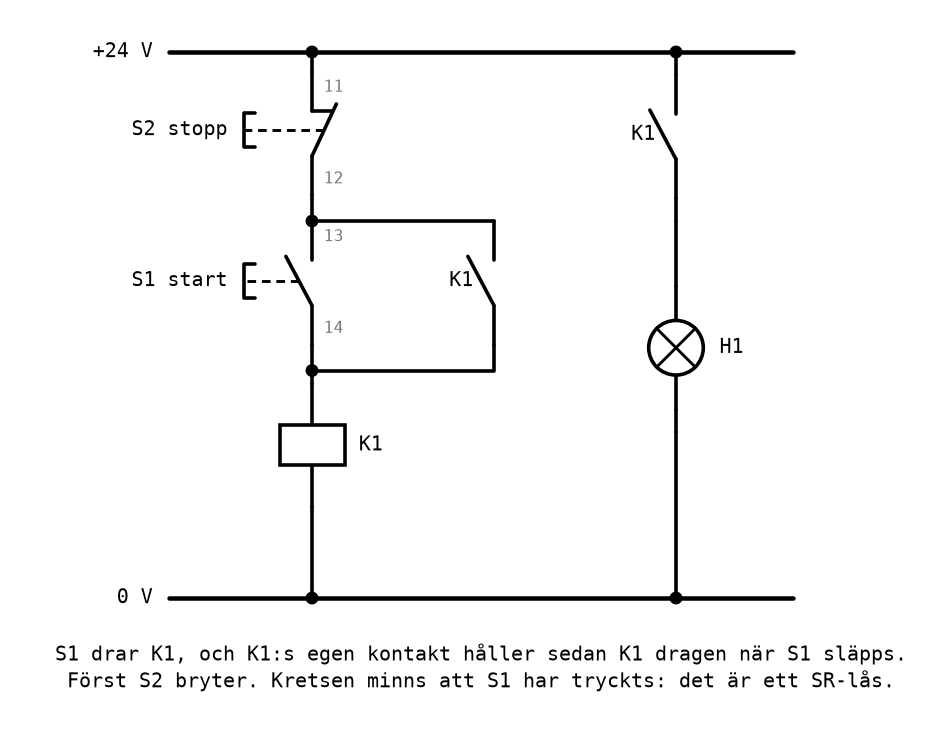
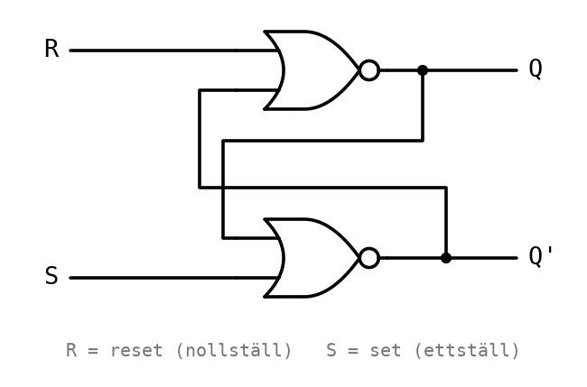
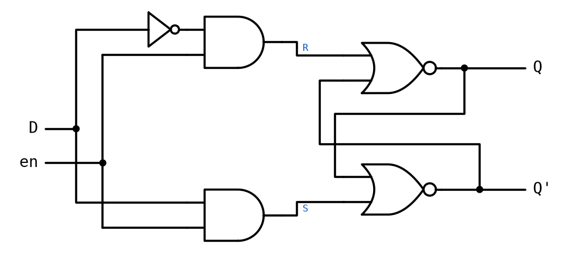
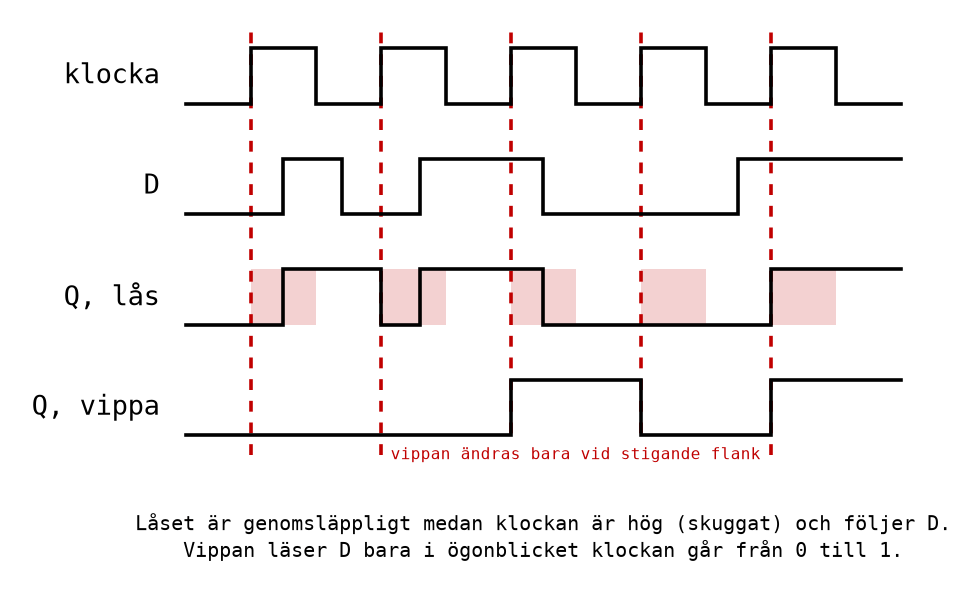
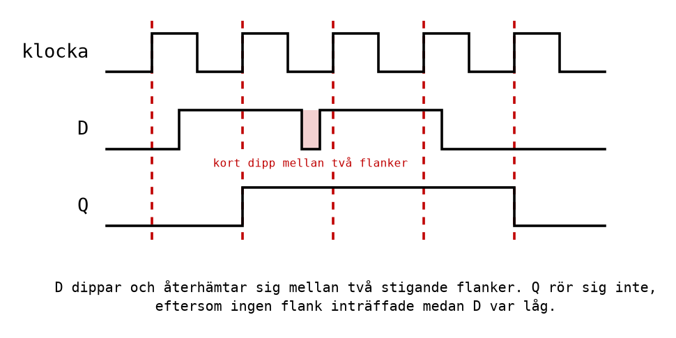
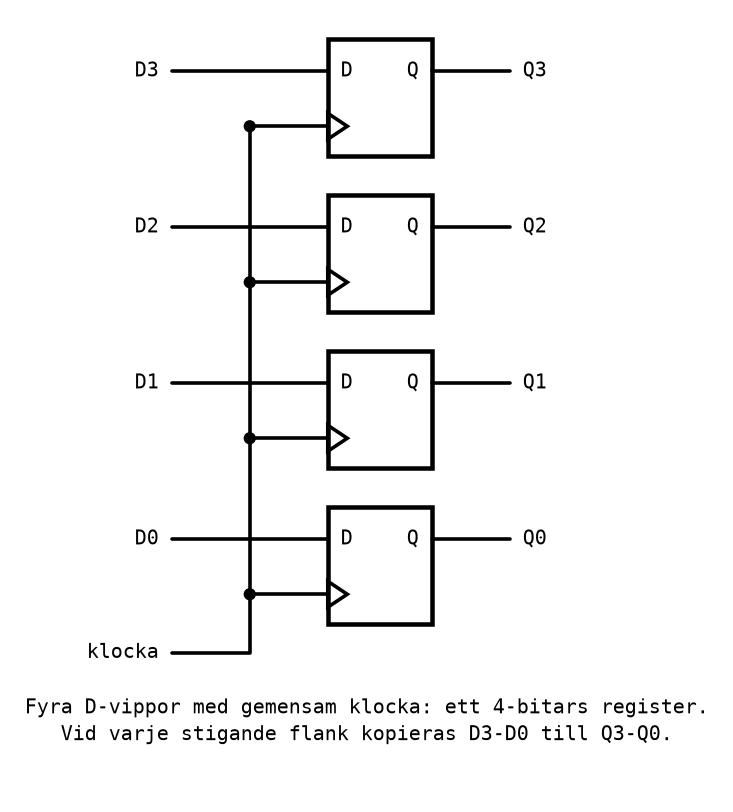
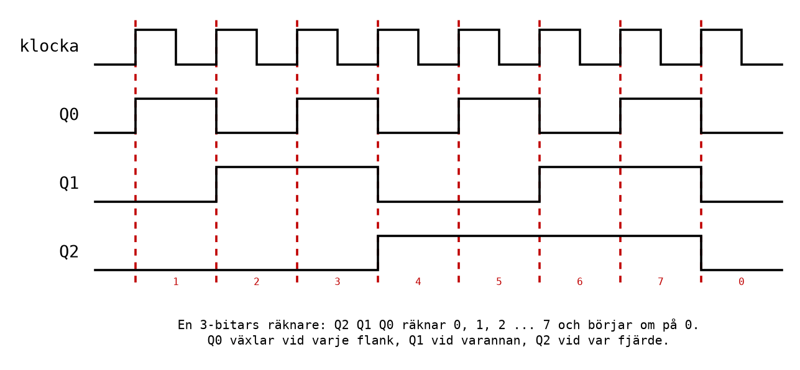
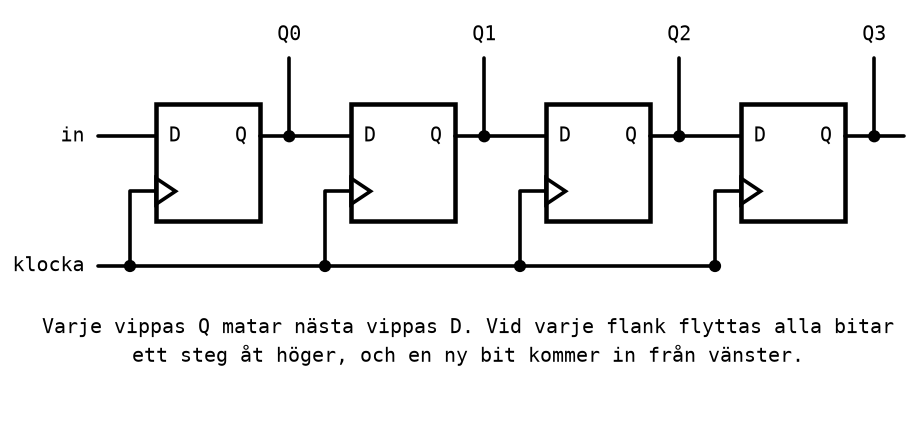

# Appendix A - Sekvensnät och vippor

## A.1 Från kombinatoriskt till sekventiellt
Alla nät hittills har varit **kombinatoriska**: utgången beror bara på ingångarnas värden just nu.
Samma ingångar ger alltid samma utgång, och nätet har ingen aning om vad som hände för en sekund
sedan. Bromsassistenten, majoritetskretsen och segmentavkodaren är alla sådana.

Många verkliga uppgifter kräver mer. Ett transportband som startas med en knapp och stoppas med en
annan måste **minnas** att startknappen har tryckts, även efter att den släppts. En räknare måste
minnas hur långt den räknat. Ett trafikljus måste minnas vilken färg som lyser, för att veta vilken
som kommer härnäst. En mikrodator måste minnas sitt program, sina variabler och vilken instruktion
den är på.

Ett nät som minns kallas ett **sekvensnät**: utgången beror på ingångarna **och** på vad som hänt
tidigare, alltså på ett lagrat **tillstånd**. Det här appendixet visar hur minne byggs av
vanliga grindar, och vad som byggs av minnet: register, räknare och skiftregister. Det är de
byggstenar som mikrodatorn i [Appendix B](./b_microcomputer.md) består av.

Sekvensnät ingår inte i kursplanens lärandemål för sin egen skull. De finns med för att
mikrodatorn annars blir en svart låda: dess register, programräknare och minnen är vippor.

---

## A.2 Minne genom återkoppling
Du har redan byggt ett sekvensnät, i [L02](../../L02/appendix/b_contact_networks.md): reläets
**självhållning**.



Tryck på start, `S1`, så får reläspolen `K1` ström och drar. Reläets egen kontakt `K1` sitter
parallellt med `S1`, så när `S1` släpps går strömmen i stället genom `K1`:s kontakt, och reläet
håller sig självt draget. Först när stopp, `S2`, trycks bryts strömmen, reläet släpper, och kretsen
är tillbaka i utgångsläget.

Samma knapptryckning, `S1` släppt och `S2` släppt, ger alltså olika resultat beroende på vad som
hänt innan: lampan lyser om start senast trycktes, och är släckt om stopp senast trycktes. Kretsen
minns.

Nyckeln är **återkopplingen**: reläets utgång, kontakten, är kopplad tillbaka till dess egen
ingång. Samma idé fungerar med grindar.

---

## A.3 SR-låset
Koppla två NOR-grindar så att varje grinds utgång matar den andra grindens ingång:



Det här är ett **SR-lås** (*SR latch*), den enklaste minnescellen som finns. Den har två ingångar:
* **S** (*set*, ettställ): gör `Q = 1`;
* **R** (*reset*, nollställ): gör `Q = 0`.

Utgången `Q'` är alltid inversen av `Q`, utom i ett fall (nedan).

| S | R | Q efteråt | Betydelse |
|---|---|-----------|-----------|
| 0 | 0 | samma som före | **minns** |
| 1 | 0 | 1 | ettställ |
| 0 | 1 | 0 | nollställ |
| 1 | 1 | ogiltigt | båda utgångarna 0 |

Följ signalerna en gång för att se varför det minns. Anta att `Q = 1`, så `Q' = 0`, och att
`S = R = 0`. Den övre grinden får `R = 0` och `Q' = 0`, och en NOR av två nollor är 1: `Q`
förblir 1. Den nedre grinden får `Q = 1` och `S = 0`, och en NOR med en etta in är 0: `Q'`
förblir 0. Tillståndet håller sig självt, precis som reläet. Ett kort tryck på `R` gör `Q = 0`,
och sedan håller sig det tillståndet lika bra.

Jämför med självhållningen: `S1` är **S**, `S2` är **R**, och reläet är låset. Skillnaden är fallet
`S = R = 1`. I reläkretsen vinner stopp, eftersom `S2` sitter i serie med allt; i NOR-låset blir
båda utgångarna 0, och vad som händer när båda släpps samtidigt går inte att förutsäga. Därför är
kombinationen förbjuden, och därför används SR-låset sällan direkt.

Bygg låset i [CircuitVerse](https://circuitverse.org/simulator) och prova: tryck `S`, släpp, tryck
`R`, släpp. Lägg märke till att utgången inte går att förutsäga från ingångarna ensamma. Du måste
veta vad som hände innan.

---

## A.4 D-låset
**D-låset** tar bort den förbjudna kombinationen. I stället för `S` och `R` har det en dataingång
`D`, värdet som ska lagras, och en ingång `en` (*enable*) som bestämmer när låset lyssnar:



De två AND-grindarna gör `S = D · en` och `R = D' · en`. När `en = 0` är både `S` och `R` noll, och
låset minns. När `en = 1` blir antingen `S` eller `R` en etta, beroende på `D`, men aldrig båda.

| en | Beteende |
|----|----------|
| 1 | **genomsläppligt**: `Q` följer `D` direkt |
| 0 | **låst**: `Q` behåller det värde det hade när `en` gick till 0 |

D-låset är **nivåkänsligt**: det släpper igenom allt som händer på `D` så länge `en` är 1. Det är
också dess svaghet. En störning på `D` medan `en = 1` går rakt igenom till `Q`, och i ett system med
tusentals minnesceller är det svårt att garantera att varje `D` är stabilt under hela den tid `en`
är 1.

---

## A.5 D-vippan och klockan
**D-vippan** (*D flip-flop*) löser problemet. Den lagrar också en bit, men den läser `D` bara i ett
enda **ögonblick**: när en **klocksignal** går från 0 till 1, den **stigande flanken**. Resten av
tiden, oavsett vad `D` gör, behåller `Q` sitt värde.

Invändigt är en D-vippa två D-lås i rad, där det ena är öppet när klockan är låg och det andra när
den är hög. Nettoeffekten är att bara värdet i själva ögonblicket när klockan stiger kommer igenom.

Kör ett lås och en vippa med samma klocka och samma `D`, så syns skillnaden:



Låset ändrar sig flera gånger, varje gång `D` ändras medan klockan är hög. Vippan ändrar sig bara
vid de stigande flankerna, och bara om `D` då har ett annat värde än det `Q` redan har. En störning
mellan två flanker syns inte alls:



**Klockan** är en fyrkantvåg som alla vippor i ett system delar. Två tal beskriver den: **perioden**
`T`, tiden för en hel svängning, och **frekvensen** `f = 1/T`. En Arduino Uno har en klocka på
**16 MHz**, sexton miljoner svängningar i sekunden, så perioden är

```math
T = \frac{1}{16\,000\,000\ \text{Hz}} = 62{,}5\ \text{ns}
```

Varje vippa i mikrodatorn uppdateras vid samma flank. Det gör att allt i datorn tar ett steg i
taget, i takt, och det är därför det går att säga att en instruktion tar ett bestämt, helt
antal **klockcykler**. Det talet kommer tillbaka i [L09](../../L09/README.md), där
tidsfördröjningar räknas ut i klockcykler.

I scheman ritas en D-vippa som en ruta med ingången `D`, utgången `Q` och en liten triangel vid
klockingången. Triangeln betyder "flanktriggad".

---

## A.6 Register
En vippa lagrar en bit. Ett **register** lagrar flera: det är N vippor sida vid sida, som delar
samma klocka.



Vid varje stigande flank kopieras alla ingångarna `D3`-`D0` till utgångarna `Q3`-`Q0` samtidigt, och
resten av tiden håller registret sitt värde.

Mikrodatorn i resten av kursen är full av register. De 32 **arbetsregistren** `r0`-`r31`, där
programmet räknar, är 8-bitars register: åtta vippor vardera. **Statusregistret** `SREG`, där
räkneenheten sparar sina flaggor, är ett register. Och **utporten** `PORTB`, som tänder lysdioderna
i Labb 3, är ett register vars utgångar är kopplade direkt till kretsens stift: skriv en etta i en
bit, så blir stiftet 5 V.

---

## A.7 Räknare
Koppla en vippa så att den **växlar** vid varje flank: `D` får inversen av `Q`. Då blir `Q` en
fyrkantvåg med halva klockans frekvens. Kedja flera sådana, så att varje vippa växlar när den
föregående går från 1 till 0, så får du en **räknare**:



Läs `Q2 Q1 Q0` som ett binärt tal efter varje flank: 001, 010, 011, 100 och så vidare upp till 111,
och sedan 000 igen. Tre vippor räknar till 7; `n` vippor räknar från 0 till `2^n - 1` och börjar
sedan om. Att räknaren slår om från 111 till 000 är ingen särskild logik; det är vad som händer när
den fjärde biten inte finns. Samma sak kallas **rundgång** i [L08](../../L08/README.md), när ett
8-bitars register räknar förbi 255.

Två saker att lägga märke till:
* **Varje bit har halva frekvensen av biten före.** `Q0` växlar vid varje flank, `Q1` vid varannan,
  `Q2` vid var fjärde. En räknare är alltså också en frekvensdelare.
* **Mikrodatorns programräknare är en räknare.** Den håller adressen till nästa instruktion och
  räknar upp ett steg för varje instruktion som hämtas ([Appendix B](./b_microcomputer.md)).

---

## A.8 Skiftregister
Koppla vipporna i en kedja, så att varje vippas `Q` matar nästa vippas `D`:



Vid varje flank tar varje vippa över värdet från vippan före, och den första tar in en ny bit.
Innehållet **flyttas**, skiftas, ett steg per klockflank. Det kallas ett **skiftregister**.

| Efter flank | `in` | Q0 | Q1 | Q2 | Q3 |
|-------------|------|----|----|----|----|
| start | | 0 | 0 | 0 | 0 |
| 1 | 1 | 1 | 0 | 0 | 0 |
| 2 | 0 | 0 | 1 | 0 | 0 |
| 3 | 0 | 0 | 0 | 1 | 0 |
| 4 | 0 | 0 | 0 | 0 | 1 |

En enda etta vandrar genom registret, som ett rinnande ljus. Skiftregister används för att skicka
data en bit i taget över en ledning (seriell överföring), och de har en direkt motsvarighet i
mikrodatorn: instruktionen `lsl` flyttar alla bitar i ett register ett steg åt vänster, vilket är
samma sak som att multiplicera med 2. Den kommer i [L08](../../L08/README.md). Att figuren flyttar
åt höger är bara ritsättet: skrivs innehållet som ett binärt tal, `Q3 Q2 Q1 Q0`, flyttas varje bit
till en mer signifikant plats, alltså åt vänster i talet, precis som med `lsl`.

---
