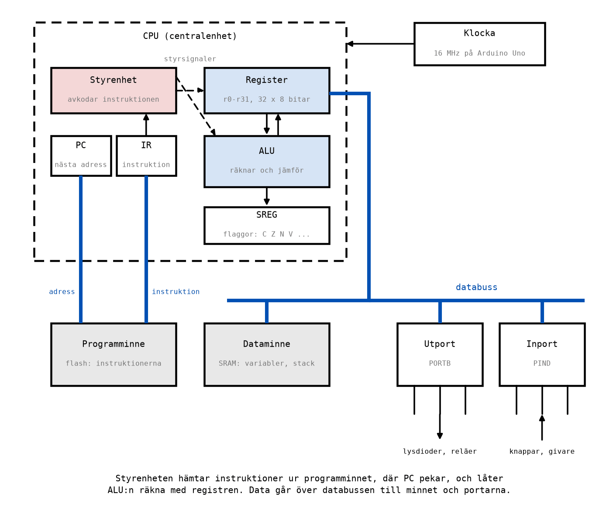
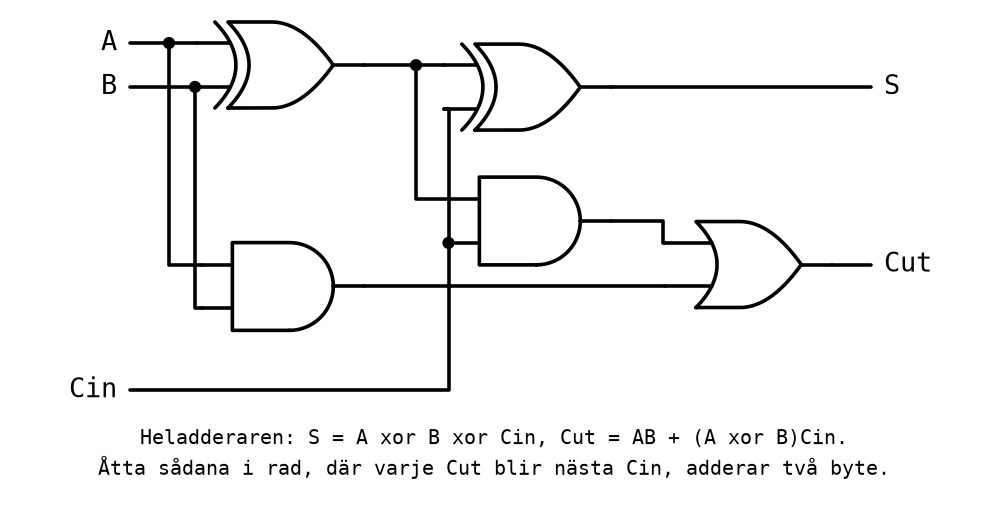
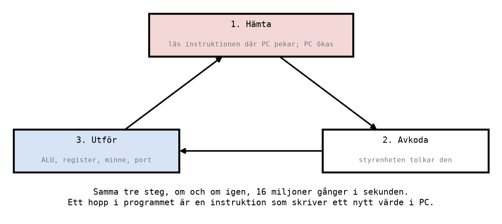
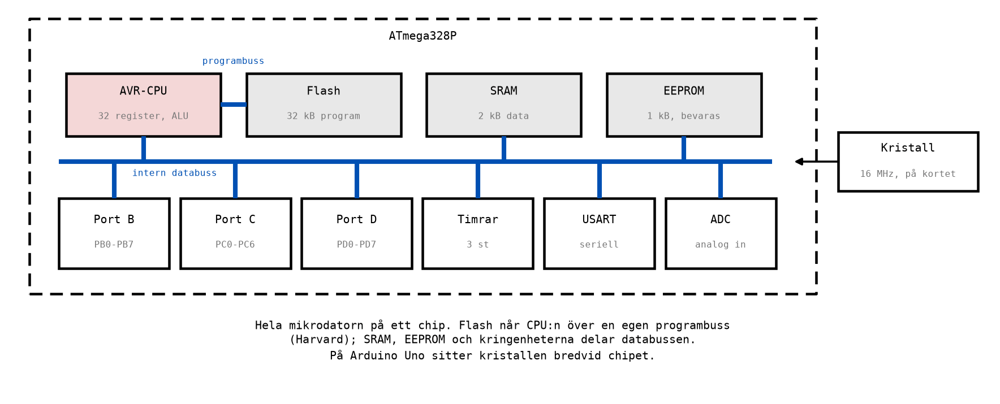

# Appendix B - Mikrodatorns uppbyggnad

## B.1 Vad en mikrodator är
En **dator** är en maskin som utför en lista av instruktioner, ett **program**, och som kan läsa
och skriva data medan den gör det. Den består av en centralenhet som utför instruktionerna, minne
som håller programmet och datat, och in- och utenheter som förbinder den med omvärlden.

En **mikrodator** är en dator där allt detta sitter i en eller några få kretsar. När hela datorn,
centralenhet, minnen och portar, sitter på **ett enda chip** kallas kretsen en **mikrokontroller**.
Den ATmega328P som sitter på ett Arduino Uno-kort, och som du programmerar från
[L07](../../L07/README.md), är en mikrokontroller.

Mikrokontroller finns överallt där något ska styras: i tvättmaskiner, kaffebryggare, bilar, hissar,
fjärrkontroller och industrirobotar. En modern bil har hundratals. De kallas **inbyggda system**,
eftersom datorn är inbyggd i en produkt och sällan syns. Till skillnad från en persondator kör en
mikrokontroller oftast ett enda program, från det att strömmen slås på tills den slås av, och
programmet handlar om att läsa givare och styra saker: det som kursplanen kallar **styrobjekt**.

---

## B.2 Blockschemat
Alla datorer, från den minsta mikrokontroller till en server, är uppbyggda av samma block:

| Block | Uppgift |
|-------|---------|
| **CPU** (centralenhet) | Hämtar instruktioner och utför dem. Består av styrenhet, register och ALU. |
| **Styrenhet** | Tolkar (avkodar) varje instruktion och styr de andra blocken så att den utförs. |
| **Programräknare, PC** | Håller adressen till nästa instruktion. |
| **Instruktionsregister, IR** | Håller den instruktion som utförs just nu. |
| **Register** | Snabba lagringsplatser inuti CPU:n, där räkningarna görs. |
| **ALU** | Aritmetisk-logisk enhet: adderar, subtraherar, jämför och gör logiska operationer. |
| **SREG** | Statusregistret: flaggor som beskriver resultatet av den senaste räkningen. |
| **Programminne** | Håller programmet, instruktion för instruktion. |
| **Dataminne** | Håller variabler och annat data medan programmet kör. |
| **In- och utportar** | Förbinder datorn med omvärlden: knappar och givare in, lysdioder och reläer ut. |
| **Bussar** | Ledningarna mellan blocken, som adresser och data går på. |
| **Klocka** | Ger takten som alla vippor i datorn uppdateras i. |

Resten av det här appendixet går igenom blocken ett i taget, och slutar med hur de ser ut i
ATmega328P.

---

## B.3 CPU:n: ALU, register och styrenhet
**Registren** är små, snabba minnen inuti CPU:n. I ATmega328P finns 32 stycken, `r0` till `r31`,
med 8 bitar vardera: varje register är åtta D-vippor med gemensam klocka
([A.6](./a_sequential_logic.md#a6-register)). All räkning sker i registren. Ett tal i dataminnet
måste först hämtas in i ett register innan något kan göras med det.

**ALU:n**, den aritmetisk-logiska enheten, är det enda ställe i datorn där något faktiskt räknas.
Den tar ett eller två tal från registren, utför en operation och lämnar resultatet i ett register.
Den är ett stort **kombinatoriskt nät**: samma sorts nät som i L02 och L04, bara större. Kärnan i
den är en **adderare**, byggd av heladderare
([L04 A.8](../../L04/appendix/a_karnaugh_maps.md#a8-nät-med-flera-utgångar)):

En heladderare adderar tre bitar: två siffror och minnessiffran från positionen till höger. Åtta
heladderare i rad, där varje `Cut` blir nästa positions `Cin`, adderar två 8-bitars tal, precis som
när du adderar två binära tal för hand i [L01](../../L01/appendix/a_number_systems.md). Den sista
minnessiffran, den som inte får plats i 8 bitar, är **carry-flaggan**.

**Statusregistret, SREG**, är ett register där ALU:n sparar information om resultatet: blev det
noll, blev det en minnessiffra över, blev det negativt? De här bitarna kallas **flaggor**.
Programmet använder dem för att fatta beslut, "hoppa om resultatet blev noll", vilket är
[L08](../../L08/README.md) och [L09](../../L09/README.md):s ämne.

**Styrenheten** läser instruktionen, avgör vad den betyder, och skickar **styrsignaler** till de
andra blocken: vilka register ALU:n ska läsa, vilken operation den ska göra, vart resultatet ska.
Den är i grunden ett sekvensnät, som stegar sig igenom varje instruktion.

---

## B.4 Programräknaren och instruktionscykeln
Ett program är en lista av instruktioner i programminnet, en efter en, var och en på sin adress.
**Programräknaren**, PC (*program counter*), håller adressen till den instruktion som står på tur.
Den är en räknare ([A.7](./a_sequential_logic.md#a7-räknare)), och det är den som gör att datorn går
framåt i programmet.

Allt en CPU gör är att upprepa samma tre steg, **instruktionscykeln**:

1. **Hämta** (*fetch*): läs instruktionen på den adress PC pekar på, lägg den i
   instruktionsregistret, och räkna upp PC så att den pekar på nästa instruktion.
2. **Avkoda** (*decode*): styrenheten tolkar bitarna i instruktionen. Vilken operation? Vilka
   register?
3. **Utför** (*execute*): ALU:n räknar, ett register skrivs, eller data flyttas till eller från
   minnet eller en port.

Sedan börjar det om, med nästa instruktion. Ett litet exempel, tre instruktioner i programminnet:

| Adress | Instruktion | Betyder |
|--------|-------------|---------|
| 0 | `ldi r16, 5` | lägg talet 5 i register r16 |
| 1 | `inc r16` | öka r16 med 1 |
| 2 | `rjmp 1` | hoppa till adress 1 |

| Steg | PC före | Hämtas | Utförs | r16 efter | PC efter |
|------|---------|--------|--------|-----------|----------|
| 1 | 0 | `ldi r16, 5` | r16 = 5 | 5 | 1 |
| 2 | 1 | `inc r16` | r16 = r16 + 1 | 6 | 2 |
| 3 | 2 | `rjmp 1` | PC = 1 | 6 | 1 |
| 4 | 1 | `inc r16` | r16 = r16 + 1 | 7 | 2 |
| 5 | 2 | `rjmp 1` | PC = 1 | 7 | 1 |

Lägg märke till steg 3. Ett **hopp** är ingenting annat än en instruktion som skriver ett nytt värde
i programräknaren. Normalt räknar PC uppåt ett steg i taget; ett hopp låter programmet gå tillbaka
och upprepa något, eller hoppa över något. Alla loopar och alla beslut i ett program är byggda på
det, och det är vad [L09](../../L09/README.md) handlar om.

På ATmega328P tar de flesta instruktioner **en klockcykel**: hämtningen av nästa instruktion sker
samtidigt som den förra utförs. Vid 16 MHz blir det upp till sexton miljoner instruktioner i
sekunden.

---

## B.5 Minnen: programminne, dataminne och EEPROM
En mikrodator har flera sorters minne, för olika ändamål:

| Minne | Håller | Bevaras utan ström? | I ATmega328P |
|-------|--------|---------------------|--------------|
| **Programminne** (flash) | programmet | ja | 32 kB |
| **Dataminne** (SRAM) | variabler och stacken | nej | 2 kB |
| **EEPROM** | inställningar som ska sparas | ja | 1 kB |

**Flashminnet** håller programmet. Det skrivs när du programmerar kretsen, i
[L11](../../L11/README.md), och finns kvar när strömmen slås av, så att programmet startar igen
nästa gång. Det kan skrivas om ungefär tiotusen gånger, vilket räcker gott för utveckling men inte
för data som ändras hela tiden.

**SRAM** (*static RAM*) är dataminnet: variabler, mellanresultat och **stacken**, där datorn sparar
returadresser när den anropar en subrutin ([L10](../../L10/README.md)). Det är snabbt och kan
skrivas hur många gånger som helst, men innehållet försvinner när strömmen bryts. Varje bit i ett
SRAM är i princip ett lås.

**EEPROM** bevarar sitt innehåll utan ström, som flashminnet, men kan skrivas en byte i taget. Det
används till sådant som ska överleva ett strömavbrott: en kalibrering, en inställning, en räknare av
driftstimmar. Kursen använder det inte.

Lägg märke till att programminnet och dataminnet är **separata** minnen med var sin buss. Det kallas
en **Harvardarkitektur**, och det betyder att CPU:n kan hämta nästa instruktion samtidigt som den
läser eller skriver data. De flesta persondatorer har i stället program och data i samma minne, en
**von Neumann-arkitektur**. För dig som programmerar betyder skillnaden att ett tal i programminnet
och ett tal i dataminnet ligger på olika ställen och nås med olika instruktioner, vilket du märker i
[L07](../../L07/README.md).

---

## B.6 Bussar
Blocken är förbundna med **bussar**: grupper av ledningar som bär ett tal i taget, en bit per
ledning.

* **Adressbussen** säger **var**: vilken minnesplats eller vilket register som ska läsas eller
  skrivas. Med `n` ledningar kan den peka ut `2^n` olika adresser. Programminnet i ATmega328P har
  16 384 instruktionsplatser, och 214 = 16 384, så programräknaren behöver 14 bitar.
* **Databussen** bär **vad**: själva värdet som läses eller skrivs. I en 8-bitars dator som
  ATmega328P är den 8 bitar bred, och det är därför den kallas 8-bitars: den hanterar en byte i
  taget.
* **Styrsignalerna** säger **hur**: läs eller skriv, och när.

En buss är ingen ny sorts komponent. Den är ledningar, och i en mikrokontroller sitter de inuti
chipet. Men begreppet förklarar mycket: allt som ska flyttas mellan två block går över en buss, en
sak i taget, och det är därför en instruktion som flyttar data mellan minnet och ett register ibland
tar två klockcykler i stället för en.

---

## B.7 In- och utportar
En dator som inte kan påverka något eller känna av något är ganska meningslös för den som ska styra
en maskin. **Portarna** är förbindelsen med omvärlden.

En **utport** är ett register vars utgångar är kopplade till kretsens **stift**. Skriver programmet
en etta i en bit, blir motsvarande stift 5 V; skriver det en nolla, blir stiftet 0 V. Koppla en
lysdiod med ett förkopplingsmotstånd till stiftet, precis som till en grindutgång i Labb 2, så styr
programmet lysdioden. Koppla ett relä via en transistor, så styr programmet en lampa på 24 V eller
en motor.

En **inport** är motsatsen: ett sätt för programmet att läsa av spänningen på ett antal stift, som
ettor och nollor. En knapp, en gränslägesbrytare eller en nivågivare blir då en bit som programmet
kan fatta beslut utifrån.

I ATmega328P kan varje stift vara antingen in- eller utgång, och det väljer programmet själv. Tre
register per port styr det: `DDRx` (riktningen), `PORTx` (vad en utgång ska ge) och `PINx` (vad en
ingång läser). Hur de används är [L08](../../L08/README.md) och [L10](../../L10/README.md):s ämne.

---

## B.8 Klockan
Allt i mikrodatorn går i takt med **klockan**, samma sorts fyrkantvåg som styr vipporna i
[A.5](./a_sequential_logic.md#a5-d-vippan-och-klockan). Vid varje stigande flank tar varje register,
programräknaren och styrenheten ett steg.

På ett Arduino Uno-kort kommer klockan från en **keramisk resonator** på 16 MHz bredvid chipet.
Det ger:

| Storhet | Värde |
|---------|-------|
| Klockfrekvens | 16 MHz = 16 000 000 perioder per sekund |
| En klockcykel | 1 / 16 000 000 s = 62,5 ns |
| Instruktioner per sekund | upp till 16 miljoner (de flesta tar en cykel) |

Att varje instruktion tar ett känt antal klockcykler gör att du kan räkna ut exakt hur lång tid en
del av ett program tar. Det är så en tidsfördröjning byggs, utan någon klocka på väggen: låt
datorn räkna ett visst antal varv, och räkna ut hur många cykler det blir. Det gör du i
[L09](../../L09/README.md).

---

## B.9 ATmega328P och Arduino Uno
Mikrokontrollern i resten av kursen är **ATmega328P** från Microchip, samma krets som sitter på ett
**Arduino Uno**-kort. Den är en 8-bitars mikrokontroller i familjen **AVR**.

| Egenskap | ATmega328P |
|----------|------------|
| Arkitektur | 8-bitars AVR, Harvard |
| Arbetsregister | 32 st, `r0`-`r31`, 8 bitar vardera |
| Programminne (flash) | 32 kB, varav en liten del upptas av Arduinos bootloader |
| Dataminne (SRAM) | 2 kB |
| EEPROM | 1 kB |
| Klocka på Arduino Uno | 16 MHz (keramisk resonator) |
| Portar | B, C och D; 23 stift som kan vara in- eller utgångar |
| Kringenheter | tre timrar, seriekommunikation (USART), analog-till-digital-omvandlare (ADC) |
| Matning | 5 V på Arduino Uno |

Blocken från B.2 finns alla där. CPU:n med sina 32 register, sin ALU och sitt SREG är kärnan.
Flashminnet håller programmet, SRAM variablerna. Portarna B, C och D är utportar och inportar, och
kortets numrerade stift (0-13, A0-A5) är kopplade till dem. Därtill kommer **kringenheter**, egna
små hårdvarublock för sådant som är vanligt i styrning: timrar som räknar tid, en seriekanal för att
prata med en dator, och en omvandlare som mäter analoga spänningar. Kursen använder portarna; resten
får vänta till en fortsättningskurs.

Två saker är värda att veta innan du börjar programmera:
* Arduino-kortets stiftnummer är **kortets** numrering, inte kretsens. Stift 13 på kortet, där den
  inbyggda lysdioden sitter, är bit 5 i port B, `PB5`. Kopplingen mellan dem kommer i
  [L08](../../L08/README.md).
* Kursen programmerar kretsen direkt i **assembler**, utan Arduinos egna programbibliotek. Varje
  instruktion du skriver blir en instruktion i flashminnet, och du ser exakt vad CPU:n gör.

---

## B.10 Från grind till dator
Varje block i mikrodatorn går tillbaka till något du redan har byggt:

| Block | Byggt av | Där du mötte det |
|-------|----------|------------------|
| ALU | kombinatoriska nät: adderare, AND, OR, XOR | L02, L04 |
| Heladderare | XOR, AND, OR | L04 A.8 |
| Register | D-vippor med gemensam klocka | A.6 |
| Programräknare | en räknare av vippor | A.7 |
| Instruktionsregister | ett register | A.6 |
| Statusregistret | ett register, en vippa per flagga | A.6 |
| Dataminne (SRAM) | tusentals lås, och avkodare som väljer ut rätt byte | A.4, L04 |
| Utport | ett register kopplat till stiften | A.6 |
| Adressavkodning | kombinatoriska nät som väljer en adress | L04 |
| Styrenhet | ett sekvensnät | A.1 |

Ingenting i en dator är magiskt. Den är grindar och vippor, i stora mängder, i takt med en klocka.
Det du lär dig i resten av kursen är hur man styr dem med ett program.

---
