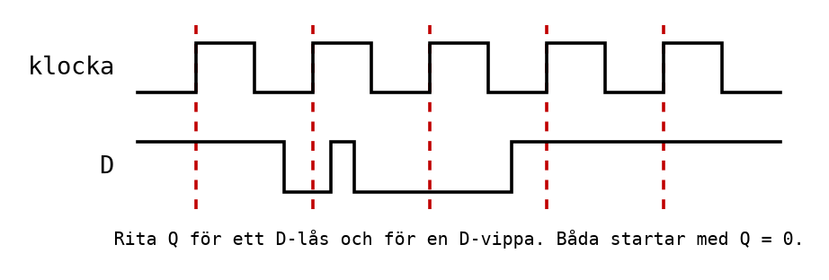

# Appendix C - Övningar

> **Så kontrollerar du ditt arbete.** Ett sekvensnät kan inte kontrolleras rad för rad i en
> sanningstabell, eftersom samma ingångar kan ge olika utgång beroende på vad som hänt innan. Gå i
> stället igenom en **följd** av ingångar, ett steg i taget, och skriv upp tillståndet efter varje
> steg. I CircuitVerse gör du samma sak: ändra en ingång, titta på utgången, anteckna, nästa.
>
> Kontrolluppgiften är övning 4. Lösningsförslagen finns i [Appendix D](./d_solutions.md).

Varje övning är märkt med sin sort.

---

## 1. Kombinatoriskt eller sekventiellt?
**Förståelse.**

Avgör för var och en av kretsarna nedan om den är kombinatorisk eller sekventiell, och motivera med
en mening.

**a)** Tankens larm i L04, som går när minst två av tre givare ger 1.

**b)** Start- och stoppkretsen med självhållning i L02.

**c)** En avkodare som tänder rätt segment i en sifferdisplay för en BCD-siffra.

**d)** Ett trafikljus som växlar mellan rött, gult och grönt.

**e)** Ett kodlås som öppnar när siffrorna 3, 7 och 1 har tryckts i den ordningen.

**f)** Bromsassistenten i L02.

---

## 2. SR-låset
**Räkna för hand.**

Ett SR-lås av två NOR-grindar ([A.3](./a_sequential_logic.md#a3-sr-låset)) börjar med `Q = 0`.
Ingångarna ändras i den här ordningen. Fyll i `Q` efter varje steg.

| Steg | S | R | Q |
|------|---|---|---|
| start | 0 | 0 | 0 |
| 1 | 1 | 0 | |
| 2 | 0 | 0 | |
| 3 | 0 | 0 | |
| 4 | 0 | 1 | |
| 5 | 0 | 0 | |
| 6 | 1 | 0 | |
| 7 | 0 | 0 | |

**a)** Fyll i tabellen.

**b)** Steg 2, 3, 5 och 7 har samma ingångar. Har de samma `Q`? Varför är det här skälet till att
nätet kallas sekventiellt?

**c)** Varför är kombinationen `S = R = 1` förbjuden i ett SR-lås av NOR-grindar?

---

## 3. Lås och vippa
**Räkna för hand.**

Ett D-lås och en D-vippa får samma klocka och samma `D`. Låset är genomsläppligt medan klockan är
hög; vippan läser `D` vid varje stigande flank. Båda börjar med `Q = 0`.

**a)** Rita `Q` för låset.

**b)** Rita `Q` för vippan.

**c)** `D` har en kort puls mellan den andra och den tredje stigande flanken. Syns den på låsets
utgång? På vippans? Förklara.

---

## 4. Kontroll: bygg ett SR-lås
**Kontroll.** *Förutsäg, bygg i CircuitVerse, jämför.*

**a) Förutsäg.** Använd din tabell från övning 2.

**b) Bygg** SR-låset av två NOR-grindar i [CircuitVerse](https://circuitverse.org/simulator), med
två ingångar `S` och `R` och två utgångar `Q` och `Q'`, korskopplade som i
[A.3](./a_sequential_logic.md#a3-sr-låset).

**c) Kör följden** från övning 2, ett steg i taget. Anteckna `Q` och `Q'` efter varje steg, och
jämför med din förutsägelse.

**d)** När du precis har byggt kretsen, innan du tryckt på något, vad visar `Q`? Är det samma sak
varje gång du bygger om den? Vad säger det om ett minne som slås på?

**e)** Ställ in `S = R = 1` och sedan båda till 0 samtidigt. Vad händer, och stämmer det med vad
[A.3](./a_sequential_logic.md#a3-sr-låset) säger?

---

## 5. Klockan
**Räkna för hand.**

**a)** En Arduino Uno har klockfrekvensen 16 MHz. Hur lång är en klockcykel?

**b)** Hur många klockcykler går det på en millisekund? På en sekund?

**c)** Ett program utför 1000 instruktioner som tar en klockcykel var. Hur lång tid tar det?

**d)** Samma program på en krets som går på 8 MHz. Hur lång tid då?

---

## 6. Räknare
**Räkna för hand.**

**a)** En 3-bitars räknare står på `000`. Vad står den på efter 11 stigande klockflanker?

**b)** Hur många vippor behövs för en räknare som ska kunna räkna från 0 till 999?

**c)** En 4-bitars räknare får en klocka på 16 Hz. Med vilken frekvens växlar den mest signifikanta
biten, `Q3`?

**d)** Ett 8-bitars register står på 255, och räknas upp ett steg. Vad står det på efter? Varför?

---

## 7. Skiftregister
**Räkna för hand.**

Ett 4-bitars skiftregister som i [A.8](./a_sequential_logic.md#a8-skiftregister) börjar med
`Q0 Q1 Q2 Q3 = 0000`.

**a)** Bitarna 1, 1, 0 och 1 skickas in på `in`, en per klockflank. Skriv upp `Q0`-`Q3` efter varje
flank.

**b)** Läs `Q3 Q2 Q1 Q0` som ett binärt tal. Registret innehåller `0011` (talet 3), och ett steg
till skiftas in med `in = 0`. Vilket tal står det nu? Vilken räkneoperation motsvarar ett steg?

---

## 8. Blockschemat
**Förståelse.**

Vilket block i mikrodatorn ([B.2](./b_microcomputer.md#b2-blockschemat)) beskrivs?

**a)** Håller adressen till nästa instruktion.

**b)** Adderar två tal, eller jämför dem.

**c)** Håller programmet, även när strömmen är avslagen.

**d)** Talar om att det senaste resultatet blev noll.

**e)** Tolkar instruktionen och talar om för de andra blocken vad de ska göra.

**f)** Ett register vars bitar är kopplade till kretsens stift.

**g)** Håller variablerna medan programmet kör.

**h)** Ger takten som alla vippor uppdateras i.

---

## 9. Instruktionscykeln
**Räkna för hand.**

Programminnet innehåller:

| Adress | Instruktion | Betyder |
|--------|-------------|---------|
| 0 | `ldi r16, 10` | lägg 10 i r16 |
| 1 | `ldi r17, 20` | lägg 20 i r17 |
| 2 | `add r16, r17` | r16 = r16 + r17 |
| 3 | `rjmp 3` | hoppa till adress 3 |

**a)** Fyll i en tabell som den i
[B.4](./b_microcomputer.md#b4-programräknaren-och-instruktionscykeln) för de sex första
instruktionerna som utförs: PC före, instruktionen, vad som händer, r16 och r17 efter, PC efter.

**b)** Vad gör programmet efter steg 4, och hur länge? Varför behövs en sådan instruktion sist i ett
program för en mikrokontroller?

---

## 10. Tre minnen
**Förståelse.**

**a)** I vilket av ATmega328P:s tre minnen hamnar: programmet; en variabel som räknar hur många
gånger en knapp tryckts; ett kalibreringsvärde som ska finnas kvar efter ett strömavbrott?

**b)** Varför finns programmet kvar när strömmen slås av, men inte variablerna?

**c)** Vad betyder det att ATmega328P har en Harvardarkitektur?

---

## 11. Bussar och minnesstorlek
**Räkna för hand.**

**a)** ATmega328P har 2 kB SRAM, alltså 2048 byte. Hur många adressbitar behövs för att peka ut
varje byte?

**b)** Flashminnet är 32 kB och varje instruktion är 16 bitar (2 byte). Hur många instruktioner ryms
som mest, och hur många bitar behöver programräknaren?

**c)** Hur många olika värden kan databussen i en 8-bitars dator bära?

---

## 12. Självhållning och SR-lås
**Konstruktion.** *(fördjupning)*

Titta på självhållningskretsen i [A.2](./a_sequential_logic.md#a2-minne-genom-återkoppling).

**a)** Vilken knapp motsvarar SR-låsets `S`, och vilken `R`?

**b)** Vad händer i reläkretsen om båda knapparna trycks samtidigt? Jämför med SR-låset av
NOR-grindar.

**c)** I en del maskiner är det tvärtom önskvärt att start vinner om båda trycks, kallat
**tillslagsdominerande** självhållning. Rita om kretsen så att `S1` alltid kan dra `K1`, även när
`S2` är nedtryckt. Varför är den varianten sällsynt för maskiner där stopp är en säkerhetsfunktion?

---
