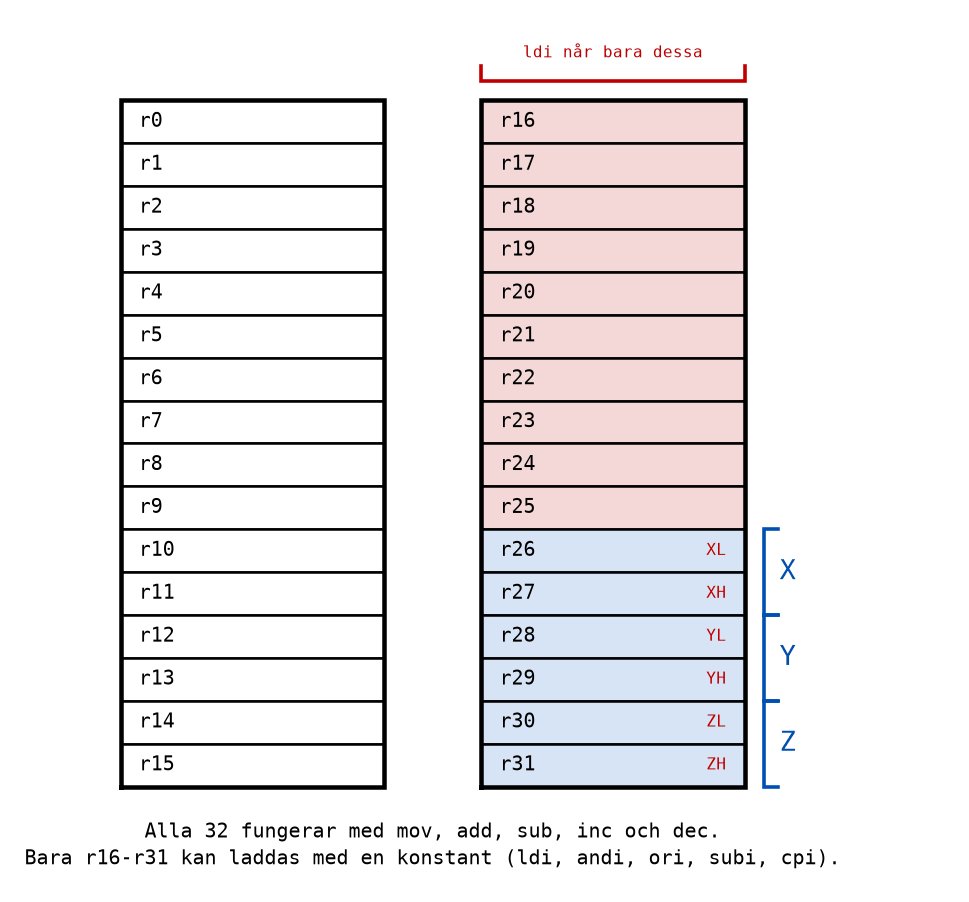
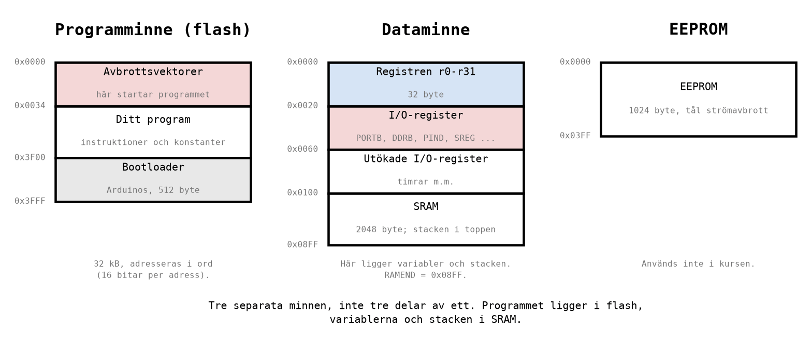
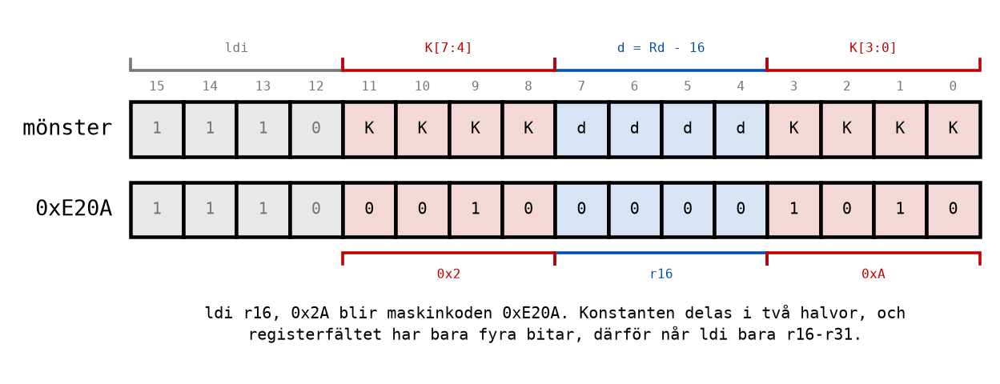

# Appendix A - Mikrodatorn ATmega328P

## A.1 Från blockschema till en verklig krets
I [L06](../../L06/README.md) byggdes mikrodatorn upp på blockschemanivå: en CPU med ALU,
register och styrenhet, ett programminne, ett dataminne, in- och utportar, och en klocka som
driver alltihop. Från och med nu arbetar vi med en verklig sådan krets: **ATmega328P**, som sitter
på ett Arduino Uno-kort.

ATmega328P är en **mikrokontroller**: en hel mikrodator på ett enda chip. Allt i L06:s blockschema
finns inuti den:

| Del | I ATmega328P |
|-----|--------------|
| CPU | En 8-bitars processor av typen AVR. Den räknar med 8 bitar, en byte, i taget. |
| Register | 32 st, `r0`-`r31`, med 8 bitar vardera. |
| Programminne | 32 kB flashminne. Programmet ligger kvar när strömmen bryts. |
| Dataminne | 2 kB SRAM, 2048 byte. Innehållet försvinner när strömmen bryts. |
| In- och utportar | Port B, C och D, som styr kretsens stift. |
| Klocka | 16 MHz på ett Arduino Uno-kort: 16 miljoner klockcykler i sekunden. |

Det finns inget operativsystem, inga fönster och ingen skärm. När kretsen får ström börjar den
köra det program som ligger i programminnet, instruktion för instruktion, och det fortsätter den
med så länge strömmen är på. Det är **ditt** program, och ingenting annat.

Två egenskaper hos maskinen är värda att känna till från början, eftersom de styr hur alla program
i kursen ser ut:

**All räkning sker i registren.** Det finns ingen instruktion som adderar två byte i minnet med
varandra. Värdena hämtas till register, räknas där, och resultatet lämnas i ett register. Det är
därför kursens program handlar så mycket om `r16`, `r17` och deras grannar.

**Program och data ligger i olika minnen.** Programmet ligger i flashminnet och variablerna i
SRAM, och de två är skilda minnen med egna adresser (A.5). Den uppdelningen kallas
**Harvardarkitektur**, och den känns igen från L06.

---

## A.2 Registren
Registren är processorns arbetsbänk: 32 st, vart och ett med plats för en byte, och med namnen
`r0`-`r31`. Allt processorn räknar på passerar genom dem.



De flesta instruktioner fungerar med vilket register som helst. Men en viktig grupp gör det inte:
**bara `r16`-`r31` kan laddas med en konstant.** Instruktionen `ldi r16, 25` (*load immediate*,
ladda ett fast värde) är tillåten; `ldi r5, 25` är det inte, och assemblern säger ifrån med ett
felmeddelande. Samma begränsning gäller de andra instruktionerna som tar en konstant, som `subi`,
`andi`, `ori` och `cpi`, som du möter i L08 och L09.

Förklaringen finns i hur instruktionen är kodad, och den står i A.6. Den praktiska regeln är enkel:
**använd `r16`-`r25` som arbetsregister.** Det gör alla program i kursen, och då behöver du aldrig
fundera på begränsningen. Registren `r26`-`r31` bildar tre 16-bitars par, `X`, `Y` och `Z`, som
används för att peka ut adresser i minnet; dem låter vi vara i den här kursen.

---

## A.3 Statusregistret SREG
Utöver de 32 registren finns ett register som inte räknar själv, utan som **minns något om den
senaste uträkningen**: statusregistret `SREG`.


Varje bit i SREG kallas en **flagga**. Efter en addition kan processorn till exempel komma ihåg om
resultatet blev noll (flaggan `Z`, *zero*) eller om det blev en minnessiffra ut ur bit 7 (flaggan
`C`, *carry*). Flaggorna är det som gör att ett program kan fatta beslut: "om resultatet blev noll,
hoppa hit". Hur varje flagga sätts är ämnet för [L08](../../L08/README.md), och hur hoppen läser
dem är ämnet för [L09](../../L09/README.md).

---

## A.4 Programräknaren
Processorn måste hela tiden veta vilken instruktion som står på tur. Det håller ett särskilt
register reda på: **programräknaren**, *program counter* eller `PC`. Den innehåller adressen i
programminnet till nästa instruktion.

Efter varje instruktion räknas `PC` upp till nästa instruktion, precis som räknaren i L06. Det är
därför ett program körs uppifrån och ned. Den enda gången programräknaren gör något annat är när
en instruktion **hoppar**: då skrivs en ny adress in i `PC`, och programmet fortsätter där.

När kretsen startar, eller återställs med resetknappen, sätts `PC` till `0x0000`. Det är därför
första raden i varje program i kursen ligger på adress 0 (se
[Appendix B.6](./b_assembly_language.md#b6-programmets-skelett)).

I simulatorn syns programräknaren som den gula pilen i editorn, och som värdet *Program Counter* i
fönstret Processor Status.

---

## A.5 Tre minnen
ATmega328P har tre minnen, och de har var sina adresser. Adress `0x0100` betyder alltså olika saker
beroende på vilket minne det gäller.



**Programminnet** (flash, 32 kB) innehåller programmet: instruktionerna, en efter en. Det behåller
innehållet utan ström, vilket är varför ett Arduino-kort kör sitt program direkt när det ansluts.
Programminnet adresseras i **ord** om 16 bitar, eftersom nästan varje instruktion är 16 bitar lång.

**Dataminnet** (SRAM, 2 kB) innehåller det som ändras medan programmet kör. Det börjar på adress
`0x0100` och slutar på `0x08FF`, en adress som har ett eget namn, `RAMEND`. Längst upp i dataminnet
ligger **stacken**, som [L10](../../L10/README.md) handlar om. Under SRAM, på de lägsta adresserna,
ligger två andra saker som också räknas till dataminnet: de 32 registren och **I/O-registren**.

**I/O-registren** är de register som styr kretsens delar utanför processorn. `DDRB`, `PORTB` och
`PINB` styr port B, och `SREG` är också ett I/O-register. Ett I/O-register läses och skrivs med
egna instruktioner, `in` och `out`, som du möter i [L08](../../L08/README.md). Namnen, som `PORTB`,
får du från filen `m328Pdef.inc` (se [Appendix B.3](./b_assembly_language.md#b3-direktiv)).

**EEPROM** (1 kB) är ett litet minne som, liksom flash, tål att strömmen bryts, men som programmet
självt kan skriva i. Kursen använder det inte.

---

## A.6 Vad en instruktion är
En instruktion är, för processorn, bara ett tal: 16 bitar i programminnet. Det tal som står i
programminnet kallas **maskinkod**. Assemblerspråket, som du skriver, är ett sätt för människor att
skriva maskinkoden utan att räkna ut bitarna själva.

Ta instruktionen `ldi r16, 0x2A`. Den blir 16 bitar, och varje bit har en uppgift:



* De fyra första bitarna, `1110`, säger att det är en `ldi`. De kallas **operationskoden**.
* De åtta bitarna märkta `K` är konstanten, `0x2A` = `0010 1010`, delad i två halvor.
* De fyra bitarna märkta `d` säger vilket register som ska laddas.

Här ser du också **varför `ldi` bara når `r16`-`r31`**. Fyra bitar kan bara räkna från 0 till 15,
alltså sexton olika register. Processorn lägger till 16 till talet i fältet, så `0000` betyder `r16`
och `1111` betyder `r31`. Det finns helt enkelt ingen plats i instruktionen för att skriva `r5`.

Så `ldi r16, 0x2A` blir maskinkoden:

```text
1110  0010  0000  1010   =   0xE20A
 ldi  K7-4   r16  K3-0
```

Du kan kontrollera det själv i listfilen som Microchip Studio skriver när programmet byggs, se
[Appendix B.7](./b_assembly_language.md#b7-listfilen). Nästan alla instruktioner i kursen är ett
ord, 16 bitar, långa.

---

## A.7 En instruktion per klockcykel
Klockan på ett Arduino Uno-kort går med **16 MHz**. Det betyder 16 miljoner klockcykler per
sekund, och en klockcykel tar

```math
T = \frac{1}{16\,000\,000\ \text{Hz}} = 62{,}5\ \text{ns}
```

De flesta instruktioner tar **en klockcykel**. Några tar två, till exempel hopp; ett par tar fler.
Ett program med tio enkla instruktioner tar alltså bara 0,625 mikrosekunder. Det är så snabbt att
ingen människa kan se ett program köra, vilket är skälet till att vi stegar i simulatorn, och till
att programmen i [L09](../../L09/README.md) måste lägga in tidsfördröjningar för att en lysdiod ska
hinna synas.

Att antalet klockcykler är fast för varje instruktion är en ovanlig egenskap. Den gör att du kan
räkna ut exakt hur lång tid ett program tar, med papper och penna, innan du har kört det. Det gör
vi i L09.

---

## A.8 Vad maskinen inte har
En mikrokontroller är enkel, och det är värt att veta vad som saknas innan man letar efter det.

**Inget operativsystem att återvända till.** Ett program på en dator avslutas och lämnar tillbaka
kontrollen till operativsystemet. Här finns ingenting att lämna tillbaka till. Ett program som
"tar slut" fortsätter att köra det som råkar ligga efter det i programminnet. Därför slutar varje
program i kursen med en loop som hoppar till sig själv, se
[Appendix B.6](./b_assembly_language.md#b6-programmets-skelett).

**Inget skydd.** Ingenting hindrar ett program från att skriva i fel register eller hoppa till fel
ställe. Det blir inget felmeddelande när programmet körs, bara fel resultat. Därför är det så
viktigt att förutsäga vad varje instruktion ska göra, och kontrollera det i simulatorn.

**Ingen division.** Processorn kan addera, subtrahera och multiplicera, men inte dividera. Division
med 2, 4, 8 och så vidare görs genom att skifta bitarna ([L08](../../L08/README.md)).

---
