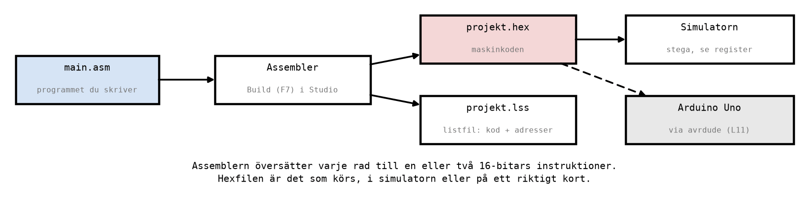
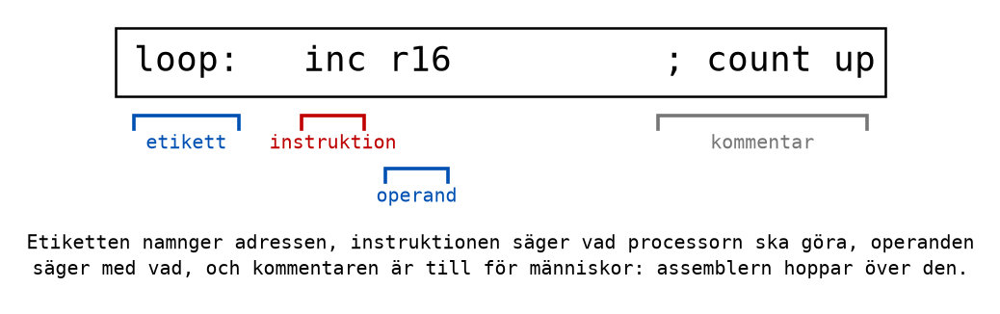

# Appendix B - Assemblerspråk

## B.1 Från assembler till maskinkod
Processorn förstår bara maskinkod: tal i programminnet, som i
[Appendix A.6](./a_avr_core.md#a6-vad-en-instruktion-är). **Assemblerspråk** är maskinkoden skriven
med ord i stället för tal. Varje rad med en instruktion blir en instruktion i maskinkod, och
ingenting annat: `inc r16` blir exakt en instruktion, som ökar `r16` med ett.

Programmet som översätter kallas **assemblern**, och översättningen kallas att **assemblera**. I
Microchip Studio sker det när du bygger projektet med **F7**.



Assemblern är det enklaste verktyget i kedjan. Den ändrar inte ordning på något, den fyller inte i
något du glömt, och den kontrollerar inte att programmet gör något vettigt. Den kontrollerar bara
att varje rad går att översätta. Allt programmet gör är alltså sådant du själv har skrivit. Det är
både det svåra och det fina med assembler: det finns ingenting dolt.

---

## B.2 En rad assembler
En rad i ett assemblerprogram kan ha fyra delar, och alla fyra är valfria:



* **Etikett**: ett namn följt av kolon, först på raden. Etiketten namnger adressen där nästa
  instruktion hamnar, så att ett hopp kan hoppa dit med namn i stället för med en adress. Kursens
  etiketter skrivs med små bokstäver och understreck: `main`, `loop`, `delay_loop`.
* **Instruktion**: vad processorn ska göra, skrivet som en kort förkortning. `inc` betyder
  *increment*, öka med ett. Förkortningen kallas också instruktionens **mnemonic**.
* **Operander**: vad instruktionen ska arbeta med. `inc` har en operand, registret som ska ökas.
  `ldi r16, 25` har två, åtskilda med kommatecken: registret och värdet. När det finns två operander
  är den första nästan alltid **målet**, det som ändras.
* **Kommentar**: allt efter ett semikolon. Assemblern hoppar över kommentarer; de är till för den
  som läser programmet, vilket oftast är du själv en vecka senare.

Indrag är inte nödvändigt, men kursens program drar in instruktionerna fyra blanksteg och låter
etiketterna stå längst till vänster. Då syns programmets struktur direkt.

---

## B.3 Direktiv
Vissa rader börjar med en punkt. De är **direktiv**: instruktioner till assemblern, inte till
processorn. Ett direktiv blir ingen maskinkod.

| Direktiv | Exempel | Betydelse |
|----------|---------|-----------|
| `.include` | `.include "m328Pdef.inc"` | Läs in en annan fil här. |
| `.org` | `.org 0x0000` | Lägg nästa instruktion på den här adressen i programminnet. |
| `.def` | `.def counter = r16` | Ge ett register ett eget namn. |
| `.equ` | `.equ LIMIT = 10` | Ge en konstant ett eget namn. |

**`.include "m328Pdef.inc"`** står först i varje program. Filen `m328Pdef.inc` följer med Microchip
Studio och innehåller namnen på alla ATmega328P:s register och konstanter: `PORTB`, `DDRB`, `PIND`,
`RAMEND` och flera hundra till. Utan den vet assemblern inte vad `PORTB` betyder.

**`.def`** gör ett program lättare att läsa. Efter `.def counter = r16` kan du skriva `inc counter`,
och assemblern byter ut `counter` mot `r16`. Det blir samma maskinkod, men programmet säger nu vad
registret används till. Du använder `.def` i [Labb 3 del
6](../../../labs/lab3/b_arithmetic_and_logic.md).

**`.equ`** gör samma sak för tal. Efter `.equ LIMIT = 10` betyder `LIMIT` talet 10 överallt i
programmet. Konstanter skrivs med stora bokstäver, så att de syns.

---

## B.4 Talformat
Ett tal kan skrivas på flera sätt i ett assemblerprogram. Det blir samma bitar i maskinkoden
oavsett hur du skriver det. Talsystemen går tillbaka till [L01](../../L01/README.md).

| Skrivsätt | Exempel | Värde |
|-----------|---------|-------|
| Decimalt | `ldi r16, 200` | 200 |
| Binärt, prefix `0b` | `ldi r16, 0b11001000` | 128 + 64 + 8 = 200 |
| Hexadecimalt, prefix `0x` | `ldi r16, 0xC8` | 12 · 16 + 8 = 200 |
| Hexadecimalt, prefix `$` | `ldi r16, $C8` | 200; äldre skrivsätt, vanligt i gamla exempel |
| Tecken, inom apostrofer | `ldi r16, 'A'` | 65 = 0x41, tecknets ASCII-kod |

Välj skrivsätt efter vad talet **betyder**. Ett antal, till exempel hur många varv en loop ska gå,
skrivs decimalt. Ett bitmönster, till exempel vilka lysdioder som ska lysa, skrivs binärt, så att
man ser varje bit. Hexadecimalt är det kompakta sättet att skriva ett bitmönster, och det är så
simulatorn visar registren.

Exempelprogrammet [`number_formats.asm`](../examples/number_formats.asm) laddar samma tal på fyra
sätt i fyra register. Stega igenom det och se att alla fyra blir `0xC8`.

---

## B.5 De första instruktionerna
Åtta instruktioner räcker för att skriva kursens första program. Antal klockcykler står inom
parentes; varför några tar två cykler tas upp i [L09](../../L09/README.md).

| Instruktion | Exempel | Gör |
|-------------|---------|-----|
| `ldi` | `ldi r16, 5` | Laddar ett fast värde i ett register, `r16`-`r31`. (1) |
| `mov` | `mov r18, r16` | Kopierar ett register till ett annat. `r16` ändras inte. (1) |
| `clr` | `clr r19` | Nollställer ett register: alla bitar blir 0. (1) |
| `ser` | `ser r20` | Ettställer ett register: alla bitar blir 1, `0xFF`. (1) |
| `inc` | `inc r18` | Ökar ett register med ett. (1) |
| `dec` | `dec r17` | Minskar ett register med ett. (1) |
| `rjmp` | `rjmp end` | Hoppar till en etikett. (2) |
| `nop` | `nop` | Gör ingenting, i en klockcykel. (1) |

Lägg märke till ordningen i `mov r18, r16`: målet först, sedan källan. Det läses "flytta till
`r18` från `r16`", och det är samma ordning som i `ldi r16, 5`, där `r16` är det som ändras.

### Genomarbetat exempel
Här är [`first_program.asm`](../examples/first_program.asm), kursens första program. Tabellen visar
registren **efter** varje instruktion. I simulatorn är alla register 0 när programmet startar.

```asm
main:
    ldi r16, 5                      ; r16 = 5
    ldi r17, 3                      ; r17 = 3
    mov r18, r16                    ; r18 = r16, so r18 = 5 (r16 is unchanged)
    inc r18                         ; r18 = r18 + 1 = 6
    dec r17                         ; r17 = r17 - 1 = 2
    clr r19                         ; r19 = 0
    ser r20                         ; r20 = 0xFF (all ones)

end:
    rjmp end                        ; Stay here forever.
```

| Efter | `r16` | `r17` | `r18` | `r19` | `r20` |
|-------|-------|-------|-------|-------|-------|
| `ldi r16, 5` | 5 | 0 | 0 | 0 | 0 |
| `ldi r17, 3` | 5 | 3 | 0 | 0 | 0 |
| `mov r18, r16` | 5 | 3 | 5 | 0 | 0 |
| `inc r18` | 5 | 3 | 6 | 0 | 0 |
| `dec r17` | 5 | 2 | 6 | 0 | 0 |
| `clr r19` | 5 | 2 | 6 | 0 | 0 |
| `ser r20` | 5 | 2 | 6 | 0 | 0xFF |

`clr r19` ändrar ingenting synligt, eftersom `r19` redan var 0. Instruktionen körs ändå, och det är
en god vana att nollställa ett register innan man använder det, i stället för att lita på att det
redan är noll.

---

## B.6 Programmets skelett
Alla program i Labb 3 utgår från samma mall,
[`labs/lab3/code/template.asm`](../../../labs/lab3/code/template.asm). Så här ser dess delar ut, rad
för rad:

```asm
.include "m328Pdef.inc"             ; Register names for the ATmega328P: PORTB, DDRB ...

.org 0x0000                         ; The processor starts here after reset.
    rjmp main                       ; Jump over everything else, to main.

main:
    ; Write your program here.

end:
    rjmp end                        ; Stay here forever: there is nothing to return to.
```

* **`.include`** ger registernamnen, se B.3.
* **`.org 0x0000`** säger att nästa instruktion ska ligga på adress 0 i programminnet. Det är där
  processorn börjar efter en reset ([Appendix A.4](./a_avr_core.md#a4-programräknaren)).
* **`rjmp main`** hoppar till etiketten `main`. Det kan verka onödigt, eftersom `main` ändå kommer
  direkt efter. Men adresserna närmast 0 är reserverade för avbrottsvektorer, som kursen inte
  använder, och vanan att börja med ett hopp gör att programmet fungerar även den dag något läggs
  där. Så börjar nästan alla AVR-program.
* **`main:`** är där ditt program börjar.
* **`end: rjmp end`** hoppar till sig självt, om och om igen. Processorn stannar alltså aldrig; den
  står och stampar på samma ställe. Utan den raden skulle processorn fortsätta in i det som råkar
  ligga efter programmet i flashminnet, vilket inte är något du har skrivit
  ([Appendix A.8](./a_avr_core.md#a8-vad-maskinen-inte-har)).

Från [L08](../../L08/README.md) och framåt byts `end` ofta ut mot en **huvudloop**: ett program som
styr något gör samma sak om och om igen, till exempel läser en knapp och tänder en lysdiod.

---

## B.7 Listfilen
När projektet byggs skriver assemblern, utöver hexfilen, en **listfil**: programmet med adressen och
maskinkoden bredvid varje rad. I Microchip Studio har den filändelsen `.lss` och ligger bland
projektets utdatafiler, i katalogen `Debug`. Listfilen för `first_program.asm` innehåller bland
annat de här raderna (formatet skiljer sig lite mellan versioner, men innehållet är detsamma):

```text
000000 c000      rjmp main
000001 e005      ldi r16, 5
000002 e013      ldi r17, 3
000003 2f20      mov r18, r16
000004 9523      inc r18
000005 951a      dec r17
000006 2733      clr r19
000007 ef4f      ser r20
000008 cfff      rjmp end
```

Första kolumnen är adressen i programminnet, räknad i ord, och andra kolumnen är maskinkoden,
hexadecimalt. Tre saker är värda att lägga märke till:

* **`ldi r16, 5` blir `0xE005`.** Samma mönster som i [Appendix
  A.6](./a_avr_core.md#a6-vad-en-instruktion-är): `1110`, konstantens höga halva `0000`,
  registerfältet `0000` för `r16`, konstantens låga halva `0101`.
* **`clr r19` blir en helt annan instruktion än `ldi r19, 0`.** Den är i själva verket `eor r19,
  r19`, en XOR av registret med sig självt, vilket alltid blir noll. `clr` är ett bekvämt namn på
  den.
* **Adresserna ökar med ett för varje rad**, eftersom varje instruktion här är ett ord lång. Hela
  programmet ryms i nio ord, 18 byte, av programminnets 32 768.

---
