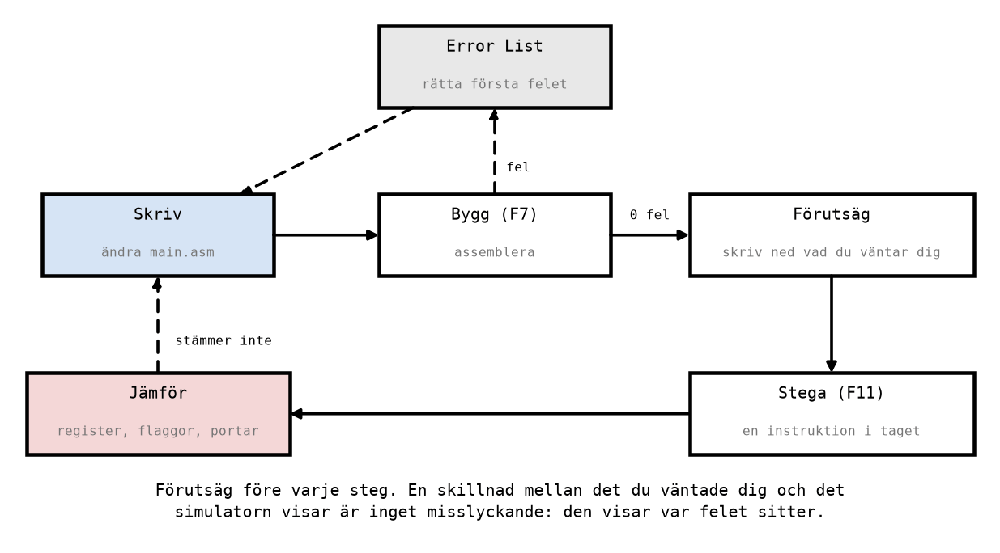

# Appendix C - Simulering i Microchip Studio

## C.1 Arbetsgången
Allt arbete i Labb 3 följer samma slinga: skriv, bygg, förutsäg, stega och jämför.

Hur du skapar ett projekt, bygger och startar simulatorn står i
[info/microchip_studio.md](../../../info/microchip_studio.md), avsnitt 2-4. Det här appendixet
handlar om hur du **använder** simulatorn för att lära dig vad instruktionerna gör.

**Varför simulatorn?** Ett riktigt kort kör upp till 16 miljoner instruktioner i sekunden, och du
ser bara slutresultatet: en lysdiod som lyser eller inte. Simulatorn låter dig köra en instruktion
i taget och se varje register, varje flagga och varje port ändras. Det är det bästa sättet att
förstå vad ett program gör, och att hitta felet när det inte gör det du tänkt. Nästan hela Labb 3
görs i simulatorn; kortet används först i [L11](../../L11/README.md).

---

## C.2 Att stega och läsa registren
Starta simuleringen med **Debug → Start Debugging and Break** (**Alt+F5**). Programmet stannar på
första instruktionen, och en gul pil visar var.

**Den gula pilen pekar på den instruktion som står på tur, inte på den som just körts.** Det är den
vanligaste källan till förvirring första gången. När pilen står på `inc r18` har `inc r18` ännu inte
körts; tryck **F11** (*Step Into*), så körs den, och pilen flyttar till nästa rad.

Öppna fönstret **Processor Status** (**Debug → Windows → Processor Status**). Där finns:
* **`R00`-`R31`**: de 32 registren. Ett register som ändrades i det senaste steget visas i rött.
* **Program Counter**: adressen till nästa instruktion. Jämför den med adresserna i listfilen
  ([Appendix B.7](./b_assembly_language.md#b7-listfilen)).
* **Status Register**: SREG, med en ruta per flagga. Flaggorna tas upp i
  [L08](../../L08/README.md).
* **Cycle Counter** och **Stop Watch**: hur många klockcykler, och hur lång tid, programmet har
  kört. Se C.5.

Registren visas hexadecimalt, så `r18 = 6` visas som `0x06` och `r16 = 200` som `0xC8`. Vänj dig vid
det: det är så datablad, listfiler och instruktionslistor skriver, och omvandlingen är den från
[L01](../../L01/README.md).

---

## C.3 Förutsäg före varje steg
Att trycka F11 och titta på vad som händer lär dig mindre än man kan tro. Du ser att något ändrades,
men inte om det var det du väntade dig. Därför en regel för hela Labb 3:

**Skriv ned vad du väntar dig innan du trycker F11.**

Det enklaste sättet är en tabell med en rad per instruktion och en kolumn per register du bryr dig
om, som tabellen i [Appendix B.5](./b_assembly_language.md#genomarbetat-exempel). Fyll i raden,
tryck F11, och jämför med Processor Status:
* **Stämmer det** vet du att du förstår instruktionen.
* **Stämmer det inte** har du hittat något att lära dig: antingen gör instruktionen något annat än
  du trodde, eller så står programmet inte där du trodde. Båda är värda att reda ut innan du går
  vidare.

Samma vana gäller när programmen blir längre. Då förutsäger du inte varje steg, utan värdet vid en
viss rad, och kör fram till den med en brytpunkt eller **Run To Cursor** (**Ctrl+F10**).

---

## C.4 Felmeddelanden
Ett program som inte går att assemblera ger felmeddelanden i fönstret **Error List** när du bygger.
Varje meddelande har ett radnummer; dubbelklicka på det så hoppar editorn dit. Tre fel är vanligast
i början:

| Felmeddelandet handlar om | Exempel på rad | Rättelse |
|---------------------------|----------------|----------|
| ett ogiltigt register | `ldi r5, 3` | `ldi` når bara `r16`-`r31`: använd `ldi r20, 3`. |
| en okänd symbol | `rjmp mian` | Etiketten heter `main`. Stavningen måste stämma exakt. |
| syntax | `ldi r16 7` | Kommatecknet saknas: `ldi r16, 7`. |

Två råd som sparar mycket tid:
* **Rätta det första felet först, och bygg om.** Ett enda fel ger ibland flera följdfel längre ned,
  som försvinner av sig själva.
* **Läs raden, inte bara meddelandet.** Meddelandet säger vad assemblern inte förstod, men felet
  kan sitta en bit tidigare på raden än där assemblern gav upp.

Ett program som assembleras utan fel kan fortfarande vara fel. Assemblern kontrollerar bara att
varje rad går att översätta, inte att programmet gör det du vill. Det är simulatorns uppgift, och
din förutsägelse är det du kontrollerar mot.

---

## C.5 Cykelräknaren
**Cycle Counter** i Processor Status räknar hur många klockcykler programmet har kört sedan start,
och **Stop Watch** visar samma sak som tid. Kontrollera först att fältet **Frequency** står på **16
MHz**, så att tiden stämmer med ett Arduino Uno-kort ([info/microchip_studio.md, avsnitt
4.4](../../../info/microchip_studio.md#44-brytpunkter-och-cykelräknaren)).

Kör `first_program.asm` fram till raden `end:`. Cykelräknaren visar då **9**:
* `rjmp main` tar 2 cykler;
* de sju instruktionerna i `main` tar 1 cykel var, 7 cykler;
* totalt 2 + 7 = 9 cykler, vilket är 9 · 62,5 ns = 562,5 ns.

Det är värt att räkna så en gång nu, för i [L09](../../L09/README.md) blir cykelräknaren det
verktyg som mäter hur lång tid en tidsfördröjning tar. Då räknar du ut antalet cykler för hand
först, och kontrollerar med stoppuret.

**Ett tips till sist.** Medan simuleringen står stilla kan du ändra värdet i ett register direkt i
Processor Status, genom att dubbelklicka på värdet och skriva in ett nytt. Det är ett snabbt sätt
att prova ett program med olika startvärden utan att bygga om det, och det används i Labb 3 del 12.

---
