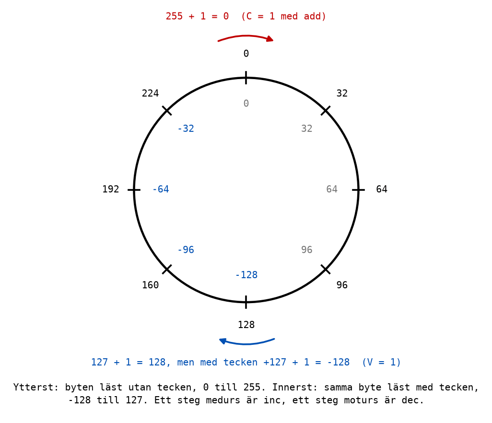
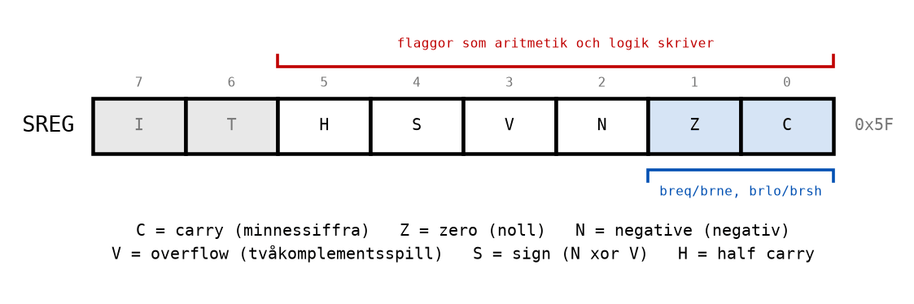

# Appendix A - Aritmetik och flaggor

## A.1 Addition i ett register
Instruktionen `add` adderar två register och lägger summan i det första:

```asm
    ldi r16, 25
    ldi r17, 17
    add r16, r17                    ; r16 = r16 + r17 = 42. r17 is unchanged.
```

Processorn räknar binärt, precis som i [L01 Appendix A](../../L01/appendix/a_number_systems.md):
bit för bit från höger, med en minnessiffra, **carry**, när en kolumn blir 2 eller mer.

```text
   carry     0 0 1 0 0 0 1 0  (in to each column)
   25    =   0 0 0 1 1 0 0 1
 + 17    =   0 0 0 1 0 0 0 1
   ---------------------------
   42    =   0 0 1 0 1 0 1 0  =  0x2A
```

Bit 0: 1 + 1 = 10 binärt, alltså 0 och en etta i minne till bit 1. Bit 4: 1 + 1 = 10 igen, en etta
i minne till bit 5. Resten av kolumnerna blir 0 eller 1 utan minne.

Två instruktioner till adderar:
* **`inc r16`** adderar 1. Den har redan dykt upp i [L07](../../L07/README.md).
* **`adc r16, r17`** adderar `r17` **och carryflaggan** till `r16`. Den behövs för tal större än en
  byte, och tas upp i [L10](../../L10/README.md).

Det finns **ingen instruktion som adderar en konstant**, ingen `addi`. Hur man ändå gör det står i
A.4.

---

## A.2 När summan inte får plats
En byte har åtta bitar och rymmer talen 0 till 255. Vad händer med 200 + 100 = 300?

```text
   200   =     1 1 0 0 1 0 0 0
 + 100   =     0 1 1 0 0 1 0 0
   -----------------------------
   300   =   1 0 0 1 0 1 1 0 0
             ^
             nionde biten: hamnar i carryflaggan C
```

Summan behöver nio bitar. Registret behåller de åtta lägsta, `0010 1100` = **44**, och den nionde
biten, minnessiffran ut ur bit 7, hamnar i **carryflaggan `C`** i statusregistret. Så `C = 1` efter
additionen betyder: "resultatet fick inte plats, det riktiga svaret är 256 större". 44 + 256 = 300.

Processorn stannar inte, och säger inte ifrån. Det är programmets sak att titta på `C` om det spelar
roll, och det är just det flaggorna är till för (A.6).

---

## A.3 Aritmetisk rundgång
En byte fungerar som mätaren i en bil: efter 999 999 kommer 000 000. Efter 255 kommer 0, och före 0
kommer 255. Det kallas **aritmetisk rundgång**.



Tänk dig talen på en urtavla. `inc` flyttar ett steg medurs, `dec` ett steg moturs. Från 255 tar
`inc` dig till 0, och från 0 tar `dec` dig till 255.

**Här finns en fälla.** `inc` och `dec` ändrar **inte** carryflaggan. När `inc` slår om från 255
till 0 sätts `Z`, eftersom resultatet blev noll, men `C` lämnas som den var. Vill man veta om en
ökning slog om måste man antingen använda `add` med ett register som innehåller 1, som sätter `C`,
eller titta på `Z` efter `inc`.

| Instruktion | Från | Till | Z | C |
|-------------|------|------|---|---|
| `inc r16` | 255 | 0 | 1 | oförändrad |
| `add r16, r17` med `r17` = 1 | 255 | 0 | 1 | 1 |
| `dec r16` | 0 | 255 | 0 | oförändrad |

Varför är `inc` och `dec` gjorda så? Därför att de oftast används som räknare i loopar, och då vill
man kunna räkna utan att förstöra `C`, som kanske håller något viktigt. Det blir tydligt i
[L10](../../L10/README.md), där `C` bär minnessiffran mellan två byte.

---

## A.4 Subtraktion
Subtraktion finns i tre varianter:

| Instruktion | Exempel | Gör |
|-------------|---------|-----|
| `sub` | `sub r16, r17` | `r16 = r16 - r17` |
| `subi` | `subi r16, 5` | `r16 = r16 - 5`, med en konstant. Bara `r16`-`r31`. |
| `dec` | `dec r16` | `r16 = r16 - 1` |

Om det man drar ifrån är större än det man drar ifrån det från, får man **låna** från en tänkt
nionde bit. Då sätts **`C = 1`**, som här betyder *lån* (*borrow*) i stället för minnessiffra:

```asm
    ldi r16, 20
    ldi r17, 50
    sub r16, r17                    ; 20 - 50: r16 = 226 = 0xE2, and C = 1 (a borrow)
```

226 är 256 + 20 - 50. Rundgången gäller åt båda hållen.

### Att addera en konstant med `subi`
Eftersom det inte finns någon `addi` adderar man en konstant genom att **subtrahera dess negativa
värde**:

```asm
    subi r16, -5                    ; r16 = r16 - (-5) = r16 + 5
```

Det fungerar på grund av rundgången: -5 lagras som 251 (A.5), och att dra ifrån 251 är detsamma som
att lägga till 5 och slå om ett varv. Tänk på att flaggorna då blir en subtraktions flaggor: `C`
betyder lån, inte minnessiffra, så `C` blir 1 när summan **inte** slår om, tvärtom mot `add`.
Använd `subi` med negativ konstant för att räkna, inte för att testa carry.

---

## A.5 Tvåkomplement: negativa tal
En byte är bara åtta bitar. Om de betyder ett tal utan tecken, 0 till 255, eller ett tal med tecken,
-128 till 127, bestämmer **programmet**, inte processorn. Samma bitar kan läsas på två sätt:

| Bitar | Hex | Utan tecken | Med tecken |
|-------|-----|-------------|------------|
| `0000 0000` | 0x00 | 0 | 0 |
| `0000 0001` | 0x01 | 1 | 1 |
| `0111 1111` | 0x7F | 127 | 127 |
| `1000 0000` | 0x80 | 128 | -128 |
| `1111 1011` | 0xFB | 251 | -5 |
| `1111 1111` | 0xFF | 255 | -1 |

Sättet att skriva negativa tal kallas **tvåkomplement**. Det har tre egenskaper som gör det till det
alla processorer använder:
* **Bit 7 är teckenbiten.** Är den 1 är talet negativt, när byten läses med tecken.
* **-x är 256 - x.** -1 är 255, -5 är 251 och -128 är 128. Det är rundgången igen: ett steg moturs
  från 0 är både 255 och -1.
* **Addition och subtraktion fungerar likadant för båda tolkningarna.** `add` behöver inte veta om
  talen har tecken: 0xFB + 0x07 = 0x02 är både 251 + 7 = 258 - 256 = 2 och -5 + 7 = 2.

### Att bilda ett negativt tal
Så räknar du ut tvåkomplementet, det negativa talet, för hand: **invertera alla bitar och lägg till
1.**

```text
   5            =  0000 0101
   invertera    =  1111 1010
   lägg till 1  =  1111 1011  =  0xFB  =  -5
```

Instruktionen **`neg r16`** gör exakt detta: `r16 = 0 - r16`.

Det är samma sak Windows miniräknare visar i läget Programmerare när den visar ett negativt tal som
`FFFF FFFF FFFF FFFB`: det är -5 i tvåkomplement med 64 bitar i stället för 8.

---

## A.6 Flaggorna
Efter varje aritmetisk eller logisk instruktion skriver processorn in några fakta om resultatet i
statusregistret `SREG`, en bit per faktum. Bitarna kallas **flaggor**.



| Flagga | Namn | Sätts till 1 när |
|--------|------|------------------|
| `C` | carry | det blev en minnessiffra ut ur bit 7 vid addition, eller ett lån vid subtraktion |
| `Z` | zero | resultatet blev noll |
| `N` | negative | bit 7 i resultatet är 1, alltså negativt om talet har tecken |
| `V` | overflow | resultatet blev fel **med tecken**: två positiva tal gav ett negativt, eller tvärtom |
| `S` | sign | `N` xor `V`: det rätta tecknet, även när `V` säger att resultatet slog om |
| `H` | half carry | det blev en minnessiffra ut ur bit 3; används sällan |

De två sista bitarna, `I` och `T`, är inte resultatflaggor och används inte i kursen.

**`C` och `V` svarar på samma fråga för de två tolkningarna.** `C = 1` betyder att resultatet inte
fick plats om talen är **utan** tecken. `V = 1` betyder att resultatet inte fick plats om talen är
**med** tecken. Processorn vet inte vilken tolkning programmet använder, så den räknar ut båda, och
programmet tittar på den flagga som passar.

**Inte alla instruktioner ändrar alla flaggor.** `ldi`, `mov`, `out` och hoppen ändrar inga flaggor
alls. `inc` och `dec` ändrar `Z`, `N`, `V` och `S`, men inte `C`. Vilka flaggor varje instruktion
ändrar står i kolumnen *Flaggor* på [referensbladet](../../../info/avr_instructions.md). Det är
värt att titta där när ett program beter sig konstigt: en flagga som man trodde var satt kan ha
skrivits över av instruktionen före.

---

## A.7 Fyra genomarbetade exempel
Programmet [`flags_demo.asm`](../examples/flags_demo.asm) gör de fyra uträkningarna nedan. Stega
det och jämför SREG i Processor Status efter varje uträkning.

### 0x7F + 0x01 = 0x80
```text
   0111 1111    127  eller  +127
 + 0000 0001      1  eller    +1
   ---------
   1000 0000    128  eller  -128
```
* `C = 0`: ingen minnessiffra ut ur bit 7. Utan tecken är 128 rätt.
* `Z = 0`: resultatet är inte noll.
* `N = 1`: bit 7 är 1.
* `V = 1`: två positiva tal gav ett negativt. Med tecken är svaret fel, +127 + 1 får inte plats.
* `S = N xor V = 0`: det rätta svaret, 128, är positivt.
* `H = 1`: bit 3 + bit 3 gav en minnessiffra, 1111 + 0001 i den låga halvan.

### 0xFF + 0x01 = 0x00
* `C = 1`: 255 + 1 = 256 får inte plats utan tecken.
* `Z = 1`: resultatet är noll.
* `N = 0`, `V = 0`: med tecken är det -1 + 1 = 0, vilket är rätt.
* `S = 0`, `H = 1`.

### 0x80 + 0x80 = 0x00
* `C = 1`: 128 + 128 = 256 får inte plats utan tecken.
* `Z = 1`: resultatet är noll.
* `V = 1`: med tecken är det -128 + (-128) = -256, som inte heller får plats. Två negativa tal gav
  noll, och det är fel.
* `N = 0`, `S = N xor V = 1`: det rätta svaret, -256, är negativt. `H = 0`.

### 0x05 - 0x07 = 0xFE
* `C = 1`: 5 - 7 kräver ett lån. Utan tecken blir det 254.
* `Z = 0`, `N = 1`: bit 7 är 1.
* `V = 0`: med tecken är 5 - 7 = -2, och 0xFE **är** -2. Svaret är rätt.
* `S = 1`: resultatet är negativt. `H = 1`: den låga halvan, 5 - 7, behövde också låna.

Lägg märke till det sista exemplet: `C = 1` men `V = 0`. Utan tecken är svaret "fel" (det skulle ha
varit -2, som inte finns bland talen 0-255), men med tecken är det rätt. Samma bitar, två
tolkningar, två flaggor.

---
