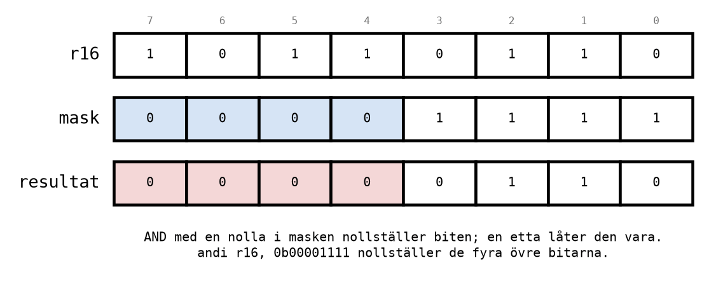
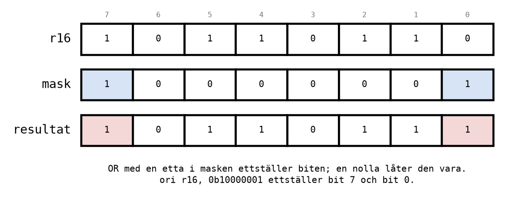
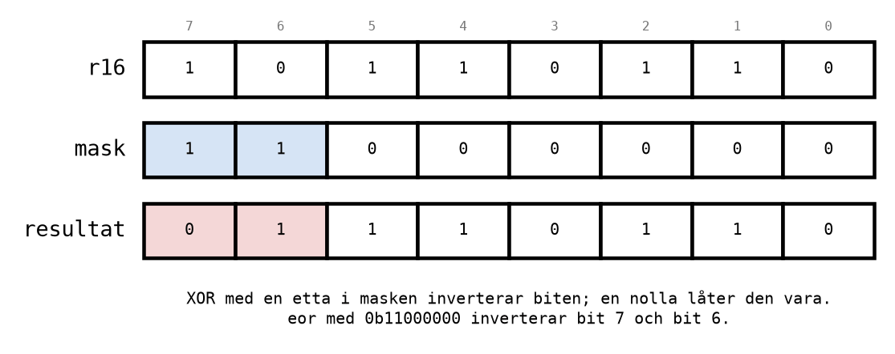
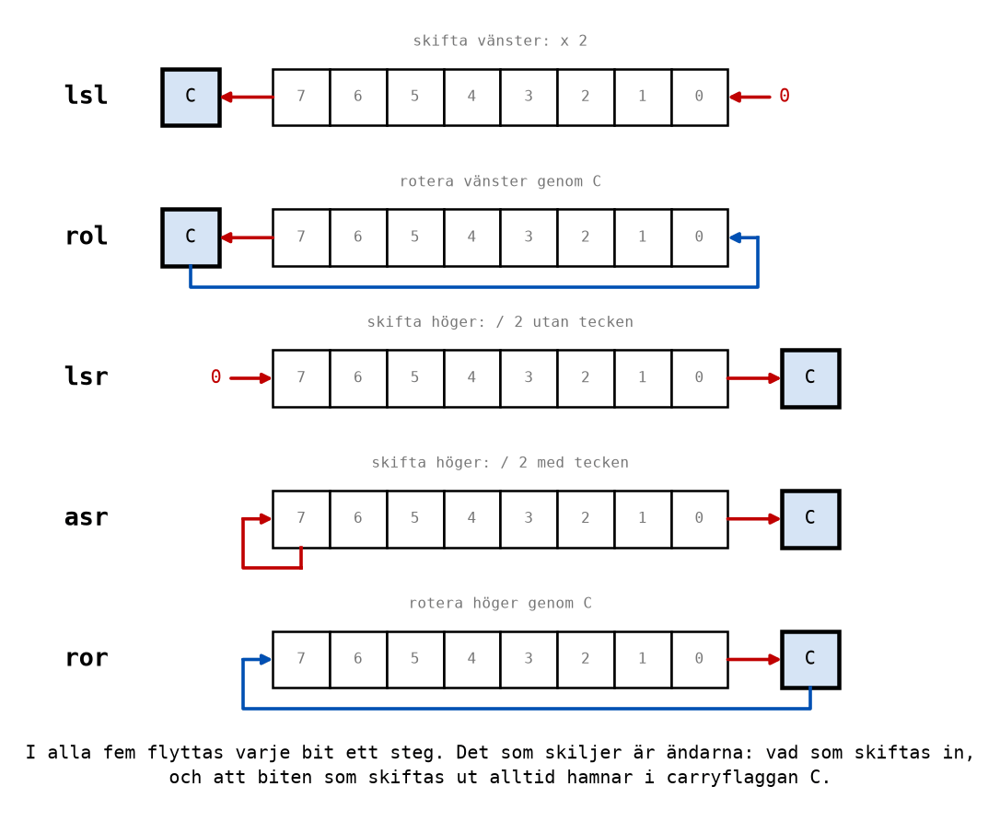

# Appendix B - Logiska operationer, skift och rotation

## B.1 Logiska operationer, bit för bit
Grindarna från [L02](../../L02/README.md) finns som instruktioner. De arbetar på alla åtta bitar i
ett register samtidigt, men varje bit för sig: bit 0 i resultatet beror bara på bit 0 i de två
operanderna, bit 1 bara på bit 1, och så vidare. Det är åtta grindar bredvid varandra.

| Instruktion | Exempel | Gör, för varje bit |
|-------------|---------|--------------------|
| `and` | `and r16, r17` | 1 om båda bitarna är 1 |
| `andi` | `andi r16, 0x0F` | samma, med en konstant |
| `or` | `or r16, r17` | 1 om minst en av bitarna är 1 |
| `ori` | `ori r16, 0x80` | samma, med en konstant |
| `eor` | `eor r16, r17` | 1 om bitarna är olika (XOR) |
| `com` | `com r16` | inverterar, NOT |

Ett exempel med `and`:

```text
   r16  =  1011 0110
   r17  =  0110 0011
   ----------------- and
   r16  =  0010 0010
```

Bara i bit 5 och bit 1 är båda operanderna 1, så bara de bitarna blir 1 i resultatet.

**Det finns ingen `eori`.** Vill man göra XOR med en konstant laddar man först konstanten i ett
register och använder `eor`:

```asm
    ldi r24, 0b11000000
    eor r16, r24                    ; Toggle bits 7 and 6 of r16.
```

---

## B.2 Masker
Den vanligaste användningen av de logiska instruktionerna är att ändra **vissa** bitar i ett
register och lämna de andra i fred. Konstanten som väljer vilka bitar kallas en **mask**. Det behövs
hela tiden när man styr en port: en port har åtta stift, och man vill ofta ändra ett av dem utan att
röra de andra sju.

### Nollställa bitar: `andi`
En nolla i masken tvingar biten till 0, en etta låter den vara som den var.



### Ettställa bitar: `ori`
En etta i masken tvingar biten till 1, en nolla låter den vara.



### Invertera bitar: `eor`
En etta i masken vänder på biten, en nolla låter den vara.



### Testa en bit: `andi` och `Z`
Vill man veta om en viss bit är 1 kan man göra AND med en mask som bara har den biten satt. Blir
resultatet noll var biten 0, annars 1, och flaggan `Z` säger vilket:

```asm
    andi r16, 0b00000100            ; Keep only bit 2. Z = 1 if bit 2 was 0.
```

Nackdelen är att `r16` ändras. Hur man testar en bit utan att förstöra registret, och vad man gör
med `Z` efteråt, kommer i [L09](../../L09/README.md).

### Sammanfattning

| Vill du | Använd | Masken har |
|---------|--------|------------|
| nollställa bitar | `andi` | 0 i de bitar som ska bli 0, 1 i resten |
| ettställa bitar | `ori` | 1 i de bitar som ska bli 1, 0 i resten |
| invertera bitar | `eor` | 1 i de bitar som ska vändas, 0 i resten |
| testa en bit | `andi`, sedan `Z` | 1 i den bit som testas, 0 i resten |

Alla exemplen finns i [`masks.asm`](../examples/masks.asm).

---

## B.3 Skift
Ett **skift** flyttar alla bitar ett steg åt vänster eller höger. Biten som ramlar ut i ena änden
hamnar i carryflaggan `C`, och i andra änden kommer en ny bit in.



**`lsl`**, *logical shift left*: alla bitar ett steg åt vänster, en nolla in i bit 0, bit 7 till
`C`. Att flytta ett binärt tal ett steg åt vänster är att **multiplicera med 2**, precis som att
lägga till en nolla sist i ett decimalt tal multiplicerar med 10:

```text
   3    =  0000 0011
   lsl  =  0000 0110  =  6
   lsl  =  0000 1100  =  12
```

**`lsr`**, *logical shift right*: alla bitar ett steg åt höger, en nolla in i bit 7, bit 0 till `C`.
Det är att **dividera med 2**, och biten i `C` är resten: `lsr` på 7 ger 3 och `C = 1`.

**`asr`**, *arithmetic shift right*: som `lsr`, men bit 7 behåller sitt värde i stället för att bli
0. Det gör att division med 2 blir rätt även för negativa tal med tecken:

```text
   -16  =  1111 0000
   asr  =  1111 1000  =  -8     (rätt, med tecken)
   lsr  =  0111 1000  =  120    (fel, med tecken: teckenbiten försvann)
```

Använd `lsr` för tal utan tecken och `asr` för tal med tecken. Processorn kan inte dividera på
något annat sätt ([L07 Appendix A.8](../../L07/appendix/a_avr_core.md#a8-vad-maskinen-inte-har)),
så division med 2, 4, 8 och så vidare görs alltid med skift.

---

## B.4 Rotation
En **rotation** är ett skift där biten som skiftas in inte är en nolla, utan carryflaggans gamla
värde. Biten som skiftas ut hamnar som vanligt i `C`. Man kan tänka sig att de åtta bitarna och `C`
sitter i en ring om nio platser.

* **`rol`**, *rotate left*: bit 7 till `C`, och `C` in i bit 0.
* **`ror`**, *rotate right*: bit 0 till `C`, och `C` in i bit 7.

Ett exempel med `rol`, som börjar med `C = 0`:

```text
   r16 = 1001 0011, C = 0
   rol   0010 0110, C = 1     (bit 7 till C, gamla C = 0 in i bit 0)
   rol   0100 1101, C = 0     (bit 7 till C, gamla C = 1 in i bit 0)
```

Ettan som ramlade ut ur bit 7 kom tillbaka in i bit 0 ett steg senare. Inget försvinner i en
rotation.

### Ett rinnande ljus
Programmet [`running_light.asm`](../examples/running_light.asm) visar en etta som vandrar över
port B med `rol`:

```asm
    clc                             ; C = 0, so no stray one is rotated in.
    ldi r16, 0b00000001             ; Start with one LED lit.

loop:
    out PORTB, r16                  ; Show the pattern.
    rol r16                         ; Move it one place to the left, through C.
    rjmp loop
```

`clc` (*clear carry*) nollställer `C` innan första rotationen. Stega programmet och titta på PORTB i
I/O-fönstret: ettan går från bit 0 till bit 7, sedan är **alla** lysdioder släckta ett steg, och
sedan börjar ettan om i bit 0. Förklaringen är ringen om nio platser: det steg då alla är släckta
ligger ettan i `C`.

---

## B.5 swap
**`swap r16`** byter plats på de två halvorna av en byte, de fyra övre och de fyra nedre bitarna.
En halv byte kallas en **nibble**, och motsvarar en hexadecimal siffra:

```text
   r16  =  0x3A  =  0011 1010
   swap =  0xA3  =  1010 0011
```

Den används när man vill arbeta med en hexadecimal siffra i taget, till exempel för att visa en
byte som två tecken. Det gör du i Labb 3 del 18.

---

## B.6 Flaggorna efter logik och skift
De logiska instruktionerna och skiften ändrar också flaggorna, men inte på samma sätt som
aritmetiken:
* **`and`, `andi`, `or`, `ori`, `eor`** sätter `Z` och `N` efter resultatet, nollställer alltid `V`,
  och rör inte `C`.
* **`com`** gör samma sak och sätter dessutom alltid `C = 1`.
* **Skiften och rotationerna** lägger den utskiftade biten i `C`, och sätter `Z` och `N` efter
  resultatet.

Att `and` lämnar `C` orörd kommer till nytta i [L09](../../L09/README.md): man kan testa en bit
med `andi` och sedan hoppa på `Z` utan att förstöra en carry man vill spara.

---
