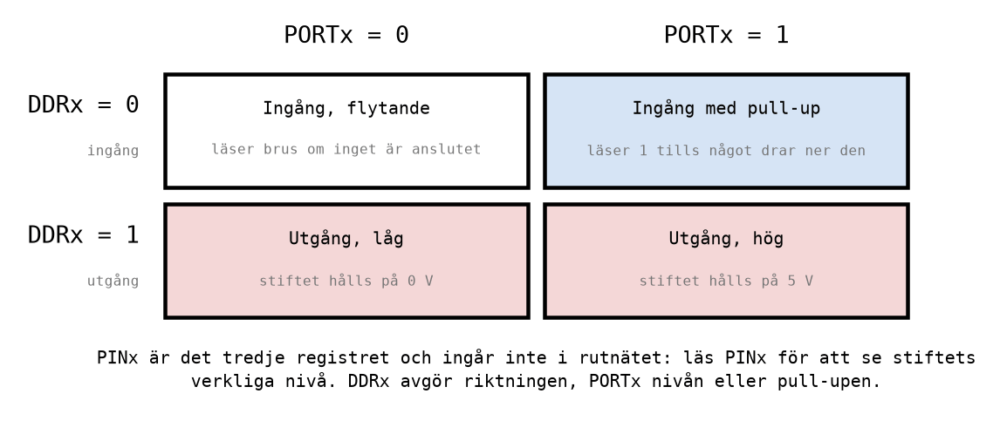
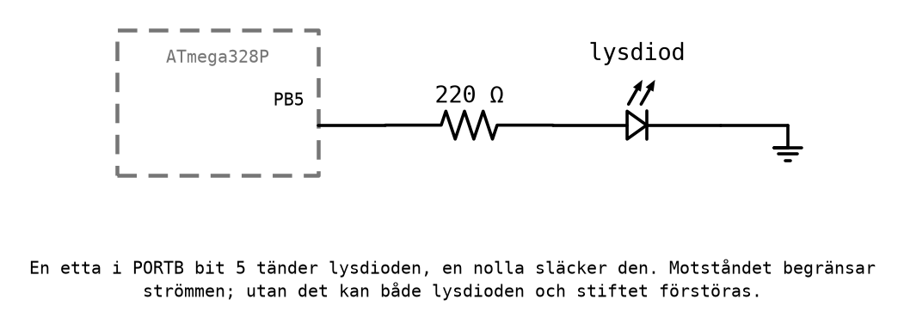

# Appendix C - Utporten

## C.1 Portar och stift
Hittills har programmen bara ändrat register inuti processorn. För att styra något utanför, en
lysdiod, ett relä, en motor, behövs en **utport**: ett register vars bitar är kopplade till kretsens
stift. En etta i biten ger 5 V på stiftet, en nolla ger 0 V.

ATmega328P har tre portar, B, C och D, med upp till åtta stift var. På ett Arduino Uno-kort är
stiften numrerade på Arduinos eget sätt, och de motsvarar portbitar så här:


I kursen är **port B utporten**. I simulatorn syns alla åtta bitar i port B. På Arduino Uno-kortet
går bara bit 0-5 ut till stiften 8-13; bit 6 och 7 används av klockan. Port D används som **inport**
i [L10](../../L10/README.md).

---

## C.2 Tre register per port
Varje port styrs av tre I/O-register. För port B heter de `DDRB`, `PORTB` och `PINB`:

| Register | Betydelse |
|----------|-----------|
| `DDRB` | *Data Direction Register*. En bit per stift: 1 = utgång, 0 = ingång. |
| `PORTB` | För en utgång: nivån som drivs ut, 1 = 5 V, 0 = 0 V. |
| `PINB` | Stiftets verkliga nivå, att läsa. Används för ingångar, i L10. |

Två bitar per stift, `DDRB` och `PORTB`, ger fyra kombinationer:



För en utport räcker den nedre raden: **`DDRB` avgör att stiftet är en utgång, och `PORTB` avgör om
det är högt eller lågt.** Alla bitar i `DDRB` är 0 när processorn startar, så varje stift är en
ingång tills programmet säger något annat.

---

## C.3 Att skriva till en port: `out`
I/O-register skrivs med instruktionen **`out`**, och läses med **`in`**:

```asm
    ser r16                         ; r16 = 0xFF
    out DDRB, r16                   ; Every pin of port B is an output.
    ldi r16, 0b00100001
    out PORTB, r16                  ; PB5 and PB0 high, the other six low.
```

Tre saker att lägga märke till:
* **`out` tar ett register, inte en konstant.** Det finns ingen `out PORTB, 0x21`. Värdet laddas
  först i ett register med `ldi`.
* **Ordningen är I/O-registret först**, sedan registret: `out PORTB, r16`, "ut till `PORTB` från
  `r16`". För `in` är det tvärtom: `in r16, PIND`, "in till `r16` från `PIND`". Målet står alltid
  först, precis som i `ldi` och `mov`.
* **`out` skriver alla åtta bitarna.** Stift som var höga och får en nolla blir låga. Vill man bara
  ändra ett stift används `sbi` eller `cbi` (C.4), eller en mask (C.5).

Namnen `DDRB` och `PORTB` kommer från `m328Pdef.inc`
([L07 Appendix B.3](../../L07/appendix/b_assembly_language.md#b3-direktiv)). De är adresserna till
I/O-registren, och `out` och `in` tar just den sortens adress.

---

## C.4 Ett stift i taget: `sbi` och `cbi`
Två instruktioner ändrar en enda bit i ett I/O-register och lämnar resten orört:

| Instruktion | Exempel | Gör |
|-------------|---------|-----|
| `sbi` | `sbi PORTB, 3` | *set bit in I/O*: bit 3 i `PORTB` blir 1 |
| `cbi` | `cbi PORTB, 0` | *clear bit in I/O*: bit 0 i `PORTB` blir 0 |

De tar en konstant bitposition, 0-7, och behöver inget register. Programmet
[`leds_on_portb.asm`](../examples/leds_on_portb.asm) använder båda:

```asm
    ser r16
    out DDRB, r16                   ; Every pin of port B is an output.
    ldi r16, 0b00100001             ; LEDs on PB5 and PB0.
    out PORTB, r16                  ; Write all eight bits at once.
    sbi PORTB, 3                    ; Also light PB3, leaving the others as they were.
    cbi PORTB, 0                    ; Put out PB0, leaving the others as they were.
```

Efter programmet är `PORTB` = `0b00101000`: bit 5 och bit 3.

`sbi` och `cbi` tar två klockcykler, mot en för `out`. De når bara de lägsta I/O-registren, men dit
hör alla portregistren i kursen.

---

## C.5 Ändra några stift med en mask
När flera stift ska ändras, men inte alla, kombineras `in`, en maskoperation från
[Appendix B.2](./b_logic_and_shifts.md#b2-masker) och `out`:

```asm
    in r16, PORTB                   ; Read what port B drives now.
    ori r16, 0b00000110             ; Set PB2 and PB1, leave the rest.
    out PORTB, r16                  ; Write it back.
```

Mönstret kallas **läs, ändra, skriv**. Man kan läsa `PORTB` tillbaka med `in` och få det värde man
senast skrev dit.

---

## C.6 Namn på register med `.def`
I ett program som räknar på en port blir det snabbt svårt att komma ihåg vad `r16` och `r17`
används till. Direktivet `.def` ger ett register ett namn:

```asm
.def counter = r16                  ; The value shown on port B.
.def temp = r17                     ; A scratch register.
```

Sedan kan man skriva `inc counter` och `out PORTB, counter`, och assemblern byter ut namnen mot
`r16`. Maskinkoden blir densamma, men programmet går att läsa. Namn skrivs med små bokstäver, och
`.def` placeras överst i programmet, efter `.include`.

---

## C.7 I/O-simulering
I simulatorn kan du följa portarna i fönstret **I/O** (**Debug → Windows → I/O**). Välj port B i
listan över enheter, där den heter ungefär *I/O Port (PORTB)*, så visas `PINB`, `DDRB` och `PORTB`
med en ruta per bit. En fylld ruta är en etta.

Stega ett program som räknar på port B, som i Labb 3 del 6:

```asm
.def counter = r16
.def temp = r17

main:
    ser temp
    out DDRB, temp                  ; All eight pins of port B are outputs.
    clr counter

loop:
    out PORTB, counter              ; Show the count on port B.
    inc counter                     ; Count up.
    rjmp loop                       ; And again, forever.
```

För varje varv i loopen visar rutorna i `PORTB` nästa binära tal: 0000 0001, 0000 0010, 0000 0011
och så vidare. Det är binär räkning, bit för bit, och varje ruta är en lysdiod på ett riktigt kort.

Lägg märke till att även **`PINB`** ändras, fast programmet aldrig skriver till den. `PINB` visar
stiftens verkliga nivå, och ett utgångsstift har den nivå porten driver ut.

Om du i stället kör programmet fritt, med **Continue** (**F5**), och sedan stoppar med **Break
All**, har räknaren hunnit många varv, och värdet i `PORTB` ser ut som ett slumpmässigt tal. Varje
varv tar fyra klockcykler, alltså 0,25 mikrosekunder. På ett riktigt kort skulle lysdioderna byta så
fort att alla åtta bara skulle se ut att lysa svagt, hela tiden. För att ett program ska gå att
följa med ögat behövs tidsfördröjningar, och det är ämnet för [L09](../../L09/README.md).

---

## C.8 En lysdiod på riktigt
En utgång på ATmega328P kan driva en lysdiod direkt, men alltid genom ett **förkopplingsmotstånd**
som begränsar strömmen:



Utan motståndet begränsas strömmen bara av vad stiftet orkar leverera, vilket är mer än både
lysdioden och stiftet tål. Arduino Uno-kortet har en lysdiod med motstånd redan monterad på stift
13, alltså PB5. Att koppla egna lysdioder och räkna ut motståndet gör du i
[L11](../../L11/README.md).

---
