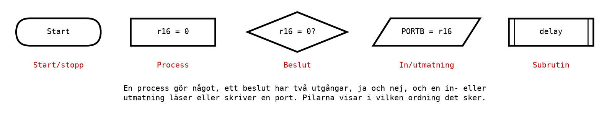
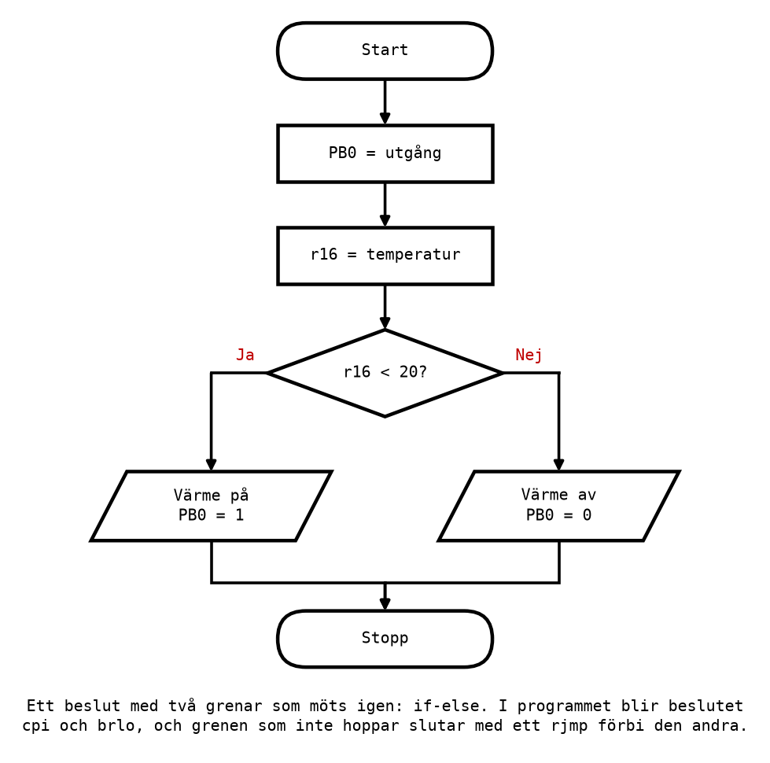
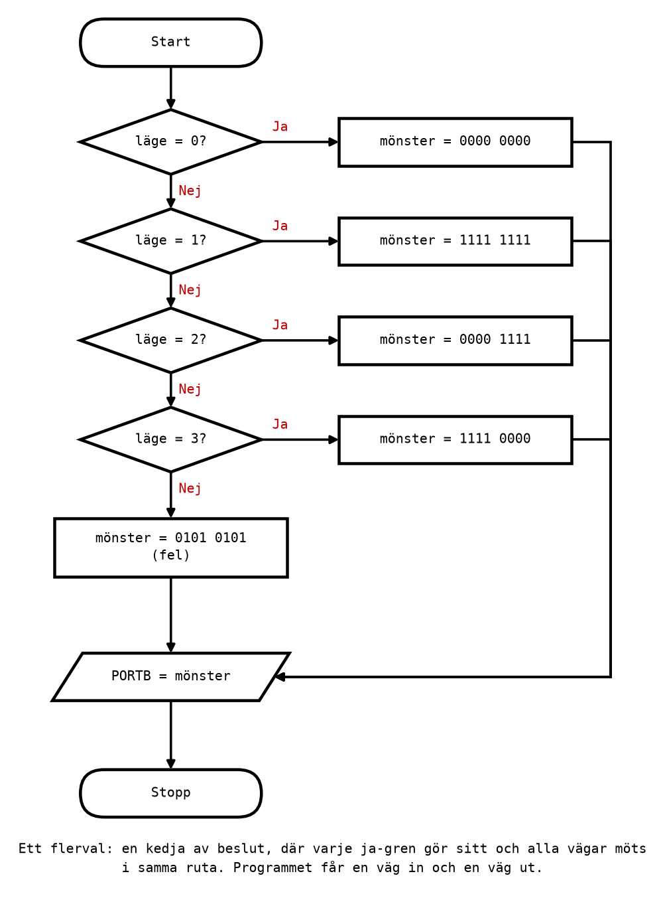

# Appendix A - Flödesplaner och villkorliga hopp

## A.1 Flödesplaner
Programmen hittills har gått rakt uppifrån och ned, en instruktion efter en annan. Riktiga program
måste **välja**: tänd värmen om det är kallt, annars inte. Innan ett sådant program skrivs är det
värt att rita det, som en **flödesplan**.

En flödesplan beskriver vad programmet ska göra, i vilken ordning, och var det väljer väg, utan att
bry sig om vilka instruktioner som behövs. Den ritas med fem symboler:



| Symbol | Betyder | Exempel |
|--------|---------|---------|
| Start/stopp | Var programmet börjar och slutar | Start |
| Process | Något programmet gör | `summa = summa + 1` |
| Beslut | En fråga med två utgångar, Ja och Nej | `r16 = 0?` |
| In/utmatning | Läsa en ingång eller skriva en utgång | `PORTB = mönster` |
| Subrutin | Ett delprogram som anropas; tas upp i [L10](../../L10/README.md) | `delay` |

Fyra regler gör en flödesplan lätt att läsa, och lätt att översätta till ett program:
* **En start**, och flödet går uppifrån och ned. Pilar som går uppåt är loopar.
* **Varje beslut har exakt två utgångar**, märkta Ja och Nej.
* **Skriv vad, inte hur.** `Värme på` är bättre än `sbi PORTB, 0`; vilken instruktion det blir
  bestäms när programmet skrivs.
* **Grenar som delar sig ska mötas igen.** Mer om det i A.8.

---

## A.2 Från flödesplan till program
När flödesplanen är klar översätts den ruta för ruta:
* en **process** eller en **in/utmatning** blir en eller några få instruktioner;
* ett **beslut** blir en jämförelse följd av ett villkorligt hopp (A.3 och A.4);
* varje ställe dit en **pil pekar** från mer än ett håll får en **etikett**, så att ett hopp kan
  hamna där.

Det sista är nyckeln. Ett program kör uppifrån och ned tills en hoppinstruktion skickar det någon
annanstans, och dit måste det finnas en etikett att hoppa till.

---

## A.3 Jämförelse: `cp`, `cpi` och `tst`
Ett beslut i en flödesplan är en fråga om två tal: är de lika, är det ena mindre? På AVR ställs
frågan med en **jämförelse**:

| Instruktion | Exempel | Gör |
|-------------|---------|-----|
| `cp` | `cp r16, r17` | Beräknar `r16 - r17` och sparar bara flaggorna. |
| `cpi` | `cpi r16, 20` | Beräknar `r16 - 20` och sparar bara flaggorna. Bara `r16`-`r31`. |
| `tst` | `tst r16` | Sätter `Z` om `r16` är noll och `N` om bit 7 är satt. |

**En jämförelse är en subtraktion vars resultat kastas bort.** `cp r16, r17` räknar ut `r16 - r17`
precis som `sub` gör, men lägger inte svaret någonstans: `r16` är oförändrat efteråt. Det enda som
blir kvar är flaggorna, och de säger allt man behöver veta om de två talen:

| Om `r16` och `r17` är | blir `r16 - r17` | och flaggorna |
|-----------------------|------------------|---------------|
| lika | noll | `Z = 1`, `C = 0` |
| `r16` större, utan tecken | positivt, inget lån | `Z = 0`, `C = 0` |
| `r16` mindre, utan tecken | ett lån behövs | `Z = 0`, `C = 1` |

Flaggorna och deras betydelse kommer från [L08 Appendix
A.6](../../L08/appendix/a_arithmetic_and_flags.md#a6-flaggorna). Det är det flaggorna är till för.

**Är du osäker på vilken väg en jämförelse läses**, skriv ut subtraktionen. `cp r16, r17` är
`r16 - r17`, alltid i den ordningen.

---

## A.4 Villkorliga hopp
Ett **villkorligt hopp** hoppar till en etikett om en flagga har ett visst värde, och fortsätter
annars med nästa instruktion. Tillsammans med en jämförelse blir det ett beslut. De vanligaste:

| Hopp | Efter `cp a, b`: hoppar om | Läser |
|------|----------------------------|-------|
| `breq` | a = b (*branch if equal*) | `Z = 1` |
| `brne` | a ≠ b (*branch if not equal*) | `Z = 0` |
| `brlo` | a < b, utan tecken (*lower*) | `C = 1` |
| `brsh` | a ≥ b, utan tecken (*same or higher*) | `C = 0` |
| `brlt` | a < b, med tecken (*less than*) | `S = 1` |
| `brge` | a ≥ b, med tecken (*greater or equal*) | `S = 0` |
| `brmi` | resultatet negativt (*minus*) | `N = 1` |
| `brpl` | resultatet positivt eller noll (*plus*) | `N = 0` |

Hela listan finns på [referensbladet](../../../info/avr_instructions.md). Två saker till är värda
att veta:
* **`rjmp`** är det **ovillkorliga** hoppet: det hoppar alltid.
* **Ett villkorligt hopp tar 1 klockcykel om det inte hoppar och 2 om det hoppar**, eftersom
  processorn då måste hämta en annan instruktion än den som stod på tur. Det spelar roll för
  tidsfördröjningarna i [Appendix B](./b_loops_and_delays.md).

Det finns inga hopp för "större än" och "mindre än eller lika med". De behövs inte: `a > b` är
detsamma som `b < a`, så man byter plats på operanderna i `cp`, eller jämför med ett tal ett steg
högre: `r16 > 24` är `r16 ≥ 25`.

---

## A.5 Om, annars
Det vanligaste beslutet är **om-annars** (*if-else*): om villkoret gäller, gör en sak, annars en
annan. Här är värmaren i [`compare_branch.asm`](../examples/compare_branch.asm), först som
flödesplan:



och sedan som program:

```asm
    cpi r16, LIMIT                  ; Compare: computes r16 - 20, keeps only the flags.
    brlo heater_on                  ; Branch if lower (C = 1): temperature < 20.
    cbi PORTB, 0                    ; Otherwise: heater off,
    rjmp done                       ; and jump past the other branch.
heater_on:
    sbi PORTB, 0                    ; Heater on.
done:
    rjmp done
```

Följ de två vägarna:
* **Temperaturen är 18.** `cpi` räknar 18 - 20, som kräver ett lån, så `C = 1`. `brlo` hoppar till
  `heater_on`, och värmen slås på.
* **Temperaturen är 22.** 22 - 20 kräver inget lån, `C = 0`. `brlo` hoppar inte, och programmet
  fortsätter med `cbi`, som slår av värmen. Sedan hoppar `rjmp done` **förbi** `heater_on`.

**Det sista `rjmp` är lätt att glömma, och då blir programmet fel.** Utan det skulle programmet
efter `cbi` fortsätta rakt ned in i `heater_on` och slå på värmen igen. I flödesplanen ser det ut
som att grenarna är åtskilda; i programmet ligger de efter varandra, och det är hoppen som håller
isär dem.

### Bara om
Utan annars-gren blir det enklare: hoppa **förbi** det som bara ska göras ibland. Då hoppar man på
det **motsatta** villkoret:

```asm
    cpi r16, 30
    brlo not_too_hot                ; Below 30: skip the alarm.
    sbi PORTB, 7                    ; 30 or above: sound the alarm.
not_too_hot:
```

Flödesplanen säger "om r16 ≥ 30, larma", och programmet säger "om r16 < 30, hoppa över larmet". Det
är samma sak, och det är det vanligaste mönstret i assembler.

---

## A.6 Utan tecken eller med tecken
Samma jämförelse kan ge olika svar beroende på om talen läses med eller utan tecken
([L08 Appendix A.5](../../L08/appendix/a_arithmetic_and_flags.md#a5-tvåkomplement-negativa-tal)).
Jämför -5 med 3:

```asm
    ldi r16, -5                     ; 0xFB: 251 without sign, -5 with.
    ldi r17, 3
    cp r16, r17                     ; Unsigned 251 > 3: C = 0. Signed -5 < 3: S = 1.
```

Efter `cp` är `C = 0`, så `brlo` hoppar **inte**: utan tecken är 251 inte mindre än 3. Men `S = 1`,
så `brlt` hoppar: med tecken är -5 mindre än 3. Välj hopp efter vad talen betyder:
* **utan tecken**, räknare, antal, portvärden: `brlo` och `brsh`;
* **med tecken**, tal som kan bli negativa, som en utomhustemperatur: `brlt` och `brge`.

Värmaren i A.5 använder `brlo`. Det fungerar så länge temperaturen aldrig är negativ, vilket gäller
inomhus. Vid -5 grader läser `brlo` talet som 251, bedömer att det är varmt nog, och slår av värmen.
En termostat för minusgrader behöver `brlt`; se övning 12 i [Appendix C](./c_exercises.md).

---

## A.7 Flerval
Ibland finns fler än två alternativ: ett läge 0, 1, 2 eller 3, som var och ett ska ge ett eget
mönster på lysdioderna. Det byggs som en **kedja av beslut**, där varje beslut testar ett
alternativ:



Programmet [`menu.asm`](../examples/menu.asm) följer flödesplanen rad för rad:

```asm
    cpi r16, 0
    breq mode_0
    cpi r16, 1
    breq mode_1
    cpi r16, 2
    breq mode_2
    cpi r16, 3
    breq mode_3
    ldi r17, 0b01010101             ; None of them: the error pattern.
    rjmp show
mode_0:
    ldi r17, 0b00000000
    rjmp show
    ...
mode_3:
    ldi r17, 0b11110000
show:
    out PORTB, r17                  ; The one place every alternative ends up.
```

Varje alternativ gör bara en sak, lägger sitt mönster i `r17`, och hoppar sedan till samma ställe,
`show`. Det sista alternativet behöver inget `rjmp show`, eftersom `show` kommer direkt efter.

Tänk på **alternativet som inte finns med**: vad ska hända om läget är 7? En flödesplan utan svar på
den frågan ger ett program som gör något ingen har bestämt. Här visar det ett felmönster.

---

## A.8 Att arbeta om en flödesplan
Den första flödesplanen man ritar blir sällan den bästa. Ett vanligt första försök för flervalet ser
ut så här: varje ja-gren får en egen `PORTB = mönster` och en egen stopp-ruta. Det fungerar, men
flödesplanen får fyra slut, och programmet får fyra kopior av `out` och fyra slutloopar. Den dag
något ska ändras i slutet, en fördröjning, en loop tillbaka till början, måste det göras på fyra
ställen, och ett av dem glöms.

Att **arbeta om** flödesplanen betyder att flytta det som är gemensamt till ett ställe:
1. **Leta efter rutor som gör samma sak** i flera grenar. Här är det `PORTB = mönster` och stopp.
2. **Låt grenarna bara göra det som skiljer dem åt**, att välja mönster, och låt dem mötas.
3. **Rita den gemensamma delen en gång**, efter mötespunkten.

Resultatet är flödesplanen i A.7: en väg in, en väg ut, och varje alternativ en enda ruta. Det är
den form som blir ett kort och läsbart program, och den form som går att bygga vidare på. I Labb 3
del 17 gör du samma omarbetning själv.

---

## A.9 Vanliga fel
* **Flaggorna skrivs över mellan jämförelsen och hoppet.** Nästan alla räkneinstruktioner ändrar
  flaggorna. Lägg hoppet direkt efter `cp` eller `cpi`. `ldi`, `mov` och `out` ändrar inga flaggor
  och är ofarliga emellan; `inc`, `dec` och `add` är det inte.
* **Fel sorts hopp.** `brlo` för tal med tecken, eller `brlt` för tal utan, fungerar för de flesta
  värden och blir fel för några. Se A.6.
* **Det saknade `rjmp`** efter den första grenen i ett om-annars, så att programmet ramlar in i den
  andra grenen. Se A.5.
* **Omvänd jämförelse.** `cp r16, r17` följt av `brlo` hoppar om `r16 < r17`, inte tvärtom. Skriv ut
  subtraktionen om du är osäker.
* **Hoppet når inte fram.** Ett villkorligt hopp når bara ungefär 64 instruktioner bort. Längre bort
  ger ett felmeddelande när programmet byggs, och löses genom att hoppa på det motsatta villkoret
  förbi ett `rjmp`, som når ungefär 2 000 instruktioner åt vardera hållet.

---
