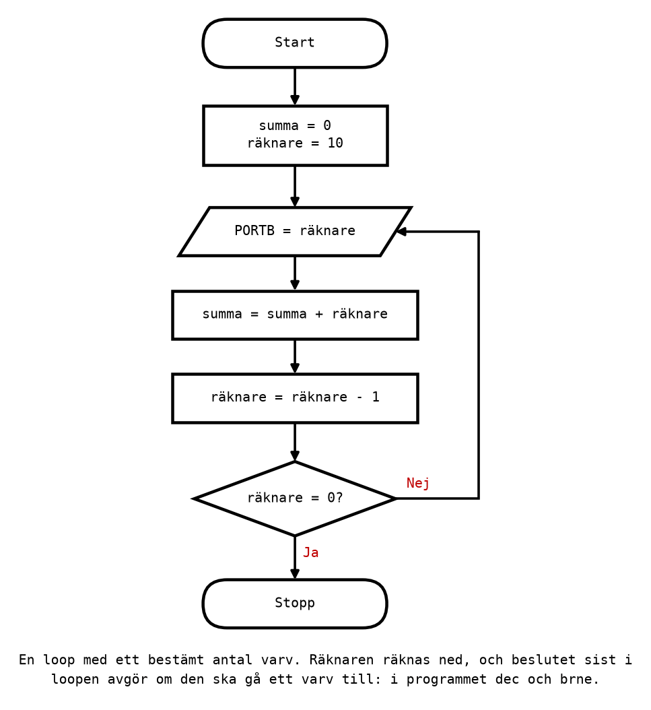
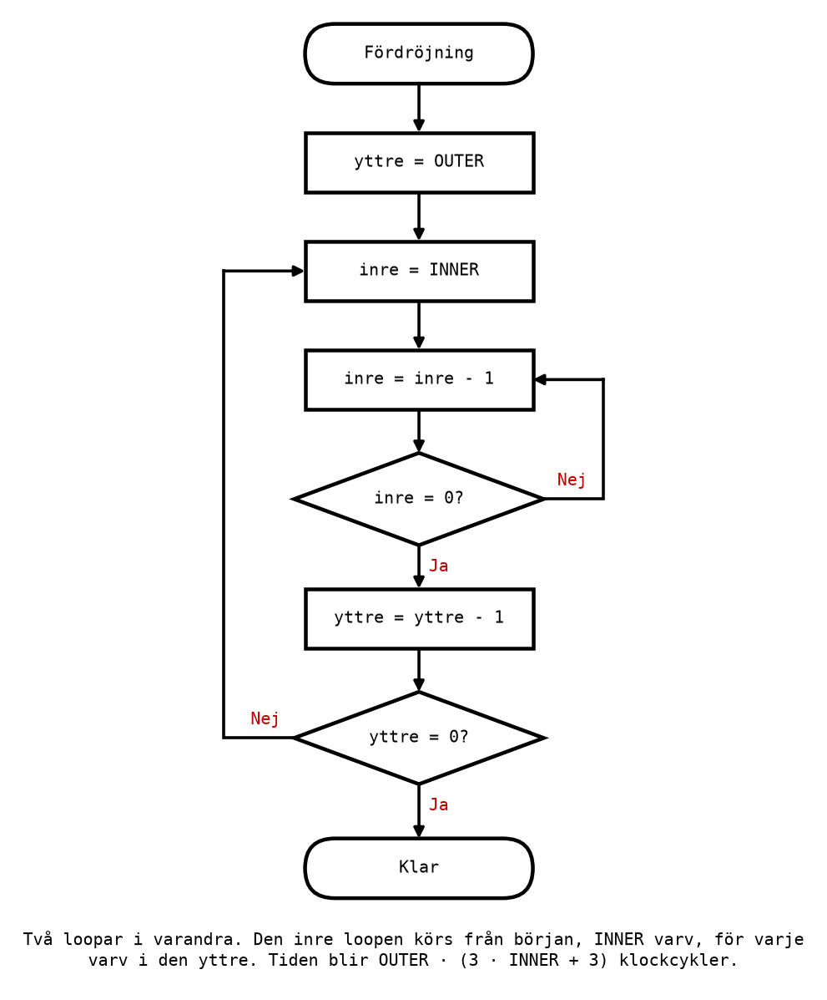

# Appendix B - Loopar och tidsfördröjningar

## B.1 En loop med ett bestämt antal varv
En **loop** är en del av programmet som körs om och om igen. Den byggs med ett hopp bakåt, till en
etikett före det som ska upprepas. Oftast ska loopen gå ett bestämt antal varv, och då behövs en
**räknare**: ett register som räknas ned för varje varv, tills det blir noll.

Programmet [`count_loop.asm`](../examples/count_loop.asm) räknar ut summan 1 + 2 + ... + 10:



```asm
    clr r17                         ; r17 = the sum so far = 0
    ldi r16, 10                     ; r16 = the counter: laps left to run

loop:
    out PORTB, r16                  ; Show the counter.
    add r17, r16                    ; sum = sum + counter
    dec r16                         ; One lap fewer left. Sets Z when it reaches 0.
    brne loop                       ; Not zero yet: go round again.
```

Nyckeln är de två sista raderna. `dec r16` minskar räknaren och sätter `Z = 1` när den når noll.
`brne loop` hoppar tillbaka så länge `Z = 0`, alltså så länge räknaren inte är noll. Ingen `cpi`
behövs: `dec` sätter själv den flagga hoppet läser.

Följ räknaren: den börjar på 10, och `brne` hoppar tillbaka när den är 9, 8, ..., 1. När `dec` gör
den till 0 hoppar `brne` inte, och programmet fortsätter efter loopen. Loopen går alltså **10
varv**, lika många som räknarens startvärde, och summan blir 10 + 9 + ... + 1 = 55.

**En fälla: startvärdet 0.** Om räknaren börjar på 0 gör den första `dec` den till 255, och loopen
går **256 varv**, inte noll. En loop med testet sist körs alltid minst en gång.

---

## B.2 Testet först eller sist
Loopen i B.1 har testet **sist**: först görs arbetet, sedan frågar `brne` om det ska göras igen. Det
är den kortaste formen, och den som används mest i assembler.

Om loopen ska kunna gå **noll** varv måste testet stå **först**:

```asm
    tst r16                         ; Is the counter already zero?
loop:
    breq done                       ; Yes: leave before doing any work.
    add r17, r16
    dec r16                         ; Sets Z for the breq at the top.
    rjmp loop
done:
```

Nu hoppar `breq` ut direkt om räknaren är noll från början. Priset är en instruktion till per varv,
`rjmp`, och en klockcykel till: `breq` som inte hoppar och `rjmp` tar 1 + 2 cykler, mot 2 för `brne`
som hoppar. Välj formen efter om noll varv kan förekomma.

---

## B.3 Vad en instruktion kostar i tid
Ett program som tänder en lysdiod och sedan släcker den gör det på en bråkdel av en mikrosekund.
För att ögat ska hinna se något, eller för att ett relä ska hinna dra, eller för att ett trafikljus
ska lysa grönt i några sekunder, måste programmet **vänta**. En **tidsfördröjning** är en loop som
inte gör något annat än att ta tid.

Hur mycket tid den tar går att räkna ut exakt, eftersom varje instruktion tar ett fast antal
klockcykler ([L07 Appendix A.7](../../L07/appendix/a_avr_core.md#a7-en-instruktion-per-klockcykel)):

| Klockcykler | Instruktioner |
|-------------|---------------|
| 1 | `ldi` `mov` `add` `sub` `subi` `inc` `dec` `and` `or` `eor` `com` `cp` `cpi` `lsl` `lsr` `rol` `ror` `in` `out` `nop` |
| 2 | `rjmp` `sbi` `cbi` |
| 1 eller 2 | `breq` `brne` `brlo` `brsh` och de andra villkorliga hoppen: 1 om de inte hoppar, 2 om de hoppar |

Vid 16 MHz tar en klockcykel 62,5 ns, och 16 cykler tar en mikrosekund. Hela tabellen, med fler
instruktioner, finns på [referensbladet](../../../info/avr_instructions.md).

---

## B.4 En kort tidsfördröjning
Den enklaste fördröjningen är en loop som räknar ned ett register, som i
[`short_delay.asm`](../examples/short_delay.asm):

```asm
delay_start:
    ldi r18, 200                    ; 1 cycle
delay_loop:
    dec r18                         ; 1 cycle per lap
    brne delay_loop                 ; 2 cycles per lap, 1 on the last
delay_end:
```

Räkna ut kostnaden med en rad per instruktion: vad den kostar, hur många gånger den körs, och
produkten. `brne` får två rader, eftersom den kostar olika mycket när den hoppar och när den inte
gör det.

| Instruktion | Cykler | Gånger | Summa |
|-------------|--------|--------|-------|
| `ldi r18, 200` | 1 | 1 | 1 |
| `dec r18` | 1 | 200 | 200 |
| `brne`, hoppar | 2 | 199 | 398 |
| `brne`, hoppar inte | 1 | 1 | 1 |
| **Totalt** | | | **600** |

600 cykler är 600 · 62,5 ns = **37,5 µs**. Det svåra i tabellen är kolumnen *Gånger*: `brne` körs
200 gånger, men hoppar bara 199 av dem, eftersom den sista gången, när räknaren har blivit noll, går
programmet vidare.

Med ett annat antal varv, n, blir summan 1 + n + 2(n - 1) + 1 = **3n** klockcykler. Det är en
formel värd att komma ihåg:
* **Önskad tid → antal varv.** 30 µs är 30 · 16 = 480 cykler, och n = 480 / 3 = 160.
* **Längsta möjliga.** Ett register rymmer högst 255, men startvärdet 0 ger 256 varv (B.1): 768
  cykler, 48 µs. Längre än så räcker inte en loop.

---

## B.5 En längre tidsfördröjning
För att vänta längre läggs en loop **inuti** en annan. Den inre loopen är fördröjningen från B.4.
Den yttre upprepar den ett antal gånger:



Programmet [`long_delay.asm`](../examples/long_delay.asm):

```asm
delay_start:
    ldi r19, OUTER                  ; 1 cycle
delay_outer:
    ldi r18, INNER                  ; 1 cycle per outer lap
delay_inner:
    dec r18                         ; 1 cycle per inner lap
    brne delay_inner                ; 2 per inner lap, 1 on the last
    dec r19                         ; 1 cycle per outer lap
    brne delay_outer                ; 2 per outer lap, 1 on the last
delay_end:
```

Räkna ut det i två steg:
1. **Ett varv i den yttre loopen.** `ldi r18` (1), den inre loopen utan sin `ldi` (3 · INNER - 1),
   `dec r19` (1) och `brne` som hoppar (2): 3 · INNER + 3 cykler. Det sista yttre varvet är en cykel
   kortare, eftersom `brne` då inte hoppar.
2. **Hela fördröjningen.** `ldi r19` (1), plus OUTER varv, minus den cykel det sista varvet sparar:

```math
\text{cykler} = \text{OUTER} \cdot (3 \cdot \text{INNER} + 3)
```

Med OUTER = 208 och INNER = 255 blir det 208 · 768 = **159 744 cykler**, vilket är
159 744 · 62,5 ns = **9,984 ms**. Nästan 10 ms.

### Att träffa exakt
Formeln ger bara vissa tider. 10 ms är 160 000 cykler, och 160 000 är inte delbart med 3, så ingen
kombination av OUTER och INNER ger exakt 10 ms. Lösningen är att lägga till en `nop`, som inte gör
något annat än att ta en cykel, i den yttre loopen. Då kostar varje yttre varv en cykel mer:

```math
\text{cykler} = \text{OUTER} \cdot (3 \cdot \text{INNER} + 4)
```

och OUTER = 250, INNER = 212 ger 250 · 640 = **160 000 cykler, exakt 10 ms**. Det gör du i Labb 3
del 16.

Så väljer du konstanterna för en önskad tid:
1. Räkna om tiden till cykler: tid i µs · 16.
2. Välj INNER så stort som möjligt, 255, och räkna ut OUTER = cykler / 768. Avrunda.
3. Räkna ut vad det faktiskt blir. Behövs mer precision, prova andra kombinationer, eller lägg till
   `nop`.

Med två loopar räcker det till ungefär 256 · 771 cykler, knappt 12,4 ms. För längre tider, en halv
sekund för en blinkande lysdiod, behövs en loop till eller en räknare med 16 bitar, som i
[L10](../../L10/README.md).

---

## B.6 Mät med stoppuret
Ett räknat värde är en förutsägelse. Kontrollera det med simulatorns stoppur, enligt
[info/microchip_studio.md, avsnitt
4.4](../../../info/microchip_studio.md#44-brytpunkter-och-cykelräknaren):
1. Kontrollera att **Frequency** i Processor Status står på **16 MHz**.
2. Sätt en brytpunkt på raden `delay_start` och en på raden `delay_end`.
3. Kör till den första med **F5**, nollställ stoppuret, och kör till den andra.
4. Läs av **Cycle Counter** eller **Stop Watch**.

För `short_delay.asm` ska stoppuret visa exakt 600 cykler, 37,5 µs, och för `long_delay.asm` 159 744
cykler. Instruktionen där en brytpunkt sitter har ännu inte körts när programmet stannar, så
mätningen från `delay_start` till `delay_end` omfattar precis fördröjningen: `ldi` men inte
instruktionen efter.

**Om mätningen inte stämmer med räkningen** är det nästan alltid räkningen som är fel. Kontrollera
först kolumnen *Gånger* för hoppen, och sedan var brytpunkterna sitter: en brytpunkt en rad för
tidigt eller för sent tar med eller utelämnar en instruktion. Att stämma av en räkning mot en
mätning och förklara skillnaden är det kontrolluppgiften i [Appendix C](./c_exercises.md) handlar
om.

---
