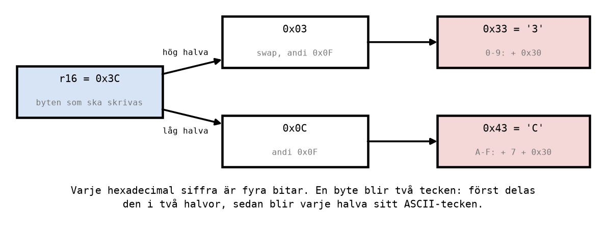
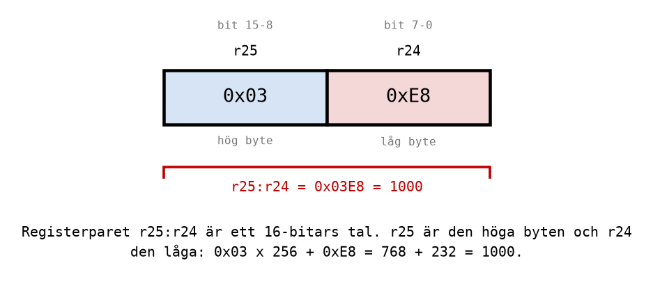

# Appendix A - ASCII-koder och 16-bitarstal

## A.1 Tecken är också tal
En mikrodator känner bara till tal. Ett tecken, en bokstav eller en siffra på en display, är ett tal
som alla har kommit överens om att tolka som ett visst tecken. Den överenskommelse som nästan all
elektronik använder heter **ASCII**, och den gicks igenom i
[L01 Appendix B](../../L01/appendix/b_binary_codes.md). Här behövs bara en liten del av tabellen:

| Tecken | ASCII-kod | | Tecken | ASCII-kod |
|--------|-----------|-|--------|-----------|
| `'0'` | `0x30` | | `'A'` | `0x41` |
| `'1'` | `0x31` | | `'B'` | `0x42` |
| `'2'` | `0x32` | | `'C'` | `0x43` |
| ... | ... | | `'D'` | `0x44` |
| `'8'` | `0x38` | | `'E'` | `0x45` |
| `'9'` | `0x39` | | `'F'` | `0x46` |

Två saker i tabellen gör resten av det här appendixet möjligt:
* **Siffrorna ligger i ordning.** Tecknet för siffran `n` har koden `0x30 + n`. Tecknet `'7'` är
  alltså `0x37`, och siffran 7 blir ett tecken genom att man adderar `0x30`.
* **Bokstäverna ligger också i ordning, men inte direkt efter siffrorna.** Efter `'9'` (`0x39`)
  kommer sju andra tecken (`:`, `;`, `<` och så vidare) innan `'A'` (`0x41`). Den luckan på sju
  kommer att dyka upp i koden.

Assemblern känner till tecken. `ldi r16, 'A'` betyder precis samma sak som `ldi r16, 0x41`, och det
är ofta det tydligaste sättet att skriva en konstant som är tänkt som ett tecken.

Varför behövs det här? Så fort ett tal ska visas för en människa, på en display, i ett
terminalfönster eller i en logg, måste det göras om till tecken. Talet `0x3C` i ett register är en
byte; texten "3C" på en skärm är två byte, `0x33` och `0x43`.

---

## A.2 En siffra blir ett tecken
Ett värde 0-15 ska bli tecknet för sin hexadecimala siffra, `'0'`-`'9'` eller `'A'`-`'F'`.

**Värdet 0-9:** addera `0x30`. Värdet 7 blir `0x37`, som är `'7'`.

**Värdet 10-15:** addera `0x30` och sju till. Värdet 10 blir `0x0A + 0x07 + 0x30 = 0x41`, som är
`'A'`. De sju extra är luckan mellan `'9'` och `'A'` från A.1.

AVR saknar en instruktion som adderar en konstant till ett enskilt register. Men att subtrahera ett
negativt tal är samma sak som att addera, så `subi r24, -0x30` adderar `0x30` (se
[L08 Appendix A](../../L08/appendix/a_arithmetic_and_flags.md)). Hela omvandlingen blir fyra
instruktioner och en etikett:

```asm
    cpi r24, 10                     ; A digit 0-9, or a letter A-F?
    brlo digit                      ; 0-9: skip the extra step.
    subi r24, -7                    ; A-F: add 7 more, so that 10 lands on 'A'.
digit:
    subi r24, -0x30                 ; Add 0x30, the ASCII code for '0'.
```

Följ två värden genom koden:

| `r24` före | `cpi r24, 10` | Hopp? | Efter `subi r24, -7` | Efter `subi r24, -0x30` |
|------------|---------------|-------|----------------------|-------------------------|
| `0x03` | 3 < 10, C = 1 | ja, `brlo` hoppar | (körs inte) | `0x33` = `'3'` |
| `0x0C` | 12 ≥ 10, C = 0 | nej | `0x13` | `0x43` = `'C'` |

> **Flaggorna efter `subi` med ett negativt tal** beter sig som vid en subtraktion, inte som vid en
> addition: `C` blir 1 när det *inte* blev någon minnessiffra i additionen. Här spelar det ingen
> roll, eftersom ingenting läser flaggorna efteråt. Men bygg aldrig ett villkorligt hopp på
> flaggorna efter ett sådant `subi`.

---

## A.3 En byte blir två tecken
En byte är två hexadecimala siffror, och varje siffra är fyra bitar, en **nibble** ([L01 Appendix
A](../../L01/appendix/a_number_systems.md)). För att skriva ut byten `0x3C` ska den höga nibblen `3`
och den låga nibblen `C` göras om var för sig.



**Den låga nibblen** får man genom att nollställa de fyra höga bitarna med en mask: `andi r24, 0x0F`
behåller bit 0-3 och nollställer bit 4-7. `0x3C` blir `0x0C`.

**Den höga nibblen** får man med en ny instruktion, **`swap`**, som byter plats på ett registers två
halvor: `0x3C` blir `0xC3`. Därefter gör samma mask som nyss att `0x03` blir kvar. `swap` tar en
cykel och påverkar inga flaggor.

Hela programmet, [`hex_to_ascii.asm`](../examples/hex_to_ascii.asm), gör om `0x3C` i `r16` till
tecknen `'3'` i `r20` och `'C'` i `r21`:

```asm
main:
    ldi r16, 0x3C                   ; The byte to convert.

    ; The high nibble: 0x3C -> 0x03 -> '3'.
    mov r24, r16                    ; Work on a copy, so r16 keeps its value.
    swap r24                        ; Swap the two nibbles: 0x3C -> 0xC3.
    andi r24, 0x0F                  ; Keep only the low nibble: 0xC3 -> 0x03.
    cpi r24, 10                     ; A digit 0-9, or a letter A-F?
    brlo high_digit                 ; 0-9: skip the extra step.
    subi r24, -7                    ; A-F: add 7 more, so that 10 lands on 'A'.
high_digit:
    subi r24, -0x30                 ; Add 0x30, the ASCII code for '0'.
    mov r20, r24                    ; r20 = '3' = 0x33.

    ; The low nibble: 0x3C -> 0x0C -> 'C'.
    mov r24, r16
    andi r24, 0x0F                  ; Keep only the low nibble: 0x3C -> 0x0C.
    cpi r24, 10
    brlo low_digit
    subi r24, -7
low_digit:
    subi r24, -0x30
    mov r21, r24                    ; r21 = 'C' = 0x43.
```

Lägg märke till att samma fem rader står två gånger, bara med olika etiketter. Det är ett tecken på
att de borde vara en **subrutin**, något man skriver en gång och anropar två gånger. Det är ämnet
för [Appendix C](./c_subroutines_and_stack.md), och i
[C.9](./c_subroutines_and_stack.md#c9-hex-till-ascii-som-subrutin) skrivs det här programmet om så.

---

## A.4 Tillbaka från tecken till värde
Omvänt: ett tecken `'0'`-`'9'` eller `'A'`-`'F'` ska bli sitt värde 0-15. Det är samma steg i omvänd
ordning:
1. Subtrahera `0x30`. En siffra är nu klar: `'7'` (`0x37`) blir 7.
2. En bokstav blev 17 eller mer: `'A'` (`0x41`) blir `0x11` = 17. Subtrahera sju till.

```asm
    subi r22, 0x30                  ; '0'-'9' -> 0-9, 'A'-'F' -> 17-22.
    cpi r22, 10
    brlo done                       ; A digit: done.
    subi r22, 7                     ; A letter: 17-22 -> 10-15.
done:
```

Det är så en mikrodator tolkar ett tal som någon har skrivit in på ett tangentbord: varje tangent
skickar ett tecken, och programmet gör om tecknen till tal.

---

## A.5 Att lägga text i minnet
Hittills har varje värde legat i ett register. Text brukar i stället ligga i **dataminnet**, SRAM,
en byte per tecken efter varandra ([L07 Appendix A](../../L07/appendix/a_avr_core.md)). En ny
instruktion skriver ett register till en adress i dataminnet:

```asm
    sts 0x0100, r20                 ; Store r20 at data address 0x0100.
    sts 0x0101, r21                 ; ... and r21 right after it.
```

**`sts`** (*store direct to data space*) tar en adress och ett register, och tar två cykler.
Motsatsen, **`lds r16, 0x0100`**, läser tillbaka byten till ett register. SRAM börjar på adress
`0x0100`, så de adresserna är lediga att använda för egna data.

Lägg till de två raderna sist i programmet i A.3, så hamnar tecknen `'3'` och `'C'` efter varandra i
minnet. I Microchip Studio syns de i fönstret **Memory** med **data IRAM** valt
([info/microchip_studio.md, avsnitt 4.3](../../../info/microchip_studio.md#43-fönstren-du-behöver)).
Till höger om bytena `33 43` visar fönstret samma byte tolkade som ASCII, och där står texten `3C`.

---

## A.6 Tal större än 255
Ett register är åtta bitar, och åtta bitar räcker till talen 0-255. Det räcker långt, men inte till
allt: ett räknevärde på 1000, en fördröjning på en sekund, eller en adress i ett minne på 2048 byte.

Lösningen är att använda **två register tillsammans**, som ett 16-bitars tal. Det ena håller den
**höga byten** (bit 15-8) och det andra den **låga byten** (bit 7-0). Ett sådant **registerpar**
skrivs med det höga registret först, till exempel `r25:r24`.



Talet 1000 är `0x03E8`. Den höga byten är `0x03` och den låga `0xE8`, och värdet är
`0x03 · 256 + 0xE8 = 768 + 232 = 1000`. En etta i den höga byten är alltså värd 256.

Assemblern delar upp ett 16-bitars tal åt dig, med `low()` och `high()`:

```asm
    ldi r24, low(1000)              ; r24 = 0xE8, the low byte.
    ldi r25, high(1000)             ; r25 = 0x03, the high byte.
```

Med 16 bitar går det att räkna till `2^16 - 1 = 65 535`. Paren `r25:r24`, `r27:r26`, `r29:r28` och
`r31:r30` används oftast, av skäl som A.8 visar.

---

## A.7 Addition och subtraktion med 16 bitar
Processorn räknar fortfarande åtta bitar i taget. En 16-bitars addition görs därför i två steg, på
samma sätt som när man adderar för hand med minnessiffra ([L01 Appendix
A](../../L01/appendix/a_number_systems.md)): först de låga bytena, sedan de höga bytena **plus
minnessiffran** från det första steget.

Minnessiffran hamnar i flaggan `C`, och det finns en instruktion som tar med den: **`adc`** (*add
with carry*) beräknar `Rd = Rd + Rr + C`.

Exempel: 1000 + 2000 = 3000, eller `0x03E8 + 0x07D0`.

```text
                 r25    r24
                0x03   0xE8      1000
             +  0x07   0xD0      2000
             ---------------
  add r24:             0x1B8  -> r24 = 0xB8, C = 1   (0xE8 + 0xD0 = 0x1B8 får inte plats)
  adc r25:     0x03 + 0x07 + 1 = 0x0B
             ---------------
                0x0B   0xB8      3000
```

```asm
    ldi r24, low(1000)              ; r25:r24 = 1000 = 0x03E8.
    ldi r25, high(1000)
    ldi r22, low(2000)              ; r23:r22 = 2000 = 0x07D0.
    ldi r23, high(2000)
    add r24, r22                    ; Low bytes: 0xE8 + 0xD0 = 0x1B8. r24 = 0xB8, C = 1.
    adc r25, r23                    ; High bytes and the carry: 0x03 + 0x07 + 1 = 0x0B.
```

Utan `adc`, med `add` även för de höga bytena, hade svaret blivit `0x0AB8` = 2744: minnessiffran
hade försvunnit, och felet hade varit exakt 256. Ett fel på 256 i ett 16-bitars resultat är nästan
alltid en glömd minnessiffra.

Subtraktion fungerar likadant. **`sub`** tar de låga bytena, och **`sbc`** (*subtract with carry*)
tar de höga bytena minus lånet i `C`: `Rd = Rd - Rr - C`.

```asm
    sub r20, r22                    ; Low bytes first; a borrow lands in C ...
    sbc r21, r23                    ; ... and sbc subtracts it from the high bytes.
```

**Ordningen spelar roll:** de låga bytena först, alltid. Det är den operationen som ger `C`, och den
höga behöver det.

---

## A.8 adiw, sbiw och movw
Tre instruktioner arbetar på ett helt registerpar på en gång:

| Instruktion | Gör | Cykler |
|-------------|-----|--------|
| `adiw r24, 1` | `r25:r24 = r25:r24 + 1`. Konstanten får vara 0-63. | 2 |
| `sbiw r24, 1` | `r25:r24 = r25:r24 - 1`. Konstanten får vara 0-63. | 2 |
| `movw r18, r24` | Kopierar paret: `r19:r18 = r25:r24`. | 1 |

Man skriver bara det låga registret i paret; det höga följer med. `adiw` och `sbiw` fungerar bara på
de fyra paren `r25:r24`, `r27:r26`, `r29:r28` och `r31:r30`, vilket är varför de paren används mest.
`movw` fungerar på alla par vars låga register har jämnt nummer.

Det viktigaste med `sbiw` är flaggan **Z**: den blir 1 när **hela** 16-bitarstalet blev noll, inte
bara den ena byten. Därför kan `sbiw` följt av `brne` räkna ned ett 16-bitars tal till noll, vilket
är precis vad en lång fördröjning behöver (A.10).

[`add16.asm`](../examples/add16.asm) visar alla tre: efter additionen i A.7 kopieras 3000 till
`r19:r18` med `movw`, och `r25:r24` blir sedan 3001 med `adiw` och 2999 med `sbiw`.

---

## A.9 Att jämföra 16-bitarstal
En jämförelse görs också byte för byte. `cpi` jämför de låga bytena, och **`cpc`** (*compare with
carry*) jämför de höga bytena och tar hänsyn till resultatet av den första jämförelsen. Efter paret
säger `Z` om talen var lika, och `C` om det första var mindre, precis som för 8-bitarstal.

```asm
    ldi r16, high(1000)             ; cpc compares with a register, not a constant.
count:
    adiw r24, 1                     ; r25:r24 = r25:r24 + 1.
    cpi r24, low(1000)              ; Compare the low bytes ...
    cpc r25, r16                    ; ... then the high bytes.
    brne count                      ; Not 1000 yet: again.
```

`cpc` finns bara i en form som jämför två register. Det finns ingen `cpci`, så den höga byten av
konstanten måste först laddas i ett eget register, här `r16`.

Loopen räknar `r25:r24` från 0 till 1000. Varje varv tar `2 + 1 + 1 + 2 = 6` cykler, utom det sista,
där `brne` inte hoppar och tar en cykel: `1000 · 6 - 1 = 5999` cykler.

---

## A.10 En lång tidsfördröjning
Fördröjningarna i [L09 Appendix B](../../L09/appendix/b_loops_and_delays.md) räknade med 8-bitars
register. En loop med `dec` och `brne` kan gå högst 256 varv, och med 3 cykler per varv blir det
ungefär 768 cykler, 48 µs. Två sådana loopar i varandra räcker till ungefär 200 000 cykler, drygt 12
ms. För en sekund, 16 000 000 cykler vid 16 MHz, behövs mer.

Med en 16-bitars loop kan den inre loopen gå upp till 65 535 varv. En sådan loop med `sbiw` och
`brne` tar 4 cykler per varv:

```asm
    ldi r24, low(INNER_TURNS)       ; 1 cycle.
    ldi r25, high(INNER_TURNS)      ; 1 cycle.
inner:
    sbiw r24, 1                     ; 2 cycles.
    brne inner                      ; 2 cycles while not 0, 1 the last time.
```

Med `N` varv tar loopen `4N - 1` cykler: `N` varv om 4 cykler, minus en eftersom den sista `brne`
inte hoppar. Det räcker till ungefär 262 000 cykler, 16 ms. För en hel sekund läggs ytterligare en
loop utanför, som kör den inre loopen `M` gånger. Hela fördröjningen i
[`one_second_delay.asm`](../examples/one_second_delay.asm):

```asm
.equ OUTER_TURNS = 80               ; Outer loop: 80 turns.
.equ INNER_TURNS = 49999            ; Inner loop: 49 999 turns of 4 cycles each.

delay_begin:
    ldi r20, OUTER_TURNS            ; 1 cycle.
outer:
    ldi r24, low(INNER_TURNS)       ; 1 cycle.
    ldi r25, high(INNER_TURNS)      ; 1 cycle.
inner:
    sbiw r24, 1                     ; 2 cycles: r25:r24 = r25:r24 - 1.
    brne inner                      ; 2 cycles while r25:r24 is not 0, 1 the last time.
    dec r20                         ; 1 cycle.
    brne outer                      ; 2 cycles while r20 is not 0, 1 the last time.
delay_end:
```

Räkna rad för rad, som i L09:

| Instruktion | Cykler | Gånger | Summa |
|-------------|--------|--------|-------|
| `ldi r20` | 1 | 1 | 1 |
| `ldi r24`, `ldi r25` | 1 + 1 | `M` | `2M` |
| inre loopen | `4N - 1` | `M` | `M(4N - 1)` |
| `dec r20` | 1 | `M` | `M` |
| `brne outer`, hoppar | 2 | `M - 1` | `2M - 2` |
| `brne outer`, hoppar inte | 1 | 1 | 1 |

Summan är `M(4N + 4)`. Ett varv i den yttre loopen tar alltså `4N + 4` cykler, och med `N = 49 999`
blir det exakt 200 000 cykler, 12,5 ms. Då behövs `M = 16 000 000 / 200 000 = 80` varv för en
sekund:

```text
M(4N + 4) = 80 · (4 · 49 999 + 4) = 80 · 200 000 = 16 000 000 cykler = 1,000000 s
```

Simulatorn mäter också 16 000 000 cykler mellan `delay_begin` och `delay_end`. Så väljer man
konstanterna för en önskad tid:
1. Räkna om tiden till cykler: tid · 16 000 000.
2. Välj ett jämnt varv för den yttre loopen, till exempel 200 000 cykler, och räkna ut `N` ur
   `4N + 4 = 200 000`.
3. Dela antalet cykler med varvtiden, så får du `M`. `M` måste vara 1-255.

> **Namnen på konstanter och etiketter får inte krocka.** Assemblern skiljer inte på stora och små
> bokstäver, så `.equ OUTER = 80` och etiketten `outer:` är samma namn, och programmet assembleras
> inte. Därför heter konstanterna `OUTER_TURNS` och `INNER_TURNS`.

---
