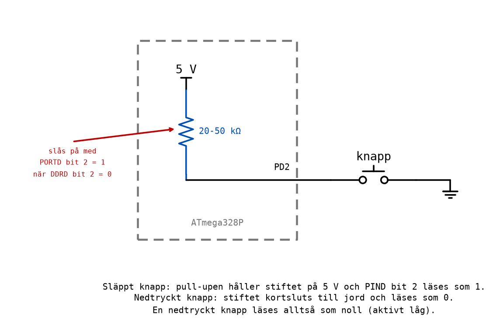

# Appendix B - Inporten

## B.1 Från utport till inport
I [L08 Appendix C](../../L08/appendix/c_output_port.md) styrde programmet lysdioder genom utporten:
`DDRB` gjorde stiften till utgångar och `PORTB` bestämde vad de skulle driva. Nu går informationen
åt andra hållet. En knapp, en brytare eller en givare ändrar nivån på ett stift, och programmet
läser av den.

Samma tre register per port används, men på ett annat sätt:

| Register | Som utgång (L08) | Som ingång (nu) |
|----------|------------------|-----------------|
| `DDRD` | biten är 1 | biten är **0** |
| `PORTD` | nivån som drivs ut | **1 = pull-up påslagen**, 0 = avslagen |
| `PIND` | (används inte) | **stiftets verkliga nivå**, att läsa |


Efter reset är alla bitar i `DDRx` noll, så varje stift börjar som ingång. Men en ingång som inte är
kopplad till något är **flytande**: den har ingen bestämd nivå, och `PINx` läser det brus som råkar
finnas på ledningen. Den kan visa 1 när du håller handen nära kortet och 0 när du tar bort den. En
flytande ingång är alltid ett fel, aldrig ett förval att lita på.

I kursen ligger knapparna på port D, Arduino-stift 2-7, och lysdioderna på port B, stift 8-13.

---

## B.2 Knappen och pull-up-motståndet
Det enklaste sättet att ansluta en knapp är mellan stiftet och jord, tillsammans med ett
**pull-up-motstånd** som håller stiftet högt när knappen är släppt. Motståndet behöver inte kopplas
in utanför kretsen: ATmega328P har ett inbyggt i varje stift, på 20-50 kΩ, som slås på genom att man
skriver en etta till biten i `PORTD` medan biten i `DDRD` är noll.



* **Knappen släppt:** ingenting drar ned stiftet, pull-upen håller det på 5 V, och `PIND` bit 2
  läses som **1**.
* **Knappen nedtryckt:** stiftet kortsluts till jord, och `PIND` bit 2 läses som **0**.

**En nedtryckt knapp läses alltså som noll.** Det kallas att knappen är **aktivt låg**. Det är
tvärtemot vad man väntar sig, och ett program som glömmer det gör exakt motsatsen till vad det ska,
varje gång. Det är åtminstone lätt att upptäcka.

Något liknande fanns redan i [L02](../../L02/README.md): en brytande kontakt och en slutande
kontakt ger motsatt logik. Här är det kopplingen, knapp mot jord med pull-up, som vänder på den.

Så här ställs stift PD2 in som ingång med pull-up:

```asm
    cbi DDRD, 2                     ; PD2 is an input (it already is after reset) ...
    sbi PORTD, 2                    ; ... with its pull-up switched on.
```

---

## B.3 Att läsa hela porten
`in r16, PIND` läser alla åtta stiften på port D på en gång, en bit per stift. Programmet
[`buttons_to_leds.asm`](../examples/buttons_to_leds.asm) visar varje knapp på lysdioden med samma
bitnummer:

```asm
main:
    ldi r16, 0x00
    out DDRD, r16                   ; Port D: all eight pins are inputs.
    ldi r16, 0xFF
    out PORTD, r16                  ; ... with their pull-ups switched on.
    out DDRB, r16                   ; Port B: all eight pins are outputs.

loop:
    in r16, PIND                    ; Read the level of all eight pins at once.
    com r16                         ; Invert: a pressed button (0) becomes a lit LED (1).
    out PORTB, r16                  ; Show the result.
    rjmp loop                       ; And again, for ever.
```

`com` inverterar varje bit ([L08 Appendix B](../../L08/appendix/b_logic_and_shifts.md)), så en
nedtryckt knapp, som läses som 0, blir en tänd lysdiod. Utan `com` hade alla lysdioder lyst när
ingen knapp var nedtryckt.

Följ en läsning där knapparna på PD2 och PD3 är nedtryckta:

| Steg | `r16` binärt | Förklaring |
|------|--------------|------------|
| `in r16, PIND` | `1111 0011` | Bit 2 och 3 är 0: de två knapparna är nedtryckta. |
| `com r16` | `0000 1100` | Nu är de nedtryckta knapparna ettor. |
| `out PORTB, r16` | `0000 1100` | Lysdioderna på PB2 och PB3 lyser. |

Programmet läser porten om och om igen, flera miljoner gånger i sekunden. Det kallas **pollning**:
programmet frågar hela tiden i stället för att bli meddelat. För en människa som trycker på en knapp
ser det ut som att lysdioden tänds i samma ögonblick.

Ofta är bara några av bitarna knappar. Då maskas de andra bort med `andi`, precis som i L08:

```asm
    in r16, PIND
    com r16                         ; Pressed = 1.
    andi r16, 0b00001100            ; Keep PD2 and PD3; clear the other six bits.
```

> **Stift 0 och 1 på Arduino-kortet** (PD0 och PD1) är kopplade till USB-kretsen och används när
> kortet programmeras. Använd dem inte till knappar. I simulatorn spelar det ingen roll, men på
> kortet gör det det.

---

## B.4 Att testa en enda bit: sbic och sbis
När programmet bara bryr sig om en knapp behöver det inte läsa hela porten. Två instruktioner testar
en enda bit i ett I/O-register och **hoppar över nästa instruktion** beroende på vad biten är:

| Instruktion | Hoppar över nästa instruktion om | Cykler |
|-------------|----------------------------------|--------|
| `sbic PIND, 2` | bit 2 i `PIND` är **0** (*skip if bit clear*) | 1 om den inte hoppar, 2 om den hoppar |
| `sbis PIND, 2` | bit 2 i `PIND` är **1** (*skip if bit set*) | 1 om den inte hoppar, 2 om den hoppar |

Den instruktion som hoppas över är nästan alltid ett `rjmp`. Paret `sbic` + `rjmp` blir då ett
villkorligt hopp: "hoppa hit om biten är 1".
[`led_follows_button.asm`](../examples/led_follows_button.asm) tänder lysdioden på PB5 så länge
knappen på PD2 hålls nedtryckt:

```asm
loop:
    sbic PIND, 2                    ; Skip the next instruction if PD2 is 0 (pressed).
    rjmp released                   ; PD2 is 1: the button is released.
pressed:
    sbi PORTB, 5                    ; Light the LED.
    rjmp loop
released:
    cbi PORTB, 5                    ; Turn the LED off.
    rjmp loop
```

Läs det som två fall:
* **Knappen släppt**, bit 2 är 1: `sbic` hoppar inte över något, `rjmp released` körs, och lysdioden
  släcks.
* **Knappen nedtryckt**, bit 2 är 0: `sbic` hoppar över `rjmp released`, programmet fortsätter på
  `pressed`, och lysdioden tänds.

Namnen är lätta att blanda ihop. Ett sätt att komma ihåg dem: *sbic* hoppar när biten är
**c**leared, nollställd, och *sbis* när den är **s**et, satt. Och eftersom knappen är aktivt låg
betyder "nollställd" här "nedtryckt".

`sbic` och `sbis` fungerar bara på de 32 första I/O-registren, vilket är de som portarna ligger i.
För en bit i ett vanligt register finns motsvarande `sbrc` och `sbrs`.

---

## B.5 Att vänta på en knapp
Ett vanligt behov är att programmet ska stå still tills någon trycker. Det är en loop som bara
består av testet:

```asm
wait_press:
    sbic PIND, 2                    ; Skip the jump when the button is pressed (0).
    rjmp wait_press                 ; Released: keep waiting.
    ; The button is pressed; the program continues here.
```

Och omvänt, för att vänta tills knappen släpps:

```asm
wait_release:
    sbis PIND, 2                    ; Skip the jump when the button is released (1).
    rjmp wait_release               ; Still pressed: keep waiting.
```

En väntan på ett tryck följd av en väntan på att knappen släpps är precis ett tryck. Men en riktig
knapp **studsar**: kontakterna sluts och öppnas flera gånger under några millisekunder innan de
ligger still, och ett program som räknar tryck kan räkna ett tryck som flera. Hur man hanterar det
tas upp i [L11 Appendix A](../../L11/appendix/a_control_objects.md#a4-knappar-som-studsar). I
simulatorn studsar ingenting.

---

## B.6 Logik i mjukvara
I [Labb 1](../../../labs/lab1/README.md) byggdes logiska funktioner av kontakter: två knappar i
serie tände lampan bara när båda var nedtryckta, AND, och två parallellt när minst en var det, OR.
Samma funktioner kan en mikrodator räkna ut i ett program, och då är det ett program och inte en
koppling som ändras när funktionen ska ändras.

Lampan på PB0 ska lysa när **båda** knapparna på PD2 och PD3 är nedtryckta:

```asm
loop:
    in r16, PIND                    ; Read the buttons.
    com r16                         ; Pressed = 1.
    andi r16, 0b00001100            ; Keep PD2 and PD3.
    cpi r16, 0b00001100             ; Both pressed?
    brne not_both
    sbi PORTB, 0                    ; Yes: PB0 on.
    rjmp loop
not_both:
    cbi PORTB, 0                    ; No: PB0 off.
    rjmp loop
```

Efter `andi` finns fyra möjliga värden, ett per kombination av de två knapparna. Bara ett av dem,
`0b00001100`, betyder att båda är nedtryckta, och det är det `cpi` letar efter. OR-funktionen, och
fler, är [Labb 3 del 21](../../../labs/lab3/d_io_and_subroutines.md).

Det här är skälet till att mikrodatorer har ersatt så mycket reläteknik: logiken ligger i ett
program, och samma kort kan göra en ny sak genom att programmeras om. En PLC är i grunden en
mikrodator med robusta in- och utgångar för 24 V.

---

## B.7 Att simulera en ingång
I simulatorn finns ingen knapp att trycka på. I stället ändrar du ingångens nivå för hand, i
fönstret **I/O** under **PORTD**, genom att klicka på biten i `PIND` ([info/microchip_studio.md,
avsnitt 4.5](../../../info/microchip_studio.md#45-simulera-en-ingång)).

Tänk på tre saker när du gör det:
* **Stoppa programmet först**, med en brytpunkt eller **Break All**, och ändra sedan biten.
  Programmet läser den nya nivån nästa gång det kör `in r16, PIND` eller `sbic PIND, 2`.
* **Kontrollera vad `PIND` visar efter att programmet har slagit på pull-uparna.** En släppt knapp
  ska läsas som 1. Om biten ändå visar 0, fyll i rutan för hand; det är så en släppt knapp ser ut.
* **En tom ruta är en nedtryckt knapp.** Det är aktivt låg logik även i simulatorn.

Förutsäg alltid först vad som ska hända, stega sedan, och jämför. En knapp i simulatorn är ett
ypperligt tillfälle att öva på det: du bestämmer själv exakt när den trycks ned.

---
