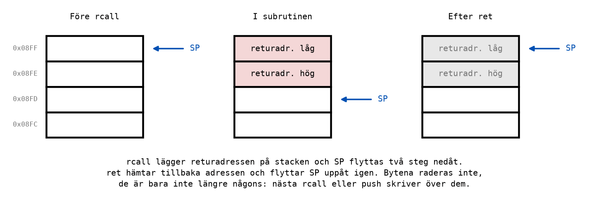
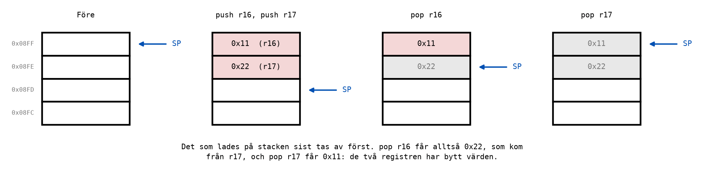
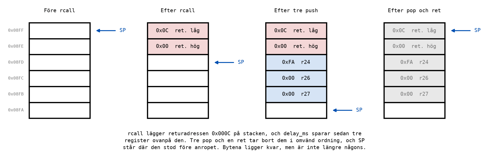

# Appendix C - Subrutiner och stacken

## C.1 Samma kod på flera ställen
Programmen har vuxit. Blinkprogrammet i
[Appendix A.10](./a_ascii_and_16bit.md#a10-en-lång-tidsfördröjning) har en fördröjning på nio rader,
och ett trafikljus behöver fyra fördröjningar av olika längd. Att skriva av samma nio rader fyra
gånger fungerar, men det är fyra ställen att rätta när något är fel, och fyra uppsättningar
etiketter som måste heta olika.

Hex-till-ASCII-programmet i [Appendix A.3](./a_ascii_and_16bit.md#a3-en-byte-blir-två-tecken) har
samma problem i liten skala: samma fem rader två gånger.

Lösningen är en **subrutin**: en bit kod som skrivs en gång, får ett namn, och **anropas** från så
många ställen som behövs. När subrutinen är klar fortsätter programmet där anropet gjordes. Andra
programspråk kallar samma sak en funktion eller en metod.

---

## C.2 rcall och ret
Två instruktioner räcker:

| Instruktion | Gör | Cykler |
|-------------|-----|--------|
| `rcall delay_ms` | Sparar adressen till instruktionen efter `rcall`, och hoppar till `delay_ms`. | 3 |
| `ret` | Hoppar tillbaka till den sparade adressen. | 4 |

Adressen som sparas kallas **returadressen**: den visar vart subrutinen ska återvända. Men var
sparas den? Inte i något av de 32 registren, utan på **stacken**, ett område i toppen av dataminnet.

```asm
loop:
    ...
    rcall delay_ms                  ; Save the address of rjmp loop, and jump.
    rjmp loop                       ; ret comes back here.

delay_ms:
    ...                             ; The subroutine's work.
    ret                             ; Jump back to the saved address.
```

Ett anrop kostar alltså 3 + 4 = 7 cykler innan subrutinen har gjort något alls. Det är lite, men det
är skälet till att en fördröjning i en subrutin blir några cykler längre än samma loop skriven
direkt i programmet.

---

## C.3 Stacken och stackpekaren
**Stacken** är en del av SRAM som används som en trave: det som läggs dit sist tas bort först. Den
börjar i toppen av dataminnet, på adress `RAMEND` = `0x08FF`, och växer **nedåt**, mot lägre
adresser.

**Stackpekaren**, `SP`, är ett 16-bitars register som pekar på den första lediga byten i stacken.
Den består av två I/O-register, `SPH` (hög byte) och `SPL` (låg byte).

Så här går ett anrop till, byte för byte:
1. Före `rcall` pekar `SP` på `0x08FF`, och stacken är tom.
2. `rcall` skriver returadressens låga byte på `0x08FF` och den höga på `0x08FE`, och flyttar `SP`
   två steg nedåt, till `0x08FD`. Sedan hoppar den.
3. `ret` flyttar `SP` två steg uppåt, läser returadressen, och hoppar dit.



Lägg märke till det sista: `ret` **raderar ingenting**. Bytena ligger kvar i minnet, men `SP` pekar
förbi dem, och nästa anrop skriver över dem.

### Att initiera stackpekaren
Ett program som använder subrutiner börjar med att peka `SP` på toppen av SRAM:

```asm
main:
    ldi r16, high(RAMEND)           ; Point the stack pointer at the top of SRAM,
    out SPH, r16                    ; high byte first ...
    ldi r16, low(RAMEND)
    out SPL, r16                    ; ... then the low byte. SP = 0x08FF.
```

På ATmega328P gör hårdvaran faktiskt redan detta vid varje reset, så i våra program ändrar de fyra
raderna ingenting. De skrivs ändå, av två skäl: många andra AVR-kretsar startar med `SP` = 0, och
ett program som hoppar in i ditt program utan reset, till exempel en bootloader, kan ha lämnat `SP`
var som helst. Fyra rader är billig försäkring, och de gör programmet begripligt för den som läser
det.

---

## C.4 En subrutin med parameter: delay_ms
En fördröjning som alltid är lika lång är till begränsad nytta. Bättre är en subrutin som får veta
hur länge den ska vänta. Värdet den får kallas en **parameter**, och i kursen lämnas den i ett
register före anropet, här `r24`:

```asm
    ldi r24, 250                    ; Wait 250 ms.
    rcall delay_ms
```

Hela subrutinen, från [`blink_subroutine.asm`](../examples/blink_subroutine.asm):

```asm
;--------------------------------------------------------------------------------
; delay_ms: Waits r24 milliseconds (1-255) at 16 MHz.
;
; Each turn of the outer loop takes exactly 16 000 cycles, 1 ms. With the rcall, the
; pushes, the pops and the ret, a call takes 16 000 x r24 + 18 cycles.
;--------------------------------------------------------------------------------
delay_ms:
    push r24                        ; Save the registers this subroutine changes.
    push r26
    push r27
delay_ms_outer:
    ldi r26, low(3999)              ; X = r27:r26 = 3999.
    ldi r27, high(3999)
delay_ms_inner:
    sbiw r26, 1                     ; 4 cycles per turn, 3 the last time.
    brne delay_ms_inner
    dec r24                         ; One more millisecond done.
    brne delay_ms_outer
    pop r27                         ; Restore them, in the opposite order.
    pop r26
    pop r24
    ret                             ; Back to the instruction after the rcall.
```

Uppbyggnaden är samma som sekundfördröjningen i
[A.10](./a_ascii_and_16bit.md#a10-en-lång-tidsfördröjning): en 16-bitars inre loop i en yttre loop.
Den yttre loopen räknar ned `r24`, en millisekund per varv. Ett varv tar `4 · 3999 + 4 = 16 000`
cykler, precis 1 ms vid 16 MHz.

Resten av cyklerna är subrutinens egna:

| Del | Cykler |
|-----|--------|
| `rcall` | 3 |
| tre `push` | 6 |
| `r24` varv om 16 000 cykler, minus 1 för sista `brne` | 16 000 · `r24` - 1 |
| tre `pop` | 6 |
| `ret` | 4 |

Summan är **16 000 · `r24` + 18** cykler. Med `r24` = 250 blir det 4 000 018 cykler, och det är
också vad simulatorn mäter mellan `rcall` och instruktionen efter. De 18 extra cyklerna tar drygt
en mikrosekund, en miljondels sekund. Ingen människa ser skillnad, men det är bra att veta var de
kommer ifrån.

Varför börjar och slutar subrutinen med `push` och `pop`? Det är ämnet för de två nästa avsnitten.

---

## C.5 push och pop
Stacken kan användas till mer än returadresser. Två instruktioner lägger dit och hämtar godtyckliga
register:

| Instruktion | Gör | Cykler |
|-------------|-----|--------|
| `push r16` | Skriver `r16` där `SP` pekar, och flyttar `SP` ett steg nedåt. | 2 |
| `pop r16` | Flyttar `SP` ett steg uppåt, och läser byten där till `r16`. | 2 |

Stacken är **sist in, först ut**. Programmet [`push_pop.asm`](../examples/push_pop.asm) visar vad
det betyder:

```asm
    ldi r16, 0x11
    ldi r17, 0x22
    push r16                        ; 0x08FF = 0x11, SP = 0x08FE.
    push r17                        ; 0x08FE = 0x22, SP = 0x08FD.
    pop r16                         ; r16 = 0x22 (the last one pushed), SP = 0x08FE.
    pop r17                         ; r17 = 0x11, SP = 0x08FF.
```



Registren har bytt värden, eftersom `pop r16` får det som lades dit sist. Vill man ha tillbaka samma
värden i samma register ska de hämtas i **omvänd ordning**: `push r16`, `push r17`, sedan `pop r17`,
`pop r16`.

---

## C.6 Kursens regel: spara det du ändrar
En subrutin använder register för sitt arbete. `delay_ms` räknar med `r24`, `r26` och `r27`. Men
programmet som anropar den kan ha något viktigt i just de registren, och det vet inte subrutinen.

Kursens regel är därför enkel:

> **En subrutin sparar varje register den ändrar med `push` när den börjar, och återställer dem med
> `pop` i omvänd ordning innan `ret`.** Undantaget är ett register som subrutinen är till för att
> lämna ett svar i; det ska stå i kommentaren ovanför subrutinen.

Med regeln behöver den som anropar en subrutin aldrig undra om ett register har ändrats. Efter
`rcall delay_ms` innehåller `r24` fortfarande 250, och därför kan samma parameter användas igen utan
att laddas om.

Så här ser stacken ut mitt i `delay_ms`, efter anropet och de tre `push`-instruktionerna, i
`blink_subroutine.asm`. `rcall` ligger på adress `0x000B` i programminnet, så returadressen är
`0x000C`:



Fem byte är upptagna: två för returadressen och tre för de sparade registren. `SP` pekar på
`0x08FA`. Tre `pop` tar bort registren i omvänd ordning, `ret` tar returadressen, och `SP` är
tillbaka på `0x08FF`.

### Vad som händer om man slarvar
Anta att `delay_ms` gör tre `push` men bara två `pop`. Då ligger en byte kvar ovanpå returadressen
när `ret` körs, och `ret` läser den byten som en del av adressen. Programmet hoppar till en adress
som ingen har bestämt, någonstans i programminnet, och fortsätter därifrån. Ingenting varnar. Ofta
hamnar programmet i tomt flashminne, kör igenom det, och börjar om från adress 0, så att det ser ut
som om kortet startar om av sig självt.

Det är därför regeln säger **varje** `push` har sin `pop`, i omvänd ordning. Ett fel här syns inte
när man läser koden rad för rad, men det syns direkt i simulatorn: stega fram till `ret` och titta
på `SP`. Står den inte där den stod när subrutinen började, stämmer inte stacken.

---

## C.7 Subrutiner som anropar subrutiner
En subrutin kan anropa en annan. Varje anrop lägger en ny returadress på stacken, och varje `ret`
tar bort den senaste, så programmet hittar alltid tillbaka i rätt ordning.

```asm
delay_500ms:
    push r24                        ; Save the register this subroutine changes.
    ldi r24, 250
    rcall delay_ms                  ; 250 ms. delay_ms saves r24, so it is still 250 ...
    rcall delay_ms                  ; ... and this is another 250 ms.
    pop r24
    ret
```

När huvudprogrammet anropar `delay_500ms`, som anropar `delay_ms`, ligger det på stacken:
* returadressen till huvudprogrammet, 2 byte;
* `r24`, sparat av `delay_500ms`, 1 byte;
* returadressen till `delay_500ms`, 2 byte;
* `r24`, `r26` och `r27`, sparade av `delay_ms`, 3 byte.

Åtta byte, och `SP` står på `0x08FF - 8 = 0x08F7`. Det är den djupaste punkten i programmet.

Lägg också märke till att det andra anropet av `delay_ms` fungerar utan att `r24` laddas om. Det är
regeln i C.6 som gör det möjligt.

---

## C.8 Hur mycket stack finns det?
SRAM är 2048 byte. Programmen i kursen använder som mest ett tiotal byte stack, så det finns gott om
plats. Men det finns ingen spärr: om stacken skulle växa ned i området där programmet har egna data,
till exempel texten i [A.5](./a_ascii_and_16bit.md#a5-att-lägga-text-i-minnet), skriver den över dem
utan varning.

Därför är det värt att räkna efter, på samma sätt som i C.7: två byte per anrop som pågår samtidigt,
och en byte per sparat register. Summan är stackens största djup.

---

## C.9 Hex-till-ASCII som subrutin
Nu kan programmet i [A.3](./a_ascii_and_16bit.md#a3-en-byte-blir-två-tecken) skrivas utan de dubbla
raderna. Omvandlingen av en nibble blir en subrutin som tar värdet 0-15 i `r24` och lämnar tecknet i
samma register. Det är just det undantag regeln i C.6 tillåter: `r24` är till för svaret, och
kommentaren säger det.

```asm
main:
    ldi r16, high(RAMEND)           ; SP = RAMEND.
    out SPH, r16
    ldi r16, low(RAMEND)
    out SPL, r16

    ldi r16, 0x3C                   ; The byte to convert.
    mov r24, r16
    swap r24
    andi r24, 0x0F                  ; The high nibble, 0x03.
    rcall nibble_to_ascii
    mov r20, r24                    ; r20 = '3'.
    mov r24, r16
    andi r24, 0x0F                  ; The low nibble, 0x0C.
    rcall nibble_to_ascii
    mov r21, r24                    ; r21 = 'C'.
end:
    rjmp end

;--------------------------------------------------------------------------------
; nibble_to_ascii: Turns the value 0-15 in r24 into its hexadecimal character.
; Returns the character in r24; changes no other register.
;--------------------------------------------------------------------------------
nibble_to_ascii:
    cpi r24, 10                     ; A digit 0-9, or a letter A-F?
    brlo nibble_digit
    subi r24, -7                    ; A-F: 7 more, so that 10 lands on 'A'.
nibble_digit:
    subi r24, -0x30                 ; Add the code for '0'.
    ret
```

Subrutinen ändrar flaggorna, med `cpi` och `subi`. Det gör nästan varje subrutin, och det är därför
huvudprogrammet aldrig ska räkna med att flaggorna är orörda efter ett anrop. Ett villkorligt hopp
ska alltid komma direkt efter den jämförelse det bygger på.

---
