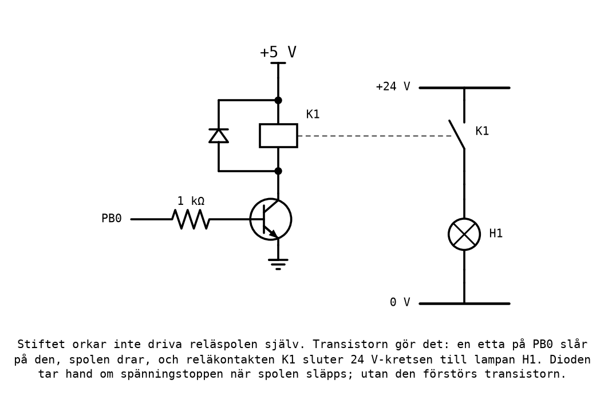
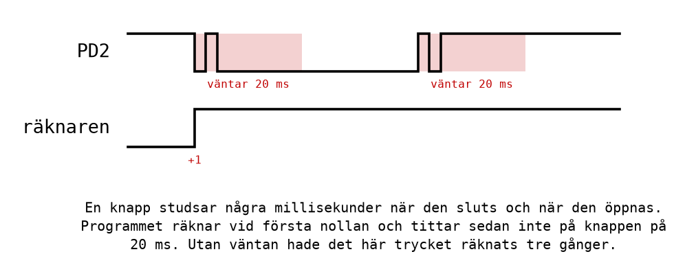
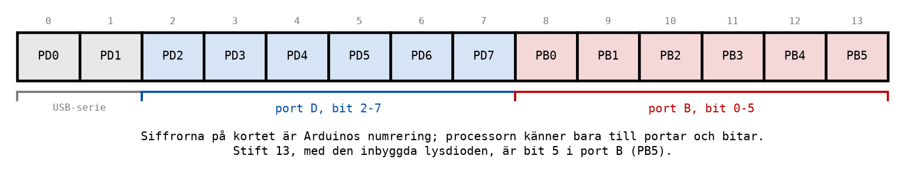
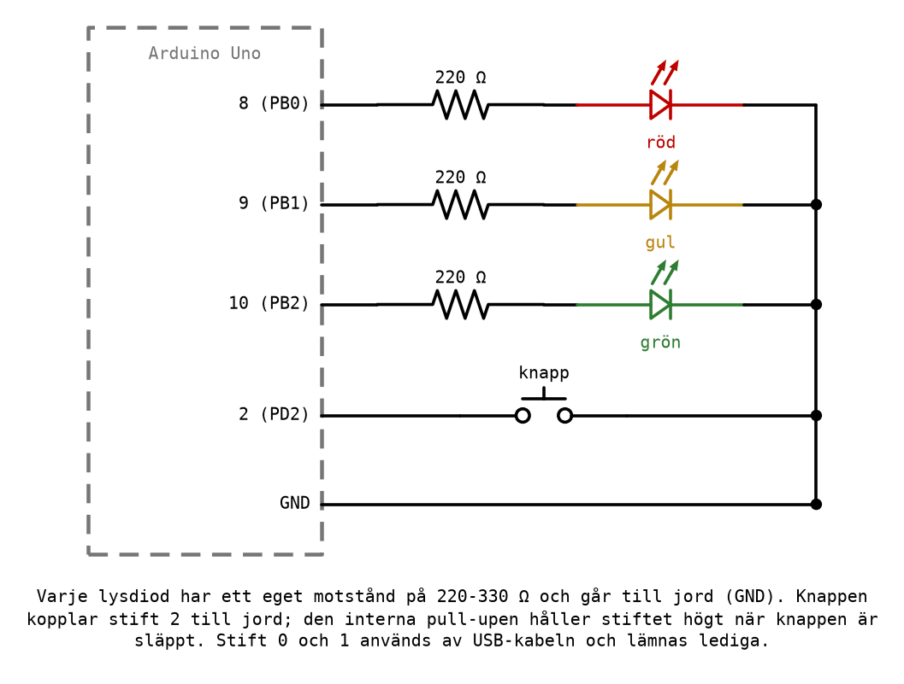

# Appendix A - Styrobjekt: in- och utgångar i verkligheten

## A.1 Vad ett styrobjekt är
Ett **styrobjekt** är det som ett styrsystem styr: en lampa, en motor, en ventil, en port, ett
trafikljus. Styrsystemet får veta hur det står till genom **ingångar**, knappar, brytare och givare,
och påverkar styrobjektet genom **utgångar**. Däremellan fattas besluten.

```text
   ingångar                    beslut                     utgångar
 knappar, givare   --->   mikrodatorns program   --->   lampor, reläer, motorer
```

Det är samma bild som kursen har ritat hela tiden, bara med olika saker i mitten:
* i [Labb 1](../../../labs/lab1/README.md) var besluten kontakternas koppling, och de ändrades med
  sladdarna;
* i [Labb 2](../../../labs/lab2/README.md) var de grindar i IC-kretsar, och de ändrades på
  kopplingsdäcket;
* nu är de ett program, och de ändras genom att programmet skrivs om.

Det sista är skälet till att nästan all styrning i dag görs med mikrodatorer. En PLC, den dator som
styr maskiner i industrin, är i grunden en mikrodator som läser ingångar, kör ett program och sätter
utgångar, om och om igen, med in- och utgångar byggda för 24 V och en elektriskt stökig omgivning.

I Labb 3 har programmen hittills körts i simulatorn, där en utgång är en ruta i ett fönster. Det här
appendixet handlar om vad som tillkommer när utgången är en riktig lysdiod och ingången en riktig
knapp.

---

## A.2 Lysdioden och förkopplingsmotståndet
En lysdiod kopplas från ett stift, genom ett motstånd, till jord. När stiftet är högt, 5 V, går det
en ström genom lysdioden och den lyser; när stiftet är lågt, 0 V, går ingen ström.


**Motståndet är inte valfritt.** En lysdiod är inte ett motstånd: spänningen över den är nästan
densamma oavsett ström, ungefär 2 V för en röd eller gul lysdiod och 2-3 V för en grön. Utan något
som begränsar strömmen blir den så stor som stiftet orkar leverera, och det räcker för att förstöra
lysdioden, och ibland stiftet.

Med motståndet i serie ligger resten av spänningen över motståndet, och strömmen följer av Ohms lag:

```text
I = (5 V - 2 V) / 220 Ω = 3 V / 220 Ω ≈ 13,6 mA
```

Så väljer man motstånd:
* ATmega328P tål **40 mA per stift** som absolut maximum, och bör hållas kring **20 mA** eller
  mindre i drift. Stiften i en grupp delar dessutom på en gemensam gräns, 100-150 mA beroende på
  kapsel och grupp; databladet anger exakt vilka stift som hör ihop. Räkna med 100 mA, så finns det
  marginal.
* En vanlig lysdiod lyser bra vid 5-15 mA. **220-330 Ω** ger 9-14 mA, och är vad kursen använder.
* Ett större motstånd ger en svagare lysdiod men är aldrig farligt. Ett för litet är det.

**Lysdioden måste vändas rätt.** Det långa benet, anoden, ska mot stiftet och motståndet, och det
korta, katoden, mot jord. Vänd fel lyser den inte alls, men den går inte sönder av det.

**Den andra kopplingen fungerar också.** En lysdiod kan kopplas från 5 V genom motståndet till
stiftet. Då lyser den när stiftet är **lågt**, och programmet måste skriva en nolla för att tända.
Det är inget fel, men det vänder på varje `sbi` och `cbi` i programmet, och ett program som skrivits
för den ena kopplingen gör exakt fel på den andra.

---

## A.3 Större laster: transistor och relä
Ett stift klarar en lysdiod, men inte en motor, en magnetventil eller glödlampan på 24 V från
[Labb 1](../../../labs/lab1/README.md). Då behövs något emellan, som låter en liten ström från
stiftet styra en stor ström i en annan krets.

Det vanligaste är en **transistor** som styr ett **relä**:



Så fungerar kopplingen:
1. En etta på PB0 ger en liten ström, under 5 mA, genom motståndet in i transistorns bas.
2. Transistorn leder, och en större ström går från 5 V genom reläets spole.
3. Spolen drar, och reläkontakten K1 sluter. Kontakten sitter i en helt annan krets, på 24 V, där
   den tänder lampan H1.

Reläkontakten är samma sorts slutande kontakt som i Labb 1, bara manövrerad av en spole i stället
för av ett finger. Mikrodatorn och 24 V-kretsen har inte ens gemensam jord: de hålls isär av reläet,
vilket är ett skäl att använda ett.

**Dioden över spolen är inte valfri.** En spole vill hålla sin ström igång. När transistorn slår av
blir det en kort spänningstopp på många tiotals volt över spolen, och utan dioden går den genom
transistorn och förstör den. Dioden ger strömmen en väg runt spolen tills den har klingat av.

I praktiken köper man ofta ett färdigt **reläkort** för Arduino, där transistor, diod och relä redan
sitter monterade, och kopplar det med tre sladdar: 5 V, jord och en signal från stiftet.

> **Koppla aldrig 24 V till Arduino-kortet eller kopplingsdäcket.** Kortet tål högst 5,5 V på sina
> stift. 24 V-kretsen hör hemma på reläkontaktens sida, och bara där.

---

## A.4 Knappar som studsar
En knapp i simulatorn går från 1 till 0 i ett enda ögonblick. En riktig knapp gör inte det. När två
metallkontakter slår ihop studsar de isär och ihop igen, flera gånger, under några millisekunder,
och samma sak händer när knappen släpps. Stiftet rapporterar troget varje studs:



För ett program som tänder en lampa så länge knappen hålls ned spelar det ingen roll: lampan flimrar
under några millisekunder, vilket ingen ser. Men för ett program som **räknar tryck**, eller växlar
något för varje tryck, är varje studs ett nytt tryck.

Programmet [`press_counter.asm`](../examples/press_counter.asm) räknar tryck på knappen på PD2 och
visar antalet binärt på PB0-PB3. I simulatorn prövades det med två tryck, där kontakten studsar en
gång både när den sluts och när den släpps, så att stiftet går 1-0-1-0 vid varje tryck och 0-1-0-1
vid varje släpp:
* **med** väntan efter varje ändring räknar programmet **2**;
* **utan** väntan räknar samma program **6**, tre för varje tryck.

Lösningen är att låta kontakten sätta sig. Efter varje ändring som programmet reagerar på väntar det
**20 ms**, längre än knappen studsar men kortare än ett mänskligt tryck, innan det tittar på knappen
igen:

```asm
loop:
wait_press:
    sbic PIND, BUTTON               ; Skip the jump when the button is pressed (0).
    rjmp wait_press
    inc r17                         ; One more press.
    andi r17, 0x0F                  ; Four LEDs: count 0-15 and round again.
    out PORTB, r17
    ldi r24, SETTLE_MS              ; Let the contact settle.
    rcall delay_ms

wait_release:
    sbis PIND, BUTTON               ; Skip the jump when the button is released (1).
    rjmp wait_release
    ldi r24, SETTLE_MS              ; Let the contact settle again.
    rcall delay_ms
    rjmp loop
```

Det kallas **avstudsning**. Programmet räknar i samma ögonblick som den första nollan kommer, så
användaren märker ingen fördröjning. Det som försvinner är bara studsarna efter.

---

## A.5 Arduino Uno-kortet
Kortet som används i Labb 3 är ett **Arduino Uno**, med en ATmega328P som klockas med 16 MHz. Kortet
gör tre saker åt processorn: det ger den ström, via USB-kabeln; det har en USB-krets som gör att den
kan programmeras från datorn; och det för ut processorns stift till hylslister med numrerade stift.



Att tänka på:
* **Stift 0 och 1** (PD0 och PD1) är kopplade till USB-kretsen, och används när kortet programmeras.
  Lämna dem lediga.
* **Stift 13** (PB5) har redan en lysdiod med motstånd på kortet. Den är användbar som signal: ett
  program kan tända den för att visa att det har kommit till en viss punkt.
* **5V** och **GND** på kortet ger matning och jord till kopplingsdäcket. Använd kortets GND som
  gemensam jord för alla lysdioder och knappar.
* PB6 och PB7 syns i simulatorn men sitter inte på något stift; på kortet används de av klockan.

En knapp kopplas mellan ett stift och GND, och stiftets inbyggda pull-up håller det högt när knappen
är släppt, precis som i
[L10 Appendix B.2](../../L10/appendix/b_input_port.md#b2-knappen-och-pull-up-motståndet):


Kopplingen till trafikljuset i slutuppgiften:



---

## A.6 Från simulatorn till kortet
Hur programmet förs över beskrivs i
[info/microchip_studio.md, avsnitt 5](../../../info/microchip_studio.md#5-programmera-ett-arduino-kort-från-microchip-studio).
Det är en engångsinställning; därefter är det ett menyval efter varje bygge.

Tre saker skiljer kortet från simulatorn, och alla tre ger fel som inte fanns där:
* **Tiden är verklig.** En sekund i programmet är en sekund på kortet. I simulatorn tar en sekund
  mycket längre tid att köra, och därför används konstanten `QUARTER_MS` i slutuppgiften: sätt den
  till 1 i simulatorn och tillbaka till 250 innan programmet förs över.
* **Knappar studsar**, som i A.4.
* **Kopplingen kan vara fel.** En lysdiod som är vänd fel, en sladd i fel rad på kopplingsdäcket,
  eller ett motstånd som inte har kontakt, ser ut precis som ett programfel.

När något inte fungerar på kortet, gör i den här ordningen:
1. **Fungerar programmet i simulatorn?** Om inte, är det ett programfel, och kortet är oskyldigt.
2. **Är programmet verkligen överfört?** Läs utskriften från `avrdude`: står det att bytena har
   skrivits?
3. **Stämmer kopplingen?** Följ varje ledning från stiftet till jord, och kontrollera lysdiodernas
   riktning. Byt plats på två lysdioder: flyttar felet med dem, sitter felet i kopplingen.
4. **Kommer programmet dit du tror?** Tänd lysdioden på stift 13 på det ställe i programmet du vill
   veta om det når.

---

## A.7 Hur noggrann är klockan?
Fördröjningarna i kursen är räknade på cykeln när. En sekund med `delay_s` är 16 000 102 cykler, och
simulatorn mäter exakt det. Men en cykel är bara 62,5 ns om klockan verkligen går på 16 MHz.

På ett Arduino Uno klockas ATmega328P av en keramisk **resonator**, som typiskt är noggrann på
ungefär ±0,5 %. Ett program som räknar till exakt en sekund kan alltså i verkligheten ta mellan
0,995 och 1,005 s, och under en timme kan det skilja 18 sekunder. Felet i själva programmet, några
mikrosekunder per sekund, är nästan tusen gånger mindre.

Det är en viktig skillnad att hålla isär: **programmet** kan vara exakt, men **tiden** blir aldrig
noggrannare än klockan som driver det. För ett trafikljus spelar en halv procent ingen roll. För en
klocka som ska visa rätt tid efter en månad gör det det, och då används en noggrannare kristall
eller en separat klockkrets.

---
