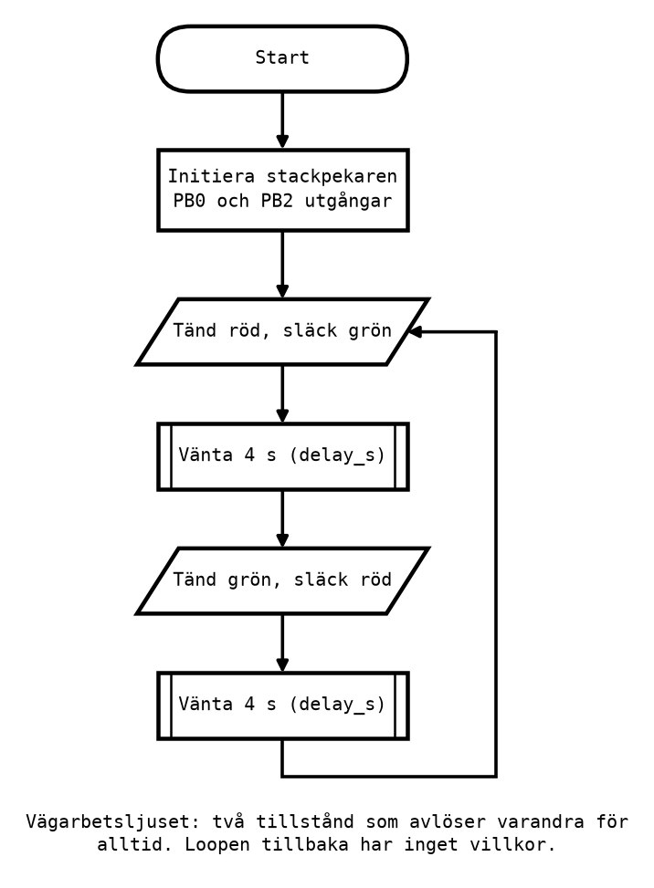

# Appendix B - Genomarbetat exempel: från flödesplan till program

## B.1 Uppgiften: vägarbetsljuset
Vid ett vägarbete är vägen smal nog för ett körfält, och trafiken från de två hållen turas om. Vid
varje ände står ett ljus med en röd och en grön lampa. Det här exemplet programmerar det ena ljuset:
**rött i 4 sekunder, grönt i 4 sekunder, och om igen, för alltid.**

Exemplet är medvetet enklare än trafikljuset i slutuppgiften: två lampor och två tillstånd i stället
för tre lampor och fyra. Metoden är densamma, och det är metoden appendixet handlar om:
1. Skriv upp **tillstånden**, vilka lampor som lyser i vart och ett, och hur länge.
2. Rita **flödesplanen**.
3. Välj **stift och bitmönster**.
4. Skriv **programmet**, ett tillstånd i taget, med subrutiner för det som upprepas.
5. **Testa** i simulatorn, och sedan på kortet.

Lamporna är lysdioder på kortet: röd på stift 8 (PB0) och grön på stift 10 (PB2), kopplade som i
slutuppgiften.

---

## B.2 Tillstånden
Ett styrobjekt som går igenom samma steg om och om igen beskrivs bäst som en följd av **tillstånd**.
Ett tillstånd säger vilka utgångar som är på, och hur länge systemet stannar där:

| Tillstånd | Röd (PB0) | Grön (PB2) | Tid | Därefter |
|-----------|-----------|------------|-----|----------|
| Stopp | tänd | släckt | 4 s | Kör |
| Kör | släckt | tänd | 4 s | Stopp |

Det är samma idé som tillståndsföljden för en räknare i [L06](../../L06/README.md): systemet är i
ett tillstånd i taget, och går till nästa vid en bestämd händelse. För en räknare var händelsen en
klockflank. Här är det att en viss tid har gått.

Tabellen är värd att skriva även när uppgiften är så här liten. Den är specifikationen, och det
färdiga programmet ska kunna kontrolleras mot den rad för rad.

---

## B.3 Flödesplanen



Varje tillstånd blir två symboler: en utmatning som tänder rätt lampor, och ett subrutinanrop som
väntar. Loopen tillbaka har inget villkor, eftersom ljuset aldrig slutar. Det enda som händer före
loopen är initieringen: stackpekaren, eftersom programmet anropar subrutiner, och de två stiften som
utgångar.

---

## B.4 Subrutinen delay_s
Programmet behöver vänta hela sekunder, men `delay_ms` från
[L10 Appendix C.4](../../L10/appendix/c_subroutines_and_stack.md#c4-en-subrutin-med-parameter-delay_ms)
räcker bara till 255 ms. En ny subrutin, `delay_s`, tar antalet sekunder i `r24` och anropar
`delay_ms` med 250 ms fyra gånger per sekund:

```asm
;--------------------------------------------------------------------------------
; delay_s: Waits r24 seconds (1-63), as 4 x r24 calls of delay_ms with 250 ms each.
; A call takes 16 000 084 x r24 + 18 cycles: about 5 microseconds too long per second.
;--------------------------------------------------------------------------------
delay_s:
    push r24                        ; Save the registers this subroutine changes.
    push r25
    mov r25, r24
    lsl r25                         ; r25 = 2 x r24 ...
    lsl r25                         ; ... = 4 x r24: the number of quarter seconds.
    ldi r24, QUARTER_MS             ; A quarter of a second is 250 ms.
delay_s_loop:
    rcall delay_ms
    dec r25
    brne delay_s_loop
    pop r25                         ; Restore them, in the opposite order.
    pop r24
    ret
```

Tre saker i den är värda att lägga märke till:
* **`lsl` två gånger multiplicerar med fyra**, som i [L08](../../L08/README.md): varje skift åt
  vänster dubblar talet. Tre sekunder blir tolv kvartar.
* **Den följer kursens regel.** Den ändrar `r24` och `r25`, och sparar båda. Efter `ldi r24, 4` och
  `rcall delay_s` är `r24` fortfarande 4, och kan användas igen.
* **Den fungerar upp till 63 sekunder.** Fyra gånger 64 är 256, som inte får plats i `r25`.

Konstanten `QUARTER_MS` står överst i programmet och är normalt 250:

```asm
.equ QUARTER_MS = 250               ; 250 ms. Set it to 1 to run about 250 times
                                    ; faster in the simulator; set it back before
                                    ; flashing.
```

Den finns för simulatorns skull, se B.6.

**Hur exakt är den?** Varje kvart är ett anrop av `delay_ms` med 250, alltså `16 000 · 250 + 18`
cykler, plus 3 cykler för `dec` och `brne` i loopen. Fyra kvartar blir 16 000 084 cykler, och hela
anropet `16 000 084 · r24 + 18` cykler. En sekund blir alltså ungefär 5 µs för lång. Det är långt
mindre än felet i kortets klocka ([Appendix
A.7](./a_control_objects.md#a7-hur-noggrann-är-klockan)).

---

## B.5 Programmet, rad för rad
Hela programmet finns i [`roadwork_light.asm`](../examples/roadwork_light.asm). Konstanter och
initiering först:

```asm
.equ RED = 0                        ; PB0, Arduino pin 8.
.equ GREEN = 2                      ; PB2, Arduino pin 10.

main:
    ldi r16, high(RAMEND)           ; SP = RAMEND = 0x08FF.
    out SPH, r16
    ldi r16, low(RAMEND)
    out SPL, r16

    ldi r16, (1 << RED) | (1 << GREEN)
    out DDRB, r16                   ; The two lights are outputs.
```

`(1 << RED)` är ett uttryck som assemblern räknar ut: en etta skiftad `RED` steg åt vänster, alltså
`0b00000001`, och `(1 << GREEN)` blir `0b00000100`. `|` är OR, bit för bit, så båda tillsammans blir
`0b00000101`. Skrivsättet gör att raden säger *vilka* lampor det gäller, i stället för bara ett tal,
och om grön flyttas till ett annat stift behöver bara `.equ`-raden ändras.

Sedan de två tillstånden, i en loop:

```asm
loop:
    ldi r16, (1 << RED)             ; Red, 4 s.
    out PORTB, r16
    ldi r24, 4
    rcall delay_s

    ldi r16, (1 << GREEN)           ; Green, 4 s.
    out PORTB, r16
    ldi r24, 4
    rcall delay_s

    rjmp loop                       ; And round again.
```

Varje tillstånd är fyra rader: bitmönstret, ut på porten, tiden, vänta. Programmet läses som
tabellen i B.2, rad för rad, och det är ingen slump: tabellen skrevs först.

Lägg märke till att `out PORTB, r16` skriver **hela** porten. Den tänder en lampa och släcker den
andra i samma instruktion, och det är därför bitmönstret för "Kör" är `0b00000100` och inte bara
"tänd grön". Med `sbi` och `cbi` hade samma sak krävt två instruktioner per tillstånd.

---

## B.6 Testa i simulatorn
Ett tillstånd på 4 sekunder är 64 miljoner cykler, och simulatorn behöver en lång stund för att köra
dem. Därför finns `QUARTER_MS`: sätt den till **1** medan programmet testas i simulatorn. Då tar
varje "sekund" ungefär 4 ms, och hela cykeln syns på ett ögonblick, i samma ordning och med samma
förhållande mellan tiderna.

Så testar du:
1. Sätt `QUARTER_MS` till 1 och bygg.
2. Sätt en brytpunkt på varje `out PORTB, r16`.
3. Kör med **Continue** (**F5**). Vid varje stopp: stega ett steg med **F11** och kontrollera i
   I/O-fönstret att rätt bitar i `PORTB` är ettor.
4. Nollställ stoppuret vid ett stopp och kör till nästa. Med `QUARTER_MS` = 1 ska två stopp i rad
   ligga ungefär 16 ms isär, 4 "sekunder" gånger 4 ms.

I kursens kontroll av programmet, med `QUARTER_MS` = 250, tar en hel cykel **128 000 716** cykler,
8,0000448 s. Med `QUARTER_MS` = 1 tar den 512 716 cykler, 32 ms: ungefär 250 gånger fortare.

---

## B.7 Till kortet
1. **Sätt tillbaka `QUARTER_MS` till 250.** Det är det vanligaste felet i det här steget. Med 1 går
   hela cykeln runt ungefär 30 gånger i sekunden, och båda lamporna ser ut att lysa svagt på en
   gång.
2. Koppla lysdioderna enligt [Appendix A.5](./a_control_objects.md#a5-arduino-uno-kortet), med
   USB-kabeln urkopplad.
3. Bygg, anslut kortet och för över programmet enligt
   [info/microchip_studio.md, avsnitt 5](../../../info/microchip_studio.md#5-programmera-ett-arduino-kort-från-microchip-studio).
4. Ta tid på några cykler och jämför med tabellen.

Om lamporna gör något annat än i simulatorn, följ felsökningsordningen i
[Appendix A.6](./a_control_objects.md#a6-från-simulatorn-till-kortet).

---

## B.8 Från vägarbetsljus till trafikljus
Slutuppgiftens del A, [trafikljuset](../../../labs/lab3/e_final_task.md), använder precis samma
metod med fler tillstånd:
* **Tabellen** får fyra rader i stället för två, och en tredje lampa, gul på PB1.
* **Flödesplanen** får fyra par av symboler, ett per tillstånd.
* **Bitmönstren** blir fyra, och ett av dem har två lampor tända samtidigt.
* **Subrutinerna** är desamma, oförändrade.

Ljuscykeln som del A ska ge, ritad som ett tidsdiagram:


Del B, övergångsstället, lägger till något nytt: ett **villkor**. Ljuset står still i ett tillstånd
tills knappen trycks, och det blir en beslutssymbol i flödesplanen och en väntan med `sbic` i
programmet ([L10 Appendix B.5](../../L10/appendix/b_input_port.md#b5-att-vänta-på-en-knapp)).

---
