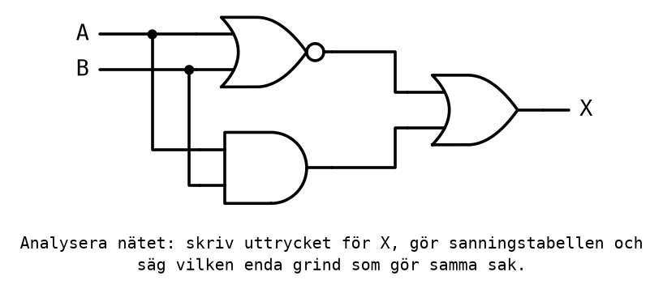

# Appendix B - Övningar

> **Så kontrollerar du ditt arbete.** Övningarna är repetition av hela kursen, i samma stil som
> provets frågor. Gör dem på papper, utan miniräknare, med
> [referensbladet](../../../info/avr_instructions.md) bredvid, och kontrollera mot
> [Appendix C](./c_solutions.md). Övning 10, kontrollen, görs först för hand och sedan i Microchip
> Studio.
>
> Varje övning säger vilket avsnitt i [Appendix A](./a_review.md) den repeterar. Går en övning
> dåligt, läs det avsnittet och den föreläsning det pekar på innan du går vidare.

Varje övning är märkt med sin sort. Exakt en övning är en **Kontroll**, och i det här passet är det
övning 10.

---

## 1. Talomvandlingar
**Räkna för hand.** *(A.2)*

Fyll i tabellen. Visa hur du räknar i minst en omvandling åt varje håll.

| Binärt | Decimalt | Hexadecimalt |
|--------|----------|--------------|
| `1011 0101` | | |
| | 200 | |
| | | `0x7E` |
| | 64 | |

---

## 2. Binär addition och flaggor
**Räkna för hand.** *(A.2, A.6)*

**a)** Addera `0110 1101` och `0101 1011` binärt, med minnessiffror. Kontrollera svaret decimalt.

**b)** Additionen görs med `add` i ett 8-bitars register. Blir flaggan `C` satt? Blir `N` satt?

**c)** Läs resultatet som ett tal **med tecken**, i tvåkomplement. Vilket tal är det? Varför är det
ett konstigt svar på en addition av två positiva tal?

---

## 3. Koder
**Räkna för hand.** *(A.2)*

**a)** Skriv 47 i BCD.

**b)** Skriv de åtta 3-bitars Graykoderna i ordning, från `000`. Hur många bitar ändras mellan två
koder som står bredvid varandra?

**c)** Vilka ASCII-koder har tecknen i texten `OK`? Bokstäverna ligger i alfabetisk ordning från
`'A'` = `0x41`.

---

## 4. Vilken grind är det?
**Räkna för hand.** *(A.3)*



**a)** Skriv uttrycket vid varje grinds utgång, och uttrycket för X.

**b)** Gör sanningstabellen för X.

**c)** Vilken enda grind gör samma sak som hela nätet?

---

## 5. Förenkla
**Räkna för hand.** *(A.3)*

Förenkla algebraiskt, och ange vilken lag varje steg använder. Kontrollera svaret med en
sanningstabell.

**a)** `X = ABC + ABC' + AB'C`

**b)** `X = (A + B)(A + B')`

---

## 6. Två NAND-grindar
**Konstruktion.** *(A.3, A.4)*

**a)** Visa med De Morgan att `X = AB + C'` kan skrivas `X = ((AB)' · C)'`.

**b)** Rita nätet med enbart NAND-grindar med två ingångar. Hur många behövs?

**c)** Hur många kapslar 74HC00 behövs, och hur många grindar blir över?

---

## 7. Ett kontaktnät
**Konstruktion.** *(A.3)*

Lampan H1 ska styras av tre tryckknappar enligt `H1 = S1(S2 + S3')`.

**a)** Rita kontaktnätet mellan +24 V och 0 V. Vilka kontakter är slutande, och vilka är brytande?

**b)** Gör sanningstabellen. För vilka kombinationer av nedtryckta knappar lyser lampan?

---

## 8. Karnaughdiagram
**Räkna för hand.** *(A.4)*

En funktion av A, B, C och D är 1 för mintermerna 0, 1, 4, 5, 10, 11, 14 och 15, och 0 annars.

**a)** Rita Karnaughdiagrammet, med `AB` på raderna och `CD` på kolumnerna, och fyll i ettorna.

**b)** Gruppera minimalt, och skriv det minimerade uttrycket.

**c)** Uttrycket är en känd grind med två av variablerna som ingångar. Vilken?

---

## 9. Mikrodatorn
**Förståelse.** *(A.5)*

**a)** Rita mikrodatorns blockschema, med CPU (ALU, register, styrenhet, programräknare),
programminne, dataminne, in- och utportar och bussar.

**b)** Beskriv vad programräknaren gör under hämta-avkoda-utföra för en instruktion.

**c)** ATmega328P startas om efter ett strömavbrott. Vad finns kvar i flashminnet, i SRAM och i
registren?

---

## 10. Kontroll: följ programmet
**Kontroll.** *(A.6) Förutsäg för hand, kontrollera i simulatorn, förklara skillnaden.*

```asm
.include "m328Pdef.inc"

.org 0x0000
    rjmp main

main:
    ldi r16, 0x9C
    ldi r17, 0x64
    add r16, r17
    ldi r18, 5
    sub r18, r17
    mov r19, r18
    lsr r19
    andi r19, 0x0F
end:
    rjmp end
```

**a) För hand.** Fyll i tabellen med värdena **efter** varje instruktion, hexadecimalt. Fyll i
flaggorna på varje rad, men lämna en registerruta tom om registret inte har ändrats sedan raden
ovanför.

| Instruktion | `r16` | `r17` | `r18` | `r19` | `C` | `Z` | `N` |
|-------------|-------|-------|-------|-------|-----|-----|-----|
| `add r16, r17` | | | | | | | |
| `sub r18, r17` | | | | | | | |
| `lsr r19` | | | | | | | |
| `andi r19, 0x0F` | | | | | | | |

**b) I simulatorn.** Skriv in programmet, stega det, och jämför med tabellen efter varje steg.

**c) Jämför.** Vilka rutor hade du fel i? Den vanligaste avvikelsen gäller `C` efter `andi`: vad
visar simulatorn, och varför?

---

## 11. En loop
**Räkna för hand.** *(A.6)*

```asm
    ldi r20, 50
loop:
    nop
    dec r20
    brne loop
```

**a)** Hur många cykler tar koden, från `ldi` till och med den sista `brne`?

**b)** Hur lång tid är det vid 16 MHz?

**c)** Vilket värde ska laddas i `r20` för att koden ska ta exakt 25 µs?

---

## 12. Om, annars
**Program.** *(A.6)*

Lysdioden på PB0 ska lysa om värdet i `r16` är **minst 100**, och lysdioden på PB1 annars.

**a)** Rita flödesplanen.

**b)** Skriv programmet. Vilket villkorligt hopp används, och varför just det?

**c)** Testa i simulatorn med `r16` = 150, 100 och 99. Vilket av de tre värdena är viktigast att
testa, och varför?

---

## 13. Stacken
**Räkna för hand.** *(fördjupning)* *(A.6)*

`SP` är `0x08FF`. Programmet kör `rcall work`, och subrutinen `work` börjar med `push r16` och
`push r17`.

**a)** Vad är `SP` efter de två `push`?

**b)** Vilka byte ligger på adresserna `0x08FF`-`0x08FC`, i ord?

**c)** Subrutinen slutar med `pop r16`, `pop r17` och `ret`. Programmet återvänder rätt, men något
annat är fel. Vad?

---
